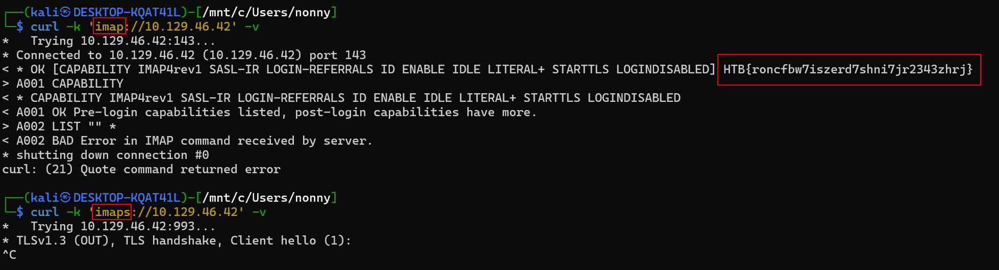
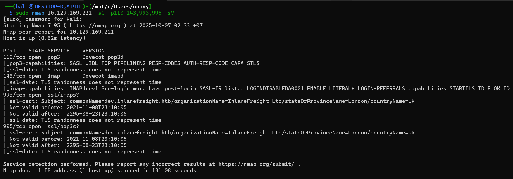
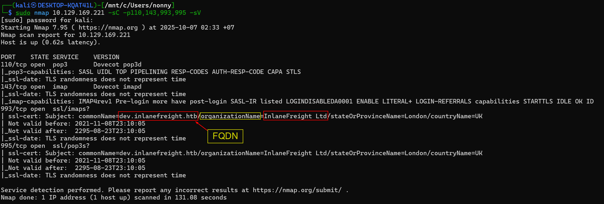
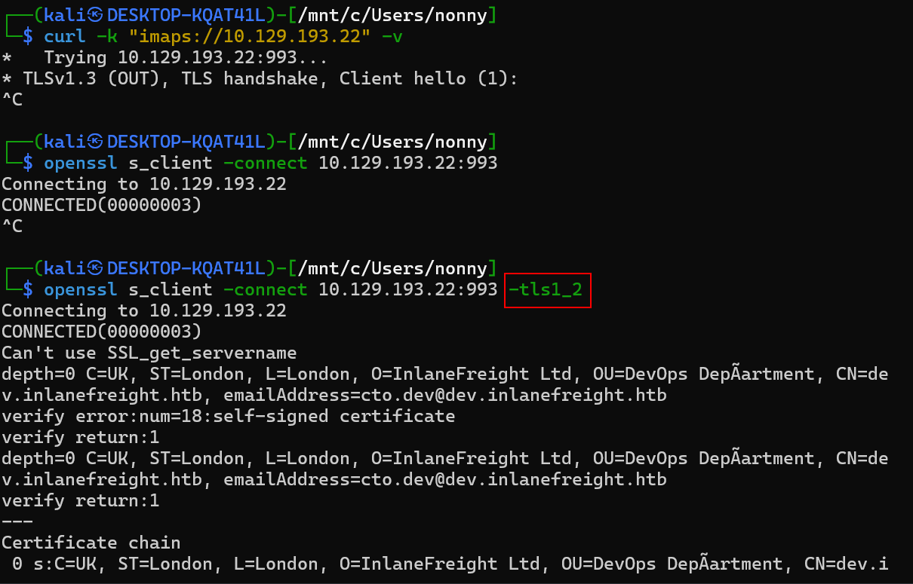
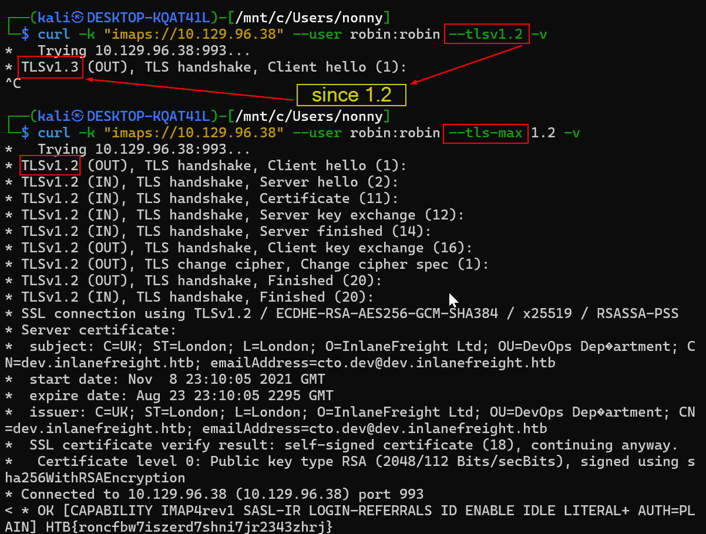
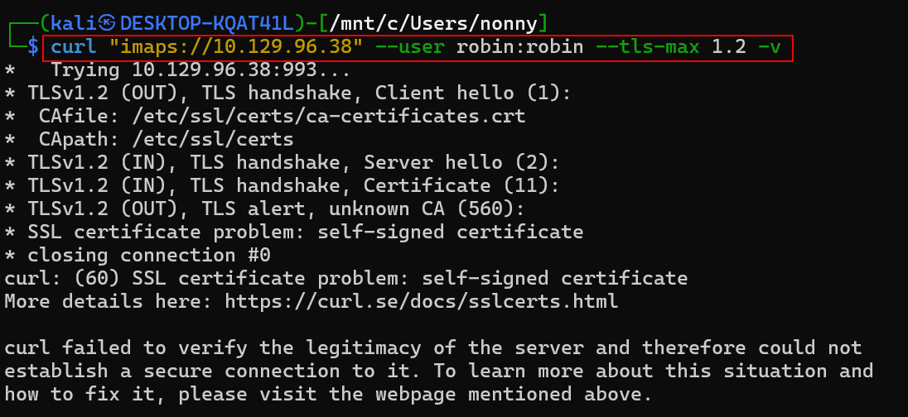
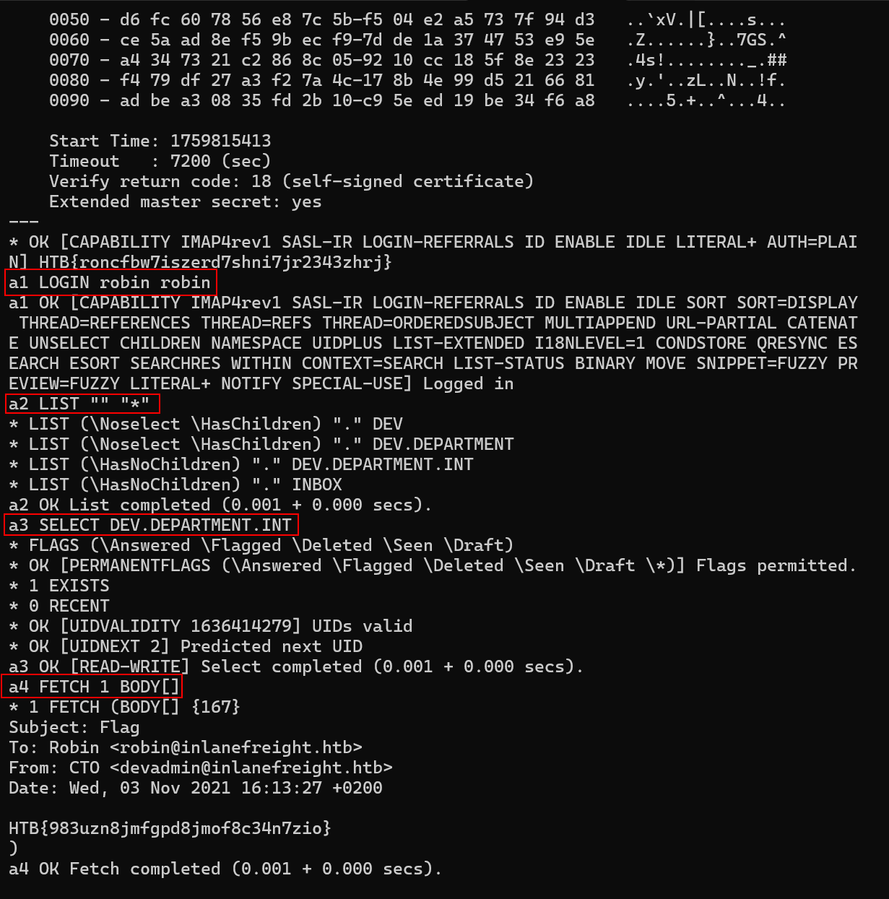
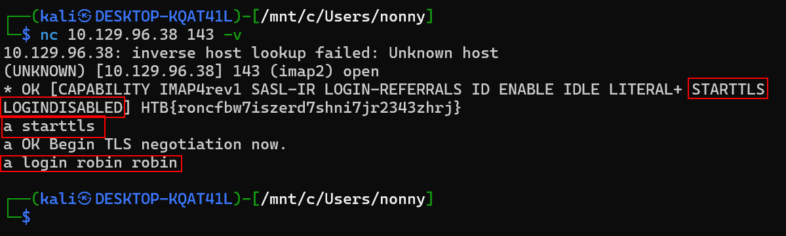

# IMAP / POP3

**IMAP (Internet Message Access Protocol)** และ **POP3 (Post Office Protocol version 3)** คือโปรโตคอลที่ใช้สำหรับรับอีเมลจาก mail server

ทั้งสองโปรโตคอลทำงานคล้ายกัน แต่มีวิธีการจัดการอีเมลที่แตกต่างกันอย่างมาก

## ความแตกต่างหลักระหว่าง IMAP และ POP3

### POP3 - ดาวน์โหลดและเก็บในเครื่อง

POP3 เป็นโปรโตคอลที่ง่ายและตรงไปตรงมา:

**วิธีการทำงาน:**
- ดาวน์โหลดอีเมลจาก server มาเก็บไว้ที่เครื่องคอมพิวเตอร์
- โดยปกติจะลบอีเมลออกจาก server หลังดาวน์โหลด (แต่สามารถตั้งค่าให้เก็บไว้ได้)
- อีเมลจะถูกเก็บไว้ในเครื่องเท่านั้น

**ฟังก์ชันพื้นฐาน:**
- แสดงรายการอีเมล
- ดึงข้อมูลอีเมล
- ลบอีเมลจาก server

**ข้อดี:**
- ใช้งานง่าย เข้าใจง่าย
- เข้าถึงอีเมลแบบ offline ได้เต็มรูปแบบ
- ไม่กินพื้นที่บน server
- เหมาะกับผู้ที่ใช้อุปกรณ์เดียว

**ข้อเสีย:**
- ไม่สามารถซิงค์ข้อมูลระหว่างหลายอุปกรณ์
- ไม่รองรับโครงสร้างโฟลเดอร์
- หากเครื่องเสีย อีเมลอาจสูญหาย

**การเชื่อมต่อ:**
- **พอร์ต 110** - POP3 แบบไม่เข้ารหัส
- **พอร์ต 995** - POP3S (POP3 over SSL/TLS)

### IMAP - จัดการอีเมลบน Server

IMAP เป็นโปรโตคอลที่ทันสมัยและมีความสามารถมากกว่า:

**วิธีการทำงาน:**
- อีเมลทั้งหมดถูกเก็บไว้บน mail server
- Client เพียงแค่เชื่อมต่อเพื่อเข้าถึงและจัดการอีเมลบน server
- สามารถสร้างสำเนาในเครื่องสำหรับการใช้งาน offline
- ทุกการเปลี่ยนแปลงจะถูกซิงค์กับ server

**คุณสมบัติหลัก:**
- จัดการอีเมลออนไลน์โดยตรงบน server
- รองรับโครงสร้างโฟลเดอร์แบบลำดับชั้น
- ซิงค์ข้อมูลระหว่างหลายอุปกรณ์อัตโนมัติ
- หลายผู้ใช้สามารถเข้าถึง mailbox พร้อมกันได้
- สามารถค้นหาและคัดกรองอีเมลบน server ได้
- เข้าถึงหลาย mailbox ในเซสชันเดียว

**ข้อดี:**
- เข้าถึงอีเมลเดียวกันจากทุกอุปกรณ์
- ฐานข้อมูลที่เป็นเอกภาพ ไม่ว่าจะใช้ client ใด
- จัดระเบียบอีเมลด้วยโฟลเดอร์ได้
- ปลอดภัยกว่า เพราะอีเมลไม่อยู่เฉพาะในเครื่อง
- รองรับโหมด offline ในบาง client

**ข้อเสีย:**
- ต้องมีการเชื่อมต่ออินเทอร์เน็ต (ยกเว้นมี offline mode)
- ใช้พื้นที่บน server มากขึ้น
- ขึ้นอยู่กับ quota ของ mailbox

**การเชื่อมต่อ:**
- **พอร์ต 143** - IMAP แบบไม่เข้ารหัส หรือ STARTTLS
- **พอร์ต 993** - IMAPS (IMAP over SSL/TLS)

## ตารางเปรียบเทียบแบบละเอียด

| หัวข้อ | POP3 | IMAP |
|--------|------|------|
| **ที่เก็บอีเมล** | ในเครื่องคอมพิวเตอร์ | บน mail server |
| **การซิงค์หลายอุปกรณ์** | ไม่รองรับ | รองรับเต็มรูปแบบ |
| **โฟลเดอร์/การจัดระเบียบ** | ไม่รองรับ | รองรับ |
| **การใช้งาน offline** | ได้เต็มรูปแบบ | จำกัด (ต้องมี offline mode) |
| **พื้นที่จัดเก็บ** | ใช้พื้นที่ในเครื่อง | ใช้พื้นที่บน server |
| **ความซับซ้อน** | ง่าย | ซับซ้อนกว่า แต่มีความสามารถมากกว่า |
| **ความเหมาะสม** | ใช้อุปกรณ์เดียว | ใช้หลายอุปกรณ์ |

## การทำงานของ IMAP แบบละเอียด

### กระบวนการเชื่อมต่อ

1. **สร้างการเชื่อมต่อ** - Client เชื่อมต่อกับ server ผ่านพอร์ต 143 หรือ 993
2. **ยืนยันตัวตน** - ผู้ใช้ login ด้วย username และ password
3. **เข้าถึง mailbox** - หลังจาก authentication สำเร็จ จึงสามารถเข้าถึง mailbox ได้
4. **ส่งคำสั่ง** - ใช้คำสั่งแบบข้อความ ASCII เพื่อจัดการอีเมล

### คุณสมบัติพิเศษของ IMAP

**Pipelining:**
- สามารถส่งคำสั่งหลายคำสั่งติดกันได้โดยไม่ต้องรอคำตอบจาก server
- แต่ละคำสั่งมีตัวระบุ (tag) เพื่อจับคู่กับคำตอบที่จะได้รับภายหลัง
- ทำให้การสื่อสารเร็วขึ้น

**Offline Mode:**
- บาง email client รองรับโหมด offline
- สร้างสำเนาของ mailbox ไว้ในเครื่อง
- สามารถอ่านและแก้ไขอีเมลแบบ offline ได้
- เมื่อออนไลน์อีกครั้ง จะซิงค์การเปลี่ยนแปลงทั้งหมดกับ server

**การเรียกดูอีเมล:**
- สามารถเรียกดูเนื้อหาอีเมลโดยตรงบน server โดยไม่ต้องดาวน์โหลด
- ประหยัดแบนด์วิดท์และเวลา
- เหมาะกับการตรวจสอบอีเมลขนาดใหญ่หรือมีไฟล์แนบ

## IMAP กับ SMTP ทำงานร่วมกันอย่างไร?

**SMTP (Simple Mail Transfer Protocol)** คือโปรโตคอลที่ใช้สำหรับ**ส่ง**อีเมล ในขณะที่ IMAP/POP3 ใช้สำหรับ**รับ**อีเมล

### การทำงานร่วมกัน:

1. **ส่งอีเมล** - ใช้ SMTP (พอร์ต 25, 465, หรือ 587)
2. **บันทึกอีเมลที่ส่ง** - SMTP คัดลอกอีเมลที่ส่งไปยัง IMAP folder (เช่น Sent Items)
3. **ซิงค์ทุกอุปกรณ์** - ทุกอุปกรณ์ที่เชื่อมต่อกับ IMAP จะเห็นอีเมลที่ส่งทั้งหมด

**ประโยชน์:**
- เข้าถึงอีเมลที่ส่งได้จากทุกอุปกรณ์
- ไม่ว่าจะส่งจากคอมพิวเตอร์, มือถือ, หรือแท็บเล็ต
- รักษาประวัติการส่งอีเมลไว้ครบถ้วน

## ความปลอดภัยและการเข้ารหัส

### ปัญหาความปลอดภัย

หากไม่มีการเข้ารหัส ทั้ง IMAP และ POP3 จะส่งข้อมูลเป็น **plaintext** (ข้อความธรรมดา) ซึ่งรวมถึง:
- ชื่อผู้ใช้และรหัสผ่าน
- เนื้อหาอีเมล
- คำสั่งต่างๆ

สิ่งนี้มีความเสี่ยงสูงต่อการถูกดักฟังหรือโจมตี

### วิธีการเข้ารหัส

**1. STARTTLS**
- เริ่มต้นด้วยการเชื่อมต่อแบบไม่เข้ารหัส
- ส่งคำสั่ง STARTTLS เพื่ออัพเกรดเป็นการเชื่อมต่อแบบเข้ารหัส
- ใช้พอร์ตมาตรฐาน (143 สำหรับ IMAP, 110 สำหรับ POP3)

**2. Implicit SSL/TLS**
- เชื่อมต่อแบบเข้ารหัสตั้งแต่เริ่มต้น
- ใช้พอร์ตเฉพาะ (993 สำหรับ IMAPS, 995 สำหรับ POP3S)
- ปลอดภัยกว่า STARTTLS

### สรุปพอร์ตทั้งหมด

| โปรโตคอล | พอร์ต | ประเภท |
|----------|-------|--------|
| IMAP | 143 | ไม่เข้ารหัส หรือ STARTTLS |
| IMAPS | 993 | SSL/TLS |
| POP3 | 110 | ไม่เข้ารหัส |
| POP3S | 995 | SSL/TLS |
| SMTP | 25, 587 | ไม่เข้ารหัส หรือ STARTTLS |
| SMTPS | 465 | SSL/TLS |

## ควรเลือกใช้โปรโตคอลไหน?

### เลือกใช้ IMAP เมื่อ:

✅ ต้องการเข้าถึงอีเมลจากหลายอุปกรณ์ (คอมพิวเตอร์, มือถือ, แท็บเล็ต)
✅ ต้องการให้อีเมลซิงค์กันอัตโนมัติทุกอุปกรณ์
✅ ต้องการจัดระเบียบอีเมลด้วยโฟลเดอร์
✅ ต้องการทำงานเป็นทีม (แชร์ mailbox)
✅ มีพื้นที่เก็บข้อมูลบน server เพียงพอ
✅ มีอินเทอร์เน็ตที่เสถียร

### เลือกใช้ POP3 เมื่อ:

✅ ใช้งานบนอุปกรณ์เดียวเป็นหลัก
✅ ต้องการเข้าถึงอีเมลแบบ offline เต็มรูปแบบ
✅ ต้องการประหยัดพื้นที่บน server
✅ มีข้อจำกัดด้านพื้นที่จัดเก็บบน server
✅ ต้องการความเรียบง่าย
✅ ต้องการควบคุมการสำรองข้อมูลเอง

## สรุป

- **POP3** = ดาวน์โหลดและเก็บในเครื่อง (เหมาะกับผู้ใช้อุปกรณ์เดียว)
- **IMAP** = จัดการบน server และซิงค์ทุกอุปกรณ์ (เหมาะกับผู้ใช้หลายอุปกรณ์)
- **SMTP** = ใช้สำหรับส่งอีเมล (ทำงานคู่กับ IMAP/POP3)

สำหรับผู้ใช้ทั่วไปในปัจจุบัน **IMAP** เป็นตัวเลือกที่แนะนำ เพราะรองรับการใช้งานแบบ multi-device ที่เป็นมาตรฐานของยุคสมัยนี้ อย่าลืมเปิดใช้งานการเข้ารหัส SSL/TLS เสมอเพื่อความปลอดภัย!

## การตั้งค่าเริ่มต้น (Default Configuration)

ทั้ง IMAP และ POP3 มีตัวเลือกการตั้งค่าจำนวนมาก ทำให้ยากที่จะศึกษาแต่ละส่วนประกอบอย่างละเอียด หากต้องการตรวจสอบการตั้งค่าโปรโตคอลเหล่านี้อย่างลึกซึ้ง แนะนำให้สร้าง VM ในเครื่องและติดตั้งแพ็กเกจ **dovecot-imapd** และ **dovecot-pop3d** โดยใช้ apt แล้วทดลองกับการตั้งค่าต่างๆ

https://doc.dovecot.org/2.4.1/core/summaries/settings.html

https://doc.dovecot.org/2.4.1/core/config/service.html


## คำสั่ง IMAP

| คำสั่ง | คำอธิบาย |
|--------|----------|
| **1 LOGIN username password** | เข้าสู่ระบบของผู้ใช้ |
| **1 LIST "" *** | แสดงรายการไดเรกทอรีทั้งหมด |
| **1 CREATE "INBOX"** | สร้าง mailbox ด้วยชื่อที่ระบุ |
| **1 DELETE "INBOX"** | ลบ mailbox |
| **1 RENAME "ToRead" "Important"** | เปลี่ยนชื่อ mailbox |
| **1 LSUB "" *** | ส่งคืนชุดย่อยของชื่อจากชุดชื่อที่ผู้ใช้ประกาศว่ากำลังใช้งานหรือสมัครสมาชิก |
| **1 SELECT INBOX** | เลือก mailbox เพื่อให้สามารถเข้าถึงข้อความใน mailbox ได้ |
| **1 UNSELECT INBOX** | ออกจาก mailbox ที่เลือก |
| **1 FETCH <ID> all** | ดึงข้อมูลที่เกี่ยวข้องกับข้อความใน mailbox |
| **1 CLOSE** | ลบข้อความทั้งหมดที่มีการตั้งค่าแฟล็ก Deleted |
| **1 LOGOUT** | ปิดการเชื่อมต่อกับ IMAP server |

## คำสั่ง POP3

| คำสั่ง | คำอธิบาย |
|--------|----------|
| **USER username** | ระบุตัวตนผู้ใช้ |
| **PASS password** | การยืนยันตัวตนของผู้ใช้โดยใช้รหัสผ่าน |
| **STAT** | ขอจำนวนอีเมลที่บันทึกไว้จาก server |
| **LIST** | ขอจำนวนและขนาดของอีเมลทั้งหมดจาก server |
| **RETR id** | ขอให้ server ส่งอีเมลที่ร้องขอตาม ID |
| **DELE id** | ขอให้ server ลบอีเมลที่ร้องขอตาม ID |
| **CAPA** | ขอให้ server แสดงความสามารถของ server |
| **RSET** | ขอให้ server รีเซ็ตข้อมูลที่ส่ง |
| **QUIT** | ปิดการเชื่อมต่อกับ POP3 server |

## การตั้งค่าที่เป็นอันตราย (Dangerous Settings)

อย่างไรก็ตาม ตัวเลือกการตั้งค่าที่ตั้งค่าไม่ถูกต้องอาจทำให้เราได้รับข้อมูลเพิ่มเติม เช่น การดีบักคำสั่งที่รันบนบริการ หรือเข้าสู่ระบบแบบ anonymous คล้ายกับบริการ FTP 

บริษัทส่วนใหญ่ใช้ผู้ให้บริการอีเมลบุคคลที่สาม เช่น Google, Microsoft และอื่นๆ อีกมากมาย อย่างไรก็ตาม บริษัทบางแห่งยังคงใช้ mail server ของตัวเองด้วยเหตุผลหลายประการ หนึ่งในเหตุผลเหล่านี้คือการรักษาความเป็นส่วนตัวที่พวกเขาต้องการเก็บไว้ในมือของตัวเอง 

ผู้ดูแลระบบสามารถทำข้อผิดพลาดในการตั้งค่าได้มากมาย ซึ่งในกรณีที่เลวร้ายที่สุดจะทำให้เราสามารถอ่านอีเมลทั้งหมดที่ส่งและรับได้ ซึ่งอาจรวมถึงข้อมูลที่เป็นความลับหรือข้อมูลที่ละเอียดอ่อน 

### การตั้งค่าที่เป็นอันตราย:

| การตั้งค่า | คำอธิบาย |
|-----------|----------|
| **auth_debug** | เปิดใช้งานการบันทึกดีบักการยืนยันตัวตนทั้งหมด |
| **auth_debug_passwords** | การตั้งค่านี้ปรับความละเอียดของ log รหัสผ่านที่ส่ง และ scheme จะถูกบันทึก |
| **auth_verbose** | บันทึกความพยายามในการยืนยันตัวตนที่ไม่สำเร็จและเหตุผล |
| **auth_verbose_passwords** | รหัสผ่านที่ใช้สำหรับการยืนยันตัวตนจะถูกบันทึก และยังสามารถถูกตัดทอนได้ |
| **auth_anonymous_username** | ระบุชื่อผู้ใช้ที่จะใช้เมื่อเข้าสู่ระบบด้วยกลไก ANONYMOUS SASL |

# การสำรวจบริการ (Footprinting the Service)

โดยค่าเริ่มต้น **พอร์ต 110 และ 995** ใช้สำหรับ POP3 และ **พอร์ต 143 และ 993** ใช้สำหรับ IMAP พอร์ตที่สูงกว่า (993 และ 995) ใช้ **TLS/SSL** เพื่อเข้ารหัสการสื่อสารระหว่าง client และ server 

การใช้ Nmap เราสามารถสแกน server สำหรับพอร์ตเหล่านี้ได้ การสแกนจะส่งคืนข้อมูลที่เกี่ยวข้อง (ตามที่เห็นด้านล่าง) หาก server ใช้ certificate แบบฝังตัว

## การสแกนด้วย Nmap

```
Watunyoo@htb[/htb]$ sudo nmap 10.129.14.128 -sV -p110,143,993,995 -sC

Starting Nmap 7.80 ( https://nmap.org ) at 2021-09-19 22:09 CEST
Nmap scan report for 10.129.14.128
Host is up (0.00026s latency).

PORT    STATE SERVICE  VERSION
110/tcp open  pop3     Dovecot pop3d
|_pop3-capabilities: AUTH-RESP-CODE SASL STLS TOP UIDL RESP-CODES CAPA PIPELINING
| ssl-cert: Subject: commonName=mail1.inlanefreight.htb/organizationName=Inlanefreight/stateOrProvinceName=California/countryName=US
| Not valid before: 2021-09-19T19:44:58
|_Not valid after:  2295-07-04T19:44:58

143/tcp open  imap     Dovecot imapd
|_imap-capabilities: more have post-login STARTTLS Pre-login capabilities LITERAL+ LOGIN-REFERRALS OK LOGINDISABLEDA0001 SASL-IR ENABLE listed IDLE ID IMAP4rev1
| ssl-cert: Subject: commonName=mail1.inlanefreight.htb/organizationName=Inlanefreight/stateOrProvinceName=California/countryName=US
| Not valid before: 2021-09-19T19:44:58
|_Not valid after:  2295-07-04T19:44:58

993/tcp open  ssl/imap Dovecot imapd
|_imap-capabilities: more have post-login OK capabilities LITERAL+ LOGIN-REFERRALS Pre-login AUTH=PLAINA0001 SASL-IR ENABLE listed IDLE ID IMAP4rev1
| ssl-cert: Subject: commonName=mail1.inlanefreight.htb/organizationName=Inlanefreight/stateOrProvinceName=California/countryName=US
| Not valid before: 2021-09-19T19:44:58
|_Not valid after:  2295-07-04T19:44:58

995/tcp open  ssl/pop3 Dovecot pop3d
|_pop3-capabilities: AUTH-RESP-CODE USER SASL(PLAIN) TOP UIDL RESP-CODES CAPA PIPELINING
| ssl-cert: Subject: commonName=mail1.inlanefreight.htb/organizationName=Inlanefreight/stateOrProvinceName=California/countryName=US
| Not valid before: 2021-09-19T19:44:58
|_Not valid after:  2295-07-04T19:44:58
MAC Address: 00:00:00:00:00:00 (VMware)

Service detection performed. Please report any incorrect results at https://nmap.org/submit/ .
Nmap done: 1 IP address (1 host up) scanned in 12.74 seconds
```

### การวิเคราะห์ผลลัพธ์

จากผลลัพธ์ เราจะเห็นว่า:
- **Common name** คือ mail1.inlanefreight.htb
- Email server เป็นขององค์กร **Inlanefreight** ซึ่งตั้งอยู่ใน California
- **Capabilities** ที่แสดงบอกเราถึงคำสั่งที่สามารถใช้ได้บน server และสำหรับบริการบนพอร์ตที่เกี่ยวข้อง

หากเราสามารถค้นหาข้อมูลรับรองการเข้าถึงของพนักงานคนใดคนหนึ่งได้สำเร็จ ผู้โจมตีสามารถเข้าสู่ระบบ mail server และอ่านหรือแม้แต่ส่งข้อความส่วนบุคคลได้

## การใช้ cURL

เราสามารถใช้ cURL เพื่อเชื่อมต่อกับ IMAP/POP3 server ได้:

```
Watunyoo@htb[/htb]$ curl -k 'imaps://10.129.14.128' --user user:p4ssw0rd

* LIST (\HasNoChildren) "." Important
* LIST (\HasNoChildren) "." INBOX
```


### การใช้ Verbose Mode

หากเราใช้ตัวเลือก verbose (`-v`) เราจะเห็นวิธีการสร้างการเชื่อมต่อ จากนี้เราสามารถเห็น:
- เวอร์ชันของ TLS ที่ใช้สำหรับการเข้ารหัส
- รายละเอียดเพิ่มเติมของ SSL certificate
- แม้แต่ banner ซึ่งมักจะมีเวอร์ชันของ mail server

```
Watunyoo@htb[/htb]$ curl -k 'imaps://10.129.14.128' --user cry0l1t3:1234 -v

*   Trying 10.129.14.128:993...
* TCP_NODELAY set
* Connected to 10.129.14.128 (10.129.14.128) port 993 (#0)
* successfully set certificate verify locations:
*   CAfile: /etc/ssl/certs/ca-certificates.crt
  CApath: /etc/ssl/certs
* TLSv1.3 (OUT), TLS handshake, Client hello (1):
* TLSv1.3 (IN), TLS handshake, Server hello (2):
* TLSv1.3 (IN), TLS handshake, Encrypted Extensions (8):
* TLSv1.3 (IN), TLS handshake, Certificate (11):
* TLSv1.3 (IN), TLS handshake, CERT verify (15):
* TLSv1.3 (IN), TLS handshake, Finished (20):
* TLSv1.3 (OUT), TLS change cipher, Change cipher spec (1):
* TLSv1.3 (OUT), TLS handshake, Finished (20):
* SSL connection using TLSv1.3 / TLS_AES_256_GCM_SHA384
* Server certificate:
*  subject: C=US; ST=California; L=Sacramento; O=Inlanefreight; OU=Customer Support; CN=mail1.inlanefreight.htb; emailAddress=cry0l1t3@inlanefreight.htb
*  start date: Sep 19 19:44:58 2021 GMT
*  expire date: Jul  4 19:44:58 2295 GMT
*  issuer: C=US; ST=California; L=Sacramento; O=Inlanefreight; OU=Customer Support; CN=mail1.inlanefreight.htb; emailAddress=cry0l1t3@inlanefreight.htb
*  SSL certificate verify result: self signed certificate (18), continuing anyway.
* TLSv1.3 (IN), TLS handshake, Newsession Ticket (4):
* TLSv1.3 (IN), TLS handshake, Newsession Ticket (4):
* old SSL session ID is stale, removing
< * OK [CAPABILITY IMAP4rev1 SASL-IR LOGIN-REFERRALS ID ENABLE IDLE LITERAL+ AUTH=PLAIN] HTB-Academy IMAP4 v.0.21.4
> A001 CAPABILITY
< * CAPABILITY IMAP4rev1 SASL-IR LOGIN-REFERRALS ID ENABLE IDLE LITERAL+ AUTH=PLAIN
< A001 OK Pre-login capabilities listed, post-login capabilities have more.
> A002 AUTHENTICATE PLAIN AGNyeTBsMXQzADEyMzQ=
< * CAPABILITY IMAP4rev1 SASL-IR LOGIN-REFERRALS ID ENABLE IDLE SORT SORT=DISPLAY THREAD=REFERENCES THREAD=REFS THREAD=ORDEREDSUBJECT MULTIAPPEND URL-PARTIAL CATENATE UNSELECT CHILDREN NAMESPACE UIDPLUS LIST-EXTENDED I18NLEVEL=1 CONDSTORE QRESYNC ESEARCH ESORT SEARCHRES WITHIN CONTEXT=SEARCH LIST-STATUS BINARY MOVE SNIPPET=FUZZY PREVIEW=FUZZY LITERAL+ NOTIFY SPECIAL-USE
< A002 OK Logged in
> A003 LIST "" *
< * LIST (\HasNoChildren) "." Important
* LIST (\HasNoChildren) "." Important
< * LIST (\HasNoChildren) "." INBOX
* LIST (\HasNoChildren) "." INBOX
< A003 OK List completed (0.001 + 0.000 secs).
* Connection #0 to host 10.129.14.128 left intact
```

### ข้อมูลที่ได้จาก Verbose Output

จากผลลัพธ์ verbose เราสามารถเห็น:

1. **การเชื่อมต่อ TLS**: ใช้ TLS version 1.3 และ cipher suite TLS_AES_256_GCM_SHA384
2. **ข้อมูล Certificate**:
   - Subject: รายละเอียดขององค์กร (C=US, ST=California, L=Sacramento, O=Inlanefreight)
   - Common Name: mail1.inlanefreight.htb
   - Email: cry0l1t3@inlanefreight.htb
   - วันที่ออก certificate และวันหมดอายุ
   - เป็น self-signed certificate
3. **Banner ของ Server**: HTB-Academy IMAP4 v.0.21.4
4. **Capabilities**: รายการคำสั่งและฟีเจอร์ที่ server รองรับทั้งก่อนและหลังการเข้าสู่ระบบ
5. **Process การเข้าสู่ระบบ**: แสดงขั้นตอนการยืนยันตัวตนโดยละเอียด
6. **Mailbox ที่พร้อมใช้งาน**: Important และ INBOX

# การโต้ตอบกับ IMAP/POP3 ผ่าน SSL

เพื่อโต้ตอบกับ IMAP หรือ POP3 server ผ่าน SSL เราสามารถใช้ **openssl** รวมถึง **ncat** ได้ คำสั่งจะมีลักษณะดังนี้:

## OpenSSL - การโต้ตอบแบบเข้ารหัส TLS กับ POP3

```
Watunyoo@htb[/htb]$ openssl s_client -connect 10.129.14.128:pop3s

CONNECTED(00000003)
Can't use SSL_get_servername
depth=0 C = US, ST = California, L = Sacramento, O = Inlanefreight, OU = Customer Support, CN = mail1.inlanefreight.htb, emailAddress = cry0l1t3@inlanefreight.htb
verify error:num=18:self signed certificate
verify return:1
depth=0 C = US, ST = California, L = Sacramento, O = Inlanefreight, OU = Customer Support, CN = mail1.inlanefreight.htb, emailAddress = cry0l1t3@inlanefreight.htb
verify return:1
---
Certificate chain
 0 s:C = US, ST = California, L = Sacramento, O = Inlanefreight, OU = Customer Support, CN = mail1.inlanefreight.htb, emailAddress = cry0l1t3@inlanefreight.htb

...SNIP...

---
read R BLOCK
---
Post-Handshake New Session Ticket arrived:
SSL-Session:
    Protocol  : TLSv1.3
    Cipher    : TLS_AES_256_GCM_SHA384
    Session-ID: 3CC39A7F2928B252EF2FFA5462140B1A0A74B29D4708AA8DE1515BB4033D92C2
    Session-ID-ctx:
    Resumption PSK: 68419D933B5FEBD878FF1BA399A926813BEA3652555E05F0EC75D65819A263AA25FA672F8974C37F6446446BB7EA83F9
    PSK identity: None
    PSK identity hint: None
    SRP username: None
    TLS session ticket lifetime hint: 7200 (seconds)
    TLS session ticket:
    0000 - d7 86 ac 7e f3 f4 95 35-88 40 a5 b5 d6 a6 41 e4   ...~...5.@....A.
    0010 - 96 6c e6 12 4f 50 ce 72-36 25 df e1 72 d9 23 94   .l..OP.r6%..r.#.
    0020 - cc 29 90 08 58 1b 57 ab-db a8 6b f7 8f 31 5b ad   .)..X.W...k..1[.
    0030 - 47 94 f4 67 58 1f 96 d9-ca ca 56 f9 7a 12 f6 6d   G..gX.....V.z..m
    0040 - 43 b9 b6 68 de db b2 47-4f 9f 48 14 40 45 8f 89   C..h...GO.H.@E..
    0050 - fa 19 35 9c 6d 3c a1 46-5c a2 65 ab 87 a4 fd 5e   ..5.m<.F\.e....^
    0060 - a2 95 25 d4 43 b8 71 70-40 6c fe 6f 0e d1 a0 38   ..%.C.qp@l.o...8
    0070 - 6e bd 73 91 ed 05 89 83-f5 3e d9 2a e0 2e 96 f8   n.s......>.*....
    0080 - 99 f0 50 15 e0 1b 66 db-7c 9f 10 80 4a a1 8b 24   ..P...f.|...J..$
    0090 - bb 00 03 d4 93 2b d9 95-64 44 5b c2 6b 2e 01 b5   .....+..dD[.k...
    00a0 - e8 1b f4 a4 98 a7 7a 7d-0a 80 cc 0a ad fe 6e b3   ......z}......n.
    00b0 - 0a d6 50 5d fd 9a b4 5c-28 a4 c9 36 e4 7d 2a 1e   ..P]...\(..6.}*.

    Start Time: 1632081313
    Timeout   : 7200 (sec)
    Verify return code: 18 (self signed certificate)
    Extended master secret: no
    Max Early Data: 0
---
read R BLOCK
+OK HTB-Academy POP3 Server
```

## OpenSSL - การโต้ตอบแบบเข้ารหัส TLS กับ IMAP

```
Watunyoo@htb[/htb]$ openssl s_client -connect 10.129.14.128:imaps

CONNECTED(00000003)
Can't use SSL_get_servername
depth=0 C = US, ST = California, L = Sacramento, O = Inlanefreight, OU = Customer Support, CN = mail1.inlanefreight.htb, emailAddress = cry0l1t3@inlanefreight.htb
verify error:num=18:self signed certificate
verify return:1
depth=0 C = US, ST = California, L = Sacramento, O = Inlanefreight, OU = Customer Support, CN = mail1.inlanefreight.htb, emailAddress = cry0l1t3@inlanefreight.htb
verify return:1
---
Certificate chain
 0 s:C = US, ST = California, L = Sacramento, O = Inlanefreight, OU = Customer Support, CN = mail1.inlanefreight.htb, emailAddress = cry0l1t3@inlanefreight.htb

...SNIP...

---
read R BLOCK
---
Post-Handshake New Session Ticket arrived:
SSL-Session:
    Protocol  : TLSv1.3
    Cipher    : TLS_AES_256_GCM_SHA384
    Session-ID: 2B7148CD1B7B92BA123E06E22831FCD3B365A5EA06B2CDEF1A5F397177130699
    Session-ID-ctx:
    Resumption PSK: 4D9F082C6660646C39135F9996DDA2C199C4F7E75D65FA5303F4A0B274D78CC5BD3416C8AF50B31A34EC022B619CC633
    PSK identity: None
    PSK identity hint: None
    SRP username: None
    TLS session ticket lifetime hint: 7200 (seconds)
    TLS session ticket:
    0000 - 68 3b b6 68 ff 85 95 7c-8a 8a 16 b2 97 1c 72 24   h;.h...|......r$
    0010 - 62 a7 84 ff c3 24 ab 99-de 45 60 26 e7 04 4a 7d   b....$...E`&..J}
    0020 - bc 6e 06 a0 ff f7 d7 41-b5 1b 49 9c 9f 36 40 8d   .n.....A..I..6@.
    0030 - 93 35 ed d9 eb 1f 14 d7-a5 f6 3f c8 52 fb 9f 29   .5........?.R..)
    0040 - 89 8d de e6 46 95 b3 32-48 80 19 bc 46 36 cb eb   ....F..2H...F6..
    0050 - 35 79 54 4c 57 f8 ee 55-06 e3 59 7f 5e 64 85 b0   5yTLW..U..Y.^d..
    0060 - f3 a4 8c a6 b6 47 e4 59-ee c9 ab 54 a4 ab 8c 01   .....G.Y...T....
    0070 - 56 bb b9 bb 3b f6 96 74-16 c9 66 e2 6c 28 c6 12   V...;..t..f.l(..
    0080 - 34 c7 63 6b ff 71 16 7f-91 69 dc 38 7a 47 46 ec   4.ck.q...i.8zGF.
    0090 - 67 b7 a2 90 8b 31 58 a0-4f 57 30 6a b6 2e 3a 21   g....1X.OW0j..:!
    00a0 - 54 c7 ba f0 a9 74 13 11-d5 d1 ec cc ea f9 54 7d   T....t........T}
    00b0 - 46 a6 33 ed 5d 24 ed b0-20 63 43 d8 8f 14 4d 62   F.3.]$.. cC...Mb

    Start Time: 1632081604
    Timeout   : 7200 (sec)
    Verify return code: 18 (self signed certificate)
    Extended master secret: no
    Max Early Data: 0
---
read R BLOCK
* OK [CAPABILITY IMAP4rev1 SASL-IR LOGIN-REFERRALS ID ENABLE IDLE LITERAL+ AUTH=PLAIN] HTB-Academy IMAP4 v.0.21.4
```

## การวิเคราะห์ข้อมูลจาก OpenSSL

จากผลลัพธ์ของ OpenSSL เราสามารถเห็นข้อมูลสำคัญหลายอย่าง:

### ข้อมูล SSL/TLS Session:
- **Protocol**: TLSv1.3
- **Cipher**: TLS_AES_256_GCM_SHA384 (อัลกอริทึมการเข้ารหัสที่แข็งแรง)
- **Session-ID**: รหัสเซสชันสำหรับการเชื่อมต่อ
- **TLS session ticket lifetime**: 7200 วินาที (2 ชั่วโมง)
- **Verify return code**: 18 (self signed certificate) - แจ้งเตือนว่าเป็น certificate ที่เซ็นเอง

### ข้อมูล Certificate:
- **Subject**: C=US, ST=California, L=Sacramento, O=Inlanefreight, OU=Customer Support
- **Common Name (CN)**: mail1.inlanefreight.htb
- **Email Address**: cry0l1t3@inlanefreight.htb

### Banner ของ Server:
- **POP3**: `+OK HTB-Academy POP3 Server`
- **IMAP**: `* OK [CAPABILITY IMAP4rev1 SASL-IR LOGIN-REFERRALS ID ENABLE IDLE LITERAL+ AUTH=PLAIN] HTB-Academy IMAP4 v.0.21.4`

## การใช้งานจริง

หลังจากที่เราสร้างการเชื่อมต่อและเข้าสู่ระบบ mail server เป้าหมายได้สำเร็จแล้ว เราสามารถใช้คำสั่งที่กล่าวถึงข้างต้น (IMAP Commands และ POP3 Commands) เพื่อทำงานและนำทางใน server ได้

### ข้อแนะนำสำคัญ:
- การตั้งค่า mail server ของเราเอง
- การค้นคว้าเกี่ยวกับมัน
- การทดลองที่เราสามารถทำร่วมกับสมาชิกชุมชนคนอื่นๆ

สิ่งเหล่านี้จะให้ความรู้แก่เราเพื่อเข้าใจการสื่อสารที่เกิดขึ้นและตัวเลือกการตั้งค่าใดที่รับผิดชอบเรื่องนี้

## ตัวอย่างการใช้งานจริง

ในส่วนของ SMTP เราได้พบผู้ใช้ชื่อ **robin** สมาชิกคนอื่นในทีมของเราสามารถค้นพบว่าผู้ใช้นี้ใช้ชื่อผู้ใช้ของเขาเป็นรหัสผ่านด้วย (**robin:robin**) 

เราสามารถใช้ข้อมูลรับรองเหล่านี้และลองใช้เพื่อโต้ตอบกับบริการ IMAP/POP3 ได้

### วิธีการเข้าสู่ระบบ:
หลังจากเชื่อมต่อด้วย openssl แล้ว สามารถใช้คำสั่งต่อไปนี้:

**สำหรับ POP3:**
```
USER robin
PASS robin
```

**สำหรับ IMAP:**
```
1 LOGIN robin robin
```

จากนั้นจึงสามารถใช้คำสั่งอื่นๆ เพื่อแสดงรายการ อ่าน หรือจัดการอีเมลในระบบได้ตามที่ต้องการ







# Problem found



ไม่สามารถเชื่อมต่อกับ imaps ได้ เนื่องจาก server ไม่ได้ update TLS version เมื่อลองใช้ -tls1_2 เพื่อเปลี่ยน เป็น version เก่าจึงสามารถเชื่อมต่อได้ และ server จะ แสดง banner certificate ออกมา



 -k (skip certificate verification)

 ลอง certificate verification

 

 1. Client hello (1):           → curl ส่ง TLS handshake ไปหา server
2. Server hello (2):           → server ตอบกลับมา (เชื่อมต่อได้!)
3. Certificate (11):           → server ส่ง certificate มา
4. TLS alert, unknown CA (560): → curl ตรวจพบว่า certificate ไม่ได้ถูก sign โดย CA ที่รู้จัก
5. SSL certificate problem      → ยกเลิกการเชื่อมต่อ

self-signed certificate = server สร้าง certificate เอง ไม่ได้ผ่าน CA (Certificate Authority) เช่น Let's Encrypt, DigiCert
unknown CA = curl ไม่รู้จัก CA ที่ sign certificate นี้



https://www.atmail.com/blog/imap-commands/





## LOGINDISABLED คืออะไร?

`LOGINDISABLED` เป็น capability ของ IMAP server ที่บอกว่า:

> **"คำสั่ง LOGIN ถูกปิดการใช้งานในโหมดปัจจุบัน"**

## ทำไมถึงปิด LOGIN?

เพื่อ**ป้องกันการส่ง username/password แบบ plain text** ผ่านเครือข่ายที่ไม่ปลอดภัย

### สถานการณ์:

```bash
# เชื่อมต่อแบบไม่เข้ารหัส (port 143)
nc 10.129.96.38 143
```

```
< * OK [CAPABILITY ... LOGINDISABLED] ...
```

หมายความว่า:
- ✅ เชื่อมต่อได้
- ❌ แต่ใช้คำสั่ง `LOGIN` ไม่ได้
- 🔒 ต้องเข้า SSL/TLS ก่อน

### ถ้าบังคับ LOGIN จะเกิดอะไร?

```bash
a1 LOGIN robin robin
```

ได้:
```
* BAD [ALERT] Plaintext authentication not allowed without SSL/TLS
a1 NO [PRIVACYREQUIRED] Plaintext authentication disallowed
```


###  ใช้ STARTTLS (upgrade connection)

```
Client                          Server
  |                               |
  |-- Connect port 143 --------->|
  |<-- CAPABILITY LOGINDISABLED --|
  |                               |
  |-- STARTTLS ------------------>|
  |<-- OK Begin TLS --------------|
  |                               |
  |== TLS Handshake ==============|
  |                               |
  |-- CAPABILITY ---------------->| (ตอนนี้ปลอดภัยแล้ว)
  |<-- CAPABILITY (no LOGINDISABLED)
  |                               |
  |-- LOGIN robin robin --------->| ✅ ใช้ได้แล้ว!
  |<-- OK Logged in --------------|
```


## เปรียบเทียบ

| สถานการณ์ | Port | Encrypted | LOGINDISABLED | LOGIN ได้? |
|-----------|------|-----------|---------------|-----------|
| Plain IMAP | 143 | ❌ | ✅ Yes | ❌ No |
| IMAP + STARTTLS | 143→TLS | ✅ | ❌ No (หลัง STARTTLS) | ✅ Yes |
| IMAPS | 993 | ✅ | ❌ No | ✅ Yes |

