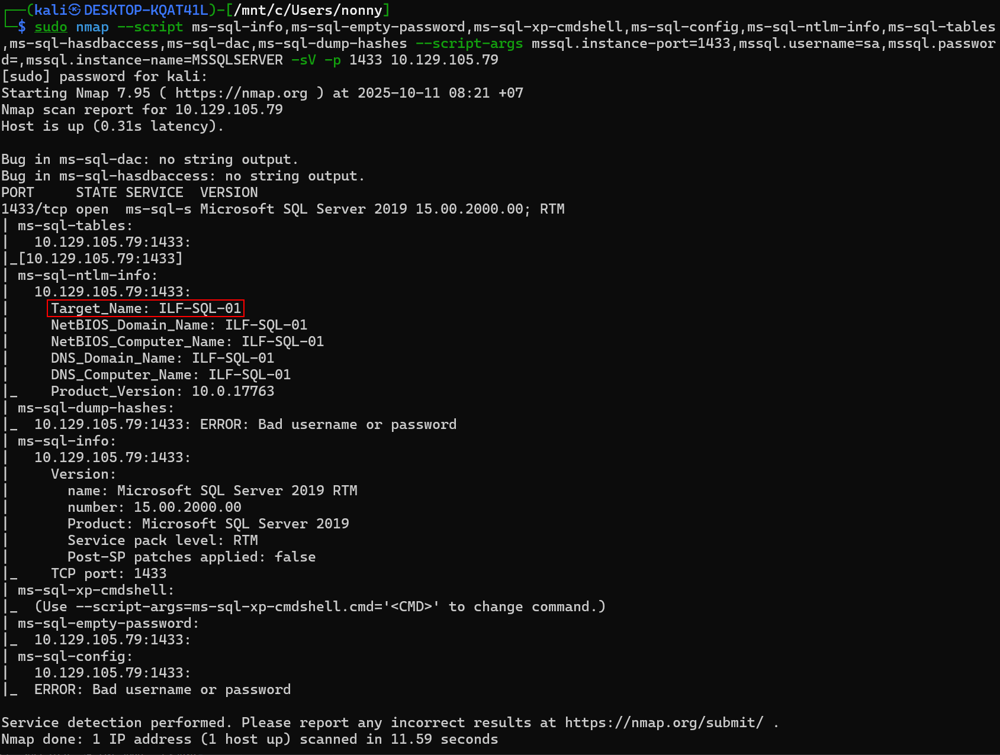
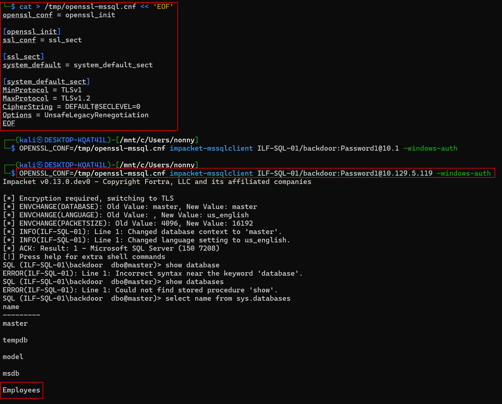

# คำอธิบายเรื่อง Microsoft SQL Server (MSSQL) เป็นภาษาไทย

## MSSQL คืออะไร?

**Microsoft SQL Server (MSSQL)** เป็นระบบจัดการฐานข้อมูลเชิงสัมพันธ์ที่ใช้ภาษา SQL ของ Microsoft โดยมีความแตกต่างจาก MySQL ตรงที่:

- **เป็นซอฟต์แวร์แบบปิด (Closed Source)** - ไม่สามารถดูหรือแก้ไขโค้ดต้นฉบับได้
- **พัฒนามาสำหรับ Windows** - ออกแบบมาให้ทำงานบนระบบปฏิบัติการ Windows เป็นหลัก
- **เหมาะกับแอปพลิเคชัน .NET** - นิยมใช้กับโปรแกรมที่พัฒนาด้วย .NET Framework เพราะรองรับได้ดีมาก
- แม้จะมีเวอร์ชันสำหรับ Linux และ MacOS แต่ส่วนใหญ่จะพบ MSSQL ติดตั้งอยู่บนเครื่อง Windows

## โปรแกรมสำหรับใช้งาน MSSQL (MSSQL Clients)

### 1. **SQL Server Management Studio (SSMS)**
- เป็นโปรแกรมหลักสำหรับจัดการ MSSQL
- สามารถติดตั้งพร้อมกับ MSSQL หรือดาวน์โหลดแยกต่างหากได้
- มักติดตั้งบนเซิร์ฟเวอร์เพื่อตั้งค่าเริ่มต้นและจัดการฐานข้อมูลระยะยาว
- **ข้อสำคัญ**: SSMS สามารถติดตั้งบนเครื่องไหนก็ได้ที่ต้องการจัดการฐานข้อมูล ไม่จำเป็นต้องอยู่บนเซิร์ฟเวอร์เสมอไป

### 2. **โปรแกรมอื่นๆ ที่ใช้ได้**
- **mssql-cli** - เครื่องมือบรรทัดคำสั่ง
- **SQL Server PowerShell** - ใช้งานผ่าน PowerShell
- **HeidiSQL** - โปรแกรมติดต่อฐานข้อมูลแบบกราฟิก
- **SQLPro** - โปรแกรมสำหรับมืออาชีพ
- **Impacket's mssqlclient.py** - เครื่องมือที่นักทดสอบความปลอดภัยนิยมใช้

สำหรับงาน Penetration Testing โปรแกรม **mssqlclient.py** จาก Impacket มักได้รับความนิยมเพราะมีติดตั้งมากับระบบปฏิบัติการสำหรับทดสอบความปลอดภัยอยู่แล้ว

หาตำแหน่งไฟล์ได้ด้วยคำสั่ง:
```bash
locate mssqlclient
```

## ฐานข้อมูลระบบของ MSSQL (Default System Databases)

MSSQL มีฐานข้อมูลระบบที่สร้างขึ้นมาโดยอัตโนมัติ 5 ตัว:

| ชื่อฐานข้อมูล | หน้าที่ |
|--------------|---------|
| **master** | เก็บข้อมูลระบบทั้งหมดของ SQL Server |
| **model** | เป็นแม่แบบสำหรับสร้างฐานข้อมูลใหม่ - การตั้งค่าใน model จะถูกคัดลอกไปยังฐานข้อมูลใหม่ทุกตัว |
| **msdb** | ใช้โดย SQL Server Agent สำหรับจัดการงานอัตโนมัติและการแจ้งเตือน |
| **tempdb** | เก็บข้อมูลชั่วคราวระหว่างการทำงาน |
| **resource** | ฐานข้อมูลแบบอ่านอย่างเดียว เก็บออบเจ็กต์ระบบของ SQL Server |

การเข้าใจฐานข้อมูลระบบเหล่านี้จะช่วยให้เราเข้าใจโครงสร้างของฐานข้อมูลทั้งหมดที่อยู่บนเซิร์ฟเวอร์ได้ดีขึ้น

# การตั้งค่าเริ่มต้นและการตั้งค่าที่เป็นอันตรายของ MSSQL

## การตั้งค่าเริ่มต้น (Default Configuration)

เมื่อผู้ดูแลระบบติดตั้งและตั้งค่า MSSQL ให้สามารถเข้าถึงผ่านเครือข่ายได้ มีรายละเอียดดังนี้:

### 1. **บัญชีผู้ใช้สำหรับรันบริการ**
- SQL Service จะทำงานภายใต้บัญชี `NT SERVICE\MSSQLSERVER`

### 2. **การยืนยันตัวตน (Authentication)**
- ค่าเริ่มต้นใช้ **Windows Authentication**
- หมายความว่าระบบปฏิบัติการ Windows จะเป็นผู้ตรวจสอบการเข้าสู่ระบบ โดยใช้:
  - **ฐานข้อมูล SAM ในเครื่อง** (สำหรับบัญชีผู้ใช้ในเครื่อง)
  - **Domain Controller พร้อม Active Directory** (สำหรับบัญชีในโดเมน)

### 3. **การเข้ารหัส**
- **ค่าเริ่มต้นไม่มีการบังคับเข้ารหัส** เมื่อมีการเชื่อมต่อ

### ข้อดีและข้อเสียของ Windows Authentication

**ข้อดี:**
- เหมาะสำหรับตรวจสอบกิจกรรมและควบคุมการเข้าถึงในสภาพแวดล้อม Windows
- จัดการผู้ใช้ได้รวมศูนย์ผ่าน Active Directory

**ข้อเสีย:**
- ถ้าบัญชีผู้ใช้ถูกแฮก อาจนำไปสู่:
  - **Privilege Escalation** (การยกระดับสิทธิ์)
  - **Lateral Movement** (การเคลื่อนย้ายไปยังระบบอื่นในโดเมน)

## การตั้งค่าที่เป็นอันตราย (Dangerous Settings)

### ทำไมต้องคิดแบบผู้ดูแลระบบ?

เมื่อทำงานทดสอบความปลอดภัย ควรคิดในมุมของผู้ดูแลระบบ IT เพราะ:
- งานประจำวันของ IT มักยุ่งมาก มีโปรเจกต์หลายอย่างพร้อมกัน
- มีแรงกดดันให้ทำงานอย่างรวดเร็วและแม่นยำ
- ความผิดพลาดเกิดขึ้นได้ง่าย
- **แค่การตั้งค่าผิดจุดเดียวก็อาจทำให้เซิร์ฟเวอร์หรือบริการสำคัญถูกบุกรุกได้**

### รายการการตั้งค่าที่ควรตรวจสอบ

นี่ไม่ใช่รายการที่ครบถ้วน แต่เป็นจุดเริ่มต้นที่ดี:

| การตั้งค่าที่เป็นอันตราย | คำอธิบาย |
|-------------------------|-----------|
| **ไม่มีการเข้ารหัสการเชื่อมต่อ** | MSSQL clients เชื่อมต่อกับเซิร์ฟเวอร์โดยไม่เข้ารหัสข้อมูล - เสี่ยงต่อการดักข้อมูล |
| **ใช้ใบรับรองที่สร้างเอง (Self-signed certificates)** | เมื่อมีการเข้ารหัส แต่ใช้ใบรับรองแบบ self-signed ซึ่งสามารถปลอมแปลงได้ |
| **ใช้ Named Pipes** | อาจเปิดช่องโหว่ให้โจมตีได้ หากไม่ได้รับการป้องกันอย่างเหมาะสม |
| **บัญชี `sa` ใช้รหัสผ่านอ่อนแอหรือเป็นค่าเริ่มต้น** | ผู้ดูแลอาจลืมปิดการใช้งานบัญชีนี้ หรือตั้งรหัสผ่านที่ง่ายเกินไป |

### หมายเหตุสำคัญ

**บัญชี `sa` (System Administrator)** เป็นบัญชีผู้ดูแลระบบระดับสูงสุดของ MSSQL:
- มีสิทธิ์เต็มในการควบคุมฐานข้อมูลทั้งหมด
- เป็นเป้าหมายหลักของผู้โจมตี
- ควรปิดการใช้งานหรือใช้รหัสผ่านที่แข็งแกร่งมาก

### คำแนะนำสำหรับการทดสอบ

ลองติดตั้งและตั้งค่า MSSQL ใน Virtual Machine (VM) ด้วยตัวเอง เพื่อ:
- เข้าใจการตั้งค่าเริ่มต้นทั้งหมด
- ทดลองหาจุดอ่อนที่ผู้ดูแลอาจตั้งค่าผิดพลาด
- เรียนรู้วิธีการโจมตีและป้องกัน
---
## Footprinting the Service

```
Watunyoo@htb[/htb]$ sudo nmap --script ms-sql-info,ms-sql-empty-password,ms-sql-xp-cmdshell,ms-sql-config,ms-sql-ntlm-info,ms-sql-tables,ms-sql-hasdbaccess,ms-sql-dac,ms-sql-dump-hashes --script-args mssql.instance-port=1433,mssql.username=sa,mssql.password=,mssql.instance-name=MSSQLSERVER -sV -p 1433 10.129.201.248

Starting Nmap 7.91 ( https://nmap.org ) at 2021-11-08 09:40 EST
Nmap scan report for 10.129.201.248
Host is up (0.15s latency).

PORT     STATE SERVICE  VERSION
1433/tcp open  ms-sql-s Microsoft SQL Server 2019 15.00.2000.00; RTM
| ms-sql-ntlm-info: 
|   Target_Name: SQL-01
|   NetBIOS_Domain_Name: SQL-01
|   NetBIOS_Computer_Name: SQL-01
|   DNS_Domain_Name: SQL-01
|   DNS_Computer_Name: SQL-01
|_  Product_Version: 10.0.17763

Host script results:
| ms-sql-dac: 
|_  Instance: MSSQLSERVER; DAC port: 1434 (connection failed)
| ms-sql-info: 
|   Windows server name: SQL-01
|   10.129.201.248\MSSQLSERVER: 
|     Instance name: MSSQLSERVER
|     Version: 
|       name: Microsoft SQL Server 2019 RTM
|       number: 15.00.2000.00
|       Product: Microsoft SQL Server 2019
|       Service pack level: RTM
|       Post-SP patches applied: false
|     TCP port: 1433
|     Named pipe: \\10.129.201.248\pipe\sql\query
|_    Clustered: false

Service detection performed. Please report any incorrect results at https://nmap.org/submit/ .
Nmap done: 1 IP address (1 host up) scanned in 8.52 seconds
```
```
msf6 auxiliary(scanner/mssql/mssql_ping) > set rhosts 10.129.201.248

rhosts => 10.129.201.248


msf6 auxiliary(scanner/mssql/mssql_ping) > run

[*] 10.129.201.248:       - SQL Server information for 10.129.201.248:
[+] 10.129.201.248:       -    ServerName      = SQL-01
[+] 10.129.201.248:       -    InstanceName    = MSSQLSERVER
[+] 10.129.201.248:       -    IsClustered     = No
[+] 10.129.201.248:       -    Version         = 15.0.2000.5
[+] 10.129.201.248:       -    tcp             = 1433
[+] 10.129.201.248:       -    np              = \\SQL-01\pipe\sql\query
[*] 10.129.201.248:       - Scanned 1 of 1 hosts (100% complete)
[*] Auxiliary module execution completed
```





```
cat > /tmp/openssl-mssql.cnf << 'EOF'
openssl_conf = openssl_init

[openssl_init]
ssl_conf = ssl_sect

[ssl_sect]
system_default = system_default_sect

[system_default_sect]
MinProtocol = TLSv1
MaxProtocol = TLSv1.2
CipherString = DEFAULT@SECLEVEL=0
Options = UnsafeLegacyRenegotiation
EOF
```

```
OPENSSL_CONF=/tmp/openssl-mssql.cnf impacket-mssqlclient ILF-SQL-01/backdoor:Password1@10.129.5.119 -windows-auth
```

