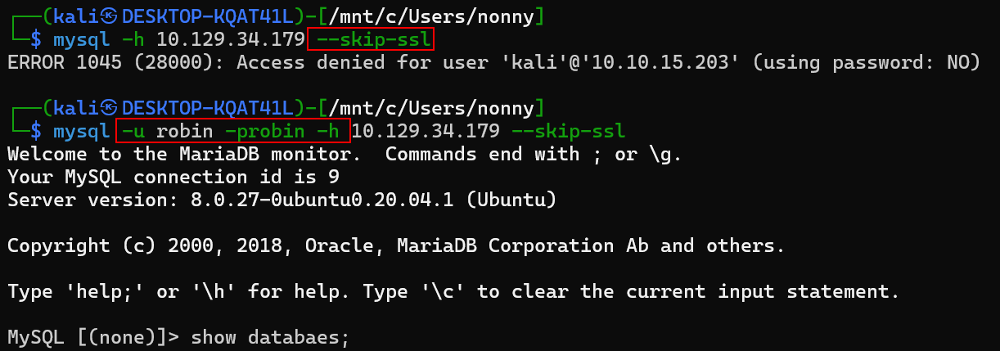
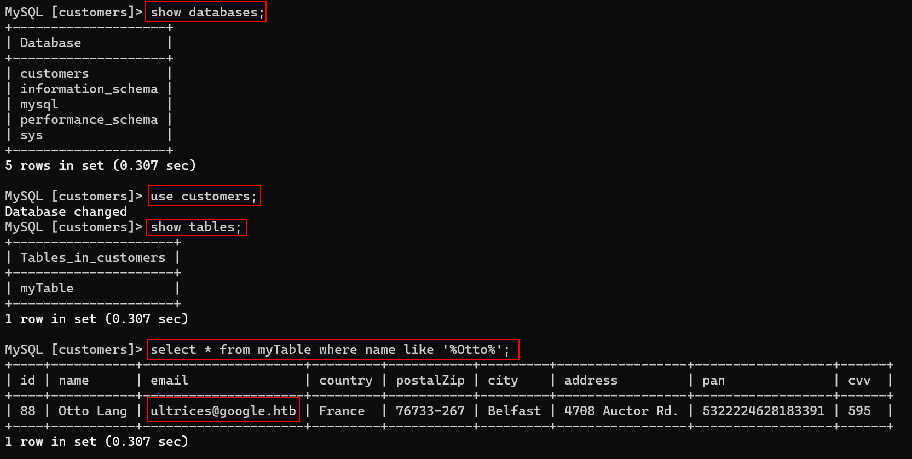

## คำอธิบายเป็นภาษาไทย

**MySQL คืออะไร?**

MySQL เป็นระบบจัดการฐานข้อมูลเชิงสัมพันธ์ (Relational Database Management System) แบบโอเพนซอร์สที่ใช้ภาษา SQL พัฒนาและสนับสนุนโดยบริษัท Oracle ฐานข้อมูลก็คือชุดของข้อมูลที่จัดเก็บอย่างเป็นระบบเพื่อให้ใช้งานและเรียกข้อมูลได้ง่าย ระบบนี้สามารถประมวลผลข้อมูลจำนวนมากได้อย่างรวดเร็วและมีประสิทธิภาพสูง ข้อมูลจะถูกจัดเก็บในรูปแบบที่ใช้พื้นที่น้อยที่สุด และควบคุมผ่านภาษา SQL

**หลักการทำงาน**

MySQL ทำงานตามหลักการ **Client-Server** ประกอบด้วย:

- **MySQL Server** - ตัวจัดการฐานข้อมูลหลักที่รับผิดชอบการจัดเก็บและแจกจ่ายข้อมูล ข้อมูลจะถูกเก็บในตารางที่มีคอลัมน์ แถว และชนิดข้อมูลต่างๆ ฐานข้อมูลมักถูกบันทึกเป็นไฟล์เดียวนามสกุล `.sql` เช่น `wordpress.sql`

- **MySQL Clients** - ตัวที่ใช้ดึงและแก้ไขข้อมูลผ่านคำสั่ง SQL สามารถเพิ่ม ลบ แก้ไข และดึงข้อมูลได้ การเข้าถึงฐานข้อมูลอาจผ่านเครือข่ายภายในหรืออินเทอร์เน็ต

**ตัวอย่างการใช้งาน**

ตัวอย่างที่ดีคือ **WordPress** ที่เก็บโพสต์ ชื่อผู้ใช้ และรหัสผ่านทั้งหมดในฐานข้อมูลของตัวเอง MySQL เหมาะกับแอปพลิเคชันอย่าง **เว็บไซต์แบบไดนามิก** ที่ต้องการความเร็วในการตอบสนองสูง

**LAMP/LEMP Stack**

MySQL มักใช้ร่วมกับ:
- Linux (ระบบปฏิบัติการ)
- Apache หรือ Nginx (เว็บเซิร์ฟเวอร์)
- PHP (ภาษาโปรแกรม)

เรียกว่า **LAMP** (Linux, Apache, MySQL, PHP) หรือ **LEMP** (เมื่อใช้ Nginx)

**ข้อมูลที่เก็บในฐานข้อมูล**

ฐานข้อมูล MySQL เก็บเนื้อหาต่างๆ ที่สคริปต์ PHP ต้องการ เช่น:
- หัวข้อและข้อความ
- ข้อมูลฟอร์ม
- ข้อมูลลูกค้าและผู้ใช้
- ชื่อผู้ใช้และรหัสผ่าน (มักเข้ารหัสด้วย One-Way-Encryption)
- อีเมล
- สิทธิ์การเข้าถึง
- ลิงก์ต่างๆ

**ความปลอดภัย**

ข้อมูลที่ละเอียดอ่อนอย่างรหัสผ่านมักถูกเข้ารหัสโดย PHP ก่อนเก็บลงฐานข้อมูล ข้อผิดพลาดในการประมวลผลอาจถูกใช้สำหรับ **SQL Injection** ได้

**MariaDB**

MariaDB เป็น fork (แยกสาขา) จาก MySQL ถูกพัฒนาโดยนักพัฒนาหลักของ MySQL หลังจากบริษัท MySQL AB ถูกซื้อโดย Oracle เป็นฐานข้อมูลโอเพนซอร์สที่สร้างจากซอร์สโค้ดของ MySQL และมักถูกนำมาใช้แทนกันได้


**ภาพรวม**

การจัดการฐานข้อมูล SQL และการตั้งค่าเป็นหัวข้อที่กว้างขวางมาก มีอาชีพเฉพาะทางอย่าง **Database Administrator (ผู้ดูแลฐานข้อมูล)** ที่ทำงานเกี่ยวกับฐานข้อมูลเกือบตลอดเวลา ความรู้เรื่องนี้เป็นทักษะหลักสำหรับ:
- นักพัฒนาซอฟต์แวร์ (Software Developers)
- นักวิเคราะห์ความปลอดภัยสารสนเทศ (Information Security Analysts)


ไฟล์ตั้งค่าหลักอยู่ที่: `/etc/mysql/mysql.conf.d/mysqld.cnf`

```
Watunyoo@htb[/htb]$ sudo apt install mysql-server -y
Watunyoo@htb[/htb]$ cat /etc/mysql/mysql.conf.d/mysqld.cnf | grep -v "#" | sed -r '/^\s*$/d'

[client]
port		= 3306
socket		= /var/run/mysqld/mysqld.sock

[mysqld_safe]
pid-file	= /var/run/mysqld/mysqld.pid
socket		= /var/run/mysqld/mysqld.sock
nice		= 0

[mysqld]
skip-host-cache
skip-name-resolve
user		= mysql
pid-file	= /var/run/mysqld/mysqld.pid
socket		= /var/run/mysqld/mysqld.sock
port		= 3306
basedir		= /usr
datadir		= /var/lib/mysql
tmpdir		= /tmp
lc-messages-dir	= /usr/share/mysql
explicit_defaults_for_timestamp

symbolic-links=0

!includedir /etc/mysql/conf.d/
```

**ส่วนประกอบสำคัญในไฟล์ตั้งค่า:**

**[client]**
- `port = 3306` - พอร์ตที่ใช้เชื่อมต่อ
- `socket` - ตำแหน่งไฟล์ socket

**[mysqld]** (ส่วนตั้งค่าเซิร์ฟเวอร์)
- `user = mysql` - ชื่อผู้ใช้ที่รัน MySQL
- `port = 3306` - พอร์ตที่ฟัง
- `datadir = /var/lib/mysql` - ตำแหน่งเก็บข้อมูล
- `skip-host-cache` - ข้ามการแคชโฮสต์
- `skip-name-resolve` - ข้ามการแปลงชื่อโฮสต์

---

## ⚠️ การตั้งค่าที่เป็นอันตราย (Dangerous Settings)

มีหลายการตั้งค่าที่อาจก่อให้เกิดช่องโหว่ด้านความปลอดภัย:

### **1. `user`**
- **คำอธิบาย**: กำหนดผู้ใช้ที่จะรันบริการ MySQL
- **ความเสี่ยง**: ถ้าใช้สิทธิ์สูงเกินไป อาจถูกใช้โจมตีระบบได้

### **2. `password`**
- **คำอธิบาย**: ตั้งรหัสผ่านสำหรับผู้ใช้ MySQL
- **ความเสี่ยง**: **เก็บเป็น plain text (ข้อความธรรมดา)** ในไฟล์ตั้งค่า ถ้าใครอ่านไฟล์นี้ได้ก็จะเห็นรหัสผ่านทันที

### **3. `admin_address`**
- **คำอธิบาย**: IP address ที่ฟังการเชื่อมต่อจากเครือข่ายผู้ดูแลระบบ
- **ความเสี่ยง**: ถ้าตั้งค่าผิดพลาดอาจเปิดช่องให้เข้าถึงจากภายนอกได้

### **4. `debug`**
- **คำอธิบาย**: แสดงข้อมูลการ debug อย่างละเอียด
- **ความเสี่ยง**: ให้ข้อมูลมากเกินไปที่ผู้โจมตีสามารถนำไปใช้หาช่องโหว่ได้

### **5. `sql_warnings`**
- **คำอธิบาย**: แสดงคำเตือนเมื่อมีข้อผิดพลาดใน SQL
- **ความเสี่ยง**: ข้อมูลละเอียดอ่อนอาจรั่วไหลผ่าน error messages

### **6. `secure_file_priv`**
- **คำอธิบาย**: จำกัดการ import/export ข้อมูล
- **ความเสี่ยง**: ถ้าไม่ตั้งค่าอาจทำให้อ่านหรือเขียนไฟล์ระบบได้

---

```
ห้ามเว้นวรรคหลัง -p
mysql -u robin -probin -h 10.129.34.179 --skip-ssl
```



