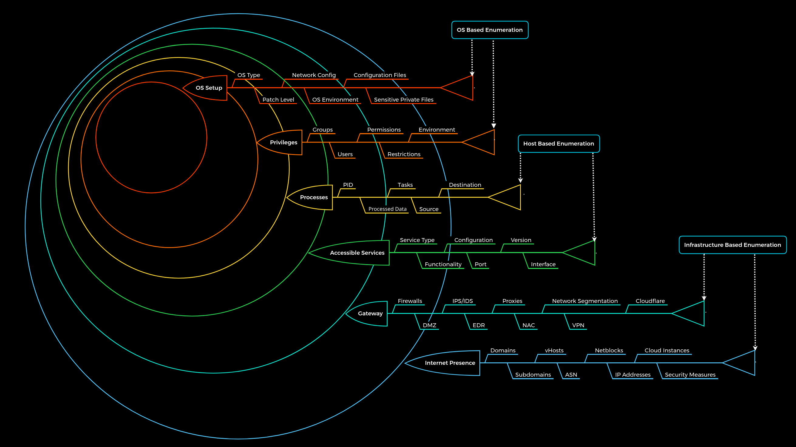

## Infrastructure Based Enumeration

### Domain Information 
-  SSL certificate --> https://crt.sh/
- shodan
- dig --> txt record

```
ใช้หา subdomain ได้แบบ public

curl -s https://crt.sh/\?q\=inlanefreight.com\&output\=json | jq . | grep name | cut -d":" -f2 | grep -v "CN=" | cut -d'"' -f2 | awk '{gsub(/\\n/,"\n");}1;' | sort -u
```

### Cloud Resources
- S3 buckets (AWS), blobs (Azure), cloud storage (GCP) Object ที่เก็บข้อมูลและเข้าถึงผ่าน URL
- https://domain.glass/    
- https://buckets.grayhatwarfare.com/

**ตัวอย่าง URL:**
```
AWS S3: https://bucket-name.s3.amazonaws.com/file.pdf
Azure: https://account.blob.core.windows.net/container/file.pdf  
GCP: https://storage.googleapis.com/bucket-name/file.pdf
```

**หลักการ:**
- แต่ละไฟล์ = 1 Object
- แต่ละ Object มี URL เฉพาะตัว
- เข้าถึงผ่าน HTTP/HTTPS

**ในมุมมอง Pentester:**
- URL เดาได้ → เข้าถึงไฟล์ได้
- Misconfiguration → Public access
- Directory listing → เห็นไฟล์ทั้งหมด

**สรุป:** Object storage = ไฟล์ + URL = เป้าหมายสำคัญใน OSINT/Recon!

## Host Based Enumeration

### File Transfer Protocol (FTP)
- application layer of the TCP/IP protocol stack
- 

