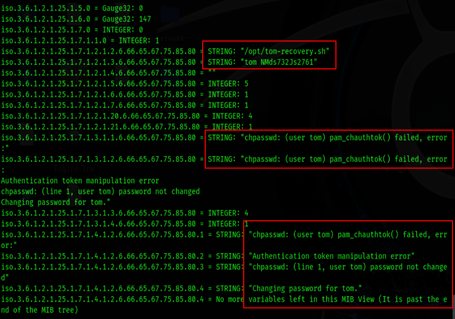

## Infrastructure Based Enumeration

### Domain Information 
-  SSL certificate --> https://crt.sh/
- shodan
- dig --> txt record

```
ใช้หา subdomain ได้แบบ public

curl -s https://crt.sh/\?q\=inlanefreight.com\&output\=json | jq . | grep name | cut -d":" -f2 | grep -v "CN=" | cut -d'"' -f2 | awk '{gsub(/\\n/,"\n");}1;' | sort -u
```

### Cloud Resources
- S3 buckets (AWS), blobs (Azure), cloud storage (GCP) Object ที่เก็บข้อมูลและเข้าถึงผ่าน URL
- https://domain.glass/    
- https://buckets.grayhatwarfare.com/

**ตัวอย่าง URL:**
```
AWS S3: https://bucket-name.s3.amazonaws.com/file.pdf
Azure: https://account.blob.core.windows.net/container/file.pdf  
GCP: https://storage.googleapis.com/bucket-name/file.pdf
```

**หลักการ:**
- แต่ละไฟล์ = 1 Object
- แต่ละ Object มี URL เฉพาะตัว
- เข้าถึงผ่าน HTTP/HTTPS

**ในมุมมอง Pentester:**
- URL เดาได้ → เข้าถึงไฟล์ได้
- Misconfiguration → Public access
- Directory listing → เห็นไฟล์ทั้งหมด

**สรุป:** Object storage = ไฟล์ + URL = เป้าหมายสำคัญใน OSINT/Recon!

# Host Based Enumeration

## File Transfer Protocol (FTP)

## Server Message Block (SMB) 


## Easy

```
┌──(kali㉿DESKTOP-KQAT41L)-[/mnt/…/nonny/OneDrive/Desktop/hackthebox]
└─$ sudo nmap -sC 10.129.169.143
[sudo] password for kali:
Starting Nmap 7.95 ( https://nmap.org ) at 2025-10-13 07:59 +07
Nmap scan report for 10.129.169.143
Host is up (0.30s latency).
Not shown: 996 closed tcp ports (reset)
PORT     STATE SERVICE
21/tcp   open  ftp
22/tcp   open  ssh
| ssh-hostkey:
|   3072 3f:4c:8f:10:f1:ae:be:cd:31:24:7c:a1:4e:ab:84:6d (RSA)
|   256 7b:30:37:67:50:b9:ad:91:c0:8f:f7:02:78:3b:7c:02 (ECDSA)
|_  256 88:9e:0e:07:fe:ca:d0:5c:60:ab:cf:10:99:cd:6c:a7 (ED25519)
53/tcp   open  domain
| dns-nsid:
|_  bind.version: 9.16.1-Ubuntu
2121/tcp open  ccproxy-ftp
```


```
┌──(kali㉿DESKTOP-KQAT41L)-[/mnt/c/Users/nonny]
└─$ dig axfr inlanefreight.htb @10.129.169.143

; <<>> DiG 9.20.9-1-Debian <<>> axfr inlanefreight.htb @10.129.169.143
;; global options: +cmd
inlanefreight.htb.      604800  IN      SOA     inlanefreight.htb. root.inlanefreight.htb. 2 604800 86400 2419200 604800
inlanefreight.htb.      604800  IN      TXT     "MS=ms97310371"
inlanefreight.htb.      604800  IN      TXT     "atlassian-domain-verification=t1rKCy68JFszSdCKVpw64A1QksWdXuYFUeSXKU"
inlanefreight.htb.      604800  IN      TXT     "v=spf1 include:mailgun.org include:_spf.google.com include:spf.protection.outlook.com include:_spf.atlassian.net ip4:10.129.124.8 ip4:10.129.127.2 ip4:10.129.42.106 ~all"
inlanefreight.htb.      604800  IN      NS      ns.inlanefreight.htb.
app.inlanefreight.htb.  604800  IN      A       10.129.18.15
internal.inlanefreight.htb. 604800 IN   A       10.129.1.6
mail1.inlanefreight.htb. 604800 IN      A       10.129.18.201
ns.inlanefreight.htb.   604800  IN      A       10.129.34.136
inlanefreight.htb.      604800  IN      SOA     inlanefreight.htb. root.inlanefreight.htb. 2 604800 86400 2419200 604800
;; Query time: 304 msec
;; SERVER: 10.129.169.143#53(10.129.169.143) (TCP)
;; WHEN: Mon Oct 13 08:18:22 +07 2025
;; XFR size: 10 records (messages 1, bytes 540)

```


## Medium

```
┌──(kali㉿kali)-[~]
└─$ sudo nmap -sC 10.129.202.41                                                                        
[sudo] password for kali: 
Starting Nmap 7.95 ( https://nmap.org ) at 2025-10-13 07:59 EDT
Nmap scan report for 10.129.202.41
Host is up (0.30s latency).
Not shown: 993 closed tcp ports (reset)
PORT     STATE SERVICE
111/tcp  open  rpcbind
| rpcinfo: 
|   program version    port/proto  service
|   100000  2,3,4        111/tcp   rpcbind
|   100000  2,3,4        111/tcp6  rpcbind
|   100000  2,3,4        111/udp   rpcbind
|   100000  2,3,4        111/udp6  rpcbind
|   100003  2,3         2049/udp   nfs
|   100003  2,3         2049/udp6  nfs
|   100003  2,3,4       2049/tcp   nfs
|   100003  2,3,4       2049/tcp6  nfs
|   100005  1,2,3       2049/tcp   mountd
|   100005  1,2,3       2049/tcp6  mountd
|   100005  1,2,3       2049/udp   mountd
|   100005  1,2,3       2049/udp6  mountd
|   100021  1,2,3,4     2049/tcp   nlockmgr
|   100021  1,2,3,4     2049/tcp6  nlockmgr
|   100021  1,2,3,4     2049/udp   nlockmgr
|   100021  1,2,3,4     2049/udp6  nlockmgr
|   100024  1           2049/tcp   status
|   100024  1           2049/tcp6  status
|   100024  1           2049/udp   status
|_  100024  1           2049/udp6  status
135/tcp  open  msrpc
139/tcp  open  netbios-ssn
445/tcp  open  microsoft-ds
2049/tcp open  nlockmgr
3389/tcp open  ms-wbt-server
| ssl-cert: Subject: commonName=WINMEDIUM
| Not valid before: 2025-10-12T10:55:43
|_Not valid after:  2026-04-13T10:55:43
| rdp-ntlm-info: 
|   Target_Name: WINMEDIUM
|   NetBIOS_Domain_Name: WINMEDIUM
|   NetBIOS_Computer_Name: WINMEDIUM
|   DNS_Domain_Name: WINMEDIUM
|   DNS_Computer_Name: WINMEDIUM
|   Product_Version: 10.0.17763
|_  System_Time: 2025-10-13T11:59:15+00:00
|_ssl-date: 2025-10-13T11:59:14+00:00; 0s from scanner time.
5985/tcp open  wsman

Host script results:
| smb2-time: 
|   date: 2025-10-13T11:59:16
|_  start_date: N/A
| smb2-security-mode: 
|   3:1:1: 
|_    Message signing enabled but not required

Nmap done: 1 IP address (1 host up) scanned in 21.77 seconds
```
```
┌──(kali㉿kali)-[~]
└─$ sudo mount -t nfs 10.129.202.41:/ .target-nfs
┌──(kali㉿kali)-[~/target-nfs]
└─$ sudo ls -la TechSupport
-rwx------ 1 nobody nogroup  1305 Nov 10  2021 ticket4238791283782.txt

```


```
┌──(kali㉿kali)-[~]
└─$ xfreerdp3 /u:alex /p:'lol123!mD' /v:10.129.202.41

```


run mssql on Desktop with administrator


## Hard


```
┌──(kali㉿kali)-[~]
└─$ sudo nmap -sC 10.129.202.20 -Pn
Starting Nmap 7.95 ( https://nmap.org ) at 2025-10-14 00:59 EDT
Nmap scan report for 10.129.202.20
Host is up (0.30s latency).
Not shown: 995 closed tcp ports (reset)
PORT    STATE SERVICE
22/tcp  open  ssh
|_ssh-hostkey: ERROR: Script execution failed (use -d to debug)
110/tcp open  pop3
| ssl-cert: Subject: commonName=NIXHARD
| Subject Alternative Name: DNS:NIXHARD
| Not valid before: 2021-11-10T01:30:25
|_Not valid after:  2031-11-08T01:30:25
143/tcp open  imap
| ssl-cert: Subject: commonName=NIXHARD
| Subject Alternative Name: DNS:NIXHARD
| Not valid before: 2021-11-10T01:30:25
|_Not valid after:  2031-11-08T01:30:25
993/tcp open  imaps
|_ssl-date: TLS randomness does not represent time
| ssl-cert: Subject: commonName=NIXHARD
| Subject Alternative Name: DNS:NIXHARD
| Not valid before: 2021-11-10T01:30:25
|_Not valid after:  2031-11-08T01:30:25
995/tcp open  pop3s
| ssl-cert: Subject: commonName=NIXHARD
| Subject Alternative Name: DNS:NIXHARD
| Not valid before: 2021-11-10T01:30:25
|_Not valid after:  2031-11-08T01:30:25
|_ssl-date: TLS randomness does not represent time

Nmap done: 1 IP address (1 host up) scanned in 22.50 seconds

```


```
┌──(kali㉿kali)-[~]
└─$ snmpwalk -v2c -c backup 10.129.129.217

```



```
┌──(kali㉿kali)-[~]
└─$ openssl  s_client -connect 10.129.129.217:993 
* OK [CAPABILITY IMAP4rev1 SASL-IR LOGIN-REFERRALS ID ENABLE IDLE LITERAL+ AUTH=PLAIN] Dovecot (Ubuntu) ready.
a1 login tom NMds732Js2761
a1 OK [CAPABILITY IMAP4rev1 SASL-IR LOGIN-REFERRALS ID ENABLE IDLE SORT SORT=DISPLAY THREAD=REFERENCES THREAD=REFS THREAD=ORDEREDSUBJECT MULTIAPPEND URL-PARTIAL CATENATE UNSELECT CHILDREN NAMESPACE UIDPLUS LIST-EXTENDED I18NLEVEL=1 CONDSTORE QRESYNC ESEARCH ESORT SEARCHRES WITHIN CONTEXT=SEARCH LIST-STATUS BINARY MOVE SNIPPET=FUZZY PREVIEW=FUZZY LITERAL+ NOTIFY SPECIAL-USE] Logged in
a2 list
a2 BAD Error in IMAP command LIST: Invalid reference (0.001 + 0.000 secs).
a2 list "" "*"
* LIST (\HasNoChildren) "." Notes
* LIST (\HasNoChildren) "." Meetings
* LIST (\HasNoChildren \UnMarked) "." Important
* LIST (\HasNoChildren) "." INBOX

```