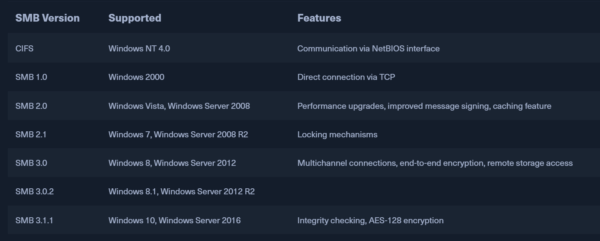

## Server Message Block (SMB) 


## 1. SMB คืออะไร?

**Server Message Block (SMB)** เป็น client-server protocol สำหรับการแชร์ทรัพยากรในเครือข่าย:
- **ไฟล์และโฟลเดอร์** - แชร์และเข้าถึงข้อมูล
- **อุปกรณ์เครือข่าย** - เครื่องพิมพ์, เราเตอร์
- **การสื่อสาร** - แลกเปลี่ยนข้อมูลระหว่างระบบต่างๆ

### ที่มาและวิวัฒนาการ
- **กำเนิด**: พัฒนาโดย Microsoft สำหรับ OS/2 (LAN Manager, LAN Server)
- **ใช้งานหลัก**: Windows operating systems ทุกรุ่น
- **Backward Compatible**: Windows รุ่นใหม่สื่อสารกับรุ่นเก่าได้
- **Cross-Platform**: Samba project ทำให้ Linux/Unix ใช้ SMB ได้

---

## 2. SMB ทำงานอย่างไร?

### ขั้นตอนการเชื่อมต่อ
```
Client → ต้องการเข้าถึงทรัพยากร
   ↓
Server → ต้องมี SMB server application
   ↓
Handshake → แลกเปลี่ยน messages เพื่อสร้างการเชื่อมต่อ
   ↓
TCP/IP → ส่งข้อมูลผ่าน three-way handshake
```


## 3. SMB Shares และการควบคุมสิทธิ์

### แนวคิด Shares
- **Server** แชร์ส่วนหนึ่งของ file system ออกมา
- **Client** เห็นโครงสร้างที่อาจแตกต่างจากของจริงบน server
- **การเข้าถึง** ต้องผ่านการตรวจสอบ 2 ชั้น: **SMB permissions** และ **Local file permissions**

### กฎการเข้าถึงไฟล์ (ต้องผ่านทั้ง 2 ชั้น)

**Scenario 1: SMB อนุญาต ✓ แต่ Local ปฏิเสธ ✗**
```bash
SMB Share ACL: john = Full Control
Local File: owner=root, permissions=700
ผลลัพธ์: ❌ john เข้าถึงไม่ได้ (Local blocking)
```

**Scenario 2: SMB ปฏิเสธ ✗ แต่ Local อนุญาต ✓**
```bash
SMB Share ACL: mary = No Access
Local File: owner=mary, permissions=755
ผลลัพธ์: ❌ mary เข้าถึงไม่ได้ (SMB blocking)
```

**Scenario 3: ทั้งคู่อนุญาต ✓✓**
```bash
SMB Share ACL: alice = Read/Write
Local File: group=staff, alice ∈ staff, permissions=770
ผลลัพธ์: ✅ alice เข้าถึงได้
```

**หลักการ**: การเข้าถึงสำเร็จต่อเมื่อ **SMB และ Local ต้องอนุญาตทั้งคู่**

---

## 4. CIFS คืออะไร?

**Common Internet File System (CIFS)** คือ:
- **Dialect (รูปแบบเฉพาะ) ของ SMB** ที่ Microsoft พัฒนา
- เทียบเท่ากับ **SMB version 1** 
- ใช้สำหรับสื่อสารระหว่าง Windows systems
- มักเรียกรวมกันว่า **SMB/CIFS**

### จุดอ่อน
- เป็นเวอร์ชันเก่า มีช่องโหว่ด้านความปลอดภัย
- ยังใช้ในระบบเก่าที่ต้องรักษา compatibility

---

## 5. Samba คืออะไร?

**Samba** เป็น open-source implementation ของ SMB protocol สำหรับ Unix/Linux:
- ทำให้ Linux/Unix สื่อสารกับ Windows ได้
- ใช้ CIFS protocol เพื่อความเข้ากันได้
- เป็นทางเลือกแทน Microsoft SMB server

### ความสัมพันธ์ระหว่าง 3 ตัว
```
SMB Protocol (Microsoft original)
│
├── CIFS (dialect = SMB v1 specific implementation)
│   └── ใช้ใน Windows environments
│
└── Samba (open-source alternative)
    └── ใช้ CIFS เพื่อทำงานร่วมกับ Windows
```

---

## 6. NetBIOS และความเกี่ยวข้องกับ SMB

### NetBIOS คืออะไร?
**Network Basic Input/Output System** ให้บริการ:
- **Naming service** - ตั้งชื่อและแก้ไขชื่อคอมพิวเตอร์
- **Session service** - จัดการการเชื่อมต่อ
- **Datagram service** - ส่งข้อความ

### ความสัมพันธ์กับ SMB

**ยุคเก่า (SMB 1)**:
- SMB ทำงานบน **NetBIOS over TCP/IP** (NetBT)
- ใช้ NetBIOS เป็น transport layer
- NetBIOS ช่วยแก้ไขชื่อและสร้าง session

**ยุคใหม่ (SMB 2.0+)**:
- SMB ทำงานได้โดยตรงบน TCP/IP โดยไม่ต้องพึ่ง NetBIOS
- NetBIOS ยังคงมีเพื่อรองรับระบบเก่า (backward compatibility)

---

## 7. Ports ที่ใช้ในการสื่อสาร

### ตารางเปรียบเทียบ

| Protocol | Ports | ใช้สำหรับ | ยุค |
|----------|-------|-----------|-----|
| **NetBIOS over TCP** | 137, 138, 139 | Legacy SMB ผ่าน NetBIOS layer | เก่า |
| **SMB Direct** | 445 | SMB/CIFS โดยตรงบน TCP/IP | ใหม่ |

### รายละเอียด Ports

**Ports 137-139 (NetBIOS)**
- ใช้เมื่อ SMB ทำงานผ่าน NetBIOS
- รองรับระบบเก่า
- ใช้กับ Samba ใน legacy mode

**Port 445 (Direct SMB)**
- CIFS/SMB ทำงานโดยตรง
- ไม่ต้องผ่าน NetBIOS layer
- เป็นมาตรฐานใน modern systems

---

## 8. SMB Versions และการพัฒนา

### Timeline วิวัฒนาการ

**SMB 1.0 / CIFS**
- เวอร์ชันแรก มีมานานที่สุด
- มีช่องโหว่ด้านความปลอดภัยมาก
- ⚠️ Microsoft แนะนำให้ปิดใช้งาน
- ยังใช้ในระบบเก่าที่จำเป็น

**SMB 2.0 / 2.1**
- ปรับปรุงประสิทธิภาพอย่างมาก
- ลดจำนวน commands และ subcommands
- เพิ่มความปลอดภัย
- รองรับ features ใหม่

**SMB 3.0 / 3.1.1** (ปัจจุบัน)
- **การเข้ารหัส end-to-end** (encryption)
- ประสิทธิภาพสูงสุด
- รองรับ Remote Direct Memory Access (RDMA)
- เป็นมาตรฐานใน Windows 10/11 และ Server 2016+

### เปรียบเทียบความแตกต่าง

| Feature | SMB 1 | SMB 2 | SMB 3 |
|---------|-------|-------|-------|
| ความปลอดภัย | ⚠️ อ่อนแอ | ✓ ดีขึ้น | ✅ แข็งแกร่ง |
| ประสิทธิภาพ | ต่ำ | กลาง | สูงมาก |
| การเข้ารหัส | ไม่มี | จำกัด | เต็มรูปแบบ |
| แนะนำใช้ | ❌ | ⚠️ | ✅ |

---

## สรุป: แผนผังความสัมพันธ์ทั้งหมด

```
Application Layer
    ↓
SMB Protocol (ควบคุมการแชร์ไฟล์/ทรัพยากร)
    ├── Implementations
    │   ├── Microsoft SMB (Windows)
    │   │   └── CIFS (SMB v1 dialect)
    │   └── Samba (Linux/Unix alternative)
    │
    └── Transport Methods
        ├── Legacy: ผ่าน NetBIOS (ports 137-139)
        └── Modern: Direct TCP/IP (port 445)
    ↓
TCP/IP Layer
    ↓
Network/Physical Layer
```

**Key Takeaway**: SMB เป็นโปรโตคอลหลัก, CIFS เป็นรูปแบบเฉพาะของ SMB v1, Samba เป็น implementation สำหรับ Linux/Unix, และ NetBIOS เป็น transport layer แบบเก่าที่ SMB เคยใช้แต่ปัจจุบันทำงานได้โดยตรงบน TCP/IP แล้ว




### คำสั่ง
```bash
smbstatus
```

### ข้อมูลที่แสดง

```
Samba version 4.11.6-Ubuntu

PID    Username   Group    Machine              Protocol    Encryption  Signing
--------------------------------------------------------------------------------
75691  sambauser  samba    10.10.14.4          SMB3_11     -           -

Service   pid    Machine      Connected at              Encryption  Signing
---------------------------------------------------------------------------
notes     75691  10.10.14.4   Do Sep 23 00:12:06 2021  -           -

No locked files
```

---

## 📊 การแปลความหมาย

| ข้อมูล | คำอธิบาย | ตัวอย่าง |
|--------|----------|----------|
| **PID** | Process ID ของการเชื่อมต่อ | 75691 |
| **Username** | ผู้ใช้ที่เชื่อมต่อ | sambauser |
| **Group** | กลุ่มของผู้ใช้ | samba |
| **Machine** | IP address ของ client | 10.10.14.4 |
| **Protocol Version** | เวอร์ชัน SMB ที่ใช้ | SMB3_11 |
| **Service** | Share ที่เข้าถึง | notes |
| **Connected at** | เวลาที่เชื่อมต่อ | Do Sep 23 00:12:06 2021 |
| **Encryption** | เข้ารหัสหรือไม่ | - (ไม่มี) |
| **Signing** | มีการ sign packets หรือไม่ | - (ไม่มี) |

---

## 🎯 ประโยชน์ของการใช้ `smbstatus`

### สำหรับ Administrator
- ✅ **ตรวจสอบว่าใครกำลังเข้าถึง shares**
- ✅ **เห็น IP address ของ clients**
- ✅ **รู้ว่า share ไหนถูกใช้งาน**
- ✅ **ตรวจจับการเข้าถึงที่ผิดปกติ**

### สำหรับ Penetration Tester
- 🔴 **รู้ว่าใครอยู่ในเครือข่าย**
- 🔴 **เห็น active connections**
- 🔴 **วางแผนการโจมตีต่อไป** (เช่น lateral movement)
- 🔴 **หลีกเลี่ยงการถูกสังเกต** (เห็นว่า admin กำลังตรวจสอบอยู่หรือไม่)

---

## 🏢 Domain-Level Security

### แนวคิด
```
Samba Server → เป็น member ของ Windows Domain
       ↓
Domain Controller (Windows NT Server)
       ↓
จัดการ authentication ทั้งหมด
```

### การทำงาน

**1. Domain Controller มีหน้าที่:**
- เป็น **password server** หลักของ domain
- จัดเก็บข้อมูล users และ passwords
- Authenticate ผู้ใช้ทุกครั้งที่ login

**2. ฐานข้อมูลที่ใช้:**

| Database | คำอธิบาย | ตำแหน่ง |
|----------|----------|---------|
| **NTDS.dit** | Active Directory database | Domain Controller |
| **SAM** (Security Authentication Module) | Local user database | Windows machines |

**3. กระบวนการ Authentication:**

```
User → Login ครั้งแรก
  ↓
Domain Controller → ตรวจสอบ NTDS.dit/SAM
  ↓
ผ่าน → ได้รับ token
  ↓
เข้าถึง shares บน Samba หรือเครื่องอื่นๆ ใน domain
```

---

## 🔐 ความสำคัญด้าน Security

### จาก `smbstatus` เห็นว่า:

```
Encryption: -    (ไม่มีการเข้ารหัส)
Signing: -       (ไม่มีการ sign)
```

**หมายความว่า:**
- ⚠️ ข้อมูลส่งแบบ plain text
- ⚠️ เสี่ยงต่อ man-in-the-middle attacks
- ⚠️ เสี่ยงต่อ credential sniffing
- ⚠️ สามารถ replay attacks ได้

### ควรเปิดใช้:
```ini
# ใน smb.conf
server signing = mandatory
smb encrypt = required
```

---

## 💡 Use Case สำคัญ

### Scenario: Penetration Testing

> "เมื่อเข้าสู่ subnet (อาจเป็น isolated network) ที่คนอื่นยังเข้าถึงได้"

**ทำไมต้องใช้ `smbstatus`:**

1. **รู้ว่าใครอยู่ในเครือข่าย**
   - เห็น active users
   - เห็น IP addresses

2. **วางแผน Lateral Movement**
   - Target users ที่มี privileges สูง
   - ตาม sessions ไปยังเครื่องอื่น

3. **หลีกเลี่ยงการถูกจับ**
   - เห็นว่า admin กำลัง monitor
   - ปรับ tactics ให้ stealthy ขึ้น

4. **เก็บข้อมูล Domain**
   - รู้โครงสร้าง domain
   - เตรียม attack ต่อ Domain Controller

---
