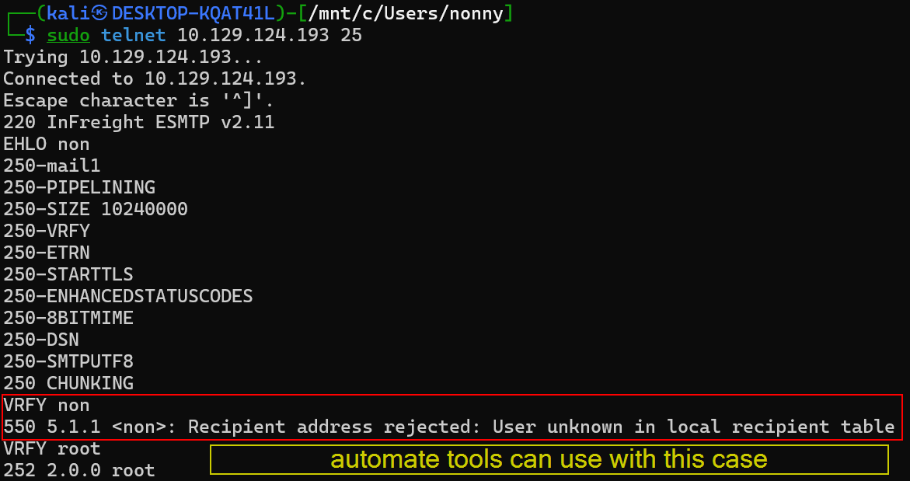

# SMTP (Simple Mail Transfer Protocol)

 คือโปรโตคอลสำหรับส่งอีเมลในเครือข่าย IP สามารถใช้ระหว่างโปรแกรมอีเมลกับเซิร์ฟเวอร์ส่งจดหมาย หรือระหว่างเซิร์ฟเวอร์ SMTP สองตัวด้วยกันได้ มักใช้ร่วมกับโปรโตคอล IMAP หรือ POP3 ซึ่งทำหน้าที่ดึงและส่งอีเมล โดยหลักการแล้ว SMTP เป็นโปรโตคอลแบบ client-server แม้ว่า SMTP จะสามารถใช้ระหว่าง client กับ server หรือระหว่าง SMTP server สองตัวก็ได้ ในกรณีนี้ server จะทำหน้าที่เป็น client


## 1. **พอร์ต 25 (พอร์ตดั้งเดิม)**
- เป็นพอร์ตมาตรฐานแรกสุด
- ใช้สำหรับ**เซิร์ฟเวอร์คุยกับเซิร์ฟเวอร์** (Server-to-Server)
- **ไม่เข้ารหัส** - ส่งข้อมูลแบบเปิดเผย
- **ปัญหา:** โดนใช้ส่งสแปมบ่อยมาก

## 2. **พอร์ต 587 (สำหรับผู้ใช้ทั่วไป)**
- ออกแบบมาสำหรับ**ผู้ใช้ส่งอีเมล** (Client-to-Server)
- **บังคับยืนยันตัวตน** - ต้อง login ก่อนส่ง
- **มีการเข้ารหัส** - ใช้ STARTTLS เปลี่ยนจากไม่เข้ารหัสเป็นเข้ารหัส
- **ปลอดภัยกว่า** - ป้องกันสแปมและปกป้องรหัสผ่าน

## 3. **พอร์ต 465 (เข้ารหัสตั้งแต่ต้น)**
- **เข้ารหัสทันที** ตั้งแต่เชื่อมต่อด้วย SSL/TLS
- ไม่ต้องสั่ง STARTTLS 
- ปลอดภัยสูงสุด

## เปรียบเทียบแบบง่าย 🚪

| พอร์ต | เหมือนกับ | ความปลอดภัย |
|------|-----------|-------------|
| **25** | ส่งจดหมายไม่ใส่ซอง | ⚠️ ไม่ปลอดภัย |
| **587** | ใส่ซองหลังส่ง | ✅ ปลอดภัย |
| **465** | ใส่ซองตั้งแต่เขียน | ✅✅ ปลอดภัยมาก |


## กระบวนการยืนยันตัวตนและส่งอีเมล

1. Client ยืนยันตัวตนด้วย username/password
2. ส่งข้อมูล: ที่อยู่ผู้ส่ง-ผู้รับ, เนื้อหาอีเมล, พารามิเตอร์
3. ส่งอีเมลเสร็จ ยกเลิกการเชื่อมต่อ
4. Server ส่งต่อไปยัง SMTP server อื่น


## กลไกป้องกันสแปม

หน้าที่สำคัญของ SMTP server คือการป้องกันสแปมโดยใช้กลไกการยืนยันตัวตนที่อนุญาตให้เฉพาะผู้ใช้ที่ได้รับอนุญาตเท่านั้นที่สามารถส่งอีเมลได้ SMTP server สมัยใหม่ส่วนใหญ่รองรับส่วนขยายโปรโตคอล ESMTP with SMTP-Auth


## การทำงานของระบบอีเมล

เมื่อคุณส่งอีเมล จะผ่านขั้นตอนดังนี้:

1. **MUA (Mail User Agent)** - โปรแกรมอีเมลของคุณ
2. **MSA (Mail Submission Agent)** - ตรวจสอบว่าอีเมลถูกต้องหรือไม่
3. **MTA (Mail Transfer Agent)** - ส่งอีเมลไปยังเซิร์ฟเวอร์ปลายทาง
4. **MDA (Mail Delivery Agent)** - นำอีเมลไปใส่ในกล่องจดหมายของผู้รับ
5. **กล่องจดหมาย (POP3/IMAP)** - ที่เก็บอีเมลของผู้รับ


# แต่ละขั้นตอนเกิดขึ้นที่ไหน

## 1. **MUA (Mail User Agent)** 
📍 **อยู่ที่: คอมพิวเตอร์ของคุณ**
- โปรแกรมที่คุณใช้เขียนอีเมล เช่น Gmail, Outlook, Thunderbird
- เป็นจุดเริ่มต้นที่คุณกดปุ่ม "ส่ง"

## 2. **MSA (Mail Submission Agent)**
📍 **อยู่ที่: เซิร์ฟเวอร์อีเมลของผู้ส่ง**
- ตัวอย่าง: smtp.gmail.com ถ้าคุณใช้ Gmail
- ทำหน้าที่รับอีเมลจากคุณ แล้วตรวจสอบความถูกต้อง
- เช็คว่าคุณมีสิทธิ์ส่งจริงไหม (ยืนยันตัวตน)

## 3. **MTA (Mail Transfer Agent)**
📍 **อยู่ที่: เซิร์ฟเวอร์อีเมลทั้งฝั่งผู้ส่งและผู้รับ**
- ฝั่งผู้ส่ง: ค้นหาว่าเซิร์ฟเวอร์ของผู้รับอยู่ที่ไหน (ผ่าน DNS)
- ส่งอีเมลข้ามอินเทอร์เน็ตไปยังเซิร์ฟเวอร์ปลายทาง
- ฝั่งผู้รับ: รับอีเมลที่ส่งมา

## 4. **MDA (Mail Delivery Agent)**
📍 **อยู่ที่: เซิร์ฟเวอร์อีเมลของผู้รับ**
- นำอีเมลที่มาถึงแล้วไปวางในกล่องจดหมายของผู้รับ
- เหมือนพนักงานไปรษณีย์ที่เอาจดหมายไปใส่ตู้ไปรษณีย์

## 5. **กล่องจดหมาย (Mailbox - POP3/IMAP)**
📍 **อยู่ที่: เซิร์ฟเวอร์อีเมลของผู้รับ**
- ที่เก็บอีเมลทั้งหมดของผู้รับ
- ผู้รับใช้ POP3 หรือ IMAP ดึงอีเมลมาอ่านที่เครื่องของตัวเอง

---

## ภาพรวมการเดินทางของอีเมล:

```
[คอมฯ คุณ] → [เซิร์ฟเวอร์ Gmail] → [อินเทอร์เน็ต] → [เซิร์ฟเวอร์ผู้รับ] → [กล่องจดหมายผู้รับ]
    MUA           MSA + MTA                            MTA + MDA              Mailbox
```


## ข้อเสียของ SMTP

SMTP มีข้อเสียที่มีอยู่แต่เดิมในโปรโตคอลเครือข่ายสองประการ:

1. **ไม่มีการยืนยันการส่งที่ใช้งานได้**: การส่งอีเมลผ่าน SMTP ไม่ส่งการยืนยันการส่งที่ใช้งานได้กลับมา แม้ว่าข้อกำหนดของโปรโตคอลจะรองรับการแจ้งเตือนประเภทนี้ แต่รูปแบบของมันไม่ได้ระบุไว้โดยค่าเริ่มต้น ดังนั้นปกติจะได้รับเพียงข้อความแสดงข้อผิดพลาดเป็นภาษาอังกฤษ รวมถึง header ของข้อความที่ส่งไม่สำเร็จเท่านั้น

2. **ไม่มีการยืนยันตัวตนผู้ใช้**: ผู้ใช้ไม่ได้รับการยืนยันตัวตนเมื่อสร้างการเชื่อมต่อ และผู้ส่งอีเมลจึงไม่น่าเชื่อถือ ส่งผลให้ open SMTP relay มักถูกใช้ในทางที่ผิดเพื่อส่งสแปมจำนวนมาก ผู้กระทำใช้ที่อยู่ผู้ส่งปลอมเพื่อไม่ให้สามารถติดตามได้ (mail spoofing) 

ปัจจุบันมีการใช้เทคนิคความปลอดภัยหลายอย่างเพื่อป้องกันการใช้ SMTP server ในทางที่ผิด เช่น ปฏิเสธหรือย้ายอีเมลที่น่าสงสัยไปยังกักกัน (โฟลเดอร์สแปม) ตัวอย่างเช่น มีโปรโตคอลระบุตัวตน DomainKeys (DKIM) และ Sender Policy Framework (SPF) ที่รับผิดชอบเรื่องนี้

## Extended SMTP (ESMTP)

ส่วนขยายสำหรับ SMTP ที่พัฒนาขึ้นเรียกว่า **Extended SMTP (ESMTP)** เมื่อผู้คนพูดถึง SMTP โดยทั่วไป มักหมายถึง ESMTP 

ESMTP ใช้ TLS ซึ่งดำเนินการหลังจากคำสั่ง EHLO โดยส่ง STARTTLS เพื่อเริ่มต้นการเชื่อมต่อ SMTP ที่ได้รับการป้องกันด้วย SSL และตั้งแต่จุดนี้เป็นต้นไป การเชื่อมต่อทั้งหมดจะถูกเข้ารหัส และมีความปลอดภัยมากขึ้น ตอนนี้ส่วนขยาง AUTH PLAIN สำหรับการยืนยันตัวตนสามารถใช้ได้อย่างปลอดภัย

## การตั้งค่าเริ่มต้น

SMTP server แต่ละตัวสามารถตั้งค่าได้หลายวิธี เช่นเดียวกับบริการอื่นๆ แต่มีความแตกต่างเพราะ SMTP server รับผิดชอบเฉพาะการส่งและการส่งต่ออีเมลเท่านั้น

### ตัวอย่างการตั้งค่า:
```
smtpd_banner = ESMTP Server 
biff = no
append_dot_mydomain = no
readme_directory = no
compatibility_level = 2
smtp_tls_session_cache_database = btree:${data_directory}/smtp_scache
myhostname = mail1.inlanefreight.htb
alias_maps = hash:/etc/aliases
alias_database = hash:/etc/aliases
smtp_generic_maps = hash:/etc/postfix/generic
mydestination = $myhostname, localhost 
masquerade_domains = $myhostname
mynetworks = 127.0.0.0/8 10.129.0.0/16
mailbox_size_limit = 0
recipient_delimiter = +
smtp_bind_address = 0.0.0.0
inet_protocols = ipv4
smtpd_helo_restrictions = reject_invalid_hostname
home_mailbox = /home/postfix
```

## คำสั่ง SMTP

การส่งและการสื่อสารทำผ่านคำสั่งพิเศษที่ทำให้ SMTP server ทำตามที่ผู้ใช้ต้องการ:

| คำสั่ง | คำอธิบาย |
|--------|----------|
| **AUTH PLAIN** | เป็นส่วนขยายบริการที่ใช้ยืนยันตัวตน client |
| **HELO** | Client เข้าสู่ระบบด้วยชื่อคอมพิวเตอร์และเริ่มเซสชัน |
| **MAIL FROM** | Client ระบุชื่อผู้ส่งอีเมล |
| **RCPT TO** | Client ระบุชื่อผู้รับอีเมล |
| **DATA** | Client เริ่มการส่งอีเมล |
| **RSET** | Client ยกเลิกการส่งที่เริ่มต้นไว้ แต่ยังคงการเชื่อมต่อระหว่าง client กับ server |
| **VRFY** | Client ตรวจสอบว่ามีกล่องจดหมายพร้อมสำหรับการถ่ายโอนข้อความหรือไม่ |
| **EXPN** | Client ตรวจสอบว่ามีกล่องจดหมายพร้อมสำหรับการส่งข้อความด้วยคำสั่งนี้ |
| **NOOP** | Client ขอการตอบกลับจาก server เพื่อป้องกันการตัดการเชื่อมต่อเนื่องจาก time-out |
| **QUIT** | Client สิ้นสุดเซสชัน |


# การโต้ตอบกับ SMTP Server

## การใช้ Telnet เชื่อมต่อกับ SMTP

เราสามารถใช้เครื่องมือ telnet เพื่อสร้างการเชื่อมต่อ TCP กับ SMTP server ได้ การเริ่มต้นเซสชันจริงๆ ทำผ่านคำสั่งที่กล่าวถึงข้างต้น คือ **HELO** หรือ **EHLO**

### ตัวอย่างการใช้ Telnet - HELO/EHLO

```
Watunyoo@htb[/htb]$ telnet 10.129.14.128 25

Trying 10.129.14.128...
Connected to 10.129.14.128.
Escape character is '^]'.
220 ESMTP Server 

HELO mail1.inlanefreight.htb

250 mail1.inlanefreight.htb

EHLO mail1

250-mail1.inlanefreight.htb
250-PIPELINING
250-SIZE 10240000
250-ETRN
250-ENHANCEDSTATUSCODES
250-8BITMIME
250-DSN
250-SMTPUTF8
250 CHUNKING
```

## การตรวจสอบผู้ใช้ด้วยคำสั่ง VRFY

คำสั่ง **VRFY** สามารถใช้เพื่อระบุผู้ใช้ที่มีอยู่ในระบบได้ อย่างไรก็ตาม วิธีนี้ไม่ได้ผลเสมอไป ขึ้นอยู่กับการตั้งค่า SMTP server บางครั้ง SMTP server อาจส่งรหัส **252** และยืนยันการมีอยู่ของผู้ใช้ที่ไม่มีจริงในระบบ รายการรหัสตอบกลับ SMTP ทั้งหมดสามารถดูได้ที่เว็บไซต์ที่เกี่ยวข้อง

### ตัวอย่างการใช้ Telnet - VRFY

```
Watunyoo@htb[/htb]$ telnet 10.129.14.128 25

Trying 10.129.14.128...
Connected to 10.129.14.128.
Escape character is '^]'.
220 ESMTP Server 

VRFY root
252 2.0.0 root

VRFY cry0l1t3
252 2.0.0 cry0l1t3

VRFY testuser
252 2.0.0 testuser

VRFY aaaaaaaaaaaaaaaaaaaaaaaaaaaa
252 2.0.0 aaaaaaaaaaaaaaaaaaaaaaaaaaaa
```

ดังนั้น เราไม่ควรเชื่อถือผลลัพธ์จากเครื่องมืออัตโนมัติทั้งหมด เพราะเครื่องมือเหล่านั้นจะรันคำสั่งที่ตั้งค่าไว้ล่วงหน้า แต่ไม่มีฟังก์ชันใดระบุอย่างชัดเจนว่าผู้ดูแลระบบตั้งค่า server ที่ทดสอบไว้อย่างไร



## การใช้งานผ่าน Web Proxy

บางครั้งเราอาจต้องทำงานผ่าน web proxy เราสามารถทำให้ web proxy นี้เชื่อมต่อกับ SMTP server ได้ คำสั่งที่เราจะส่งจะมีลักษณะดังนี้: 
```
CONNECT 10.129.14.128:25 HTTP/1.0
```

## การส่งอีเมลจาก Command Line

คำสั่งทั้งหมดที่เราป้อนใน command line เพื่อส่งอีเมล เราก็รู้จักจากโปรแกรมอีเมลทุกตัว เช่น Thunderbird, Gmail, Outlook และอื่นๆ อีกมากมาย เราระบุหัวเรื่อง ผู้รับอีเมล, CC, BCC และข้อมูลที่เราต้องการแชร์กับผู้อื่น แน่นอนว่าสามารถทำแบบเดียวกันจาก command line ได้

### ตัวอย่างการส่งอีเมล

```
Watunyoo@htb[/htb]$ telnet 10.129.14.128 25

Trying 10.129.14.128...
Connected to 10.129.14.128.
Escape character is '^]'.
220 ESMTP Server

EHLO inlanefreight.htb

250-mail1.inlanefreight.htb
250-PIPELINING
250-SIZE 10240000
250-ETRN
250-ENHANCEDSTATUSCODES
250-8BITMIME
250-DSN
250-SMTPUTF8
250 CHUNKING

MAIL FROM: <cry0l1t3@inlanefreight.htb>

250 2.1.0 Ok

RCPT TO: <mrb3n@inlanefreight.htb> NOTIFY=success,failure

250 2.1.5 Ok

DATA

354 End data with <CR><LF>.<CR><LF>

From: <cry0l1t3@inlanefreight.htb>
To: <mrb3n@inlanefreight.htb>
Subject: DB
Date: Tue, 28 Sept 2021 16:32:51 +0200
Hey man, I am trying to access our XY-DB but the creds don't work. 
Did you make any changes there?
.

250 2.0.0 Ok: queued as 6E1CF1681AB

QUIT

221 2.0.0 Bye
Connection closed by foreign host.
```

## Mail Header (ส่วนหัวอีเมล)

Mail header เป็นตัวพาข้อมูลที่น่าสนใจจำนวนมากในอีเมล ข้อมูลเหล่านี้รวมถึงข้อมูลเกี่ยวกับผู้ส่งและผู้รับ เวลาที่ส่งและรับ สถานีที่อีเมลผ่านในเส้นทาง เนื้อหาและรูปแบบของข้อความ รวมถึงผู้ส่งและผู้รับ

บางข้อมูลเป็นข้อมูลบังคับ เช่น ข้อมูลผู้ส่งและเวลาที่สร้างอีเมล ข้อมูลอื่นๆ เป็นข้อมูลเสริม อย่างไรก็ตาม email header ไม่มีข้อมูลที่จำเป็นสำหรับการส่งทางเทคนิค แต่จะถูกส่งไปเป็นส่วนหนึ่งของโปรโตคอลการส่ง ทั้งผู้ส่งและผู้รับสามารถเข้าถึง header ของอีเมลได้ แม้ว่าจะไม่สามารถมองเห็นได้ในทันที โครงสร้างของ email header ถูกกำหนดโดย **RFC5322**

## การตั้งค่าที่เป็นอันตราย (Dangerous Settings)

เพื่อป้องกันไม่ให้อีเมลที่ส่งถูกกรองโดยฟิลเตอร์สแปมและไม่ไปถึงผู้รับ ผู้ส่งสามารถใช้ relay server ที่ผู้รับเชื่อถือได้ นั่นคือ SMTP server ที่รู้จักและได้รับการตรวจสอบโดยทุกฝ่าย โดยปกติ ผู้ส่งต้องยืนยันตัวตนกับ relay server ก่อนใช้งาน

บ่อยครั้งที่ผู้ดูแลระบบไม่มีภาพรวมว่าต้องอนุญาต IP range ใดบ้าง ส่งผลให้เกิดการตั้งค่าที่ผิดพลาดของ SMTP server ซึ่งเรายังคงพบบ่อยในการทดสอบเจาะระบบภายนอกและภายใน ดังนั้น พวกเขาจึงอนุญาตที่อยู่ IP ทั้งหมดเพื่อไม่ให้เกิดข้อผิดพลาดในการรับส่งอีเมล และเพื่อไม่รบกวนหรือขัดจังหวะการสื่อสารกับลูกค้าที่มีศักยภาพและลูกค้าปัจจุบันโดยไม่ได้ตั้งใจ

### การตั้งค่า Open Relay

```
mynetworks = 0.0.0.0/0
```

ด้วยการตั้งค่านี้ SMTP server สามารถส่งอีเมลปลอมและเริ่มต้นการสื่อสารระหว่างหลายฝ่ายได้ ความเป็นไปได้ในการโจมตีอีกแบบหนึ่งคือการปลอมแปลงอีเมลและอ่านมัน

## การสำรวจบริการ (Footprinting the Service)

สคริปต์ Nmap เริ่มต้นรวมถึง **smtp-commands** ซึ่งใช้คำสั่ง EHLO เพื่อแสดงรายการคำสั่งทั้งหมดที่สามารถรันบน SMTP server เป้าหมายได้

### ตัวอย่างการใช้ Nmap

```
Watunyoo@htb[/htb]$ sudo nmap 10.129.14.128 -sC -sV -p25

Starting Nmap 7.80 ( https://nmap.org ) at 2021-09-27 17:56 CEST
Nmap scan report for 10.129.14.128
Host is up (0.00025s latency).

PORT   STATE SERVICE VERSION
25/tcp open  smtp    Postfix smtpd
|_smtp-commands: mail1.inlanefreight.htb, PIPELINING, SIZE 10240000, VRFY, ETRN, ENHANCEDSTATUSCODES, 8BITMIME, DSN, SMTPUTF8, CHUNKING, 
MAC Address: 00:00:00:00:00:00 (VMware)

Service detection performed. Please report any incorrect results at https://nmap.org/submit/ .
Nmap done: 1 IP address (1 host up) scanned in 14.09 seconds
```

## การตรวจสอบ Open Relay

เราสามารถใช้สคริปต์ NSE **smtp-open-relay** เพื่อระบุว่า SMTP server เป้าหมายเป็น open relay หรือไม่โดยใช้การทดสอบ 16 แบบที่แตกต่างกัน หากเราพิมพ์ผลลัพธ์การสแกนออกมาอย่างละเอียด เราจะสามารถดูได้ว่าสคริปต์กำลังรันการทดสอบใด

### ตัวอย่าง Nmap - Open Relay

```
Watunyoo@htb[/htb]$ sudo nmap 10.129.14.128 -p25 --script smtp-open-relay -v

Starting Nmap 7.80 ( https://nmap.org ) at 2021-09-30 02:29 CEST
NSE: Loaded 1 scripts for scanning.
NSE: Script Pre-scanning.
Initiating NSE at 02:29
Completed NSE at 02:29, 0.00s elapsed
Initiating ARP Ping Scan at 02:29
Scanning 10.129.14.128 [1 port]
Completed ARP Ping Scan at 02:29, 0.06s elapsed (1 total hosts)
Initiating Parallel DNS resolution of 1 host. at 02:29
Completed Parallel DNS resolution of 1 host. at 02:29, 0.03s elapsed
Initiating SYN Stealth Scan at 02:29
Scanning 10.129.14.128 [1 port]
Discovered open port 25/tcp on 10.129.14.128
Completed SYN Stealth Scan at 02:29, 0.06s elapsed (1 total ports)
NSE: Script scanning 10.129.14.128.
Initiating NSE at 02:29
Completed NSE at 02:29, 0.07s elapsed
Nmap scan report for 10.129.14.128
Host is up (0.00020s latency).

PORT   STATE SERVICE
25/tcp open  smtp
| smtp-open-relay: Server is an open relay (16/16 tests)
|  MAIL FROM:<> -> RCPT TO:<relaytest@nmap.scanme.org>
|  MAIL FROM:<antispam@nmap.scanme.org> -> RCPT TO:<relaytest@nmap.scanme.org>
|  MAIL FROM:<antispam@ESMTP> -> RCPT TO:<relaytest@nmap.scanme.org>
|  MAIL FROM:<antispam@[10.129.14.128]> -> RCPT TO:<relaytest@nmap.scanme.org>
|  MAIL FROM:<antispam@[10.129.14.128]> -> RCPT TO:<relaytest%nmap.scanme.org@[10.129.14.128]>
|  MAIL FROM:<antispam@[10.129.14.128]> -> RCPT TO:<relaytest%nmap.scanme.org@ESMTP>
|  MAIL FROM:<antispam@[10.129.14.128]> -> RCPT TO:<"relaytest@nmap.scanme.org">
|  MAIL FROM:<antispam@[10.129.14.128]> -> RCPT TO:<"relaytest%nmap.scanme.org">
|  MAIL FROM:<antispam@[10.129.14.128]> -> RCPT TO:<relaytest@nmap.scanme.org@[10.129.14.128]>
|  MAIL FROM:<antispam@[10.129.14.128]> -> RCPT TO:<"relaytest@nmap.scanme.org"@[10.129.14.128]>
|  MAIL FROM:<antispam@[10.129.14.128]> -> RCPT TO:<relaytest@nmap.scanme.org@ESMTP>
|  MAIL FROM:<antispam@[10.129.14.128]> -> RCPT TO:<@[10.129.14.128]:relaytest@nmap.scanme.org>
|  MAIL FROM:<antispam@[10.129.14.128]> -> RCPT TO:<@ESMTP:relaytest@nmap.scanme.org>
|  MAIL FROM:<antispam@[10.129.14.128]> -> RCPT TO:<nmap.scanme.org!relaytest>
|  MAIL FROM:<antispam@[10.129.14.128]> -> RCPT TO:<nmap.scanme.org!relaytest@[10.129.14.128]>
|_ MAIL FROM:<antispam@[10.129.14.128]> -> RCPT TO:<nmap.scanme.org!relaytest@ESMTP>
MAC Address: 00:00:00:00:00:00 (VMware)

NSE: Script Post-scanning.
Initiating NSE at 02:29
Completed NSE at 02:29, 0.00s elapsed
Read data files from: /usr/bin/../share/nmap
Nmap done: 1 IP address (1 host up) scanned in 0.48 seconds
           Raw packets sent: 2 (72B) | Rcvd: 2 (72B)
```

จากผลลัพธ์ด้านบน แสดงให้เห็นว่า server เป็น **open relay** (ผ่านการทดสอบ 16/16 tests) ซึ่งหมายความว่าสามารถใช้ส่งอีเมลปลอมหรือสแปมได้ นี่เป็นช่องโหว่ด้านความปลอดภัยที่สำคัญ


---

# HELO vs EHLO - ความแตกต่างและการใช้งาน

## HELO (Hello)

**HELO** คือคำสั่งพื้นฐานของ SMTP ตามมาตรฐาน RFC 821 (SMTP เวอร์ชันเก่า)

### ไวยากรณ์:
```
HELO <hostname>
```

### ตัวอย่าง:
```bash
telnet 10.129.14.128 25

220 ESMTP Server               ← Server ทักทาย

HELO mail1.inlanefreight.htb   ← Client แนะนำตัว

250 mail1.inlanefreight.htb    ← Server ตอบรับ
```

### คำอธิบาย:
- **HELO** = "สวัสดี ฉันคือ mail1.inlanefreight.htb"
- Client บอก hostname ของตัวเองกับ server
- Server ตอบกลับด้วยรหัส **250** (สำเร็จ)

### ข้อจำกัดของ HELO:
❌ ไม่รองรับส่วนขยายของ SMTP (ESMTP Extensions)
❌ ไม่สามารถใช้ TLS/SSL
❌ ไม่สามารถใช้ authentication
❌ เป็นโปรโตคอลเก่า ไม่แนะนำในปัจจุบัน

---

## EHLO (Extended Hello)

**EHLO** คือคำสั่งสำหรับ ESMTP (Extended SMTP) ตามมาตรฐาน RFC 5321 (เวอร์ชันใหม่)

### ไวยากรณ์:
```
EHLO <hostname>
```

### ตัวอย่าง:
```bash
telnet 10.129.14.128 25

220 ESMTP Server               ← Server ทักทาย

EHLO mail1                     ← Client แนะนำตัวแบบ Extended

250-mail1.inlanefreight.htb    ← Server ตอบรับพร้อมบอกความสามารถ
250-PIPELINING                 ← รองรับ Pipelining
250-SIZE 10240000              ← ขนาดอีเมลสูงสุด 10MB
250-ETRN                       ← รองรับ ETRN
250-ENHANCEDSTATUSCODES        ← รหัสสถานะแบบละเอียด
250-8BITMIME                   ← รองรับ 8-bit characters
250-DSN                        ← Delivery Status Notification
250-SMTPUTF8                   ← รองรับ UTF-8
250 CHUNKING                   ← รองรับส่งข้อมูลเป็นก้อน
```

### คำอธิบาย:
- **EHLO** = "สวัสดี ฉันคือ mail1 และฉันรองรับ ESMTP"
- Server ตอบกลับด้วย:
  - รหัส **250-** (มีข้อมูลต่อ)
  - รหัส **250** (บรรทัดสุดท้าย)
  - พร้อมแสดง**รายการความสามารถ (capabilities)** ที่รองรับ

### ความสามารถที่ EHLO แสดง:

| Extension | คำอธิบาย |
|-----------|----------|
| **PIPELINING** | ส่งคำสั่งหลายคำสั่งพร้อมกันได้ ไม่ต้องรอคำตอบทีละคำสั่ง |
| **SIZE 10240000** | รับอีเมลได้สูงสุด 10,240,000 bytes (≈10 MB) |
| **STARTTLS** | รองรับการเข้ารหัส TLS (ถ้ามี) |
| **AUTH PLAIN/LOGIN** | รองรับการยืนยันตัวตน (ถ้ามี) |
| **8BITMIME** | รองรับตัวอักษร 8-bit (เช่น ภาษาไทย, จีน, ญี่ปุ่น) |
| **DSN** | แจ้งสถานะการส่ง (success/failure) |
| **SMTPUTF8** | รองรับ UTF-8 ในอีเมล address |
| **CHUNKING** | ส่งข้อมูลขนาดใหญ่เป็นชิ้นๆ |
| **VRFY** | ตรวจสอบว่ามี user อยู่หรือไม่ |
| **ENHANCEDSTATUSCODES** | รหัสสถานะแบบละเอียด (เช่น 5.7.1) |

---

## ความแตกต่างหลัก HELO vs EHLO

| ลักษณะ | HELO | EHLO |
|--------|------|------|
| **โปรโตคอล** | SMTP (RFC 821) | ESMTP (RFC 5321) |
| **ปีที่สร้าง** | 1982 | 2008 |
| **แสดงความสามารถ** | ❌ ไม่แสดง | ✅ แสดงทั้งหมด |
| **รองรับ TLS** | ❌ ไม่รองรับ | ✅ รองรับ (STARTTLS) |
| **รองรับ Auth** | ❌ ไม่รองรับ | ✅ รองรับ (AUTH) |
| **ขนาดอีเมล** | จำกัด | ระบุขนาดสูงสุดได้ |
| **UTF-8** | ❌ ไม่รองรับ | ✅ รองรับ |
| **การใช้งานปัจจุบัน** | ⚠️ เลิกใช้แล้ว | ✅ มาตรฐานปัจจุบัน |

---

## ทำไมต้องมี HELO/EHLO?

### 1. **แนะนำตัว (Identification)**
```
EHLO mail.company.com
```
- Client บอก hostname ของตัวเอง
- Server รู้ว่ากำลังคุยกับใคร
- ใช้สำหรับ logging และ tracking

### 2. **เจรจาความสามารถ (Capability Negotiation)**
```
250-STARTTLS    ← "ฉันรองรับ TLS นะ"
250 AUTH PLAIN  ← "ฉันรองรับ authentication นะ"
```
- Client รู้ว่า server รองรับอะไรบ้าง
- Client เลือกใช้ฟีเจอร์ที่ต้องการ

### 3. **ความเข้ากันได้ย้อนหลัง (Backward Compatibility)**
- ถ้า server ไม่รู้จัก EHLO → จะตอบ error
- Client ลองใหม่ด้วย HELO
- รองรับ server เก่าๆ ที่ยังใช้ SMTP แบบดั้งเดิม

---

## ตัวอย่างการใช้งานจริง

### กรณีที่ 1: Server รองรับ ESMTP (สมัยใหม่)
```bash
telnet smtp.gmail.com 587

220 smtp.gmail.com ESMTP

EHLO client.com

250-smtp.gmail.com
250-STARTTLS          ← รองรับ TLS
250-AUTH LOGIN PLAIN  ← รองรับ authentication
250 8BITMIME

# จากนั้นสามารถใช้ STARTTLS เพื่อเข้ารหัส
STARTTLS
220 Ready to start TLS
```

### กรณีที่ 2: Server เก่า (ไม่รองรับ ESMTP)
```bash
telnet old-server.com 25

220 old-server.com SMTP

EHLO client.com

500 Command not recognized  ← ไม่รู้จัก EHLO

HELO client.com             ← ลองใช้ HELO แทน

250 old-server.com          ← ได้!
```

### กรณีที่ 3: ตรวจสอบความสามารถก่อนส่งอีเมล
```bash
EHLO test.com

250-mail.server.com
250-STARTTLS
250-SIZE 52428800      ← รับอีเมลได้สูงสุด 50 MB
250 AUTH LOGIN

# รู้แล้วว่ารองรับ authentication
AUTH LOGIN
334 VXNlcm5hbWU6    ← ขอ username (Base64)
```

---

## ข้อควรระวัง

### ⚠️ **HELO/EHLO บังคับต้องใช้**
```bash
MAIL FROM:<sender@test.com>

503 5.5.1 Error: send HELO/EHLO first  ← ต้องแนะนำตัวก่อน!
```

### ⚠️ **ใช้ได้ครั้งเดียวต่อเซสชัน**
```bash
EHLO client.com
250 OK

EHLO client.com
503 5.5.1 Error: nested EHLO/HELO  ← ไม่ให้ใช้ซ้ำ!
```

### ⚠️ **Hostname ควรเป็น FQDN**
```bash
EHLO localhost          ← ไม่ดี (บาง server ปฏิเสธ)
EHLO mail.company.com   ← ดี (FQDN สมบูรณ์)
```

---


**ในโลกปัจจุบัน:**
- 🎯 เมื่อพูดถึง **SMTP** = หมายถึง **ESMTP** (Extended SMTP)
- 🎯 **EHLO** = มาตรฐานที่ทุก server ควรรองรับ
- 🎯 **HELO** = เก็บไว้เพื่อความเข้ากันได้กับ server โบราณเท่านั้น