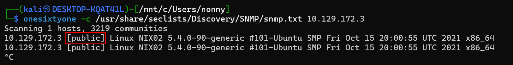
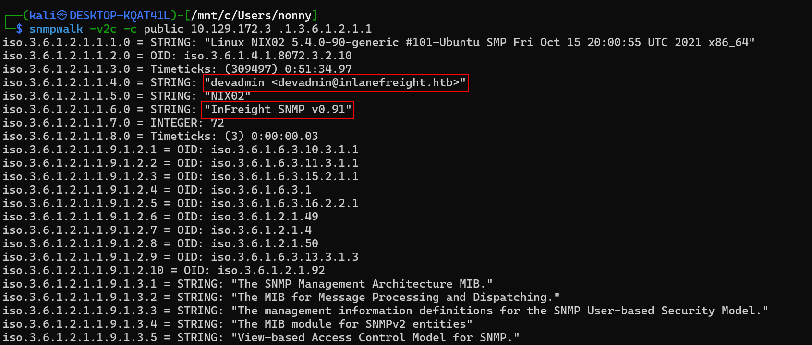
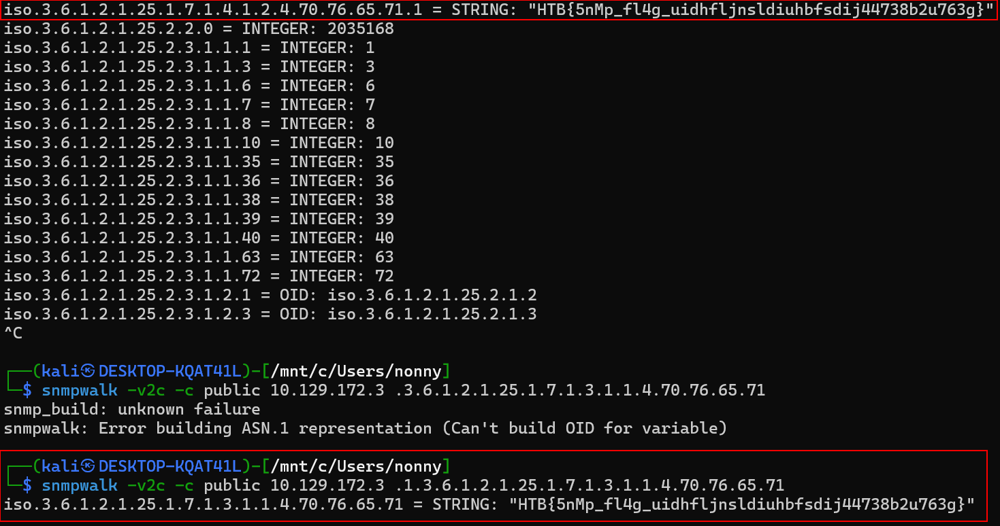

# สรุปเนื้อหาทั้งหมดเกี่ยวกับ SNMP

## 🔍 SNMP คืออะไร?
**Simple Network Management Protocol (SNMP)** คือโปรโตคอลที่ใช้สำหรับ:
- **ตรวจสอบอุปกรณ์เครือข่าย** (Monitoring)
- **จัดการและตั้งค่าอุปกรณ์จากระยะไกล**

## 📱 อุปกรณ์ที่รองรับ
เราเตอร์, สวิตช์, เซิร์ฟเวอร์, อุปกรณ์ IoT และอุปกรณ์เครือข่ายอื่นๆ

---

## 🔄 การทำงานของ SNMP

### พอร์ตที่ใช้งาน
- **UDP พอร์ต 161**: ส่งคำสั่งควบคุมและแลกเปลี่ยนข้อมูล
- **UDP พอร์ต 162**: รับ SNMP Traps (การแจ้งเตือนอัตโนมัติจากเซิร์ฟเวอร์)

### SNMP Traps
- เป็นข้อมูลที่เซิร์ฟเวอร์ส่งมาให้ไคลเอนต์**โดยอัตโนมัติ**
- **ไม่ต้องร้องขอ** - ส่งมาทันทีเมื่อเกิดเหตุการณ์สำคัญ

---

## 📚 MIB (Management Information Base)

**ฐานข้อมูลที่เก็บโครงสร้างข้อมูลของอุปกรณ์**

### คุณสมบัติ
- เป็นไฟล์ข้อความที่เขียนด้วย **ASN.1**
- จัดเก็บข้อมูลแบบ**ลำดับชั้นแบบต้นไม้**
- **ไม่เก็บข้อมูลจริง** แต่บอกว่าข้อมูลอยู่ที่ไหน มีรูปแบบอย่างไร
- ทำให้ SNMP ทำงานได้**ข้ามผู้ผลิต**

---

## 🎯 OID (Object Identifier)

**ที่อยู่เฉพาะของแต่ละข้อมูลใน MIB**

### รูปแบบ
- เป็น**ตัวเลขเรียงต่อกันด้วยจุด** เช่น 1.3.6.1.2.1.1.1
- **ยิ่งยาว = ยิ่งเฉพาะเจาะจง**
- ค้นหาได้ใน Object Identifier Registry

---

## 🔐 เวอร์ชันของ SNMP

### SNMPv1 (เวอร์ชันแรก)
✅ รองรับการดึงข้อมูล, ตั้งค่า, Traps  
❌ **ไม่มีการยืนยันตัวตน**  
❌ **ไม่มีการเข้ารหัส** - ส่งข้อมูลเป็นข้อความธรรมดา

### SNMPv2c (c = community-based)
✅ เพิ่มฟังก์ชันการทำงาน  
❌ ความปลอดภัย**เท่ากับ v1**  
❌ Community string ส่งเป็น**ข้อความธรรมดา**

### SNMPv3 (ปัจจุบัน - ปลอดภัยที่สุด)
✅ มี**การยืนยันตัวตน** (username/password)  
✅ มี**การเข้ารหัส** (pre-shared key)  
⚠️ **ซับซ้อนมากขึ้น** - ตั้งค่ายากกว่า

---

## 🔑 Community Strings

**รหัสผ่านของ SNMP** - ใช้ควบคุมการเข้าถึงข้อมูล

### ปัญหาความปลอดภัย ⚠️
1. **ส่งเป็นข้อความธรรมดา** - แฮกเกอร์ดักจับได้ง่าย
2. องค์กรส่วนใหญ่ยังใช้ **SNMPv2** เพราะย้ายไป v3 ยาก
3. ผู้ดูแลระบบ**ขาดความรู้**เรื่องความเสี่ยง
4. แฮกเกอร์สามารถ**ดักจับ community strings** แล้วเข้าถึงข้อมูลได้

---

## 💡 สรุปสั้นๆ

**SNMP = เครื่องมือจัดการเครือข่าย** ที่ใช้ MIB + OID ในการเก็บและเข้าถึงข้อมูล แต่เวอร์ชันเก่า (v1, v2c) **ไม่ปลอดภัย**เพราะไม่มีการเข้ารหัส ควรใช้ **SNMPv3** เพื่อความปลอดภัยที่ดีกว่า แม้จะตั้งค่ายากกว่า

# การตั้งค่าที่เป็นอันตรายและการโจมตี SNMP

## ⚠️ การตั้งค่าที่เป็นอันตราย (Dangerous Settings)

ผู้ดูแลระบบอาจตั้งค่า SNMP ที่เป็นอันตรายได้ ดังนี้:

| การตั้งค่า | คำอธิบาย |
|-----------|----------|
| **rwuser noauth** | ให้การเข้าถึง OID tree ทั้งหมด**โดยไม่ต้องยืนยันตัวตน** |
| **rwcommunity <community string> <IPv4 address>** | ให้การเข้าถึง OID tree ทั้งหมด**ไม่ว่าคำขอจะส่งมาจากที่ไหน** |
| **rwcommunity6 <community string> <IPv6 address>** | เหมือน rwcommunity แต่ใช้กับ **IPv6** |

---

## 🔍 Footprinting (การสำรวจบริการ SNMP)

### เครื่องมือที่ใช้
1. **snmpwalk** - ใช้สอบถาม OIDs พร้อมข้อมูล
2. **onesixtyone** - ใช้ brute-force หา community strings
3. **braa** - ใช้ brute-force OIDs แต่ละตัว

---

## 🛠️ การใช้งานเครื่องมือ

### 1. SNMPwalk - สอบถามข้อมูลจากระบบ

```bash
snmpwalk -v2c -c public 10.129.14.128
```

**ผลลัพธ์ที่ได้:**
- ข้อมูลระบบปฏิบัติการ: `Linux htb 5.11.0-34-generic`
- อีเมล์ผู้ดูแล: `mrb3n@inlanefreight.htb`
- ชื่อโฮสต์: `htb`
- ตำแหน่ง: `Sitting on the Dock of the Bay`
- **แพ็กเกจ Python ที่ติดตั้ง** และซอฟต์แวร์ต่างๆ เช่น:
  - printer drivers
  - proftpd (FTP server)
  - python3 packages

**สิ่งสำคัญ:** หากมีการตั้งค่าผิดพลาด และใช้ SNMP v1 หรือ v2c โดยไม่ต้องยืนยันตัวตน เราจะสามารถ**ดึงข้อมูลภายในระบบทั้งหมดได้**

---

### 2. OneSixtyOne - หา Community Strings

```bash
# ติดตั้ง
sudo apt install onesixtyone

# ใช้งานกับ wordlist
onesixtyone -c /opt/useful/seclists/Discovery/SNMP/snmp.txt 10.129.14.128
```

**ผลลัพธ์:**
```
Scanning 1 hosts, 3220 communities
10.129.14.128 [public] Linux htb 5.11.0-37-generic ...
```

**ทำไมต้องใช้เครื่องมือนี้?**
- Community strings สามารถตั้งชื่อได้**ตามใจชอบ**
- อาจผูกกับ IP address เฉพาะ
- ในเครือข่ายใหญ่ที่มี 100+ เซิร์ฟเวอร์ ชื่อ community strings มักมี**รูปแบบ (pattern)**
- สามารถใช้เครื่องมืออย่าง **crunch** สร้าง custom wordlist ได้

---

### 3. Braa - Brute-force OIDs

```bash
# ติดตั้ง
sudo apt install braa

# รูปแบบการใช้งาน
braa <community string>@<IP>:.1.3.6.*

# ตัวอย่าง
braa public@10.129.14.128:.1.3.6.*
```

**ผลลัพธ์:**
```
10.129.14.128:20ms:.1.3.6.1.2.1.1.1.0:Linux htb 5.11.0-34-generic ...
10.129.14.128:20ms:.1.3.6.1.2.1.1.4.0:mrb3n@inlanefreight.htb
10.129.14.128:20ms:.1.3.6.1.2.1.1.5.0:htb
10.129.14.128:20ms:.1.3.6.1.2.1.1.6.0:US
```

เมื่อรู้ community string แล้ว สามารถใช้ braa เพื่อ:
- Brute-force OID แต่ละตัว
- แจงนับข้อมูลที่อยู่ภายใน

---

## 🎯 สรุปขั้นตอนการโจมตี

1. **ค้นหา Community Strings** ด้วย onesixtyone + wordlist
2. **สอบถามข้อมูล** ด้วย snmpwalk เมื่อรู้ community string
3. **Brute-force OIDs** ด้วย braa เพื่อข้อมูลเพิ่มเติม
4. **รวบรวมข้อมูล** เกี่ยวกับ:
   - ระบบปฏิบัติการ
   - ซอฟต์แวร์ที่ติดตั้ง
   - ข้อมูลผู้ดูแลระบบ
   - การตั้งค่าเครือข่าย

---

## ⚡ ข้อควรระวัง

> **SNMP สามารถเป็นได้ทั้ง:**
> - **พรสวรรค์** สำหรับผู้ดูแลระบบ IT (ช่วยจัดการระบบได้ง่าย)
> - **คำสาป** สำหรับนักวิเคราะห์ความปลอดภัย (เป็นช่องโหว่ที่เสี่ยง)

### คำแนะนำ
- **ฝึกปฏิบัติ**: ตั้ง VM พร้อม SNMP และทดลองการตั้งค่าต่างๆ
- **ทดสอบ**: ลองใช้เครื่องมือทั้ง 3 ตัวเพื่อเข้าใจวิธีการโจมตี
- **ป้องกัน**: ใช้ SNMPv3, ตั้ง community strings ที่แข็งแรง, จำกัด IP ที่เข้าถึงได้

---

## 📋 สรุปรวมทั้งหมด (Recap ครั้งที่ 2)

### SNMP พื้นฐาน
- โปรโตคอลจัดการเครือข่าย ใช้ MIB + OID เก็บข้อมูล
- ทำงานผ่าน UDP 161 (คำสั่ง) และ 162 (traps)

### ปัญหาความปลอดภัย
- v1, v2c: ไม่เข้ารหัส, community strings ส่งเป็น plain text
- v3: ปลอดภัยแต่ตั้งค่ายาก

### การโจมตี
- ใช้ onesixtyone หา community strings
- ใช้ snmpwalk/braa ดึงข้อมูลระบบทั้งหมด
- ได้ข้อมูลสำคัญ: OS, software, users, configuration





