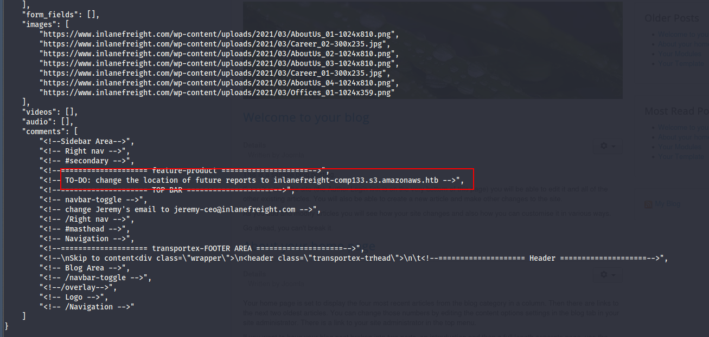

# Crawling (การคลานเว็บไซต์)

## Crawling คืออะไร?

**Crawling** หรือที่เรียกว่า **Spidering** เป็นกระบวนการอัตโนมัติในการเรียกดู World Wide Web อย่างเป็นระบบ คล้ายกับที่แมงมุมนำทางบนใยของมัน web crawler ติดตามลิงก์จากหน้าหนึ่งไปอีกหน้าหนึ่ง โดยรวบรวมข้อมูล

**Crawlers** เป็นบอทที่ใช้อัลกอริทึมที่กำหนดไว้ล่วงหน้าเพื่อค้นพบและจัดทำดัชนีหน้าเว็บ ทำให้สามารถเข้าถึงได้ผ่านเครื่องมือค้นหาหรือสำหรับจุดประสงค์อื่นๆ เช่น:
- การวิเคราะห์ข้อมูล
- การสอดแนมเว็บไซต์

## วิธีการทำงานของ Web Crawlers

การทำงานพื้นฐานของ web crawler นั้นตรงไปตรงมาแต่ทรงพลัง:

### ขั้นตอนการทำงาน

| ขั้นตอน | กระบวนการ |
|---------|-----------|
| **1. เริ่มต้น** | เริ่มจาก **seed URL** (หน้าเว็บเริ่มต้นที่จะคลาน) |
| **2. ดึงข้อมูล** | Crawler ดึงหน้านี้มา วิเคราะห์เนื้อหา และแยกลิงก์ทั้งหมด |
| **3. จัดคิว** | เพิ่มลิงก์เหล่านี้ลงในคิวและคลานต่อ |
| **4. ทำซ้ำ** | ทำซ้ำกระบวนการแบบวนซ้ำ ขึ้นอยู่กับขอบเขตและการตั้งค่า |

### ตัวอย่างการทำงาน

```
Homepage: เริ่มต้นด้วย homepage ที่มี link1, link2, และ link3

Homepage
├── link1
├── link2
└── link3

เยี่ยมชม link1: พบ homepage, link2, และ link4, link5 เพิ่มเติม

link1 Page
├── Homepage
├── link2
├── link4
└── link5

คลานต่อไป: Crawler ติดตามลิงก์เหล่านี้อย่างเป็นระบบ รวบรวมหน้าและลิงก์ที่เข้าถึงได้ทั้งหมด
```

**หมายเหตุ:** ตัวอย่างนี้แสดงให้เห็นว่า web crawler ค้นพบและรวบรวมข้อมูลโดยการติดตามลิงก์อย่างเป็นระบบ ซึ่งแตกต่างจาก **fuzzing** ที่เกี่ยวข้องกับการเดาลิงก์ที่เป็นไปได้

## กลยุทธ์การ Crawling

### 1. Breadth-First Crawling (คลานแบบกว้างก่อน)

```
Seed URL → Page 1
            ├── Page 2
            │   ├── Page 4
            │   └── Page 5
            └── Page 3
                ├── Page 6
                └── Page 7
```

**คำอธิบาย:**
- ให้ความสำคัญกับการสำรวจความกว้างของเว็บไซต์ก่อนที่จะเจาะลึก
- เริ่มด้วยการคลานลิงก์ทั้งหมดบน seed page
- จากนั้นจึงย้ายไปยังลิงก์บนหน้าเหล่านั้น และทำต่อไปเรื่อยๆ

**ประโยชน์:** มีประโยชน์ในการได้ภาพรวมกว้างๆ ของโครงสร้างและเนื้อหาเว็บไซต์

### 2. Depth-First Crawling (คลานแบบลึกก่อน)

```
Seed URL → Page 1 → Page 2 → Page 3
                              ├── Page 4
                              └── Page 5
```

**คำอธิบาย:**
- ให้ความสำคัญกับความลึกมากกว่าความกว้าง
- ติดตามเส้นทางเดียวของลิงก์ให้ไกลที่สุดเท่าที่จะทำได้
- จากนั้นจึงย้อนกลับและสำรวจเส้นทางอื่นๆ

**ประโยชน์:** มีประโยชน์ในการค้นหาเนื้อหาเฉพาะหรือเข้าถึงลึกเข้าไปในโครงสร้างเว็บไซต์

### การเลือกกลยุทธ์

การเลือกกลยุทธ์ขึ้นอยู่กับเป้าหมายเฉพาะของกระบวนการคลาน

## การดึงข้อมูลที่มีค่า

Crawlers สามารถดึงข้อมูลที่หลากหลาย แต่ละอย่างให้บริการวัตถุประสงค์เฉพาะในกระบวนการสอดแนม:

### ประเภทข้อมูลที่ดึงได้

| ประเภทข้อมูล | คำอธิบาย | ประโยชน์ |
|-------------|----------|----------|
| **Links (Internal & External)** | ลิงก์ภายในและภายนอก เชื่อมต่อหน้าภายในเว็บไซต์และเว็บไซต์อื่น | สร้างแผนผังโครงสร้างเว็บไซต์, ค้นหาหน้าที่ซ่อนอยู่, ระบุความสัมพันธ์กับทรัพยากรภายนอก |
| **Comments** | ความคิดเห็นในบล็อก ฟอรัม หรือหน้าแบบโต้ตอบ | ผู้ใช้มักเปิดเผยรายละเอียดที่สำคัญ กระบวนการภายใน หรือคำใบ้เกี่ยวกับช่องโหว่โดยไม่ตั้งใจ |
| **Metadata** | ข้อมูลเกี่ยวกับข้อมูล เช่น ชื่อหน้า คำอธิบาย คีย์เวิร์ด ชื่อผู้เขียน และวันที่ | ให้บริบทที่มีค่าเกี่ยวกับเนื้อหา วัตถุประสงค์ และความเกี่ยวข้องของหน้า |
| **Sensitive Files** | ไฟล์ที่สำคัญที่อาจถูกเปิดเผยโดยไม่ตั้งใจ | - Backup files (.bak, .old)<br>- Configuration files (web.config, settings.php)<br>- Log files (error_log, access_log)<br>- ไฟล์ที่มี passwords, API keys หรือข้อมูลที่เป็นความลับ |

### การตรวจสอบไฟล์ที่สำคัญ

การตรวจสอบไฟล์ที่ดึงมาอย่างระมัดระวัง โดยเฉพาะไฟล์สำรองและการตั้งค่า สามารถเปิดเผยข้อมูลที่สำคัญมากมาย เช่น:
- ข้อมูลประจำตัวฐานข้อมูล (Database credentials)
- กุญแจเข้ารหัส (Encryption keys)
- ส่วนของซอร์สโค้ด (Source code snippets)

## ความสำคัญของบริบท (The Importance of Context)

การเข้าใจบริบทที่เกี่ยวข้องกับข้อมูลที่ดึงมาเป็นสิ่งสำคัญยิ่ง

### หลักการวิเคราะห์แบบองค์รวม

**ข้อมูลเดี่ยว vs. ข้อมูลที่เชื่อมโยง:**

ข้อมูลชิ้นเดียว เช่น ความคิดเห็นที่กล่าวถึงเวอร์ชันซอฟต์แวร์เฉพาะ อาจดูไม่สำคัญ แต่เมื่อรวมกับการค้นพบอื่นๆ:
- เวอร์ชันล้าสมัยที่แสดงใน metadata
- ไฟล์การตั้งค่าที่อาจมีช่องโหว่
- รูปแบบใน URL structure

มันสามารถกลายเป็นตัวบ่งชี้สำคัญของช่องโหว่ที่เป็นไปได้

### ตัวอย่างการวิเคราะห์บริบท

#### ตัวอย่างที่ 1: การค้นพบไดเรกทอรี /files/

**สถานการณ์:**
1. รายการลิงก์ที่ดึงมาอาจดูธรรมดา
2. แต่เมื่อตรวจสอบใกล้ชิด พบว่า URL หลายตัวชี้ไปที่ไดเรกทอรี `/files/`
3. เยี่ยมชมไดเรกทอรีด้วยตนเอง พบว่าเปิดใช้งาน directory browsing
4. เปิดเผยไฟล์มากมาย รวมถึง:
   - Backup archives
   - เอกสารภายใน
   - ข้อมูลที่อาจสำคัญ

**บทเรียน:** การค้นพบนี้จะเป็นไปไม่ได้หากมองลิงก์แต่ละตัวแยกกัน การวิเคราะห์บริบทนำไปสู่การค้นพบที่สำคัญนี้

#### ตัวอย่างที่ 2: ความคิดเห็นเกี่ยวกับ File Server

**สถานการณ์:**
1. ความคิดเห็นที่กล่าวถึง "file server" อาจไม่ทำให้เกิดความสงสัยในตอนแรก
2. แต่เมื่อรวมกับการค้นพบไดเรกทอรี `/files/` ข้างต้น
3. เสริมความเป็นไปได้ว่า file server สามารถเข้าถึงได้จากสาธารณะ
4. อาจเปิดเผยข้อมูลที่สำคัญหรือข้อมูลที่เป็นความลับ

**บทเรียน:** ความคิดเห็นที่ดูเหมือนไม่เป็นอันตรายสามารถมีความสำคัญเมื่อเชื่อมโยงกับการค้นพบอื่นๆ

## แนวทางปฏิบัติในการวิเคราะห์ข้อมูล

### หลักการสำคัญ

| หลักการ | คำอธิบาย |
|---------|----------|
| **วิเคราะห์แบบองค์รวม** | พิจารณาความสัมพันธ์ระหว่างจุดข้อมูลต่างๆ และผลกระทบที่อาจเกิดขึ้น |
| **เชื่อมโยงจุดต่างๆ** | รวมข้อมูลจากแหล่งต่างๆ เพื่อสร้างภาพที่ครอบคลุม |
| **พิจารณาบริบท** | ข้อมูลเดียวกันอาจมีความหมายแตกต่างกันในบริบทที่แตกต่างกัน |
| **มองหารูปแบบ** | รูปแบบที่ซ้ำกันมักบ่งชี้ถึงโครงสร้างหรือช่องโหว่ที่เป็นระบบ |

# robots.txt

## robots.txt คืออะไร?

**จินตนาการว่า:** คุณเป็นแขกในงานเลี้ยงที่บ้านหลังใหญ่ แม้ว่าคุณจะเดินไปมาและสำรวจได้อย่างอิสระ แต่อาจมีบางห้องที่ทำเครื่องหมายว่า "Private" ที่คุณควรหลีกเลี่ยง นี่คือสิ่งที่ **robots.txt** ทำหน้าที่ในโลกของการคลานเว็บ

**robots.txt** ทำหน้าที่เป็น **"คู่มือมารยาท"** เสมือนสำหรับบอท โดยระบุว่าพื้นที่ใดของเว็บไซต์ที่พวกมันสามารถเข้าถึงได้และพื้นที่ใดที่ห้ามเข้า

## คำจำกัดความทางเทคนิค

**robots.txt** คือไฟล์ข้อความธรรมดาที่วางไว้ใน **root directory** ของเว็บไซต์ (เช่น `www.example.com/robots.txt`) 

มันปฏิบัติตาม **Robots Exclusion Standard** ซึ่งเป็นแนวทางว่า web crawlers ควรประพฤติตัวอย่างไรเมื่อเยี่ยมชมเว็บไซต์ ไฟล์นี้มีคำสั่งในรูปแบบของ "directives" ที่บอกบอทว่าส่วนใดของเว็บไซต์ที่พวกมันสามารถและไม่สามารถคลานได้

## วิธีการทำงานของ robots.txt

Directives ใน robots.txt โดยทั่วไปจะกำหนดเป้าหมายไปที่ **user-agents** เฉพาะ ซึ่งเป็นตัวระบุสำหรับบอทประเภทต่างๆ

### ตัวอย่างพื้นฐาน

```txt
User-agent: *
Disallow: /private/
```

**คำอธิบาย:** directive นี้บอก user-agents ทั้งหมด (`*` เป็น wildcard) ว่าพวกมันไม่ได้รับอนุญาตให้เข้าถึง URL ใดๆ ที่เริ่มต้นด้วย `/private/`

Directives อื่นๆ สามารถ:
- อนุญาตการเข้าถึงไดเรกทอรีหรือไฟล์เฉพาะ
- ตั้งค่าความล่าช้าในการคลานเพื่อหลีกเลี่ยงการโหลดเซิร์ฟเวอร์มากเกินไป
- ให้ลิงก์ไปยัง sitemaps สำหรับการคลานที่มีประสิทธิภาพ

## โครงสร้างของ robots.txt

ไฟล์ robots.txt เป็นเอกสารข้อความธรรมดาที่อยู่ใน root directory ของเว็บไซต์ มันมีโครงสร้างที่ตรงไปตรงมา โดยแต่ละชุดคำสั่งหรือ "record" คั่นด้วยบรรทัดว่าง

### องค์ประกอบหลัก

แต่ละ record ประกอบด้วยสองส่วนหลัก:

1. **User-agent:** ระบุว่า crawler หรือบอทใดที่กฎต่อไปนี้ใช้กับ
   - Wildcard (`*`) = ใช้กับบอททั้งหมด
   - User agents เฉพาะ เช่น "Googlebot" (crawler ของ Google) หรือ "Bingbot" (crawler ของ Microsoft)

2. **Directives:** บรรทัดที่ให้คำสั่งเฉพาะแก่ user-agent ที่ระบุ

### Directives ทั่วไป

| Directive | คำอธิบาย | ตัวอย่าง |
|-----------|----------|----------|
| **Disallow** | ระบุเส้นทางหรือรูปแบบที่บอทไม่ควรคลาน | `Disallow: /admin/` (ห้ามเข้าถึงไดเรกทอรี admin) |
| **Allow** | อนุญาตให้บอทคลานเส้นทางหรือรูปแบบเฉพาะอย่างชัดเจน แม้ว่าจะอยู่ภายใใต้กฎ Disallow ที่กว้างขึ้น | `Allow: /public/` (อนุญาตการเข้าถึงไดเรกทอรี public) |
| **Crawl-delay** | ตั้งค่าความล่าช้า (เป็นวินาที) ระหว่างคำขอต่อเนื่องจากบอทเพื่อหลีกเลี่ยงการโหลดเซิร์ฟเวอร์มากเกินไป | `Crawl-delay: 10` (ความล่าช้า 10 วินาทีระหว่างคำขอ) |
| **Sitemap** | ให้ URL ไปยัง XML sitemap สำหรับการคลานที่มีประสิทธิภาพมากขึ้น | `Sitemap: https://www.example.com/sitemap.xml` |

## ทำไมต้องเคารพ robots.txt?

แม้ว่า robots.txt จะไม่สามารถบังคับใช้ได้อย่างเคร่งครัด (บอทที่ไม่ดีอาจยังคงเพิกเฉยได้) แต่ web crawlers และ search engine bots ที่ถูกต้องตามกฎหมายส่วนใหญ่จะเคารพ directives ของมัน

### เหตุผลสำคัญ

| เหตุผล | คำอธิบาย |
|--------|----------|
| **หลีกเลี่ยงการโหลดเซิร์ฟเวอร์มากเกินไป** | การจำกัดการเข้าถึงของ crawler ในบางพื้นที่ ช่วยป้องกันทราฟฟิกมากเกินไปที่อาจทำให้เซิร์ฟเวอร์ช้าลงหรือแม้แต่ล่ม |
| **ปกป้องข้อมูลที่สำคัญ** | robots.txt สามารถป้องกันข้อมูลส่วนตัวหรือความลับจากการถูกจัดทำดัชนีโดยเครื่องมือค้นหา |
| **การปฏิบัติตามกฎหมายและจริยธรรม** | ในบางกรณี การเพิกเฉย directives ของ robots.txt อาจถือว่าเป็นการละเมิดข้อกำหนดการให้บริการของเว็บไซต์ หรือแม้แต่เป็นปัญหาทางกฎหมาย โดยเฉพาะหากเกี่ยวข้องกับการเข้าถึงข้อมูลที่มีลิขสิทธิ์หรือข้อมูลส่วนตัว |

## robots.txt ในการสอดแนมเว็บ

สำหรับการสอดแนมเว็บ robots.txt ทำหน้าที่เป็นแหล่งข้อมูลข่าวกรองที่มีค่า ในขณะที่เคารพ directives ที่ระบุไว้ในไฟล์นี้ ผู้เชี่ยวชาญด้านความปลอดภัยสามารถรวบรวมข้อมูลเชิงลึกที่สำคัญเกี่ยวกับโครงสร้างและช่องโหว่ที่อาจเกิดขึ้นของเว็บไซต์เป้าหมาย:

### ประโยชน์ในการสอดแนม

| ประโยชน์ | คำอธิบาย |
|---------|----------|
| **เปิดเผยไดเรกทอรีที่ซ่อนอยู่** | เส้นทางที่ไม่อนุญาตใน robots.txt มักชี้ไปยังไดเรกทอรีหรือไฟล์ที่เจ้าของเว็บไซต์ตั้งใจให้อยู่นอกเหนือการเข้าถึงของ search engine crawlers พื้นที่ที่ซ่อนเหล่านี้อาจเก็บข้อมูลที่สำคัญ, ไฟล์สำรอง, แผงการจัดการ หรือทรัพยากรอื่นๆ ที่อาจสนใจผู้โจมตี |
| **สร้างแผนผังโครงสร้างเว็บไซต์** | โดยการวิเคราะห์เส้นทางที่อนุญาตและไม่อนุญาต ผู้เชี่ยวชาญด้านความปลอดภัยสามารถสร้างแผนผังพื้นฐานของโครงสร้างเว็บไซต์ สามารถเปิดเผยส่วนที่ไม่ได้ลิงก์จากเมนูหลัก อาจนำไปสู่หน้าหรือฟังก์ชันที่ยังไม่ถูกค้นพบ |
| **ตรวจจับกับดัก Crawler** | เว็บไซต์บางแห่งตั้งใจใส่ไดเรกทอรี "honeypot" ใน robots.txt เพื่อล่อบอทที่เป็นอันตราย การระบุกับดักดังกล่าวสามารถให้ข้อมูลเชิงลึกเกี่ยวกับการตระหนักรู้ด้านความปลอดภัยและมาตรการป้องกันของเป้าหมาย |

## การวิเคราะห์ robots.txt

### ตัวอย่างไฟล์ robots.txt

```txt
User-agent: *
Disallow: /admin/
Disallow: /private/
Allow: /public/

User-agent: Googlebot
Crawl-delay: 10

Sitemap: https://www.example.com/sitemap.xml
```

### การวิเคราะห์

ไฟล์นี้มี directives ดังต่อไปนี้:

| Directive | ความหมาย |
|-----------|----------|
| `User-agent: *`<br>`Disallow: /admin/`<br>`Disallow: /private/` | User agents ทั้งหมดไม่ได้รับอนุญาตให้เข้าถึงไดเรกทอรี `/admin/` และ `/private/` |
| `Allow: /public/` | User agents ทั้งหมดได้รับอนุญาตให้เข้าถึงไดเรกทอรี `/public/` |
| `User-agent: Googlebot`<br>`Crawl-delay: 10` | Googlebot (web crawler ของ Google) ได้รับคำสั่งเฉพาะให้รอ 10 วินาทีระหว่างคำขอ |
| `Sitemap: https://www.example.com/sitemap.xml` | Sitemap ที่ตั้งอยู่ที่ URL ที่ระบุ ให้ไว้สำหรับการคลานและจัดทำดัชนีที่ง่ายขึ้น |

### สิ่งที่อนุมานได้

จากการวิเคราะห์ robots.txt นี้ เราสามารถอนุมานได้ว่า:

| การค้นพบ | การตีความ |
|---------|-----------|
| **`/admin/`** | เว็บไซต์น่าจะมี admin panel ที่ตั้งอยู่ที่ `/admin/` |
| **`/private/`** | มีเนื้อหาส่วนตัวบางอย่างในไดเรกทอรี `/private/` |
| **`/public/`** | มีพื้นที่สาธารณะที่อนุญาตให้เข้าถึงได้ชัดเจน |
| **Crawl-delay สำหรับ Googlebot** | อาจบ่งชี้ว่าเว็บไซต์ต้องการควบคุมอัตราการคลานจาก Google |

# Well-Known URIs

## Well-Known URIs คืออะไร?

มาตรฐาน **.well-known** ที่กำหนดไว้ใน **RFC 8615** ทำหน้าที่เป็นไดเรกทอรีมาตรฐานภายใน root domain ของเว็บไซต์ ตำแหน่งที่กำหนดนี้ โดยทั่วไปเข้าถึงได้ผ่านเส้นทาง `/.well-known/` บนเว็บเซิร์ฟเวอร์ เป็นศูนย์รวม metadata ที่สำคัญของเว็บไซต์ รวมถึง:

- ไฟล์การตั้งค่า (Configuration files)
- ข้อมูลที่เกี่ยวข้องกับบริการ โปรโตคอล และกลไกความปลอดภัย

## จุดประสงค์และประโยชน์

### การทำให้เป็นมาตรฐาน

การสร้างตำแหน่งที่สอดคล้องกันสำหรับข้อมูลดังกล่าว **.well-known** ช่วย:

| ประโยชน์ | คำอธิบาย |
|---------|----------|
| **ทำให้การค้นพบง่ายขึ้น** | ทำให้กระบวนการค้นหาและเข้าถึงง่ายขึ้นสำหรับผู้มีส่วนได้ส่วนเสียต่างๆ เช่น เว็บเบราว์เซอร์, แอปพลิเคชัน และเครื่องมือความปลอดภัย |
| **การเข้าถึงอัตโนมัติ** | ช่วยให้ไคลเอนต์สามารถค้นหาและดึงไฟล์การตั้งค่าเฉพาะโดยอัตโนมัติ โดยการสร้าง URL ที่เหมาะสม |
| **มาตรฐานสากล** | มีมาตรฐานที่ชัดเจนและเป็นที่ยอมรับในระดับสากล |

### ตัวอย่างการใช้งาน

เพื่อเข้าถึงนโยบายความปลอดภัยของเว็บไซต์ ไคลเอนต์จะขอ:
```
https://example.com/.well-known/security.txt
```

## Well-Known URIs ที่สำคัญ

**Internet Assigned Numbers Authority (IANA)** ดูแลรักษาทะเบียนของ .well-known URIs โดยแต่ละอันให้บริการวัตถุประสงค์เฉพาะที่กำหนดโดยข้อกำหนดและมาตรฐานต่างๆ

### ตารางสรุป Well-Known URIs ที่โดดเด่น

| URI Suffix | คำอธิบาย | สถานะ | อ้างอิง |
|------------|----------|-------|---------|
| **security.txt** | มีข้อมูลติดต่อสำหรับนักวิจัยด้านความปลอดภัยเพื่อรายงานช่องโหว่ | Permanent | RFC 9116 |
| **change-password** | ให้ URL มาตรฐานสำหรับนำผู้ใช้ไปยังหน้าเปลี่ยนรหัสผ่าน | Provisional | W3C WebAppSec |
| **openid-configuration** | กำหนดรายละเอียดการตั้งค่าสำหรับ OpenID Connect (identity layer บน OAuth 2.0) | Permanent | OpenID Connect Discovery |
| **assetlinks.json** | ใช้สำหรับยืนยันความเป็นเจ้าของทรัพย์สินดิจิทัล (เช่น แอป) ที่เกี่ยวข้องกับโดเมน | Permanent | Google Digital Asset Links |
| **mta-sts.txt** | ระบุนโยบายสำหรับ SMTP MTA Strict Transport Security (MTA-STS) เพื่อเพิ่มความปลอดภัยอีเมล | Permanent | RFC 8461 |

**หมายเหตุ:** นี่เป็นเพียงตัวอย่างเล็กๆ ของ .well-known URIs มากมายที่จดทะเบียนกับ IANA แต่ละรายการในทะเบียนมีแนวทางและข้อกำหนดเฉพาะสำหรับการดำเนินการ

## Web Recon และ .well-known

ในการสอดแนมเว็บ .well-known URIs สามารถมีค่าอย่างยิ่งในการค้นพบ endpoints และรายละเอียดการตั้งค่าที่สามารถทดสอบเพิ่มเติมระหว่างการทดสอบเจาะระบบ

### กรณีศึกษา: openid-configuration

**openid-configuration** เป็นหนึ่งใน URI ที่มีประโยชน์เป็นพิเศษ เป็นส่วนหนึ่งของโปรโตคอล OpenID Connect Discovery ซึ่งเป็น identity layer ที่สร้างบน OAuth 2.0

#### วิธีการทำงาน

เมื่อแอปพลิเคชันไคลเอนต์ต้องการใช้ OpenID Connect สำหรับการยืนยันตัวตน สามารถดึงการตั้งค่าของ OpenID Connect Provider โดยการเข้าถึง:

```
https://example.com/.well-known/openid-configuration
```

#### ตัวอย่างผลลัพธ์ JSON

```json
{
  "issuer": "https://example.com",
  "authorization_endpoint": "https://example.com/oauth2/authorize",
  "token_endpoint": "https://example.com/oauth2/token",
  "userinfo_endpoint": "https://example.com/oauth2/userinfo",
  "jwks_uri": "https://example.com/oauth2/jwks",
  "response_types_supported": ["code", "token", "id_token"],
  "subject_types_supported": ["public"],
  "id_token_signing_alg_values_supported": ["RS256"],
  "scopes_supported": ["openid", "profile", "email"]
}
```

### โอกาสในการสำรวจจาก openid-configuration

ข้อมูลที่ได้จาก openid-configuration endpoint ให้โอกาสในการสำรวจหลายด้าน:

#### 1. การค้นพบ Endpoints (Endpoint Discovery)

| Endpoint | คำอธิบาย | URL ตัวอย่าง |
|----------|----------|--------------|
| **Authorization Endpoint** | ระบุ URL สำหรับคำขออนุญาตผู้ใช้ | `https://example.com/oauth2/authorize` |
| **Token Endpoint** | ค้นหา URL ที่ออก tokens | `https://example.com/oauth2/token` |
| **Userinfo Endpoint** | ระบุตำแหน่ง endpoint ที่ให้ข้อมูลผู้ใช้ | `https://example.com/oauth2/userinfo` |
| **JWKS URI** | เปิดเผย JSON Web Key Set (JWKS) ที่ระบุรายละเอียดคีย์การเข้ารหัสที่เซิร์ฟเวอร์ใช้ | `https://example.com/oauth2/jwks` |

#### 2. Scopes และ Response Types ที่รองรับ

**ความสำคัญ:** การเข้าใจว่า scopes และ response types ใดที่รองรับช่วยในการสร้างแผนผังฟังก์ชันการทำงานและข้อจำกัดของการใช้งาน OpenID Connect

**ตัวอย่าง:**
- `response_types_supported`: `["code", "token", "id_token"]`
- `scopes_supported`: `["openid", "profile", "email"]`

#### 3. รายละเอียดอัลกอริทึม (Algorithm Details)

**ความสำคัญ:** ข้อมูลเกี่ยวกับอัลกอริทึมการเซ็นที่รองรับอาจมีความสำคัญต่อการเข้าใจมาตรการรักษาความปลอดภัยที่มีอยู่

**ตัวอย่าง:**
- `id_token_signing_alg_values_supported`: `["RS256"]`

## แนวทางปฏิบัติในการใช้งาน

### การสำรวจทะเบียน IANA

การสำรวจ **IANA Registry** และทดลองกับ .well-known URIs ต่างๆ เป็นแนวทางที่มีค่าอย่างยิ่งในการเปิดเผยโอกาสการสอดแนมเว็บเพิ่มเติม

# Creepy Crawlies (เครื่องมือคลานเว็บ)

## บทนำ

การคลานเว็บมีความกว้างขวางและซับซ้อน แต่คุณไม่ต้องเดินทางเพียงลำพัง มีเครื่องมือคลานเว็บมากมายที่พร้อมช่วยเหลือคุณ แต่ละตัวมีจุดแข็งและความเชี่ยวชาญเฉพาะของตัวเอง เครื่องมือเหล่านี้ทำให้กระบวนการคลานเป็นอัตโนมัติ ทำให้เร็วและมีประสิทธิภาพมากขึ้น ช่วยให้คุณสามารถมุ่งเน้นไปที่การวิเคราะห์ข้อมูลที่ดึงมา

## เครื่องมือ Web Crawlers ยอดนิยม

### 1. Burp Suite Spider

| คุณสมบัติ | รายละเอียด |
|----------|-----------|
| **ประเภท** | Active crawler ที่มีประสิทธิภาพ |
| **แพลตฟอร์ม** | ส่วนหนึ่งของ Burp Suite (web application testing platform ที่ใช้กันอย่างแพร่หลาย) |
| **จุดเด่น** | - เก่งในการสร้างแผนผังเว็บแอปพลิเคชัน<br>- ระบุเนื้อหาที่ซ่อนอยู่<br>- เปิดเผยช่องโหว่ที่อาจเกิดขึ้น |

### 2. OWASP ZAP (Zed Attack Proxy)

| คุณสมบัติ | รายละเอียด |
|----------|-----------|
| **ประเภท** | Web application security scanner |
| **ลิขสิทธิ์** | ฟรี และ open-source |
| **โหมด** | ใช้งานได้ทั้งแบบอัตโนมัติและแบบแมนนวล |
| **จุดเด่น** | - มี spider component สำหรับคลานเว็บแอปพลิเคชัน<br>- ระบุช่องโหว่ที่อาจเกิดขึ้น |

### 3. Scrapy (Python Framework)

| คุณสมบัติ | รายละเอียด |
|----------|-----------|
| **ประเภท** | Python framework สำหรับสร้าง custom web crawlers |
| **ความสามารถ** | หลากหลายและปรับขนาดได้ |
| **จุดเด่น** | - ดึงข้อมูลที่เป็นโครงสร้างจากเว็บไซต์<br>- จัดการสถานการณ์การคลานที่ซับซ้อน<br>- ทำการประมวลผลข้อมูลอัตโนมัติ<br>- ความยืดหยุ่นทำให้เหมาะสำหรับงานสอดแนมที่ปรับแต่งได้ |

### 4. Apache Nutch (Scalable Crawler)

| คุณสมบัติ | รายละเอียล |
|----------|-----------|
| **ประเภท** | Open-source web crawler เขียนด้วย Java |
| **ความสามารถ** | ขยายได้สูงและปรับขนาดได้มาก |
| **จุดเด่น** | - ออกแบบมาเพื่อจัดการการคลานขนาดใหญ่ทั่วทั้งเว็บ<br>- สามารถมุ่งเน้นไปที่โดเมนเฉพาะ<br>- เหมาะสำหรับโปรเจ็กต์สอดแนมขนาดใหญ่ |
| **ข้อควรระวัง** | ต้องใช้ความเชี่ยวชาญทางเทคนิคมากขึ้นในการตั้งค่าและกำหนดค่า |

## แนวทางปฏิบัติด้านจริยธรรม

**สำคัญมาก:** ไม่ว่าคุณจะเลือกเครื่องมือใด การปฏิบัติตามหลักจริยธรรมและความรับผิดชอบในการคลานเป็นสิ่งสำคัญยิ่ง

### หลักการสำคัญ

| หลักการ | คำอธิบาย |
|---------|----------|
| **ขออนุญาตเสมอ** | ขออนุญาตก่อนคลานเว็บไซต์ โดยเฉพาะหากคุณวางแผนที่จะทำการสแกนที่กว้างขวางหรือรุกราน |
| **คำนึงถึงทรัพยากร** | ระลึกถึงทรัพยากรเซิร์ฟเวอร์ของเว็บไซต์ และหลีกเลี่ยงการโหลดมากเกินไปด้วยคำขอที่มากเกินไป |
| **เคารพข้อจำกัด** | ปฏิบัติตาม robots.txt และข้อจำกัดอื่นๆ ที่เว็บไซต์กำหนด |

## การใช้งาน Scrapy

เราจะใช้ประโยชน์จาก **Scrapy** และ custom spider ที่ปรับแต่งสำหรับการสอดแนมบน inlanefreight.com

**หมายเหตุ:** หากสนใจข้อมูลเพิ่มเติมเกี่ยวกับเทคนิคการคลาน/spidering สามารถดูโมดูล "Using Web Proxies" ซึ่งเป็นส่วนหนึ่งของ CWES เช่นกัน

### การติดตั้ง Scrapy

ก่อนเริ่มต้น ตรวจสอบว่าคุณมี Scrapy ติดตั้งบนระบบของคุณ หากยังไม่มี สามารถติดตั้งได้อย่างง่ายดายโดยใช้ pip (Python package installer):

```bash
pip3 install scrapy
```

คำสั่งนี้จะดาวน์โหลดและติดตั้ง Scrapy พร้อมกับ dependencies ของมัน เตรียมสภาพแวดล้อมของคุณสำหรับสร้าง spider

## ReconSpider

### การดาวน์โหลดและติดตั้ง

ขั้นแรก รันคำสั่งนี้ใน terminal เพื่อดาวน์โหลด custom scrapy spider **ReconSpider** และแตกไฟล์ไปยัง working directory ปัจจุบัน:

```bash
wget -O ReconSpider.zip https://academy.hackthebox.com/storage/modules/144/ReconSpider.v1.2.zip
unzip ReconSpider.zip
```

### การรันโปรแกรม

เมื่อแตกไฟล์แล้ว คุณสามารถรัน ReconSpider.py ได้โดยใช้คำสั่ง:

```bash
python3 ReconSpider.py http://inlanefreight.com
```

**แทนที่** `inlanefreight.com` ด้วยโดเมนที่คุณต้องการคลาน Spider จะคลานเป้าหมายและรวบรวมข้อมูลที่มีค่า

## ผลลัพธ์: results.json

### โครงสร้างไฟล์ JSON

หลังจากรัน ReconSpider.py ข้อมูลจะถูกบันทึกในไฟล์ JSON ชื่อ **results.json** ไฟล์นี้สามารถสำรวจได้โดยใช้ text editor ใดก็ได้

```json
{
    "emails": [
        "lily.floid@inlanefreight.com",
        "cvs@inlanefreight.com",
        ...
    ],
    "links": [
        "https://www.themeansar.com",
        "https://www.inlanefreight.com/index.php/offices/",
        ...
    ],
    "external_files": [
        "https://www.inlanefreight.com/wp-content/uploads/2020/09/goals.pdf",
        ...
    ],
    "js_files": [
        "https://www.inlanefreight.com/wp-includes/js/jquery/jquery-migrate.min.js?ver=3.3.2",
        ...
    ],
    "form_fields": [],
    "images": [
        "https://www.inlanefreight.com/wp-content/uploads/2021/03/AboutUs_01-1024x810.png",
        ...
    ],
    "videos": [],
    "audio": [],
    "comments": [
        "<!-- #masthead -->",
        ...
    ]
}
```

### คำอธิบาย JSON Keys

แต่ละ key ในไฟล์ JSON แสดงถึงประเภทข้อมูลที่แตกต่างกันที่ดึงมาจากเว็บไซต์เป้าหมาย:

| JSON Key | คำอธิบาย | ประโยชน์ |
|----------|----------|----------|
| **emails** | รายชื่ออีเมลที่พบบนโดเมน | ระบุข้อมูลติดต่อ, เป้าหมาย social engineering |
| **links** | รายการ URLs ของลิงก์ที่พบภายในโดเมน | สร้างแผนผังโครงสร้างเว็บไซต์ |
| **external_files** | รายการ URLs ของไฟล์ภายนอก เช่น PDFs | ค้นหาเอกสารที่อาจมีข้อมูลสำคัญ |
| **js_files** | รายการ URLs ของไฟล์ JavaScript ที่เว็บไซต์ใช้ | วิเคราะห์ฟังก์ชันและช่องโหว่ที่อาจเกิดขึ้น |
| **form_fields** | รายการฟิลด์ฟอร์มที่พบบนโดเมน | ระบุจุดรับข้อมูลและช่องโหว่ที่อาจเกิดขึ้น |
| **images** | รายการ URLs ของรูปภาพที่พบบนโดเมน | วิเคราะห์ metadata และเนื้อหา |
| **videos** | รายการ URLs ของวิดีโอที่พบบนโดเมน | ตรวจสอบเนื้อหามัลติมีเดีย |
| **audio** | รายการ URLs ของไฟล์เสียงที่พบบนโดเมน | ตรวจสอบไฟล์เสียง |
| **comments** | รายการความคิดเห็น HTML ที่พบในซอร์สโค้ด | ค้นหาข้อมูลที่นักพัฒนาทิ้งไว้ |

```
──(pentest_env)─(kali㉿kali)-[~]
└─$ python3 ReconSpider.py http://inlanefreight.com

──(pentest_env)─(kali㉿kali)-[~]
└─$ cat results.json   
```

