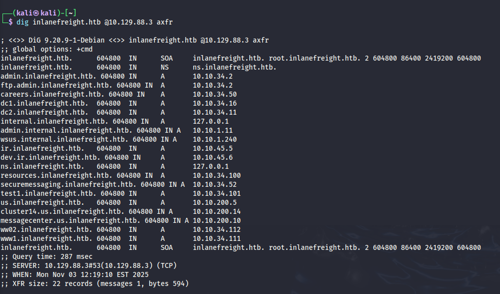
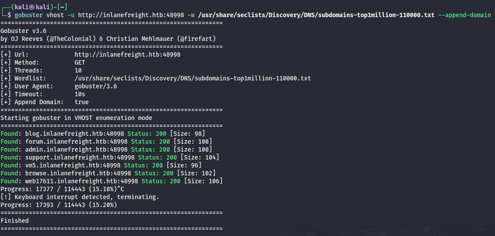

# DNS (Domain Name System)

## DNS คืออะไร?

**DNS (Domain Name System)** ทำหน้าที่เหมือน GPS ของอินเทอร์เน็ต นำทางการเดินทางออนไลน์ของคุณจากจุดหมายที่จำง่าย (ชื่อโดเมน) ไปสู่พิกัดตัวเลขที่แม่นยำ (IP addresses)

เหมือนกับที่ GPS แปลงชื่อปลายทางเป็นละติจูดและลองจิจูดสำหรับการนำทาง DNS ก็แปลงชื่อโดเมนที่มนุษย์อ่านได้ (เช่น www.example.com) เป็น IP addresses แบบตัวเลข (เช่น 192.0.2.1) ที่คอมพิวเตอร์ใช้สื่อสารกัน

**จินตนาการว่า:** คุณต้องนำทางในเมืองโดยการจำละติจูดและลองจิจูดที่แน่นอนของทุกสถานที่ที่คุณต้องการไป มันจะยุ่งยากและไม่มีประสิทธิภาพอย่างมาก DNS ขจัดความซับซ้อนนี้โดยให้เราใช้ชื่อโดเมนที่จำง่ายแทน

**หากไม่มี DNS:** การนำทางโลกออนไลน์จะเหมือนกับการขับรถโดยไม่มีแผนที่หรือ GPS – เป็นความพยายามที่น่าหงุดหงิดและเต็มไปด้วยข้อผิดพลาด

## วิธีการทำงานของ DNS

สมมติคุณต้องการเยี่ยมชมเว็บไซต์ www.example.com คุณพิมพ์ชื่อโดเมนนี้ลงในเบราว์เซอร์ แต่คอมพิวเตอร์ของคุณไม่เข้าใจคำ – มันพูดภาษาตัวเลข โดยเฉพาะ IP addresses DNS จึงเข้ามาทำหน้าที่เป็นล่ามของอินเทอร์เน็ต

### ขั้นตอนการทำงานของ DNS (เหมือนการวิ่งผลัด)

| ขั้นตอน | กระบวนการ | คำอธิบาย |
|---------|-----------|----------|
| **1. DNS Query** | คอมพิวเตอร์ของคุณถามหาทิศทาง | เมื่อคุณป้อนชื่อโดเมน คอมพิวเตอร์จะตรวจสอบหน่วยความจำ (cache) ก่อนว่าจำ IP address จากการเยี่ยมชมครั้งก่อนหรือไม่ ถ้าไม่พบ จะติดต่อ **DNS resolver** (ปกติให้บริการโดย ISP ของคุณ) |
| **2. Recursive Lookup** | DNS Resolver ตรวจสอบแผนที่ | Resolver มี cache ด้วย ถ้าไม่พบ IP address จะเริ่มการเดินทางผ่านลำดับชั้น DNS โดยเริ่มจากถาม **Root Name Server** (เหมือนบรรณารักษ์ของอินเทอร์เน็ต) |
| **3. Root Server** | Root Name Server ชี้ทาง | Root server ไม่รู้ที่อยู่ที่แน่นอน แต่รู้ว่าใครรู้ – ชี้ไปที่ **TLD Name Server** ที่รับผิดชอบส่วนท้ายของโดเมน (เช่น .com, .org) |
| **4. TLD Server** | TLD Name Server จำกัดขอบเขต | TLD name server เหมือนแผนที่ภูมิภาค รู้ว่า **Authoritative Name Server** ไหนรับผิดชอบโดเมนที่คุณหา (เช่น example.com) และส่ง resolver ไปที่นั่น |
| **5. Authoritative Server** | Authoritative Name Server ส่งที่อยู่ | เป็นจุดหมายสุดท้าย เหมือนที่อยู่ถนนของเว็บไซต์ เก็บ IP address ที่ถูกต้องและส่งกลับไปที่ resolver |
| **6. Response** | DNS Resolver ส่งข้อมูลกลับ | Resolver รับ IP address และให้กับคอมพิวเตอร์ของคุณ พร้อมจำไว้สักพัก (cache) เผื่อคุณต้องการเยี่ยมชมเว็บไซต์อีกครั้ง |
| **7. Connection** | คอมพิวเตอร์ของคุณเชื่อมต่อ | ตอนนี้คอมพิวเตอร์รู้ IP address แล้ว สามารถเชื่อมต่อโดยตรงกับเว็บเซิร์ฟเวอร์ที่โฮสต์เว็บไซต์ และคุณก็สามารถเริ่มเรียกดูได้ |

## The Hosts File (ไฟล์โฮสต์)

**Hosts file** คือไฟล์ข้อความธรรมดาที่ใช้แมป hostnames กับ IP addresses เป็นวิธีการแก้ไขชื่อโดเมนด้วยตนเองที่ข้ามกระบวนการ DNS

### ตำแหน่งไฟล์:
- **Windows:** `C:\Windows\System32\drivers\etc\hosts`
- **Linux/MacOS:** `/etc/hosts`

### รูปแบบ:
```
<IP Address>    <Hostname> [<Alias> ...]
```

### ตัวอย่าง:
```
127.0.0.1       localhost
192.168.1.10    devserver.local
```

### การใช้งานทั่วไป:

| การใช้งาน | ตัวอย่าง | จุดประสงค์ |
|-----------|----------|-----------|
| **Development** | `127.0.0.1  myapp.local` | เปลี่ยนเส้นทางโดเมนไปยังเซิร์ฟเวอร์ local |
| **Testing** | `192.168.1.20  testserver.local` | ทดสอบการเชื่อมต่อโดยระบุ IP address |
| **Blocking** | `0.0.0.0  unwanted-site.com` | บล็อกเว็บไซต์ที่ไม่ต้องการโดยเปลี่ยนเส้นทางไปยัง IP ที่ไม่มีอยู่ |

**หมายเหตุ:** การแก้ไขต้องใช้สิทธิ์ administrator/root และมีผลทันทีโดยไม่ต้องรีสตาร์ทระบบ

## แนวคิดสำคัญของ DNS

### DNS Zone และ Zone File

**DNS Zone** เป็นส่วนที่แตกต่างกันของ domain namespace ที่เอนทิตีหรือผู้ดูแลระบบเฉพาะจัดการ คิดว่าเป็นคอนเทนเนอร์เสมือนสำหรับชุดของชื่อโดเมน

**ตัวอย่าง Zone File สำหรับ example.com:**

```zone
$TTL 3600 ; Default Time-To-Live (1 hour)
@       IN SOA   ns1.example.com. admin.example.com. (
                2024060401 ; Serial number (YYYYMMDDNN)
                3600       ; Refresh interval
                900        ; Retry interval
                604800     ; Expire time
                86400 )    ; Minimum TTL

@       IN NS    ns1.example.com.
@       IN NS    ns2.example.com.
@       IN MX 10 mail.example.com.
www     IN A     192.0.2.1
mail    IN A     198.51.100.1
ftp     IN CNAME www.example.com.
```

### แนวคิดพื้นฐาน DNS

| แนวคิด DNS | คำอธิบาย | ตัวอย่าง |
|-----------|----------|----------|
| **Domain Name** | ป้ายกำกับที่มนุษย์อ่านได้สำหรับเว็บไซต์หรือทรัพยากรอินเทอร์เน็ต | www.example.com |
| **IP Address** | ตัวระบุเลขที่ไม่ซ้ำกันที่กำหนดให้กับอุปกรณ์แต่ละเครื่องที่เชื่อมต่อกับอินเทอร์เน็ต | 192.0.2.1 |
| **DNS Resolver** | เซิร์ฟเวอร์ที่แปลงชื่อโดเมนเป็น IP addresses | DNS server ของ ISP หรือ public resolvers เช่น Google DNS (8.8.8.8) |
| **Root Name Server** | เซิร์ฟเวอร์ระดับบนสุดในลำดับชั้น DNS | มี 13 root servers ทั่วโลก ชื่อ A-M: a.root-servers.net |
| **TLD Name Server** | เซิร์ฟเวอร์ที่รับผิดชอบ top-level domains เฉพาะ | Verisign สำหรับ .com, PIR สำหรับ .org |
| **Authoritative Name Server** | เซิร์ฟเวอร์ที่เก็บ IP address จริงสำหรับโดเมน | มักจัดการโดย hosting providers หรือ domain registrars |
| **DNS Record Types** | ประเภทต่างๆ ของข้อมูลที่เก็บใน DNS | A, AAAA, CNAME, MX, NS, TXT, ฯลฯ |

## ประเภท DNS Records

| Record Type | ชื่อเต็ม | คำอธิบาย | ตัวอย่าง Zone File |
|-------------|---------|----------|-------------------|
| **A** | Address Record | แมป hostname กับ IPv4 address | `www.example.com. IN A 192.0.2.1` |
| **AAAA** | IPv6 Address Record | แมป hostname กับ IPv6 address | `www.example.com. IN AAAA 2001:db8:85a3::8a2e:370:7334` |
| **CNAME** | Canonical Name Record | สร้างนามแฝงสำหรับ hostname ชี้ไปยัง hostname อื่น | `blog.example.com. IN CNAME webserver.example.net.` |
| **MX** | Mail Exchange Record | ระบุเมลเซิร์ฟเวอร์ที่รับผิดชอบจัดการอีเมลสำหรับโดเมน | `example.com. IN MX 10 mail.example.com.` |
| **NS** | Name Server Record | มอบหมาย DNS zone ให้กับ authoritative name server เฉพาะ | `example.com. IN NS ns1.example.com.` |
| **TXT** | Text Record | เก็บข้อมูลข้อความที่กำหนดเอง มักใช้สำหรับการยืนยันโดเมนหรือนโยบายความปลอดภัย | `example.com. IN TXT "v=spf1 mx -all"` |
| **SOA** | Start of Authority Record | ระบุข้อมูลการบริหารเกี่ยวกับ DNS zone รวมถึง primary name server, อีเมลผู้รับผิดชอบ และพารามิเตอร์อื่นๆ | `example.com. IN SOA ns1.example.com. admin.example.com. 2024060301 10800 3600 604800 86400` |
| **SRV** | Service Record | กำหนด hostname และหมายเลขพอร์ตสำหรับบริการเฉพาะ | `_sip._udp.example.com. IN SRV 10 5 5060 sipserver.example.com.` |
| **PTR** | Pointer Record | ใช้สำหรับ reverse DNS lookups แมป IP address กับ hostname | `1.2.0.192.in-addr.arpa. IN PTR www.example.com.` |

### หมายเหตุเกี่ยว "IN"

**"IN"** ในตัวอย่างหมายถึง "Internet" เป็น class field ใน DNS records ที่ระบุ protocol family ในกรณีส่วนใหญ่ คุณจะเห็น "IN" ถูกใช้ เพราะหมายถึง Internet protocol suite (IP) ที่ใช้สำหรับชื่อโดเมนส่วนใหญ่

## ทำไม DNS จึงสำคัญต่อการสอดแนมเว็บ

DNS ไม่ได้เป็นเพียงโปรโตคอลทางเทคนิคสำหรับแปลงชื่อโดเมน แต่เป็นองค์ประกอบสำคัญของโครงสร้างพื้นฐานของเป้าหมายที่สามารถใช้เพื่อเปิดเผยช่องโหว่และเข้าถึงระหว่างการทดสอบเจาะระบบ:

### 1. เปิดเผยทรัพย์สิน (Uncovering Assets)

DNS records สามารถเปิดเผยข้อมูลมากมาย รวมถึง:
- ซับโดเมน (Subdomains)
- เมลเซิร์ฟเวอร์ (Mail servers)
- Name server records

**ตัวอย่าง:** CNAME record ที่ชี้ไปยังเซิร์ฟเวอร์ล้าสมัย (`dev.example.com CNAME oldserver.example.net`) อาจนำไปสู่ระบบที่มีช่องโหว่

### 2. สร้างแผนที่โครงสร้างเครือข่าย (Mapping Network Infrastructure)

โดยการวิเคราะห์ข้อมูล DNS คุณสามารถสร้างแผนที่ที่ครอบคลุมของโครงสร้างพื้นฐานเครือข่ายของเป้าหมาย:

- **ระบุ Name Servers (NS records):** เปิดเผย hosting provider ที่ใช้
- **A record สำหรับ loadbalancer.example.com:** ระบุตำแหน่ง load balancer
- **เข้าใจการเชื่อมต่อระบบ:** ช่วยระบุการไหลของทราฟฟิก จุดคอขวด หรือจุดอ่อนที่อาจใช้ประโยชน์ได้

### 3. ติดตามการเปลี่ยนแปลง (Monitoring for Changes)

การติดตาม DNS records อย่างต่อเนื่องสามารถเปิดเผยการเปลี่ยนแปลงในโครงสร้างพื้นฐานของเป้าหมายเมื่อเวลาผ่านไป:

| การเปลี่ยนแปลง | ความหมาย | การใช้ประโยชน์ |
|---------------|----------|----------------|
| **ซับโดเมนใหม่ปรากฏขึ้น** (vpn.example.com) | บ่งชี้จุดเข้าใหม่เข้าสู่เครือข่าย | ตรวจสอบเพื่อหาช่องโหว่ |
| **TXT record** (_1password=...) | บ่งบอกว่าองค์กรใช้ 1Password | ใช้ในการโจมตี social engineering หรือแคมเปญ phishing แบบเจาะจง |

# Digging DNS

หลังจากที่เราได้สร้างความเข้าใจที่มั่นคงเกี่ยวกับพื้นฐาน DNS และ record types ต่างๆ แล้ว มาเปลี่ยนไปสู่การปฏิบัติจริงกันเถอะ ส่วนนี้จะสำรวจเครื่องมือและเทคนิคสำหรับการใช้ประโยชน์จาก DNS ในการสอดแนมเว็บไซต์

## เครื่องมือ DNS

การสอดแนม DNS เกี่ยวข้องกับการใช้เครื่องมือเฉพาะทางที่ออกแบบมาเพื่อสอบถาม DNS servers และดึงข้อมูลที่มีค่า ต่อไปนี้คือเครื่องมือยอดนิยมและอเนกประสงค์ที่สุดในคลังแสงของมืออาชีพด้านการสอดแนมเว็บ:

| เครื่องมือ | คุณสมบัติหลัก | กรณีการใช้งาน |
|-----------|---------------|---------------|
| **dig** | เครื่องมือค้นหา DNS ที่หลากหลาย รองรับประเภทการ query หลายแบบ (A, MX, NS, TXT, ฯลฯ) และ output ที่ละเอียด | การ query DNS ด้วยตนเอง, zone transfers (ถ้าได้รับอนุญาต), แก้ไขปัญหา DNS, และการวิเคราะห์ DNS records อย่างลึกซึ้ง |
| **nslookup** | เครื่องมือค้นหา DNS ที่เรียบง่าย หลักๆ สำหรับ A, AAAA และ MX records | การ query DNS พื้นฐาน, ตรวจสอบด่วนของการแก้ไขโดเมนและ mail server records |
| **host** | เครื่องมือค้นหา DNS แบบเพรียวบาง มี output กระชับ | ตรวจสอบ A, AAAA และ MX records อย่างรวดเร็ว |
| **dnsenum** | เครื่องมือแจงนับ DNS อัตโนมัติ, dictionary attacks, brute-forcing, zone transfers (ถ้าได้รับอนุญาต) | ค้นหาซับโดเมนและรวบรวมข้อมูล DNS อย่างมีประสิทธิภาพ |
| **fierce** | เครื่องมือสอดแนม DNS และแจงนับซับโดเมน มีการค้นหาแบบ recursive และตรวจจับ wildcard | อินเทอร์เฟซที่ใช้งานง่ายสำหรับการสอดแนม DNS, ระบุซับโดเมนและเป้าหมายที่เป็นไปได้ |
| **dnsrecon** | รวมเทคนิคการสอดแนม DNS หลายแบบและรองรับรูปแบบ output ต่างๆ | การแจงนับ DNS ที่ครอบคลุม, ระบุซับโดเมน และรวบรวม DNS records เพื่อวิเคราะห์เพิ่มเติม |
| **theHarvester** | เครื่องมือ OSINT ที่รวบรวมข้อมูลจากแหล่งต่างๆ รวมถึง DNS records (ที่อยู่อีเมล) | เก็บรวบรวมที่อยู่อีเมล, ข้อมูลพนักงาน และข้อมูลอื่นๆ ที่เกี่ยวข้องกับโดเมนจากหลายแหล่ง |
| **Online DNS Lookup Services** | อินเทอร์เฟซที่ใช้งานง่ายสำหรับทำ DNS lookups | การค้นหา DNS ที่รวดเร็วและง่าย, สะดวกเมื่อไม่มีเครื่องมือ command-line, ตรวจสอบความพร้อมใช้งานของโดเมนหรือข้อมูลพื้นฐาน |

## The Domain Information Groper (dig)

คำสั่ง **dig** (Domain Information Groper) เป็นยูทิลิตี้ที่หลากหลายและทรงพลังสำหรับสอบถาม DNS servers และดึง DNS records ประเภทต่างๆ ความยืดหยุ่นและ output ที่ละเอียดและปรับแต่งได้ทำให้มันเป็นตัวเลือกแรกของผู้เชี่ยวชาญ

### คำสั่ง dig ทั่วไป

| คำสั่ง | คำอธิบาย |
|--------|----------|
| `dig domain.com` | ทำการค้นหา A record เริ่มต้นสำหรับโดเมน |
| `dig domain.com A` | ดึง IPv4 address (A record) ที่เกี่ยวข้องกับโดเมน |
| `dig domain.com AAAA` | ดึง IPv6 address (AAAA record) ที่เกี่ยวข้องกับโดเมน |
| `dig domain.com MX` | หาเมลเซิร์ฟเวอร์ (MX records) ที่รับผิดชอบโดเมน |
| `dig domain.com NS` | ระบุ authoritative name servers สำหรับโดเมน |
| `dig domain.com TXT` | ดึง TXT records ที่เกี่ยวข้องกับโดเมน |
| `dig domain.com CNAME` | ดึง canonical name (CNAME) record สำหรับโดเมน |
| `dig domain.com SOA` | ดึง start of authority (SOA) record สำหรับโดเมน |
| `dig @1.1.1.1 domain.com` | ระบุ name server เฉพาะที่จะสอบถาม; ในกรณีนี้คือ 1.1.1.1 |
| `dig +trace domain.com` | แสดงเส้นทางเต็มของการแก้ไข DNS |
| `dig -x 192.168.1.1` | ทำ reverse lookup บน IP address 192.168.1.1 เพื่อหา hostname ที่เกี่ยวข้อง (อาจต้องระบุ name server) |
| `dig +short domain.com` | ให้คำตอบที่สั้นและกระชับต่อการ query |
| `dig +noall +answer domain.com` | แสดงเฉพาะส่วนคำตอบของ query output |
| `dig domain.com ANY` | ดึง DNS records ทั้งหมดที่มีสำหรับโดเมน (หมายเหตุ: DNS servers หลายตัวละเว้น ANY queries เพื่อลดภาระและป้องกันการใช้ในทางที่ผิด ตาม RFC 8482) |

**⚠️ คำเตือน:** บางเซิร์ฟเวอร์สามารถตรวจจับและบล็อก DNS queries ที่มากเกินไปได้ ใช้ด้วยความระมัดระวังและเคารพขนาดอัตรา (rate limits) ขอความอนุญาตก่อนทำการสอดแนม DNS อย่างกว้างขวางบนเป้าหมายเสมอ

## การใช้งาน dig จริง

### ตัวอย่าง: Query google.com

```bash
dig google.com
```

**Output:**

```
; <<>> DiG 9.18.24-0ubuntu0.22.04.1-Ubuntu <<>> google.com
;; global options: +cmd
;; Got answer:
;; ->>HEADER<<- opcode: QUERY, status: NOERROR, id: 16449
;; flags: qr rd ad; QUERY: 1, ANSWER: 1, AUTHORITY: 0, ADDITIONAL: 0
;; WARNING: recursion requested but not available

;; QUESTION SECTION:
;google.com.                    IN      A

;; ANSWER SECTION:
google.com.             0       IN      A       142.251.47.142

;; Query time: 0 msec
;; SERVER: 172.23.176.1#53(172.23.176.1) (UDP)
;; WHEN: Thu Jun 13 10:45:58 SAST 2024
;; MSG SIZE  rcvd: 54
```

## การวิเคราะห์ Output ของ dig

Output นี้เป็นผลลัพธ์จากการ DNS query โดยใช้คำสั่ง dig สำหรับโดเมน google.com สามารถแบ่งออกเป็น 4 ส่วนหลัก:

### 1. Header (ส่วนหัว)

| ส่วนประกอบ | คำอธิบาย |
|-----------|----------|
| `opcode: QUERY` | ประเภทของ query |
| `status: NOERROR` | สถานะที่สำเร็จ |
| `id: 16449` | ตัวระบุเฉพาะสำหรับ query นี้ |

**Flags:**
- `qr`: Query Response flag - บ่งชี้ว่านี่คือการตอบกลับ
- `rd`: Recursion Desired flag - หมายความว่าขอให้ทำ recursion
- `ad`: Authentic Data flag - หมายความว่า resolver ถือว่าข้อมูลเป็นของแท้

**จำนวนรายการ:**
- QUERY: 1 (1 คำถาม)
- ANSWER: 1 (1 คำตอบ)
- AUTHORITY: 0 (0 authority records)
- ADDITIONAL: 0 (0 additional records)

**คำเตือน:** `recursion requested but not available` - บ่งชี้ว่าขอให้ทำ recursion แต่เซิร์ฟเวอร์ไม่รองรับ

### 2. Question Section (ส่วนคำถาม)

```
;google.com.                    IN      A
```

**ความหมาย:** "IPv4 address (A record) ของ google.com คืออะไร?"

### 3. Answer Section (ส่วนคำตอบ)

```
google.com.             0       IN      A       142.251.47.142
```

| ส่วนประกอบ | ค่า | ความหมาย |
|-----------|-----|----------|
| **Domain** | google.com | โดเมนที่ถาม |
| **TTL** | 0 | Time-to-live - ระยะเวลาที่สามารถเก็บผลลัพธ์ใน cache (0 วินาที) |
| **Class** | IN | Internet |
| **Type** | A | Address record (IPv4) |
| **IP Address** | 142.251.47.142 | IP address ที่เกี่ยวข้องกับ google.com |

### 4. Footer (ส่วนท้าย)

| รายละเอียด | ค่า | ความหมาย |
|-----------|-----|----------|
| **Query time** | 0 msec | เวลาที่ใช้ในการประมวลผล query และรับการตอบกลับ |
| **SERVER** | 172.23.176.1#53 (UDP) | DNS server ที่ให้คำตอบและโปรโตคอลที่ใช้ |
| **WHEN** | Thu Jun 13 10:45:58 SAST 2024 | timestamp ของเมื่อทำ query |
| **MSG SIZE rcvd** | 54 bytes | ขนาดของ DNS message ที่ได้รับ |

### หมายเหตุเพิ่มเติม: OPT Pseudosection

บางครั้งอาจมี **opt pseudosection** ปรากฏใน dig query เนื่องจาก **Extension Mechanisms for DNS (EDNS)** ซึ่งอนุญาตให้มีฟีเจอร์เพิ่มเติม เช่น:
- ขนาด message ที่ใหญ่ขึ้น
- การรองรับ DNS Security Extensions (DNSSEC)

## การใช้ +short เพื่อผลลัพธ์กระชับ

หากคุณต้องการเพียงคำตอบของคำถาม โดยไม่มีข้อมูลอื่นๆ สามารถใช้ `+short`:

```bash
dig +short google.com
```

**Output:**
```
142.251.47.142
```

ได้เฉพาะ IP address เท่านั้น สะดวกและรวดเร็วสำหรับการตรวจสอบด่วน!


# Subdomains (ซับโดเมน)

## ซับโดเมนคืออะไร?

เมื่อสำรวจ DNS records เรามักจะมุ่งเน้นไปที่โดเมนหลัก (เช่น `example.com`) และข้อมูลที่เกี่ยวข้อง อย่างไรก็ตาม ใต้พื้นผิวของโดเมนหลักนี้มีเครือข่ายของ**ซับโดเมน**ที่อาจมีอยู่ ซับโดเมนเป็นส่วนขยายของโดเมนหลัก มักถูกสร้างขึ้นเพื่อจัดระเบียบและแยกส่วนหรือฟังก์ชันต่างๆ ของเว็บไซต์

### ตัวอย่างการใช้งานซับโดเมน:

| ซับโดเมน | วัตถุประสงค์ |
|----------|-------------|
| `blog.example.com` | บล็อกของบริษัท |
| `shop.example.com` | ร้านค้าออนไลน์ |
| `mail.example.com` | บริการอีเมล |
| `dev.example.com` | สภาพแวดล้อมสำหรับนักพัฒนา |
| `admin.example.com` | แผงควบคุมผู้ดูแลระบบ |

## ทำไมซับโดเมนจึงสำคัญต่อการสอดแนมเว็บ?

ซับโดเมนมักโฮสต์ข้อมูลและทรัพยากรที่มีค่าซึ่งไม่ได้ลิงก์โดยตรงจากเว็บไซต์หลัก ซึ่งอาจรวมถึง:

### 1. Development และ Staging Environments (สภาพแวดล้อมพัฒนาและทดสอบ)

**คำอธิบาย:** บริษัทมักใช้ซับโดเมนเพื่อทดสอบฟีเจอร์ใหม่หรืออัปเดตก่อนนำไปใช้กับไซต์หลัก

**ความเสี่ยง:**
- มาตรการความปลอดภัยที่หย่อนยาน
- อาจมีช่องโหว่
- เปิดเผยข้อมูลที่สำคัญ

**ตัวอย่าง:** `dev.example.com`, `staging.example.com`, `test.example.com`

### 2. Hidden Login Portals (พอร์ทัลเข้าสู่ระบบที่ซ่อนอยู่)

**คำอธิบาย:** ซับโดเมนอาจโฮสต์แผงควบคุมผู้ดูแลระบบหรือหน้าเข้าสู่ระบบอื่นๆ ที่ไม่ได้ตั้งใจให้เข้าถึงได้สาธารณะ

**ความเสี่ยง:**
- เป้าหมายที่น่าสนใจสำหรับผู้โจมตีที่ต้องการเข้าถึงโดยไม่ได้รับอนุญาต

**ตัวอย่าง:** `admin.example.com`, `portal.example.com`, `login.example.com`

### 3. Legacy Applications (แอปพลิเคชันเก่า)

**คำอธิบาย:** เว็บแอปพลิเคชันเก่าที่ถูกลืมอาจอยู่บนซับโดเมน

**ความเสี่ยง:**
- มีซอฟต์แวร์ล้าสมัยที่มีช่องโหว่ที่รู้จักแล้ว
- ไม่ได้รับการอัปเดตหรือบำรุงรักษา

**ตัวอย่าง:** `old.example.com`, `legacy.example.com`, `archive.example.com`

### 4. Sensitive Information (ข้อมูลที่สำคัญ)

**คำอธิบาย:** ซับโดเมนอาจเปิดเผยเอกสารลับ ข้อมูลภายใน หรือไฟล์คอนฟิกโดยไม่ตั้งใจ

**ความเสี่ยง:**
- ข้อมูลที่มีค่าสำหรับผู้โจมตี
- การรั่วไหลของข้อมูลที่ไม่ได้ตั้งใจ

**ตัวอย่าง:** `docs.example.com`, `internal.example.com`, `files.example.com`

## Subdomain Enumeration (การแจงนับซับโดเมน)

**Subdomain enumeration** คือกระบวนการระบุและจัดทำรายการซับโดเมนเหล่านี้อย่างเป็นระบบ

### DNS Records ที่เกี่ยวข้อง:

| Record Type | การใช้งานกับซับโดเมน |
|-------------|---------------------|
| **A / AAAA** | แมปชื่อซับโดเมนกับ IP address (IPv4/IPv6) |
| **CNAME** | สร้างนามแฝงสำหรับซับโดเมน ชี้ไปยังโดเมนหรือซับโดเมนอื่น |

## วิธีการแจงนับซับโดเมน

มี 2 แนวทางหลัก:

### 1. Active Subdomain Enumeration (การแจงนับแบบเชิงรุก)

**คำอธิบาย:** เกี่ยวข้องกับการโต้ตอบโดยตรงกับ DNS servers ของโดเมนเป้าหมายเพื่อค้นพบซับโดเมน

#### เทคนิคที่ใช้:

| เทคนิค | คำอธิบาย | ความสำเร็จ | เครื่องมือ |
|--------|----------|-----------|-----------|
| **DNS Zone Transfer** | พยายามขอรายการซับโดเมนทั้งหมดจากเซิร์ฟเวอร์ที่ตั้งค่าผิดพลาด | ❌ หายาก (เนื่องจากมาตรการรักษาความปลอดภัยที่เข้มงวด) | `dig`, `host` |
| **Brute-Force Enumeration** | ทดสอบรายการชื่อซับโดเมนที่เป็นไปได้อย่างเป็นระบบกับโดเมนเป้าหมาย | ✅ ทั่วไปและมีประสิทธิภาพ | `dnsenum`, `ffuf`, `gobuster` |

**Brute-Force Enumeration:**
- ใช้ wordlists ของชื่อซับโดเมนทั่วไป
- หรือรายการที่สร้างขึ้นเองตามรูปแบบเฉพาะ
- เครื่องมืออัตโนมัติกระบวนการนี้

**ข้อดี:**
- ✅ ควบคุมได้มากขึ้น
- ✅ มีศักยภาพในการค้นพบที่ครอบคลุม

**ข้อเสีย:**
- ❌ ตรวจจับได้มากขึ้น
- ❌ อาจถูก rate limiting หรือบล็อก

### 2. Passive Subdomain Enumeration (การแจงนับแบบเชิงรับ)

**คำอธิบาย:** อาศัยแหล่งข้อมูลภายนอกเพื่อค้นพบซับโดเมนโดยไม่ต้องสอบถาม DNS servers ของเป้าหมายโดยตรง

#### เทคนิคที่ใช้:

| เทคนิค | คำอธิบาย | วิธีการ |
|--------|----------|---------|
| **Certificate Transparency (CT) Logs** | คลังสาธารณะของใบรับรอง SSL/TLS | ใบรับรองมักรวมรายการซับโดเมนที่เกี่ยวข้องในฟิลด์ Subject Alternative Name (SAN) |
| **Search Engines** | ใช้เครื่องมือค้นหา | ใช้ search operators พิเศษ (เช่น `site:example.com`) เพื่อกรองผลลัพธ์ให้แสดงเฉพาะซับโดเมน |
| **Online Databases** | ฐานข้อมูลและเครื่องมือออนไลน์ | รวบรวมข้อมูล DNS จากหลายแหล่ง ให้คุณค้นหาซับโดเมนโดยไม่ต้องโต้ตอบกับเป้าหมายโดยตรง |

**ตัวอย่าง Search Engine Query:**
```
site:example.com
```

**ตัวอย่าง CT Log Services:**
- crt.sh
- Censys
- Certificate Search

**ข้อดี:**
- ✅ แอบดูได้ (stealthier)
- ✅ ไม่สร้างทราฟฟิกไปยังเป้าหมาย
- ✅ ปลอดภัยกว่า

**ข้อเสีย:**
- ❌ อาจไม่ค้นพบซับโดเมนที่มีอยู่ทั้งหมด
- ❌ ข้อมูลอาจล้าสมัย


### ขั้นตอนแนะนำ:

1. **เริ่มต้นด้วย Passive Enumeration**
   - ใช้ CT Logs
   - ค้นหาผ่าน Search Engines
   - ตรวจสอบ Online Databases
   - **เหตุผล:** ไม่สร้างเสียงรบกวน, รวบรวมข้อมูลเบื้องต้น

2. **ดำเนินการ Active Enumeration**
   - ใช้ข้อมูลจาก passive enumeration เพื่อสร้าง wordlist ที่ดีขึ้น
   - ทำ brute-force enumeration
   - **เหตุผล:** ค้นหาซับโดเมนที่ถูกพลาด

3. **วิเคราะห์และยืนยัน**
   - ตรวจสอบซับโดเมนที่พบว่ายังใช้งานอยู่
   - ระบุเทคโนโลยีและบริการที่ใช้
   - **เหตุผล:** มุ่งเน้นที่เป้าหมายที่มีค่า

# Subdomain Bruteforcing (การบรูทฟอร์ซซับโดเมน)

## ภาพรวม

**Subdomain Brute-Force Enumeration** เป็นเทคนิคการค้นพบซับโดเมนแบบ active ที่ทรงพลัง โดยใช้รายการชื่อซับโดเมนที่เป็นไปได้ที่กำหนดไว้ล่วงหน้า แนวทางนี้ทดสอบชื่อเหล่านี้กับโดเมนเป้าหมายอย่างเป็นระบบเพื่อระบุซับโดเมนที่ถูกต้อง

การใช้ wordlists ที่สร้างขึ้นอย่างรอบคอบสามารถเพิ่มประสิทธิภาพและประสิทธิผลของความพยายามในการค้นพบซับโดเมนของคุณอย่างมาก

## กระบวนการ 4 ขั้นตอน

### ขั้นตอนที่ 1: การเลือก Wordlist (Wordlist Selection)

กระบวนการเริ่มต้นด้วยการเลือก wordlist ที่มีชื่อซับโดเมนที่เป็นไปได้

| ประเภท Wordlist | คำอธิบาย | ตัวอย่าง | เมื่อไหร่ควรใช้ |
|----------------|----------|----------|----------------|
| **General-Purpose** (ทั่วไป) | มีช่วงกว้างของชื่อซับโดเมนทั่วไป | `dev`, `staging`, `blog`, `mail`, `admin`, `test` | เมื่อคุณไม่รู้รูปแบบการตั้งชื่อของเป้าหมาย |
| **Targeted** (เฉพาะเจาะจง) | เน้นที่อุตสาหกรรม เทคโนโลยี หรือรูปแบบการตั้งชื่อเฉพาะที่เกี่ยวข้องกับเป้าหมาย | รายการเฉพาะสำหรับ e-commerce, banking, healthcare | มีประสิทธิภาพมากขึ้นและลดโอกาส false positives |
| **Custom** (กำหนดเอง) | สร้างของคุณเองตาม keywords, รูปแบบ หรือข่าวกรองที่รวบรวมจากแหล่งอื่น | รายการที่สร้างจากชื่อบริษัท, ผลิตภัณฑ์ | เมื่อมีข้อมูลเฉพาะเกี่ยวกับเป้าหมาย |

### ขั้นตอนที่ 2: การวนซ้ำและการสอบถาม (Iteration and Querying)

สคริปต์หรือเครื่องมือจะวนซ้ำผ่าน wordlist โดยเพิ่มแต่ละคำหรือวลีต่อท้ายโดเมนหลัก

**ตัวอย่าง:**
- โดเมนหลัก: `example.com`
- Wordlist: `dev`, `staging`, `api`
- ซับโดเมนที่สร้าง: `dev.example.com`, `staging.example.com`, `api.example.com`

### ขั้นตอนที่ 3: การค้นหา DNS (DNS Lookup)

ทำ DNS query สำหรับแต่ละซับโดเมนที่เป็นไปได้เพื่อตรวจสอบว่ามันแก้ไขเป็น IP address หรือไม่

**Record Types ที่ใช้:**
- `A` record (สำหรับ IPv4)
- `AAAA` record (สำหรับ IPv6)

### ขั้นตอนที่ 4: การกรองและการตรวจสอบ (Filtering and Validation)

หากซับโดเมนแก้ไขได้สำเร็จ จะถูกเพิ่มลงในรายการซับโดเมนที่ถูกต้อง

**ขั้นตอนการตรวจสอบเพิ่มเติม:**
- ยืนยันการมีอยู่และฟังก์ชันการทำงานของซับโดเมน
- พยายามเข้าถึงผ่านเว็บเบราว์เซอร์
- ตรวจสอบการตอบสนอง HTTP

## เครื่องมือสำหรับ Brute-Force Enumeration

| เครื่องมือ | คำอธิบาย | จุดเด่น |
|-----------|----------|---------|
| **dnsenum** | เครื่องมือแจงนับ DNS ที่ครอบคลุม รองรับการโจมตีแบบ dictionary และ brute-force | รองรับหลายฟังก์ชัน, ทำงานอัตโนมัติ |
| **fierce** | เครื่องมือที่ใช้งานง่ายสำหรับการค้นพบซับโดเมนแบบ recursive | ตรวจจับ wildcard, อินเทอร์เฟซง่าย |
| **dnsrecon** | เครื่องมืออเนกประสงค์ที่รวมเทคนิคการสอดแนม DNS หลายแบบ | รูปแบบ output ที่ปรับแต่งได้ |
| **amass** | เครื่องมือที่ได้รับการบำรุงรักษาอย่างต่อเนื่อง เน้นการค้นพบซับโดเมน | รวมกับเครื่องมืออื่นๆ, แหล่งข้อมูลกว้างขวาง |
| **assetfinder** | เครื่องมือง่ายแต่มีประสิทธิภาพ | รวดเร็วและเบา, เหมาะสำหรับการสแกนเร็ว |
| **puredns** | เครื่องมือ brute-forcing DNS ที่ทรงพลังและยืดหยุ่น | แก้ไขและกรองผลลัพธ์ได้อย่างมีประสิทธิภาพ |

## DNSEnum - รายละเอียดเชิงลึก

**dnsenum** เป็นเครื่องมือ command-line ที่อเนกประสงค์และใช้กันอย่างแพร่หลาย เขียนด้วย Perl เป็นชุดเครื่องมือที่ครอบคลุมสำหรับการสอดแนม DNS

### ฟังก์ชันหลักของ DNSEnum:

| ฟังก์ชัน | คำอธิบาย |
|---------|----------|
| **DNS Record Enumeration** | ดึง DNS records ต่างๆ (A, AAAA, NS, MX, TXT) ให้ภาพรวมที่ครอบคลุมของการตั้งค่า DNS |
| **Zone Transfer Attempts** | พยายามทำ zone transfers จาก name servers ที่ค้นพบโดยอัตโนมัติ |
| **Subdomain Brute-Forcing** | รองรับการแจงนับซับโดเมนแบบ brute-force โดยใช้ wordlist |
| **Google Scraping** | สามารถ scrape ผลการค้นหาของ Google เพื่อหาซับโดเมนเพิ่มเติม |
| **Reverse Lookup** | ทำ reverse DNS lookups เพื่อระบุโดเมนที่เกี่ยวข้องกับ IP address ที่กำหนด |
| **WHOIS Lookups** | ทำ WHOIS queries เพื่อรวบรวมข้อมูลเกี่ยวกับความเป็นเจ้าของและรายละเอียดการจดทะเบียนโดเมน |

## การใช้งาน DNSEnum - ตัวอย่างจริง

### คำสั่งพื้นฐาน

```bash
dnsenum --enum inlanefreight.com -f /usr/share/seclists/Discovery/DNS/subdomains-top1million-20000.txt -r
```

### คำอธิบายพารามิเตอร์:

| พารามิเตอร์ | คำอธิบาย |
|-----------|----------|
| `dnsenum --enum inlanefreight.com` | ระบุโดเมนเป้าหมายที่ต้องการแจงนับ พร้อมทางลัดสำหรับตัวเลือกการปรับแต่ง |
| `-f /usr/share/seclists/Discovery/DNS/subdomains-top1million-20000.txt` | ระบุเส้นทางไปยัง SecLists wordlist ที่จะใช้สำหรับ brute-forcing (ปรับเส้นทางหาก SecLists ติดตั้งในตำแหน่งอื่น) |
| `-r` | เปิดใช้งาน recursive subdomain brute-forcing หาก dnsenum พบซับโดเมน มันจะพยายามแจงนับซับโดเมนของซับโดเมนนั้น |

### ตัวอย่าง Output:

```
dnsenum VERSION:1.2.6

-----   inlanefreight.com   -----


Host's addresses:
__________________

inlanefreight.com.                       300      IN    A        134.209.24.248

[...]

Brute forcing with /usr/share/seclists/Discovery/DNS/subdomains-top1million-20000.txt:
_______________________________________________________________________________________

www.inlanefreight.com.                   300      IN    A        134.209.24.248
support.inlanefreight.com.               300      IN    A        134.209.24.248
[...]


done.
```

### การวิเคราะห์ Output:

| ส่วน | คำอธิบาย |
|------|----------|
| **Host's addresses** | แสดง IP address ของโดเมนหลัก |
| **Brute forcing results** | แสดงซับโดเมนที่พบพร้อม IP addresses ของพวกเขา |
| **TTL (300)** | Time-to-live สำหรับ DNS record |
| **Record Type (A)** | ประเภทของ DNS record (IPv4 address) |


# DNS Zone Transfers

ในขณะที่การ brute-forcing อาจเป็นแนวทางที่ให้ผลดี แต่มีวิธีที่รุกรานน้อยกว่าและอาจมีประสิทธิภาพมากกว่าในการเปิดเผยซับโดเมน – นั่นคือ **DNS zone transfers** กลไกนี้ออกแบบมาสำหรับการจำลอง DNS records ระหว่าง name servers แต่สามารถกลายเป็นแหล่งข้อมูลมหาศาลสำหรับผู้สอดแนมโดยไม่ตั้งใจหากถูกตั้งค่าผิดพลาด

## Zone Transfer คืออะไร?

**DNS zone transfer** เป็นการคัดลอก DNS records ทั้งหมดภายใน zone (โดเมนและซับโดเมน) จาก name server หนึ่งไปยังอีก server หนึ่งแบบครบถ้วน กระบวนการนี้มีความจำเป็นสำหรับการรักษาความสอดคล้องและความซ้ำซ้อนข้าม DNS servers

**อย่างไรก็ตาม:** หากไม่ได้รับการรักษาความปลอดภัยอย่างเพียงพอ บุคคลที่ไม่ได้รับอนุญาตสามารถดาวน์โหลด zone file ทั้งหมด เปิดเผยรายการซับโดเมนที่สมบูรณ์, IP addresses ที่เกี่ยวข้อง และข้อมูล DNS ที่สำคัญอื่นๆ

## กระบวนการ Zone Transfer

กระบวนการ zone transfer ประกอบด้วย 5 ขั้นตอนหลัก:

### ขั้นตอนที่ 1: Zone Transfer Request (AXFR)

| รายละเอียด | คำอธิบาย |
|-----------|----------|
| **ผู้เริ่มต้น** | Secondary DNS server |
| **การดำเนินการ** | ส่ง zone transfer request ไปยัง primary server |
| **ประเภท Request** | โดยทั่วไปใช้ AXFR (Full Zone Transfer) |

### ขั้นตอนที่ 2: SOA Record Transfer

| รายละเอียด | คำอธิบาย |
|-----------|----------|
| **การตอบสนอง** | Primary server ตอบกลับโดยส่ง Start of Authority (SOA) record |
| **ข้อมูลใน SOA** | มีข้อมูลสำคัญเกี่ยวกับ zone รวมถึง serial number |
| **วัตถุประสงค์** | ช่วยให้ secondary server กำหนดว่าข้อมูล zone เป็นปัจจุบันหรือไม่ |
| **การตรวจสอบ** | Primary server อาจตรวจสอบ secondary server ก่อน |

### ขั้นตอนที่ 3: DNS Records Transmission

| รายละเอียด | คำอธิบาย |
|-----------|----------|
| **การส่งข้อมูล** | Primary server ส่ง DNS records ทั้งหมดใน zone ไปยัง secondary server ทีละรายการ |
| **Records ที่รวม** | A, AAAA, MX, CNAME, NS และอื่นๆ ที่กำหนดซับโดเมน, เมลเซิร์ฟเวอร์, name servers และการตั้งค่าอื่นๆ |

### ขั้นตอนที่ 4: Zone Transfer Complete

| รายละเอียด | คำอธิบาย |
|-----------|----------|
| **การแจ้งเตือน** | Primary server ส่งสัญญาณสิ้นสุด zone transfer |
| **ผลลัพธ์** | แจ้ง secondary server ว่าได้รับสำเนาข้อมูล zone ที่สมบูรณ์แล้ว |

### ขั้นตอนที่ 5: Acknowledgement (ACK)

| รายละเอียด | คำอธิบาย |
|-----------|----------|
| **การตอบกลับ** | Secondary server ส่งข้อความ acknowledgement ไปยัง primary server |
| **การยืนยัน** | ยืนยันการรับและประมวลผลข้อมูล zone สำเร็จ |
| **สถานะ** | จบกระบวนการ zone transfer |

## ช่องโหว่ของ Zone Transfer

แม้ว่า zone transfers จะจำเป็นสำหรับการจัดการ DNS ที่ถูกต้อง แต่ DNS server ที่ตั้งค่าผิดพลาดสามารถเปลี่ยนกระบวนการนี้ให้เป็นช่องโหว่ด้านความปลอดภัยที่สำคัญ

### ปัญหาหลัก

ปัญหาหลักอยู่ที่ **access controls** ที่ควบคุมว่าใครสามารถเริ่มต้น zone transfer ได้

| ยุคสมัย | การตั้งค่า | ผลกระทบ |
|---------|-----------|---------|
| **อินเทอร์เน็ตยุคแรก** | อนุญาตให้ client ใดๆ ขอ zone transfer ได้ | 🔓 เปิดช่องโหว่ด้านความปลอดภัยขนาดใหญ่ |
| **ปัจจุบัน** | จำกัดเฉพาะ secondary servers ที่เชื่อถือได้ | 🔒 ปลอดภัยกว่า แต่ยังมีการตั้งค่าผิดพลาดบ้าง |

### ข้อมูลที่ได้จาก Unauthorized Zone Transfer

ข้อมูลที่ได้จาก zone transfer ที่ไม่ได้รับอนุญาตมีค่าอย่างยิ่งสำหรับผู้โจมตี เปิดเผยแผนที่ที่ครอบคลุมของโครงสร้างพื้นฐาน DNS ของเป้าหมาย:

| ข้อมูลที่ได้ | คำอธิบาย | ความเสี่ยง |
|------------|----------|-----------|
| **Subdomains** | รายการซับโดเมนที่สมบูรณ์ หลายอันอาจไม่ได้ลิงก์จากเว็บไซต์หลัก | ⚠️ อาจโฮสต์ development servers, staging environments, แผงควบคุมผู้ดูแลระบบ หรือทรัพยากรที่สำคัญอื่นๆ |
| **IP Addresses** | IP addresses ที่เกี่ยวข้องกับแต่ละซับโดเมน | ⚠️ เป้าหมายที่เป็นไปได้สำหรับการสอดแนมหรือการโจมตีเพิ่มเติม |
| **Name Server Records** | รายละเอียดเกี่ยวกับ authoritative name servers | ⚠️ เปิดเผย hosting provider และการตั้งค่าผิดพลาดที่เป็นไปได้ |

### ตัวอย่างข้อมูลที่อาจถูกเปิดเผย:

```
- dev.example.com (development server)
- staging.example.com (staging environment)
- admin.example.com (administrative panel)
- internal.example.com (internal resources)
- vpn.example.com (VPN gateway)
- backup.example.com (backup systems)
```

## การแก้ไขปัญหา (Remediation)

### สถานการณ์ปัจจุบัน:

| แง่มุม | สถานะ |
|-------|-------|
| **การตระหนักรู้** | ✅ เพิ่มขึ้นมาก |
| **การตั้งค่า Modern DNS Servers** | ✅ โดยทั่วไปตั้งค่าให้อนุญาต zone transfers เฉพาะ trusted secondary servers |
| **ความเสี่ยงที่เหลืออยู่** | ⚠️ การตั้งค่าผิดพลาดยังคงเกิดขึ้นเนื่องจากข้อผิดพลาดของมนุษย์หรือแนวทางปฏิบัติที่ล้าสมัย |

### ทำไมยังคงเป็นเทคนิคที่มีค่า:

แม้จะไม่สำเร็จ การพยายามทำ zone transfer (ด้วยการอนุญาตที่เหมาะสม) ยังคงเป็นเทคนิคการสอดแนมที่มีค่า:
- เปิดเผยข้อมูลเกี่ยวกับการตั้งค่า DNS server
- แสดงท่าทางความปลอดภัย (security posture)

## การใช้ประโยชน์จาก Zone Transfers

### คำสั่ง dig สำหรับ Zone Transfer

```bash
dig axfr @nsztm1.digi.ninja zonetransfer.me
```

### คำอธิบายคำสั่ง:

| ส่วนประกอบ | คำอธิบาย |
|-----------|----------|
| `dig` | เครื่องมือ DNS lookup |
| `axfr` | ขอ full zone transfer |
| `@nsztm1.digi.ninja` | DNS server ที่จะสอบถาม |
| `zonetransfer.me` | โดเมนเป้าหมาย |

### ตัวอย่าง Output:

```bash
dig axfr @nsztm1.digi.ninja zonetransfer.me

; <<>> DiG 9.18.12-1~bpo11+1-Debian <<>> axfr @nsztm1.digi.ninja zonetransfer.me
; (1 server found)
;; global options: +cmd
zonetransfer.me.	7200	IN	SOA	nsztm1.digi.ninja. robin.digi.ninja. 2019100801 172800 900 1209600 3600
zonetransfer.me.	300	IN	HINFO	"Casio fx-700G" "Windows XP"
zonetransfer.me.	301	IN	TXT	"google-site-verification=tyP28J7JAUHA9fw2sHXMgcCC0I6XBmmoVi04VlMewxA"
zonetransfer.me.	7200	IN	MX	0 ASPMX.L.GOOGLE.COM.
...
zonetransfer.me.	7200	IN	A	5.196.105.14
zonetransfer.me.	7200	IN	NS	nsztm1.digi.ninja.
zonetransfer.me.	7200	IN	NS	nsztm2.digi.ninja.
_acme-challenge.zonetransfer.me. 301 IN	TXT	"6Oa05hbUJ9xSsvYy7pApQvwCUSSGgxvrbdizjePEsZI"
_sip._tcp.zonetransfer.me. 14000 IN	SRV	0 0 5060 www.zonetransfer.me.
14.105.196.5.IN-ADDR.ARPA.zonetransfer.me. 7200	IN PTR www.zonetransfer.me.
asfdbauthdns.zonetransfer.me. 7900 IN	AFSDB	1 asfdbbox.zonetransfer.me.
asfdbbox.zonetransfer.me. 7200	IN	A	127.0.0.1
asfdbvolume.zonetransfer.me. 7800 IN	AFSDB	1 asfdbbox.zonetransfer.me.
canberra-office.zonetransfer.me. 7200 IN A	202.14.81.230
...
;; Query time: 10 msec
;; SERVER: 81.4.108.41#53(nsztm1.digi.ninja) (TCP)
;; WHEN: Mon May 27 18:31:35 BST 2024
;; XFR size: 50 records (messages 1, bytes 2085)
```

## การวิเคราะห์ Output

### ข้อมูลสำคัญที่ได้รับ:

| Record Type | ตัวอย่าง | ข้อมูลที่ได้ |
|------------|----------|-------------|
| **SOA** | `nsztm1.digi.ninja. robin.digi.ninja.` | Primary name server และ email ผู้ดูแลระบบ |
| **NS** | `nsztm1.digi.ninja.`, `nsztm2.digi.ninja.` | Name servers ที่ authoritative |
| **A** | `5.196.105.14` | IPv4 addresses |
| **MX** | `ASPMX.L.GOOGLE.COM.` | Mail servers |
| **TXT** | `google-site-verification=...` | ข้อมูลยืนยันและการตั้งค่า |
| **HINFO** | `"Casio fx-700G" "Windows XP"` | ข้อมูลฮาร์ดแวร์/ซอฟต์แวร์ |
| **Subdomains** | `canberra-office.zonetransfer.me` | ซับโดเมนทั้งหมด |

### สถิติสุดท้าย:

```
;; XFR size: 50 records (messages 1, bytes 2085)
```

**ความหมาย:** รับ 50 DNS records ใน 1 message ขนาด 2,085 bytes

## หมายเหตุสำคัญ

**zonetransfer.me** เป็นบริการที่ตั้งขึ้นโดยเฉพาะเพื่อสาธิตความเสี่ยงของ zone transfers ดังนั้นคำสั่ง dig จะคืนค่า zone record เต็มรูปแบบ



# Virtual Hosts

## Virtual Hosts คืออะไร?

เมื่อ DNS นำทางทราฟฟิกไปยังเซิร์ฟเวอร์ที่ถูกต้อง **การกำหนดค่าเว็บเซิร์ฟเวอร์** จะเป็นตัวกำหนดว่าคำขอที่เข้ามาจะถูกจัดการอย่างไร เว็บเซิร์ฟเวอร์อย่าง Apache, Nginx หรือ IIS ได้รับการออกแบบมาเพื่อโฮสต์เว็บไซต์หรือแอปพลิเคชันหลายตัวบนเซิร์ฟเวอร์เดียว พวกเขาทำได้ผ่าน **virtual hosting** ซึ่งช่วยให้สามารถแยกความแตกต่างระหว่างโดเมน ซับโดเมน หรือแม้แต่เว็บไซต์แยกต่างหากที่มีเนื้อหาที่แตกต่างกัน

## วิธีการทำงานของ Virtual Hosts

หัวใจของ virtual hosting คือความสามารถของเว็บเซิร์ฟเวอร์ในการแยกแยะระหว่างเว็บไซต์หลายตัวหรือแอปพลิเคชันที่ใช้ IP address เดียวกัน โดยใช้ **HTTP Host header** ซึ่งเป็นข้อมูลที่รวมอยู่ในทุก HTTP request ที่ส่งโดยเว็บเบราว์เซอร์

## VHosts กับ Subdomains: ความแตกต่างหลัก

| แนวคิด | คำอธิบาย | ตัวอย่าง | ความสัมพันธ์กับ DNS |
|--------|----------|----------|---------------------|
| **Subdomains** | ส่วนขยายของชื่อโดเมนหลัก ใช้จัดระเบียบส่วนหรือบริการต่างๆ ของเว็บไซต์ | `blog.example.com` เป็นซับโดเมนของ `example.com` | มี DNS records ของตัวเอง ชี้ไปยัง IP address เดียวกันหรือต่างกับโดเมนหลัก |
| **Virtual Hosts (VHosts)** | การกำหนดค่าภายในเว็บเซิร์ฟเวอร์ที่อนุญาตให้โฮสต์เว็บไซต์หลายตัวบนเซิร์ฟเวอร์เดียว | `example.com`, `dev.example.com` | อาจมีหรือไม่มี DNS record - สามารถเข้าถึงผ่าน hosts file ได้ |

### ข้อสำคัญ:
- **VHosts ที่ไม่มี DNS record:** ยังคงเข้าถึงได้โดยแก้ไข hosts file บนเครื่องของคุณ
- **Subdomains ที่ไม่เป็นสาธารณะ:** มักไม่ปรากฏใน DNS records และเข้าถึงได้เฉพาะภายในหรือผ่านการกำหนดค่าเฉพาะ
- **VHost Fuzzing:** เทคนิคในการค้นพบซับโดเมนและ VHosts ทั้งสาธารณะและไม่สาธารณะโดยทดสอบ hostnames ต่างๆ กับ IP address ที่ทราบ

## ตัวอย่างการกำหนดค่า Virtual Hosts

Virtual hosts สามารถกำหนดค่าเพื่อใช้โดเมนที่แตกต่างกัน ไม่ใช่แค่ซับโดเมน:

```apacheconf
# ตัวอย่างการกำหนดค่า name-based virtual host ใน Apache
<VirtualHost *:80>
    ServerName www.example1.com
    DocumentRoot /var/www/example1
</VirtualHost>

<VirtualHost *:80>
    ServerName www.example2.org
    DocumentRoot /var/www/example2
</VirtualHost>

<VirtualHost *:80>
    ServerName www.another-example.net
    DocumentRoot /var/www/another-example
</VirtualHost>
```

ในที่นี้ `example1.com`, `example2.org` และ `another-example.net` เป็นโดเมนที่แตกต่างกันที่โฮสต์บนเซิร์ฟเวอร์เดียวกัน เว็บเซิร์ฟเวอร์ใช้ Host header เพื่อให้บริการเนื้อหาที่เหมาะสมตามชื่อโดเมนที่ขอ

## กระบวนการค้นหา VHost ของเซิร์ฟเวอร์

### ขั้นตอนการทำงาน:

| ขั้นตอน | กระบวนการ | คำอธิบาย |
|---------|-----------|----------|
| **1** | **Browser Requests Website** | เมื่อคุณป้อนชื่อโดเมน (เช่น www.inlanefreight.com) ในเบราว์เซอร์ มันจะเริ่มต้น HTTP request ไปยังเว็บเซิร์ฟเวอร์ที่เกี่ยวข้องกับ IP address ของโดเมนนั้น |
| **2** | **Host Header Reveals Domain** | เบราว์เซอร์รวมชื่อโดเมนใน Host header ของคำขอ ซึ่งทำหน้าที่เป็นป้ายกำกับเพื่อแจ้งเว็บเซิร์ฟเวอร์ว่ากำลังขอเว็บไซต์ใด |
| **3** | **Web Server Determines VHost** | เว็บเซิร์ฟเวอร์รับคำขอ ตรวจสอบ Host header และปรึกษาการกำหนดค่า virtual host เพื่อหารายการที่ตรงกันสำหรับชื่อโดเมนที่ขอ |
| **4** | **Serving the Right Content** | เมื่อระบุการกำหนดค่า virtual host ที่ถูกต้อง เว็บเซิร์ฟเวอร์จะดึงไฟล์และทรัพยากรที่เกี่ยวข้องจาก document root และส่งกลับไปยังเบราว์เซอร์เป็น HTTP response |

**สรุป:** Host header ทำหน้าที่เหมือนสวิตช์ ช่วยให้เว็บเซิร์ฟเวอร์สามารถกำหนดเว็บไซต์ที่จะให้บริการได้แบบไดนามิกตามชื่อโดเมนที่เบราว์เซอร์ขอ

## ประเภทของ Virtual Hosting

| ประเภท | คำอธิบาย | ข้อดี | ข้อเสีย |
|--------|----------|-------|---------|
| **Name-Based Virtual Hosting** | อาศัย HTTP Host header เพียงอย่างเดียวในการแยกความแตกต่างระหว่างเว็บไซต์ | ✅ ประหยัดต้นทุน<br>✅ ตั้งค่าง่าย<br>✅ ไม่ต้องใช้หลาย IP addresses<br>✅ รองรับเว็บเซิร์ฟเวอร์สมัยใหม่ส่วนใหญ่ | ❌ ต้องการเว็บเซิร์ฟเวอร์ที่รองรับ<br>❌ มีข้อจำกัดกับโปรโตคอลบางอย่างเช่น SSL/TLS |
| **IP-Based Virtual Hosting** | กำหนด IP address ที่ไม่ซ้ำกันให้กับแต่ละเว็บไซต์ เซิร์ฟเวอร์กำหนดเว็บไซต์ตาม IP address ที่ได้รับคำขอ | ✅ ไม่ต้องอาศัย Host header<br>✅ ใช้ได้กับโปรโตคอลใดก็ได้<br>✅ แยกเว็บไซต์ได้ดีกว่า | ❌ ต้องการหลาย IP addresses (แพงและขยายตัวได้น้อย) |
| **Port-Based Virtual Hosting** | เว็บไซต์ต่างๆ เชื่อมโยงกับพอร์ตต่างกันบน IP address เดียวกัน | ✅ ใช้ได้เมื่อ IP addresses จำกัด | ❌ ไม่เป็นที่นิยมหรือใช้งานง่ายเท่า name-based<br>❌ ผู้ใช้อาจต้องระบุหมายเลขพอร์ตใน URL |

**ตัวอย่าง Port-Based:** เว็บไซต์หนึ่งเข้าถึงได้ที่พอร์ต 80 ในขณะที่อีกเว็บไซต์อยู่ที่พอร์ต 8080

## เครื่องมือค้นหา Virtual Host

### เครื่องมือหลัก

| เครื่องมือ | คำอธิบาย | คุณสมบัติเด่น |
|-----------|----------|---------------|
| **gobuster** | เครื่องมือหลายจุดประสงค์ที่มักใช้สำหรับ directory/file brute-forcing แต่ก็มีประสิทธิภาพในการค้นหา virtual host | ⚡ เร็ว<br>🔧 รองรับหลาย HTTP methods<br>📝 ใช้ wordlists ที่กำหนดเองได้ |
| **Feroxbuster** | คล้ายกับ Gobuster แต่ใช้ Rust รู้จักในเรื่องความเร็วและความยืดหยุ่น | 🔄 รองรับ recursion<br>🔍 wildcard discovery<br>🎯 ตัวกรองหลากหลาย |
| **ffuf** | Web fuzzer ที่เร็วสามารถใช้ค้นหา virtual host โดย fuzzing Host header | 📋 Wordlist input ที่ปรับแต่งได้<br>🎛️ ตัวเลือกการกรองหลากหลาย |

## การใช้งาน Gobuster สำหรับ VHost Discovery

### การเตรียมการ

1. **ระบุเป้าหมาย:** หา IP address ของเว็บเซิร์ฟเวอร์เป้าหมายผ่าน DNS lookups หรือเทคนิคการสอดแนมอื่นๆ
2. **เตรียม Wordlist:** เตรียม wordlist ที่มีชื่อ virtual host ที่เป็นไปได้ (เช่น SecLists หรือสร้างเอง)

### คำสั่งพื้นฐาน

```bash
gobuster vhost -u http://<target_IP_address> -w <wordlist_file> --append-domain
```

**พารามิเตอร์สำคัญ:**

| Flag | คำอธิบาย |
|------|----------|
| `-u` | ระบุ target URL |
| `-w` | ระบุไฟล์ wordlist |
| `--append-domain` | ผนวกโดเมนฐานเข้ากับแต่ละคำใน wordlist (จำเป็นใน Gobuster เวอร์ชันใหม่) |
| `-t` | เพิ่มจำนวน threads เพื่อสแกนเร็วขึ้น |
| `-k` | ละเว้นข้อผิดพลาด SSL/TLS certificate |
| `-o` | บันทึกผลลัพธ์ลงไฟล์เพื่อวิเคราะห์ภายหลัง |

### ตัวอย่างการใช้งานจริง

```bash
gobuster vhost -u http://inlanefreight.htb:81 -w /usr/share/seclists/Discovery/DNS/subdomains-top1million-110000.txt --append-domain
```

**ผลลัพธ์:**

```
===============================================================
Gobuster v3.6
by OJ Reeves (@TheColonial) & Christian Mehlmauer (@firefart)
===============================================================
[+] Url:             http://inlanefreight.htb:81
[+] Method:          GET
[+] Threads:         10
[+] Wordlist:        /usr/share/seclists/Discovery/DNS/subdomains-top1million-110000.txt
[+] User Agent:      gobuster/3.6
[+] Timeout:         10s
[+] Append Domain:   true
===============================================================
Starting gobuster in VHOST enumeration mode
===============================================================
Found: forum.inlanefreight.htb:81 Status: 200 [Size: 100]
[...]
Progress: 114441 / 114442 (100.00%)
===============================================================
Finished
===============================================================
```

```
┌──(kali㉿kali)-[~]
└─$ cat /etc/hosts | grep in 
94.237.120.230  inlanefreight.htb

```


# Certificate Transparency Logs

## บทนำ

ในโลกอินเทอร์เน็ตที่กว้างใหญ่ **ความไว้วางใจ** เป็นสินค้าที่เปราะบาง หนึ่งในรากฐานสำคัญของความไว้วางใจนี้คือ **SSL/TLS (Secure Sockets Layer/Transport Layer Security)** protocol ซึ่งเข้ารหัสการสื่อสารระหว่างเบราว์เซอร์ของคุณกับเว็บไซต์

หัวใจของ SSL/TLS คือ **digital certificate** ซึ่งเป็นไฟล์เล็กๆ ที่ยืนยันตัวตนของเว็บไซต์และอนุญาตให้มีการสื่อสารที่ปลอดภัยและเข้ารหัส

### ปัญหา

กระบวนการออกและจัดการ certificates เหล่านี้ไม่ได้สมบูรณ์แบบ ผู้โจมตีสามารถใช้ประโยชน์จาก certificates ที่ออกผิดพลาดหรือปลอมเพื่อ:
- 🎭 ปลอมแปลงเว็บไซต์ที่ถูกต้อง
- 🔓 สกัดกั้นข้อมูลที่ละเอียดอ่อน
- 🦠 แพร่กระจายมัลแวร์

นี่คือจุดที่ **Certificate Transparency (CT) logs** เข้ามามีบทบาท

## Certificate Transparency Logs คืออะไร?

**Certificate Transparency (CT) logs** เป็น **public, append-only ledgers** (บัญชีแยกประเภทสาธารณะที่เพิ่มเติมได้อย่างเดียว) ที่บันทึกการออก SSL/TLS certificates

### กลไกการทำงาน

เมื่อ **Certificate Authority (CA)** ออก certificate ใหม่ จะต้องส่งไปยัง CT logs หลายแห่ง logs เหล่านี้ดูแลโดยองค์กรอิสระและเปิดให้ทุกคนตรวจสอบได้

**คิดถึง CT logs เหมือนเป็นทะเบียนทั่วโลกของ certificates** พวกเขาให้บันทึกที่โปร่งใสและตรวจสอบได้ของทุก SSL/TLS certificate ที่ออกให้กับเว็บไซต์

## วัตถุประสงค์สำคัญของ CT Logs

| วัตถุประสงค์ | คำอธิบาย | ประโยชน์ |
|-------------|----------|---------|
| **การตรวจจับ Rogue Certificates ตั้งแต่เนิ่นๆ** | โดยการติดตาม CT logs นักวิจัยด้านความปลอดภัยและเจ้าของเว็บไซต์สามารถระบุ certificates ที่น่าสงสัยหรือออกผิดพลาดได้อย่างรวดเร็ว | การตรวจจับเร็วช่วยให้ดำเนินการเพิกถอน certificates ก่อนที่จะถูกใช้เพื่อวัตถุประสงค์ที่เป็นอันตราย |
| **ความรับผิดชอบของ Certificate Authorities** | CT logs ทำให้ CAs รับผิดชอบต่อแนวทางการออก certificates | หาก CA ออก certificate ที่ละเมิดกฎหรือมาตรฐาน จะเห็นได้ชัดเจนใน logs นำไปสู่การลงโทษหรือการสูญเสียความไว้วางใจ |
| **เสริมความแข็งแกร่งให้ Web PKI** | Web PKI เป็นระบบความไว้วางใจที่เป็นรากฐานของการสื่อสารออนไลน์ที่ปลอดภัย | CT logs ช่วยเพิ่มความปลอดภัยและความสมบูรณ์ของ Web PKI โดยให้กลไกสำหรับการกำกับดูแลและการตรวจสอบ certificates |

**หมายเหตุ:** Rogue certificate คือ digital certificate ที่ไม่ได้รับอนุญาตหรือฉ้อโกงที่ออกโดย certificate authority ที่เชื่อถือได้

## วิธีการทำงานของ Certificate Transparency Logs

### ขั้นตอนการทำงาน

| ขั้นตอน | กระบวนการ | คำอธิบายโดยละเอียด |
|---------|-----------|-------------------|
| **1. Certificate Issuance** | การออก Certificate | เมื่อเจ้าของเว็บไซต์ขอ SSL/TLS certificate จาก CA, CA จะตรวจสอบตัวตนและความเป็นเจ้าของโดเมน เมื่อตรวจสอบแล้ว CA จะออก **pre-certificate** (certificate เวอร์ชันเบื้องต้น) |
| **2. Log Submission** | ส่ง Certificate ไปยัง Logs | CA ส่ง pre-certificate ไปยัง CT logs หลายแห่ง แต่ละ log ดำเนินการโดยองค์กรต่างกัน logs เป็นแบบ append-only (เพิ่มเติมได้อย่างเดียว) ไม่สามารถแก้ไขหรือลบได้ |
| **3. SCT Generation** | สร้าง Signed Certificate Timestamp | เมื่อได้รับ pre-certificate แต่ละ CT log จะสร้าง **SCT (Signed Certificate Timestamp)** ซึ่งเป็นหลักฐานเข้ารหัสว่า certificate ถูกส่งไปยัง log ในเวลาเฉพาะ SCT จะถูกรวมอยู่ใน certificate สุดท้าย |
| **4. Browser Verification** | เบราว์เซอร์ตรวจสอบ | เมื่อเบราว์เซอร์เชื่อมต่อกับเว็บไซต์ จะตรวจสอบ SCTs ของ certificate กับ CT logs สาธารณะเพื่อยืนยันว่า certificate ถูกออกและบันทึกอย่างถูกต้อง |
| **5. Monitoring and Auditing** | ติดตามและตรวจสอบ | CT logs ถูกติดตามอย่างต่อเนื่องโดยนักวิจัย, เจ้าของเว็บไซต์ และผู้ผลิตเบราว์เซอร์ มองหาความผิดปกติหรือ certificates ที่น่าสงสัย |

## โครงสร้าง Merkle Tree

เพื่อรับประกันความสมบูรณ์และการป้องกันการปลอมแปลงของ CT logs พวกเขาใช้โครงสร้างเข้ารหัส **Merkle tree**

### การทำงานของ Merkle Tree

โครงสร้างนี้จัดระเบียบ certificates ในรูปแบบต้นไม้:
- **Leaf nodes** (โหนดใบ): แทน certificates แต่ละใบ
- **Non-leaf nodes** (โหนดที่ไม่ใช่ใบ): แทน hash ของ child nodes
- **Root** (ราก): Merkle root เป็น hash เดียวที่แทนทั้ง log

### ตัวอย่างสมมติสำหรับ inlanefreight.com

```
               Root Hash
              /          \
         Hash 1          Hash 2
        /      \        /      \
    Cert 1  Cert 2  Cert 3  Cert 4
    (www)   (blog)  (mail)   (dev)
```

| องค์ประกอบ | คำอธิบาย |
|-----------|----------|
| **Root Hash** | โหนดบนสุด - hash เดียวที่แทนสถานะทั้งหมดของ log |
| **Hash 1 & Hash 2** | โหนดกลาง - แต่ละตัวเป็น hash ของสอง child nodes |
| **Cert 1-4** | โหนดใบ - แทน SSL/TLS certificates สำหรับซับโดเมนต่างๆ ของ inlanefreight.com |

### ตัวอย่างการตรวจสอบ

เพื่อตรวจสอบ **Cert 2** (blog.inlanefreight.com) คุณต้องการ:

1. **Cert 2's hash**: ตรวจสอบ certificate โดยตรง
2. **Hash 1**: ตรวจสอบว่า hash ของ Cert 2 จับคู่กับ hash ของ Cert 1 อย่างถูกต้อง
3. **Root Hash**: ยืนยันว่า Hash 1 เป็นส่วนที่ถูกต้องของโครงสร้าง log โดยรวม

**ข้อดี:** หากข้อมูลบิตเดียวใน certificate หรือ log ถูกเปลี่ยนแปลง root hash จะเปลี่ยน ส่งสัญญาณการปลอมแปลงทันที

## CT Logs กับการสอดแนมเว็บ

### ข้อได้เปรียบเหนือวิธีอื่น

| คุณสมบัติ | CT Logs | Brute-forcing/Wordlist |
|----------|---------|----------------------|
| **ความครอบคลุม** | ✅ บันทึกที่แน่นอนของ certificates ที่ออก | ❌ จำกัดด้วยขอบเขต wordlist |
| **ข้อมูลในอดีต** | ✅ มุมมองที่ครอบคลุมและเป็นประวัติศาสตร์ | ❌ เห็นเฉพาะปัจจุบัน |
| **ซับโดเมนที่เก่า/หมดอายุ** | ✅ เปิดเผยซับโดเมนที่เชื่อมโยงกับ certificates เก่า | ❌ ไม่สามารถหาได้ |
| **ประสิทธิภาพ** | ✅ เชื่อถือได้และมีประสิทธิภาพ | ❌ ใช้เวลานานและอาจพลาด |

**ประโยชน์สำคัญ:**
- ไม่ต้องใช้ brute-forcing แบบละเอียดถี่ถ้วน
- ไม่ต้องพึ่งพาความสมบูรณ์ของ wordlists
- เปิดเผยซับโดเมนที่อาจโฮสต์ซอฟต์แวร์หรือการกำหนดค่าที่ล้าสมัย (มีช่องโหว่)
- ให้หน้าต่างที่ไม่เหมือนใครเข้าสู่ประวัติของโดเมน

## เครื่องมือค้นหา CT Logs

### เปรียบเทียบเครื่องมือยอดนิยม

| เครื่องมือ | คุณสมบัติหลัก | กรณีการใช้งาน | ข้อดี | ข้อเสีย |
|-----------|--------------|--------------|-------|---------|
| **crt.sh** | • Web interface ที่ใช้งานง่าย<br>• ค้นหาง่ายตามโดเมน<br>• แสดงรายละเอียด certificate<br>• รายการ SAN | • ค้นหาอย่างรวดเร็วและง่าย<br>• ระบุซับโดเมน<br>• ตรวจสอบประวัติการออก certificate | ✅ ฟรี<br>✅ ใช้งานง่าย<br>✅ ไม่ต้องลงทะเบียน | ❌ ตัวเลือกการกรองและวิเคราะห์จำกัด |
| **Censys** | • Search engine ที่ทรงพลังสำหรับอุปกรณ์ที่เชื่อมต่ออินเทอร์เน็ต<br>• การกรองขั้นสูงตามโดเมน, IP, คุณสมบัติ certificate | • การวิเคราะห์เชิงลึกของ certificates<br>• ระบุการตั้งค่าผิดพลาด<br>• หา certificates และ hosts ที่เกี่ยวข้อง | ✅ ข้อมูลและตัวเลือกการกรองมากมาย<br>✅ การเข้าถึง API | ❌ ต้องลงทะเบียน (มี free tier) |

## การใช้งาน crt.sh ผ่าน API

แม้ว่า crt.sh จะมี web interface แต่คุณสามารถใช้ API สำหรับการค้นหาอัตโนมัติจาก terminal ได้

### ตัวอย่าง: หาซับโดเมน 'dev' ทั้งหมดบน facebook.com

```bash
curl -s "https://crt.sh/?q=facebook.com&output=json" | jq -r '.[] | select(.name_value | contains("dev")) | .name_value' | sort -u
```

**ผลลัพธ์:**

```
*.dev.facebook.com
*.newdev.facebook.com
*.secure.dev.facebook.com
dev.facebook.com
devvm1958.ftw3.facebook.com
facebook-amex-dev.facebook.com
facebook-amex-sign-enc-dev.facebook.com
newdev.facebook.com
secure.dev.facebook.com
```

### อธิบายคำสั่ง

| ส่วนของคำสั่ง | คำอธิบาย |
|--------------|----------|
| `curl -s "https://crt.sh/?q=facebook.com&output=json"` | ดึงผลลัพธ์ JSON จาก crt.sh สำหรับ certificates ที่ตรงกับโดเมน facebook.com |
| `jq -r '.[] \| select(.name_value \| contains("dev")) \| .name_value'` | กรองผลลัพธ์ JSON เลือกเฉพาะรายการที่ฟิลด์ `name_value` มีคำว่า "dev"<br>`-r` flag บอกให้ jq แสดง raw strings |
| `sort -u` | เรียงลำดับผลลัพธ์ตามตัวอักษรและลบรายการที่ซ้ำกัน |
