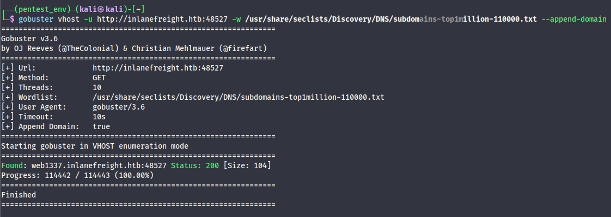
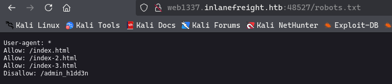
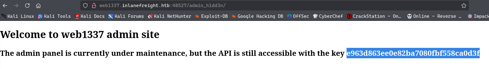
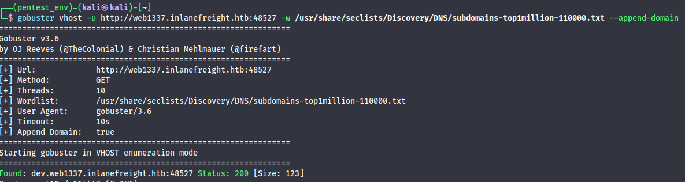

# การสอดแนมเว็บไซต์ (Web Reconnaissance)

## บทนำ
การสอดแนมเว็บไซต์เป็นรากฐานสำคัญของการประเมินความปลอดภัย เป็นกระบวนการรวบรวมข้อมูลเกี่ยวกับเว็บไซต์หรือเว็บแอปพลิเคชันเป้าหมายอย่างเป็นระบบและละเอียดถี่ถ้วน คิดได้ว่าเป็นขั้นตอนเตรียมการก่อนที่จะเจาะลึกเข้าไปวิเคราะห์และหาช่องโหว่ เป็นส่วนสำคัญของ "ขั้นตอนการรวบรวมข้อมูล" ในกระบวนการทดสอบเจาะระบบ

## เป้าหมายหลักของการสอดแนมเว็บไซต์

1. **ระบุทรัพย์สิน** - ค้นหาส่วนประกอบทั้งหมดที่เข้าถึงได้สาธารณะ เช่น หน้าเว็บ, ซับโดเมน, IP addresses และเทคโนโลยีที่ใช้

2. **ค้นหาข้อมูลที่ซ่อนอยู่** - หาข้อมูลที่สำคัญที่อาจถูกเปิดเผยโดยไม่ตั้งใจ เช่น ไฟล์สำรอง, ไฟล์คอนฟิก หรือเอกสารภายใน

3. **วิเคราะห์พื้นที่โจมตี** - ตรวจสอบพื้นที่ที่อาจถูกโจมตีได้ เพื่อหาช่องโหว่และจุดอ่อน

4. **รวบรวมข้อมูลสำคัญ** - เก็บข้อมูลที่สามารถใช้ในการโจมตีหรือ social engineering เช่น บุคลากรสำคัญ, อีเมล หรือรูปแบบพฤติกรรม

ผู้โจมตีใช้ข้อมูลเหล่านี้เพื่อวางแผนโจมตีที่เฉพาะเจาะจง ในขณะที่ผู้ป้องกันใช้เพื่อหาและแก้ไขช่องโหว่ก่อนที่คนร้ายจะเจอ

## ประเภทของการสอดแนม

### 1. การสอดแนมแบบเชิงรุก (Active Reconnaissance)

การโต้ตอบโดยตรงกับระบบเป้าหมายเพื่อรวบรวมข้อมูล มีความเสี่ยงสูงที่จะถูกตรวจจับ แต่ได้ข้อมูลที่ครบถ้วนและตรงไปตรงมา

| เทคนิค | คำอธิบาย | ตัวอย่าง | เครื่องมือ | ความเสี่ยงถูกตรวจจับ |
|--------|----------|----------|------------|---------------------|
| **Port Scanning** (สแกนพอร์ต) | ตรวจสอบพอร์ตที่เปิดใช้งานและบริการที่ทำงานอยู่บนเป้าหมาย | ใช้ Nmap สแกนเว็บเซิร์ฟเวอร์เพื่อหาพอร์ต 80 (HTTP) และ 443 (HTTPS) ที่เปิดอยู่ | Nmap, Masscan, Unicornscan | **สูง:** การโต้ตอบโดยตรงอาจกระตุ้น IDS และ Firewall |
| **Vulnerability Scanning** (สแกนหาช่องโหว่) | ตรวจสอบช่องโหว่ที่ทราบแล้ว เช่น ซอฟต์แวร์ล้าสมัยหรือการตั้งค่าผิดพลาด | ใช้ Nessus ตรวจสอบเว็บแอปพลิเคชันเพื่อหาช่องโหว่ SQL injection หรือ XSS | Nessus, OpenVAS, Nikto | **สูง:** ส่ง exploit payloads ที่ระบบรักษาความปลอดภัยตรวจจับได้ |
| **Network Mapping** (สร้างแผนที่เครือข่าย) | วาดแผนผังโครงสร้างเครือข่ายของเป้าหมาย รวมถึงอุปกรณ์ที่เชื่อมต่อและความสัมพันธ์ | ใช้ traceroute เพื่อหาเส้นทางที่แพ็กเก็ตเดินทางไปยังเซิร์ฟเวอร์เป้าหมาย เผยให้เห็นโครงสร้างพื้นฐานเครือข่าย | Traceroute, Nmap | **ปานกลางถึงสูง:** ทราฟฟิกเครือข่ายที่มากเกินไปหรือผิดปกติอาจสร้างความสงสัย |
| **Banner Grabbing** (ดึงข้อมูลจาก Banner) | ดึงข้อมูลจากข้อความ banner ที่แสดงโดยบริการต่างๆ | เชื่อมต่อกับเว็บเซิร์ฟเวอร์ที่พอร์ต 80 และตรวจสอบ HTTP banner เพื่อระบุซอฟต์แวร์และเวอร์ชันของเว็บเซิร์ฟเวอร์ | Netcat, curl | **ต่ำ:** มีการโต้ตอบน้อยแต่ยังคงถูกบันทึกได้ |
| **OS Fingerprinting** (ระบุระบบปฏิบัติการ) | ระบุระบบปฏิบัติการที่ทำงานอยู่บนเป้าหมาย | ใช้ความสามารถในการตรวจจับ OS ของ Nmap (-O) เพื่อดูว่าเป้าหมายใช้ Windows, Linux หรือ OS อื่นๆ | Nmap, Xprobe2 | **ต่ำ:** โดยทั่วไปเป็นแบบ passive แต่เทคนิคขั้นสูงบางอย่างอาจถูกตรวจจับได้ |
| **Service Enumeration** (ระบุเวอร์ชันของบริการ) | หาเวอร์ชันเฉพาะของบริการที่ทำงานบนพอร์ตที่เปิดอยู่ | ใช้การตรวจจับเวอร์ชันบริการของ Nmap (-sV) เพื่อดูว่าเว็บเซิร์ฟเวอร์ใช้ Apache 2.4.50 หรือ Nginx 1.18.0 | Nmap | **ต่ำ:** คล้ายกับ banner grabbing สามารถถูกบันทึกแต่มีโอกาสน้อยที่จะกระตุ้นการแจ้งเตือน |
| **Web Spidering** (คลานเว็บไซต์) | สำรวจเว็บไซต์เป้าหมายเพื่อระบุหน้าเว็บ, ไดเรกทอรี และไฟล์ต่างๆ | ใช้ web crawler เช่น Burp Suite Spider หรือ OWASP ZAP Spider เพื่อสร้างแผนผังโครงสร้างเว็บไซต์และค้นหาทรัพยากรที่ซ่อนอยู่ | Burp Suite Spider, OWASP ZAP Spider, Scrapy | **ต่ำถึงปานกลาง:** อาจถูกตรวจจับได้หากพฤติกรรมของ crawler ไม่ได้รับการตั้งค่าให้เลียนแบบทราฟฟิกปกติ |

### 2. การสอดแนมแบบเชิงรับ (Passive Reconnaissance)

การรวบรวมข้อมูลโดยไม่ต้องโต้ตอบกับเป้าหมายโดยตรง อาศัยข้อมูลสาธารณะที่มีอยู่แล้ว แอบดูได้โดยไม่ถูกจับและปลอดภัยกว่า แต่อาจได้ข้อมูลไม่ครบถ้วนเท่ากับแบบเชิงรุก

| เทคนิค | คำอธิบาย | ตัวอย่าง | เครื่องมือ | ความเสี่ยงถูกตรวจจับ |
|--------|----------|----------|------------|---------------------|
| **Search Engine Queries** (ค้นหาผ่านเสิร์ชเอนจิ้น) | ใช้เสิร์ชเอนจิ้นค้นหาข้อมูลเกี่ยวกับเป้าหมาย รวมถึงเว็บไซต์, โปรไฟล์โซเชียลมีเดีย และบทความข่าว | ค้นหา "[ชื่อบริษัท] employees" ใน Google เพื่อหาข้อมูลพนักงานหรือโปรไฟล์โซเชียลมีเดีย | Google, DuckDuckGo, Bing, เสิร์ชเอนจิ้นเฉพาะทาง (เช่น Shodan) | **ต่ำมาก:** การค้นหาผ่านเสิร์ชเอนจิ้นเป็นกิจกรรมปกติบนอินเทอร์เน็ตและไม่น่าจะกระตุ้นการแจ้งเตือน |
| **WHOIS Lookups** (ค้นหาข้อมูล WHOIS) | สอบถามฐานข้อมูล WHOIS เพื่อดึงรายละเอียดการจดทะเบียนโดเมน | ทำ WHOIS lookup บนโดเมนเป้าหมายเพื่อหาชื่อผู้จดทะเบียน, ข้อมูลติดต่อ และ name servers | คำสั่ง whois, เว็บไซต์บริการ WHOIS lookup | **ต่ำมาก:** การค้นหา WHOIS เป็นกิจกรรมที่ถูกต้องตามกฎหมายและไม่สร้างความสงสัย |
| **DNS Analysis** (วิเคราะห์ DNS) | วิเคราะห์ DNS records เพื่อระบุซับโดเมน, เมลเซิร์ฟเวอร์ และโครงสร้างพื้นฐานอื่นๆ | ใช้ dig เพื่อแจงนับซับโดเมนของโดเมนเป้าหมาย | dig, nslookup, host, dnsenum, fierce, dnsrecon | **ต่ำมาก:** การค้นหา DNS เป็นสิ่งจำเป็นสำหรับการเรียกดูอินเทอร์เน็ตและโดยทั่วไปไม่ถูกระบุว่าน่าสงสัย |
| **Web Archive Analysis** (วิเคราะห์เว็บไซต์เก่า) | ตรวจสอบภาพรวมในอดีตของเว็บไซต์เป้าหมายเพื่อระบุการเปลี่ยนแปลง, ช่องโหว่ หรือข้อมูลที่ซ่อนอยู่ | ใช้ Wayback Machine เพื่อดูเว็บไซต์เป้าหมายในอดีตว่ามีการเปลี่ยนแปลงอย่างไรเมื่อเวลาผ่านไป | Wayback Machine | **ต่ำมาก:** การเข้าถึงเว็บไซต์ที่เก็บถาวรเป็นกิจกรรมปกติ |
| **Social Media Analysis** (วิเคราะห์โซเชียลมีเดีย) | รวบรวมข้อมูลจากแพลตฟอร์มโซเชียลมีเดีย เช่น LinkedIn, Twitter หรือ Facebook | ค้นหา LinkedIn สำหรับพนักงานขององค์กรเป้าหมายเพื่อเรียนรู้เกี่ยวกับบทบาท, ความรับผิดชอบ และเป้าหมาย social engineering ที่เป็นไปได้ | LinkedIn, Twitter, Facebook, เครื่องมือ OSINT เฉพาะทาง | **ต่ำมาก:** การเข้าถึงโปรไฟล์โซเชียลมีเดียสาธารณะไม่ถือว่าเป็นการบุกรุก |
| **Code Repositories** (คลังเก็บโค้ด) | วิเคราะห์ code repositories สาธารณะ เช่น GitHub เพื่อหา credentials ที่ถูกเปิดเผยหรือช่องโหว่ | ค้นหา GitHub สำหรับ code snippets หรือ repositories ที่เกี่ยวข้องกับเป้าหมายที่อาจมีข้อมูลที่สำคัญหรือช่องโหว่ในโค้ด | GitHub, GitLab | **ต่ำมาก:** Code repositories มีไว้สำหรับการเข้าถึงสาธารณะ และการค้นหาไม่ใช่กิจกรรมที่น่าสงสัย |













```
┌──(pentest_env)─(kali㉿kali)-[~]
└─$ python3 ReconSpider.py http://dev.web1337.inlanefreight.htb:48527

┌──(pentest_env)─(kali㉿kali)-[~]
└─$ cat results.json
{
    "emails": [
        "1337testing@inlanefreight.htb"
    ],
    "links": [
        "http://dev.web1337.inlanefreight.htb:48527/index-949.html",
        "http://dev.web1337.inlanefreight.htb:48527/index-203.html",
        "http://dev.web1337.inlanefreight.htb:48527/index-134.html",
        "http://dev.web1337.inlanefreight.htb:48527/index-332.html",
        "http://dev.web1337.inlanefreight.htb:48527/index-615.html",
        "http://dev.web1337.inlanefreight.htb:48527/index-807.html",
        "http://dev.web1337.inlanefreight.htb:48527/index-789.html",
        "http://dev.web1337.inlanefreight.htb:48527/index-798.html",
        "http://dev.web1337.inlanefreight.htb:48527/index-933.html",
        "http://dev.web1337.inlanefreight.htb:48527/index-737.html",
        "http://dev.web1337.inlanefreight.htb:48527/index-80.html",
        "http://dev.web1337.inlanefreight.htb:48527/index-292.html",
        "http://dev.web1337.inlanefreight.htb:48527/index-862.html",
        "http://dev.web1337.inlanefreight.htb:48527/index-254.html",
        "http://dev.web1337.inlanefreight.htb:48527/index-244.html",
        "http://dev.web1337.inlanefreight.htb:48527/index-714.html",
        "http://dev.web1337.inlanefreight.htb:48527/index-459.html",
        "http://dev.web1337.inlanefreight.htb:48527/index-918.html",
        "http://dev.web1337.inlanefreight.htb:48527/index-555.html",
        "http://dev.web1337.inlanefreight.htb:48527/index-964.html",
        "http://dev.web1337.inlanefreight.htb:48527/index-577.html",
        "http://dev.web1337.inlanefreight.htb:48527/index-114.html",
        "http://dev.web1337.inlanefreight.htb:48527/index-585.html",
        "http://dev.web1337.inlanefreight.htb:48527/index-795.html",
        "http://dev.web1337.inlanefreight.htb:48527/index-458.html",
        "http://dev.web1337.inlanefreight.htb:48527/index-465.html",
        "http://dev.web1337.inlanefreight.htb:48527/index-733.html",
        "http://dev.web1337.inlanefreight.htb:48527/index-437.html",
        "http://dev.web1337.inlanefreight.htb:48527/index-631.html",
        "http://dev.web1337.inlanefreight.htb:48527/index-643.html",
        "http://dev.web1337.inlanefreight.htb:48527/index-472.html",
        "http://dev.web1337.inlanefreight.htb:48527/index-24.html",
        "http://dev.web1337.inlanefreight.htb:48527/index-329.html",
        "http://dev.web1337.inlanefreight.htb:48527/index-553.html",
        "http://dev.web1337.inlanefreight.htb:48527/index-925.html",
        "http://dev.web1337.inlanefreight.htb:48527/index-635.html",
        "http://dev.web1337.inlanefreight.htb:48527/index-727.html",
        "http://dev.web1337.inlanefreight.htb:48527/index-769.html",
        "http://dev.web1337.inlanefreight.htb:48527/index-817.html",
        "http://dev.web1337.inlanefreight.htb:48527/index-403.html",
        "http://dev.web1337.inlanefreight.htb:48527/index-291.html",
        "http://dev.web1337.inlanefreight.htb:48527/index-202.html",
        "http://dev.web1337.inlanefreight.htb:48527/index-379.html",
        "http://dev.web1337.inlanefreight.htb:48527/index-77.html",
        "http://dev.web1337.inlanefreight.htb:48527/index-687.html",
        "http://dev.web1337.inlanefreight.htb:48527/index-513.html",
        "http://dev.web1337.inlanefreight.htb:48527/index-334.html",
        "http://dev.web1337.inlanefreight.htb:48527/index-248.html",
        "http://dev.web1337.inlanefreight.htb:48527/index-342.html",
        "http://dev.web1337.inlanefreight.htb:48527/index-1000.html",
        "http://dev.web1337.inlanefreight.htb:48527/index-799.html",
        "http://dev.web1337.inlanefreight.htb:48527/index-988.html",
        "http://dev.web1337.inlanefreight.htb:48527/index-977.html",
        "http://dev.web1337.inlanefreight.htb:48527/index-300.html",
        "http://dev.web1337.inlanefreight.htb:48527/index-504.html",
        "http://dev.web1337.inlanefreight.htb:48527/index-531.html",
        "http://dev.web1337.inlanefreight.htb:48527/index-226.html",
        "http://dev.web1337.inlanefreight.htb:48527/index-204.html",
        "http://dev.web1337.inlanefreight.htb:48527/index-525.html",
        "http://dev.web1337.inlanefreight.htb:48527/index-734.html",
        "http://dev.web1337.inlanefreight.htb:48527/index-105.html",
        "http://dev.web1337.inlanefreight.htb:48527/index-939.html",
        "http://dev.web1337.inlanefreight.htb:48527/index-748.html",
        "http://dev.web1337.inlanefreight.htb:48527/index-408.html",
        "http://dev.web1337.inlanefreight.htb:48527/index-989.html",
        "http://dev.web1337.inlanefreight.htb:48527/index-947.html",
        "http://dev.web1337.inlanefreight.htb:48527/index-567.html",
        "http://dev.web1337.inlanefreight.htb:48527/index-384.html",
        "http://dev.web1337.inlanefreight.htb:48527/index-335.html",
        "http://dev.web1337.inlanefreight.htb:48527/index-888.html",
        "http://dev.web1337.inlanefreight.htb:48527/index-815.html",
        "http://dev.web1337.inlanefreight.htb:48527/index-574.html",
        "http://dev.web1337.inlanefreight.htb:48527/index-581.html",
        "http://dev.web1337.inlanefreight.htb:48527/index-561.html",
        "http://dev.web1337.inlanefreight.htb:48527/index-909.html",
        "http://dev.web1337.inlanefreight.htb:48527/index-626.html",
        "http://dev.web1337.inlanefreight.htb:48527/index-895.html",
        "http://dev.web1337.inlanefreight.htb:48527/index-350.html",
        "http://dev.web1337.inlanefreight.htb:48527/index-247.html",
        "http://dev.web1337.inlanefreight.htb:48527/index-302.html",
        "http://dev.web1337.inlanefreight.htb:48527/index-938.html",
        "http://dev.web1337.inlanefreight.htb:48527/index-755.html",
        "http://dev.web1337.inlanefreight.htb:48527/index-760.html",
        "http://dev.web1337.inlanefreight.htb:48527/index-364.html",
        "http://dev.web1337.inlanefreight.htb:48527/index-224.html",
        "http://dev.web1337.inlanefreight.htb:48527/index-944.html",
        "http://dev.web1337.inlanefreight.htb:48527/index-728.html",
        "http://dev.web1337.inlanefreight.htb:48527/index-641.html",
        "http://dev.web1337.inlanefreight.htb:48527/index-385.html",
        "http://dev.web1337.inlanefreight.htb:48527/index-463.html",
        "http://dev.web1337.inlanefreight.htb:48527/index-326.html",
        "http://dev.web1337.inlanefreight.htb:48527/index-189.html",
        "http://dev.web1337.inlanefreight.htb:48527/index-431.html",
        "http://dev.web1337.inlanefreight.htb:48527/index-220.html",
        "http://dev.web1337.inlanefreight.htb:48527/index-948.html",
        "http://dev.web1337.inlanefreight.htb:48527/index-785.html",
        "http://dev.web1337.inlanefreight.htb:48527/index-165.html",
        "http://dev.web1337.inlanefreight.htb:48527/index-166.html",
        "http://dev.web1337.inlanefreight.htb:48527/index-660.html"
    ],
    "external_files": [],
    "js_files": [],
    "form_fields": [],
    "images": [],
    "videos": [],
    "audio": [],
    "comments": [
        "<!-- Remember to change the API key to ba988b835be4aa97d068941dc852ff33 -->"
    ]
}              
```


