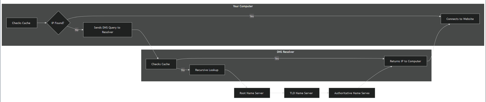

# WHOIS

## WHOIS คืออะไร?

WHOIS เป็นโปรโตคอลแบบ query และ response ที่ใช้กันอย่างแพร่หลาย ออกแบบมาเพื่อเข้าถึงฐานข้อมูลที่เก็บข้อมูลเกี่ยวกับทรัพยากรอินเทอร์เน็ตที่จดทะเบียนไว้ ส่วนใหญ่เกี่ยวข้องกับชื่อโดเมน แต่ WHOIS ยังให้รายละเอียดเกี่ยวกับบล็อก IP address และ autonomous systems ได้ด้วย คิดได้ว่าเป็นเหมือน **สมุดโทรศัพท์ขนาดยักษ์ของอินเทอร์เน็ต** ที่ให้คุณค้นหาว่าใครเป็นเจ้าของหรือรับผิดชอบทรัพย์สินออนไลน์ต่างๆ

### ตัวอย่างการใช้งาน

```shell-session
Watunyoo@htb[/htb]$ whois inlanefreight.com

[...]
Domain Name: inlanefreight.com
Registry Domain ID: 2420436757_DOMAIN_COM-VRSN
Registrar WHOIS Server: whois.registrar.amazon
Registrar URL: https://registrar.amazon.com
Updated Date: 2023-07-03T01:11:15Z
Creation Date: 2019-08-05T22:43:09Z
[...]
```

## ข้อมูลใน WHOIS Record

แต่ละ WHOIS record โดยทั่วไปจะประกอบด้วยข้อมูลดังนี้:

| ข้อมูล | คำอธิบาย |
|--------|----------|
| **Domain Name** | ชื่อโดเมนเอง (เช่น example.com) |
| **Registrar** | บริษัทที่ใช้จดทะเบียนโดเมน (เช่น GoDaddy, Namecheap) |
| **Registrant Contact** | บุคคลหรือองค์กรที่จดทะเบียนโดเมน |
| **Administrative Contact** | บุคคลที่รับผิดชอบในการจัดการโดเมน |
| **Technical Contact** | บุคคลที่จัดการปัญหาทางเทคนิคที่เกี่ยวข้องกับโดเมน |
| **Creation and Expiration Dates** | วันที่จดทะเบียนและวันที่จะหมดอายุ |
| **Name Servers** | เซิร์ฟเวอร์ที่แปลงชื่อโดเมนเป็น IP address |

## ประวัติความเป็นมาของ WHOIS

### ยุคเริ่มต้น (ทศวรรษ 1970)

ประวัติของ WHOIS เชื่อมโยงกับวิสัยทัศน์และการอุทิศตนของ **Elizabeth Feinler** นักวิทยาศาสตร์คอมพิวเตอร์ที่มีบทบาทสำคัญในการสร้างอินเทอร์เน็ตยุคแรก

ในช่วงทศวรรษ 1970 Feinler และทีมงานที่ Network Information Center (NIC) ของ Stanford Research Institute ตระหนักถึงความจำเป็นในการมีระบบติดตามและจัดการทรัพยากรเครือข่ายที่เพิ่มขึ้นบน ARPANET (ต้นแบบของอินเทอร์เน็ตสมัยใหม่) 

พวกเขาจึงสร้าง **WHOIS directory** ซึ่งเป็นฐานข้อมูลพื้นฐานแต่ก้าวล้ำที่เก็บข้อมูลเกี่ยวกับผู้ใช้เครือข่าย, ชื่อโฮสต์ และชื่อโดเมน

### การทำให้เป็นมาตรฐาน (ค.ศ. 1982)

เมื่ออินเทอร์เน็ตขยายตัวเกินกว่าวงการวิชาการ โปรโตคอล WHOIS ถูกทำให้เป็นทางการและมาตรฐานใน **RFC 812** ซึ่งเผยแพร่ในปี 1982 

**Ken Harrenstien** และ **Vic White** ที่ NIC มีบทบาทสำคัญในการกำหนดโปรโตคอล WHOIS และกลไกการ query-response

### ยุค Distributed WHOIS และ RIRs (ทศวรรษ 1990)

ด้วยการเติบโตอย่างรวดเร็วของอินเทอร์เน็ต โมเดล WHOIS แบบรวมศูนย์พิสูจน์แล้วว่าไม่เพียงพอ การจัดตั้ง **Regional Internet Registries (RIRs)** ในช่วงทศวรรษ 1990 เป็นจุดเปลี่ยนสู่ระบบ WHOIS แบบกระจาย

บุคคลสำคัญอย่าง **Randy Bush** และ **John Postel** มีส่วนในการพัฒนาระบบ RIR ซึ่งแบ่งความรับผิดชอบในการจัดการทรัพยากรอินเทอร์เน็ตออกเป็นโซนภูมิภาค การกระจายอำนาจนี้ช่วยเพิ่มความสามารถในการขยายตัวและความยืดหยุ่น

### ยุค ICANN และการทำให้ทันสมัย (ค.ศ. 1998)

การจัดตั้ง **Internet Corporation for Assigned Names and Numbers (ICANN)** ในปี 1998 เปิดยุคใหม่ของ WHOIS 

**Vint Cerf** ซึ่งมักถูกเรียกว่าหนึ่งใน "บิดาแห่งอินเทอร์เน็ต" มีบทบาทสำคัญในการจัดตั้ง ICANN ซึ่งรับผิดชอบการจัดการ DNS ทั่วโลกและการพัฒนานโยบาย WHOIS

การกำกับดูแลแบบรวมศูนย์นี้ช่วยในการทำให้รูปแบบข้อมูล WHOIS เป็นมาตรฐาน ปรับปรุงความถูกต้อง และแก้ไขข้อพิพาทเกี่ยวกับโดเมน เช่น:
- Cybersquatting (การยึดครองโดเมน)
- การละเมิดเครื่องหมายการค้า
- ข้อขัดแย้งเรื่องโดเมนที่ไม่ได้ใช้งาน

นโยบาย **Uniform Domain-Name Dispute-Resolution Policy (UDRP)** ของ ICANN ให้กรอบสำหรับการแก้ไขข้อขัดแย้งผ่านการอนุญาโตตุลาการ

### ยุคความกังวลด้านความเป็นส่วนตัวและ GDPR (ศตวรรษที่ 21)

ศตวรรษที่ 21 นำมาซึ่งการตระหนักรู้ที่เพิ่มขึ้นเกี่ยวกับความกังวลด้านความเป็นส่วนตัวที่เกี่ยวข้องกับข้อมูล WHOIS การเปิดเผยข้อมูลส่วนบุคคลต่อสาธารณะ เช่น ชื่อ ที่อยู่ และเบอร์โทรศัพท์ กลายเป็นความกังวลที่เพิ่มมากขึ้น

นำไปสู่การเพิ่มขึ้นของบริการปกป้องความเป็นส่วนตัวที่อนุญาตให้เจ้าของโดเมนปิดบังข้อมูลส่วนตัว

การบังคับใช้ **General Data Protection Regulation (GDPR)** ในปี 2018 เร่งแนวโน้มนี้เร็วขึ้น โดยกำหนดให้ผู้ให้บริการ WHOIS ต้องปฏิบัติตามกฎการปกป้องข้อมูลที่เข้มงวด

### ปัจจุบัน

ปัจจุบัน WHOIS ยังคงพัฒนาต่อไปเพื่อตอบสนองต่อภูมิทัศน์ที่เปลี่ยนแปลงตลอดเวลาของอินเทอร์เน็ต ความตึงเครียดระหว่างความโปร่งใสและความเป็นส่วนตัวยังคงเป็นประเด็นหลัก

มีความพยายามในการหาจุดสมดุลผ่านโครงการต่างๆ เช่น **Registration Data Access Protocol (RDAP)** ซึ่งเสนอแนวทางที่ละเอียดและคำนึงถึงความเป็นส่วนตัวมากขึ้นในการเข้าถึงข้อมูลการจดทะเบียนโดเมน

## ทำไม WHOIS จึงสำคัญต่อการสอดแนมเว็บ

ข้อมูล WHOIS เป็นขุมทรัพย์ของข้อมูลสำหรับ penetration testers ในระหว่างขั้นตอนการสอดแนมของการประเมิน โดยให้ข้อมูลเชิงลึกที่มีค่าเกี่ยวกับร่องรอยดิจิทัลและช่องโหว่ที่อาจเกิดขึ้นขององค์กรเป้าหมาย:

### 1. ระบุบุคลากรสำคัญ (Identifying Key Personnel)

WHOIS records มักเปิดเผยชื่อ, อีเมล และเบอร์โทรศัพท์ของบุคคลที่รับผิดชอบในการจัดการโดเมน ข้อมูลนี้สามารถใช้สำหรับ:
- การโจมตีแบบ social engineering
- ระบุเป้าหมายที่เป็นไปได้สำหรับแคมเปญ phishing

### 2. ค้นพบโครงสร้างพื้นฐานเครือข่าย (Discovering Network Infrastructure)

รายละเอียดทางเทคนิค เช่น name servers และ IP addresses ให้เบาะแสเกี่ยวกับโครงสร้างพื้นฐานเครือข่ายของเป้าหมาย สิ่งนี้สามารถช่วย penetration testers:
- ระบุจุดเข้าที่เป็นไปได้
- ค้นหาการตั้งค่าที่ผิดพลาด

### 3. วิเคราะห์ข้อมูลในอดีต (Historical Data Analysis)

การเข้าถึง WHOIS records ในอดีตผ่านบริการต่างๆ เช่น WhoisFreaks สามารถเปิดเผย:
- การเปลี่ยนแปลงความเป็นเจ้าของ
- การเปลี่ยนแปลงข้อมูลติดต่อ
- การเปลี่ยนแปลงรายละเอียดทางเทคนิคเมื่อเวลาผ่านไป

ข้อมูลนี้มีประโยชน์ในการติดตามวิวัฒนาการของการปรากฏตัวทางดิจิทัลของเป้าหมาย


# การใช้งาน WHOIS (Utilising WHOIS)

## กรณีศึกษา: สถานการณ์จริงในการใช้งาน WHOIS

### สถานการณ์ที่ 1: การสอบสวนการฟิชชิ่ง (Phishing Investigation)

**สถานการณ์:**
ระบบรักษาความปลอดภัยอีเมลตรวจพบอีเมลต้องสงสัยที่ส่งถึงพนักงานหลายคนในบริษัท อีเมลอ้างว่ามาจากธนาคารของบริษัทและเร่งเร้าให้ผู้รับคลิกลิงก์เพื่ออัปเดตข้อมูลบัญชี นักวิเคราะห์ความปลอดภัยเริ่มสอบสวนโดยทำ WHOIS lookup บนโดเมนที่ลิงก์ในอีเมล

**ผลลัพธ์จาก WHOIS:**

| รายละเอียด | ข้อมูลที่พบ | การตีความ |
|------------|-------------|-----------|
| **Registration Date** | จดทะเบียนเมื่อไม่กี่วันก่อน | 🚩 สัญญาณเตือนภัย - โดเมนใหม่มาก |
| **Registrant** | ข้อมูลผู้จดทะเบียนถูกซ่อนด้วยบริการปกป้องความเป็นส่วนตัว | 🚩 น่าสงสัย - ซ่อนตัวตน |
| **Name Servers** | เชื่อมโยงกับ bulletproof hosting provider ที่รู้จักว่าใช้ในกิจกรรมที่เป็นอันตราย | 🚩 เป็นอันตรายสูง |

**การดำเนินการ:**
นักวิเคราะห์แจ้งเตือนแผนก IT ของบริษัทให้บล็อกโดเมนทันทีและเตือนพนักงานเกี่ยวกับการหลอกลวง การสอบสวนเพิ่มเติมเกี่ยวกับ hosting provider และ IP addresses ที่เกี่ยวข้องอาจเปิดเผยโดเมนฟิชชิ่งเพิ่มเติมหรือโครงสร้างพื้นฐานที่ผู้โจมตีใช้

### สถานการณ์ที่ 2: การวิเคราะห์มัลแวร์ (Malware Analysis)

**สถานการณ์:**
นักวิจัยด้านความปลอดภัยกำลังวิเคราะห์มัลแวร์สายพันธุ์ใหม่ที่ติดเชื้อหลายระบบภายในเครือข่าย มัลแวร์สื่อสารกับเซิร์ฟเวอร์ระยะไกลเพื่อรับคำสั่งและขโมยข้อมูล นักวิจัยทำ WHOIS lookup บนโดเมนที่เชื่อมโยงกับเซิร์ฟเวอร์ Command-and-Control (C2)

**ผลลัพธ์จาก WHOIS:**

| รายละเอียด | ข้อมูลที่พบ | การตีความ |
|------------|-------------|-----------|
| **Registrant** | โดเมนจดทะเบียนโดยบุคคลที่ใช้บริการอีเมลฟรีที่รู้จักในเรื่องการไม่เปิดเผยตัวตน | 🚩 ซ่อนตัวตน |
| **Location** | ที่อยู่ผู้จดทะเบียนอยู่ในประเทศที่มีอาชญากรรมไซเบอร์สูง | 🚩 พื้นที่เสี่ยงสูง |
| **Registrar** | จดทะเบียนผ่าน registrar ที่มีประวัตินโยบายการจัดการการละเมิดที่หละหลวม | 🚩 ไม่มีการควบคุมที่ดี |

**การดำเนินการ:**
นักวิจัยสรุปว่าเซิร์ฟเวอร์ C2 น่าจะโฮสต์บนเซิร์ฟเวอร์ที่ถูกบุกรุกหรือ "bulletproof" server จากนั้นใช้ข้อมูล WHOIS เพื่อระบุผู้ให้บริการโฮสติ้งและแจ้งเตือนพวกเขาเกี่ยวกับกิจกรรมที่เป็นอันตราย

### สถานการณ์ที่ 3: รายงานข่าวกรองภัยคุกคาม (Threat Intelligence Report)

**สถานการณ์:**
บริษัทความปลอดภัยไซเบอร์ติดตามกิจกรรมของกลุ่มผู้โจมตีที่มีความซับซ้อนซึ่งรู้จักกันว่าโจมตีสถาบันการเงิน นักวิเคราะห์รวบรวมข้อมูล WHOIS จากหลายโดเมนที่เกี่ยวข้องกับแคมเปญในอดีตของกลุ่มเพื่อสร้างรายงานข่าวกรองภัยคุกคามที่ครอบคลุม

**รูปแบบที่ค้นพบจากการวิเคราะห์ WHOIS:**

| รูปแบบ | ข้อมูลที่พบ | ความสำคัญ |
|--------|-------------|-----------|
| **Registration Dates** | โดเมนถูกจดทะเบียนเป็นกลุ่ม มักจะไม่นานก่อนการโจมตีครั้งใหญ่ | บ่งชี้การวางแผนล่วงหน้า |
| **Registrants** | ผู้จดทะเบียนใช้นามแฝงและตัวตนปลอมต่างๆ | เทคนิคในการหลบซ่อนตัวตน |
| **Name Servers** | โดเมนมักใช้ name servers เดียวกัน | บ่งบอกถึงโครงสร้างพื้นฐานร่วมกัน |
| **Takedown History** | โดเมนหลายโดเมนถูกปิดหลังจากการโจมตี | บ่งชี้การแทรกแซงของหน่วยงานบังคับใช้กฎหมายหรือความปลอดภัยก่อนหน้านี้ |

**ผลลัพธ์:**
ข้อมูลเชิงลึกเหล่านี้ช่วยให้นักวิเคราะห์สร้างโปรไฟล์โดยละเอียดของ tactics, techniques, and procedures (TTPs) ของผู้โจมตี รายงานมี indicators of compromise (IOCs) ที่อิงจากข้อมูล WHOIS ซึ่งองค์กรอื่นๆ สามารถใช้เพื่อตรวจจับและบล็อกการโจมตีในอนาคต

## การใช้งาน WHOIS Command

### การติดตั้ง

ก่อนใช้คำสั่ง whois คุณต้องแน่ใจว่าติดตั้งบนระบบ Linux แล้ว:

```bash
sudo apt update
sudo apt install whois -y
```

### ตัวอย่างการใช้งาน: WHOIS Lookup สำหรับ facebook.com

```bash
whois facebook.com
```

**ผลลัพธ์:**

```
Domain Name: FACEBOOK.COM
Registry Domain ID: 2320948_DOMAIN_COM-VRSN
Registrar WHOIS Server: whois.registrarsafe.com
Registrar URL: http://www.registrarsafe.com
Updated Date: 2024-04-24T19:06:12Z
Creation Date: 1997-03-29T05:00:00Z
Registry Expiry Date: 2033-03-30T04:00:00Z
Registrar: RegistrarSafe, LLC
Registrar IANA ID: 3237
Registrar Abuse Contact Email: abusecomplaints@registrarsafe.com
Registrar Abuse Contact Phone: +1-650-308-7004
Domain Status: clientDeleteProhibited
Domain Status: clientTransferProhibited
Domain Status: clientUpdateProhibited
Domain Status: serverDeleteProhibited
Domain Status: serverTransferProhibited
Domain Status: serverUpdateProhibited
Name Server: A.NS.FACEBOOK.COM
Name Server: B.NS.FACEBOOK.COM
Name Server: C.NS.FACEBOOK.COM
Name Server: D.NS.FACEBOOK.COM

[...]
Registrant Name: Domain Admin
Registrant Organization: Meta Platforms, Inc.
[...]
```

## การวิเคราะห์ผลลัพธ์ WHOIS ของ facebook.com

### 1. การจดทะเบียนโดเมน (Domain Registration)

| รายละเอียด | ข้อมูล | การตีความ |
|------------|--------|-----------|
| **Registrar** | RegistrarSafe, LLC | ผู้ให้บริการจดทะเบียนที่เชื่อถือได้ |
| **Creation Date** | 1997-03-29 | โดเมนมีอายุยาวนาน บ่งบอกความถูกต้องและการมีอยู่ออนไลน์ที่มั่นคง |
| **Expiry Date** | 2033-03-30 | วันหมดอายุที่ไกลออกไป เสริมสร้างความยั่งยืน |

### 2. เจ้าของโดเมน (Domain Owner)

| รายละเอียด | ข้อมูล |
|------------|--------|
| **Organization** | Meta Platforms, Inc. |
| **Contact** | Domain Admin |

ข้อมูลนี้ระบุว่า Meta Platforms, Inc. คือองค์กรเบื้องหลัง facebook.com และ "Domain Admin" คือจุดติดต่อสำหรับเรื่องที่เกี่ยวข้องกับโดเมน สอดคล้องกับความคาดหวังที่ Facebook เป็นเจ้าของโดย Meta Platforms, Inc.

### 3. สถานะโดเมน (Domain Status)

สถานะต่างๆ ที่ปรากฏ:
- `clientDeleteProhibited`
- `clientTransferProhibited`
- `clientUpdateProhibited`
- `serverDeleteProhibited`
- `serverTransferProhibited`
- `serverUpdateProhibited`

**ความหมาย:** โดเมนได้รับการป้องกันจากการเปลี่ยนแปลง การโอน หรือการลบที่ไม่ได้รับอนุญาตทั้งฝั่งไคลเอนต์และเซิร์ฟเวอร์ แสดงให้เห็นถึงการเน้นย้ำด้านความปลอดภัยและการควบคุมโดเมนที่แข็งแกร่ง

### 4. Name Servers

```
A.NS.FACEBOOK.COM
B.NS.FACEBOOK.COM
C.NS.FACEBOOK.COM
D.NS.FACEBOOK.COM
```

**ความหมาย:** Name servers ทั้งหมดอยู่ภายในโดเมน facebook.com บ่งบอกว่า Meta Platforms, Inc. จัดการโครงสร้างพื้นฐาน DNS ของตนเอง เป็นแนวทางปฏิบัติทั่วไปสำหรับองค์กรขนาดใหญ่เพื่อรักษาการควบคุมและความน่าเชื่อถือ

## สรุป

ผลลัพธ์ WHOIS สำหรับ facebook.com สอดคล้องกับความคาดหวังสำหรับโดเมนที่มั่นคงและปลอดภัย ซึ่งเป็นเจ้าของโดยองค์กรขนาดใหญ่อย่าง Meta Platforms, Inc.

**ข้อจำกัด:** แม้ว่า WHOIS record จะให้ข้อมูลติดต่อสำหรับปัญหาที่เกี่ยวข้องกับโดเมน แต่อาจไม่เป็นประโยชน์โดยตรงในการระบุพนักงานแต่ละคนหรือช่องโหว่เฉพาะ นี่เน้นย้ำถึงความจำเป็นในการรวมข้อมูล WHOIS กับเทคนิคการสอดแนมอื่นๆ เพื่อทำความเข้าใจร่องรอยดิจิทัลของเป้าหมายอย่างครอบคลุม


