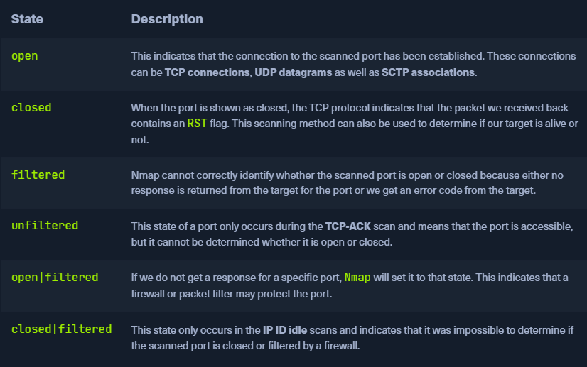
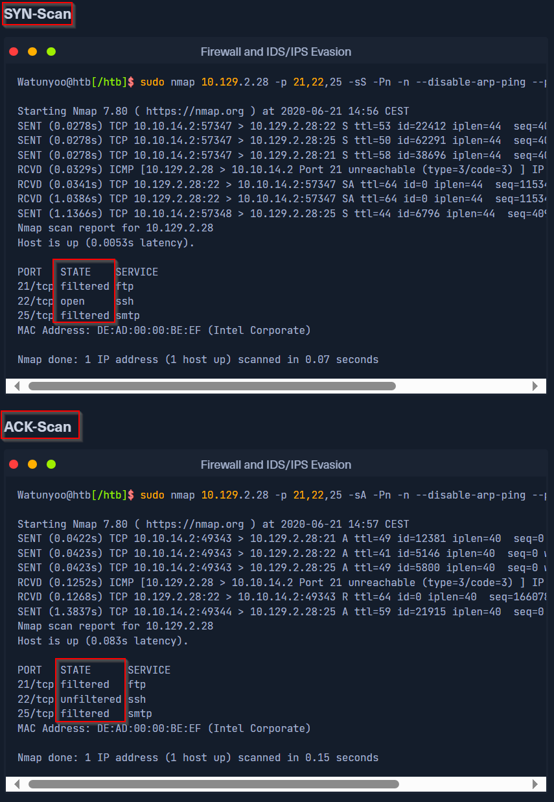
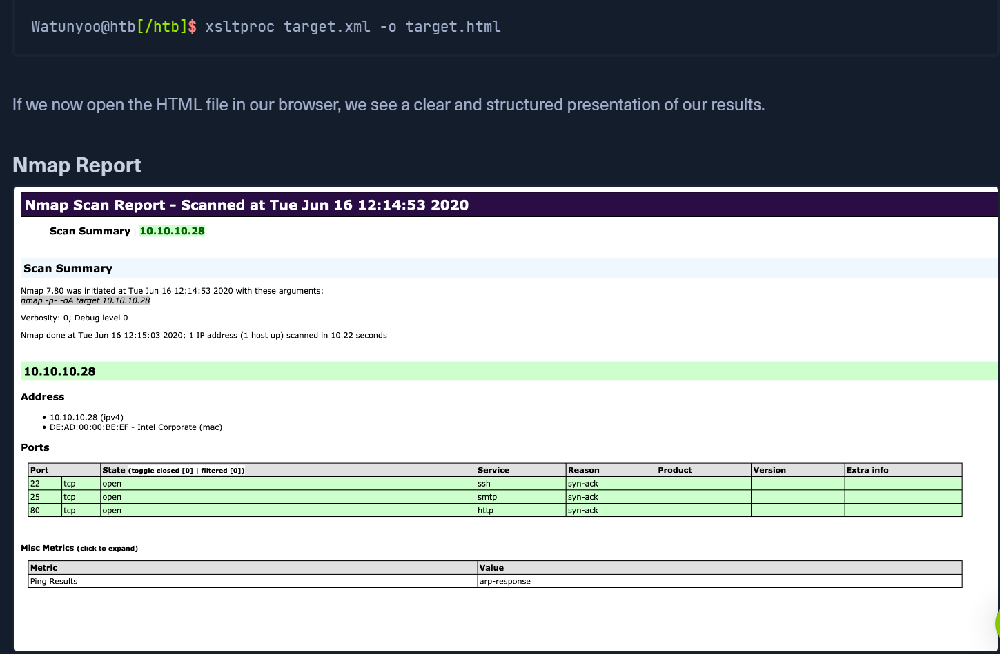
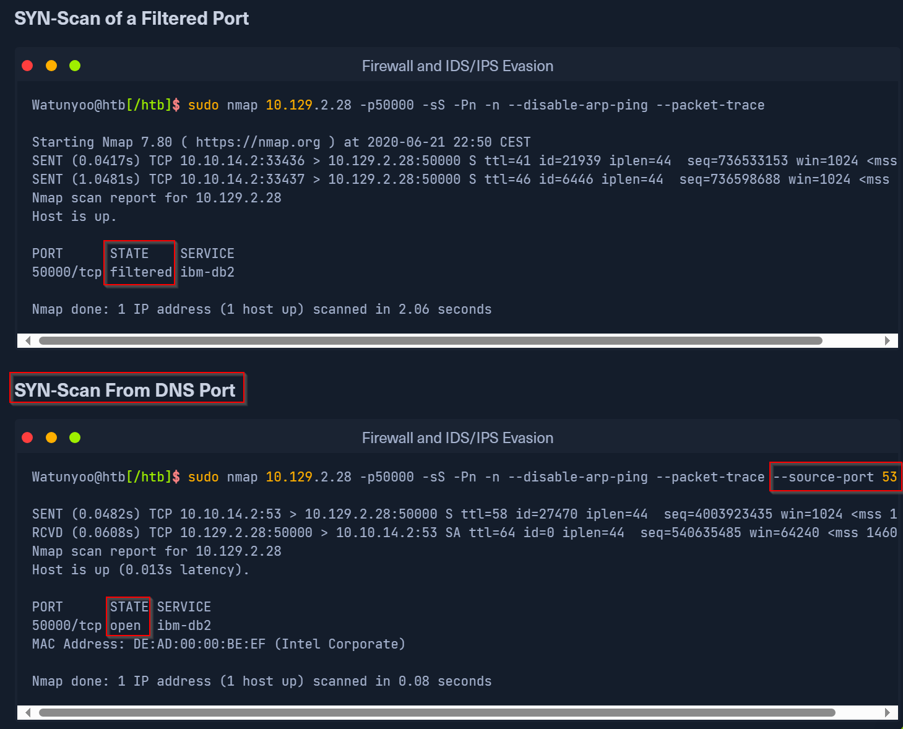

## Timeout ใน Port Scanning

**ปัญหา:**
- เครื่องมือสแกนรอ response จาก service 
- ถ้า timeout → มาร์คเป็น closed/filtered/unknown
- **อันตราย**: ถ้ามาร์คเป็น "closed" → Nmap ไม่แสดงให้เห็น
```
Port เปิดอยู่ → Timeout → มาร์ค "closed" → เราพลาดไป!
```

## TCP-SYN scan (-sS)

จะส่งแพ็กเก็ตที่มีแฟล็ก SYN หนึ่งแพ็กเก็ต ไม่สามารถทำ three-way handshake ได้สำเร็จ
- Nmap ได้ SYN-ACK = port open
- Nmap ได้ RST = close
- Nmap ไม่ได้ อาจจะโดน firewall = filtered

TCP-SYN scan (-sS) เป็นค่าเริ่มต้นในฐานะ root. Nmap จะสแกนพอร์ต TCP 1,000 พอร์ตแรกด้วย
(-sS) ใช้ raw socket 
## Nmap Ping Scan Behavior

**เมื่อปิด Port Scan (`-sn`):**
- Nmap ใช้ ping scan แทน
- **Default**: ส่ง `ICMP Echo Request` (`-PE`)
- **คาดหวัง**: ได้ `ICMP Reply` กลับมา = host มีชีวิต

**ความจริงที่น่าสนใจ:**
```
การสแกนปกติ → ไม่ส่ง ICMP Echo Request
เพราะ → ส่ง ARP ping ก่อน → ได้ ARP reply → จบ
```

**ลำดับการทำงาน:**
1. **ARP ping** → **ARP reply** ✅ (จบเลย)
2. ~~ICMP Echo Request~~ (ไม่ต้องส่ง)

**การตรวจสอบ:**
- ใช้ `--packet-trace` เพื่อดู packet ที่ส่ง
- ใช้ `-PE` เพื่อบังคับส่ง ICMP Echo Request

```
Windows TTL มักใช้ค่า 128 ส่วน Linux อาจใช้ค่า 64 
```




## ทำไมต้อง Disable ICMP Echo (`-Pn`)

**เหตุผลหลัก:**

### 1. **Host Discovery ปกติ**
```
Nmap → ส่ง ICMP Echo Request → รอ ICMP Reply
ถ้าไม่ได้ Reply → คิดว่า host ตาย → หยุดสแกน!
```

### 2. **ปัญหาที่เกิดขึ้น:**
- **Firewall block ICMP** → ไม่ได้ Reply
- **Host มีชีวิต** แต่ Nmap คิดว่าตาย
- **ไม่สแกน port** เลย!

### 3. **การใช้ `-Pn`:**
```
-Pn = "ถือว่าทุก host มีชีวิต"
→ ข้าม ping test
→ สแกน port ตรงๆ เลย
```


## การสแกน UDP Ports

**TCP vs UDP:**
```
TCP: มี 3-way handshake → ได้ ACK → รวดเร็ว
UDP: ไม่มี handshake → ไม่มี ACK → timeout นาน
```

**ปัญหาใหญ่ของ UDP Scan:**

1. **Nmap ส่ง empty datagrams**
2. **ไม่ได้ response กลับมา**
3. **ไม่รู้ว่า packet ถึงหรือเปล่า**
4.  เมื่อไหร่ได้ response: UDP port เปิด **และ** application ตั้งค่าให้ตอบกลับ

If we get an ICMP response with error code 3 (port unreachable), we know that the port is indeed closed.

For all other ICMP responses, the scanned ports are marked as (open|filtered).








## Bypass Security Measures
Decoys
## Decoy Scanning (-D) - หลบ Firewall/IPS

**ปัญหาที่เจอ:**
- Admin บล็อก subnet จากต่างประเทศ
- IPS บล็อก IP เรา
- ไม่สามารถเข้าถึง target ได้

```bash
nmap -D RND:5 target
```

**การทำงาน:**
1. สร้าง IP ปลอม 5 ตัว
2. แทรก IP จริงของเราไปด้วย (สุ่มตำแหน่ง)
3. ส่ง packet จากทุก IP พร้อมกัน

```
102.52.161.59    → ส่ง packet (ปลอม)
10.10.14.2       → ส่ง packet (IP จริงเรา - ตำแหน่งที่ 2)  
210.120.38.29    → ส่ง packet (ปลอม)
191.6.64.171     → ส่ง packet (ปลอม)
184.178.194.209  → ส่ง packet (ปลอม)
```

**ข้อสำคัญ:**
- **Decoy IP ต้องมีชีวิต!** ไม่งั้น target โดน SYN-flooding
- ISP อาจกรอง spoofed packet ออก

## ปัญหา Spoofed Packets และวิธีแก้

**ปัญหา:**
- ISP/Router กรอง spoofed packets ออก
- แม้จะอยู่ network range เดียวกัน

**วิธีแก้ที่ดีกว่า:**

### 1. **ใช้ VPS IP + IP ID Manipulation**
```bash
nmap -D vps1_ip,vps2_ip,ME target
```
- ใช้ IP ของ VPS servers จริง
- ผ่าน ISP filter ได้ง่ายกว่า
- ปรับ IP ID ใน header

### 2. **Manual Source IP (-S)**
```bash
nmap -S specific_ip target
```
- ระบุ source IP เอง
- ทดสอบว่า subnet ไหนผ่านได้
- บางทีเฉพาะ subnet นั้นถูกบล็อก

**สถานการณ์ที่ใช้:**
- บาง subnet ถูกบล็อกจาก service นั้นๆ
- ทดสอบ access control rules
- หาช่องโหว่ใน firewall config

**Scan Types ที่ใช้ Decoy ได้:**
- SYN scan
- ACK scan  
- ICMP scan
- OS detection scan

**สรุป:** ถ้า random IP ไม่ผ่าน → ใช้ VPS IP หรือระบุ source IP เอง!


### Custom DNS Server**
```bash
nmap --dns-server internal_dns_ip target
```

**ข้อดี (โดยเฉพาะใน DMZ):**
- Internal DNS servers **น่าเชื่อถือกว่า** internet DNS
- ใช้ interact กับ internal network ได้
- ผ่าน security controls ง่ายกว่า

### Source Port Spoofing**
```bash
nmap --source-port 53 target
```

**วิธีการ:**
- ใช้ TCP port 53 เป็น source port
- Firewall คิดว่าเป็น DNS traffic
- **Trusted** → ผ่านได้!

**เงื่อนไข:**
- Admin กำหนด firewall rule ให้ port 53 ผ่าน
- IDS/IPS filter ไม่เข้มงวด

**สรุป:** ใช้ DNS เป็นฉากหลัง = ดูเหมือน legitimate traffic!


## Hard Lab

--source-port 53 ทะลุ firewall ได้

```
┌──(kali㉿DESKTOP-KQAT41L)-[/mnt/…/Desktop/hackthebox/CPTS/Nmap]
└─$ ncat --source-port 53 10.129.227.208 50000
220 HTB{kjnsdf2n982n1827eh76238s98di1w6}
```