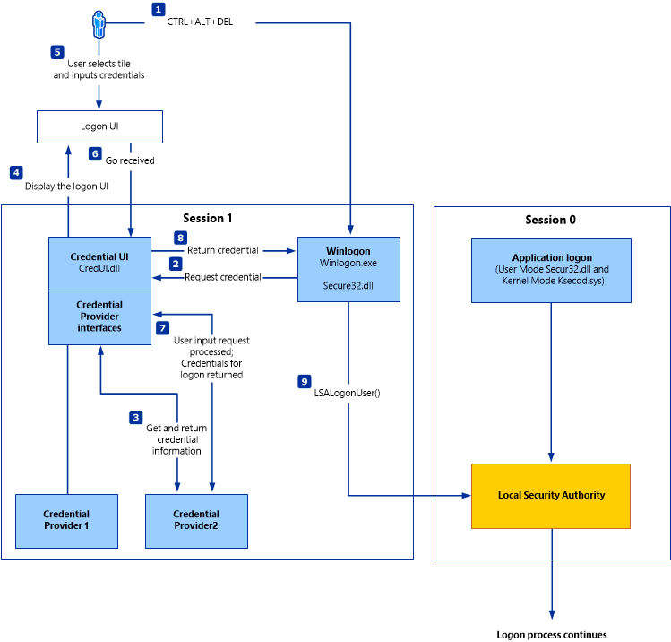
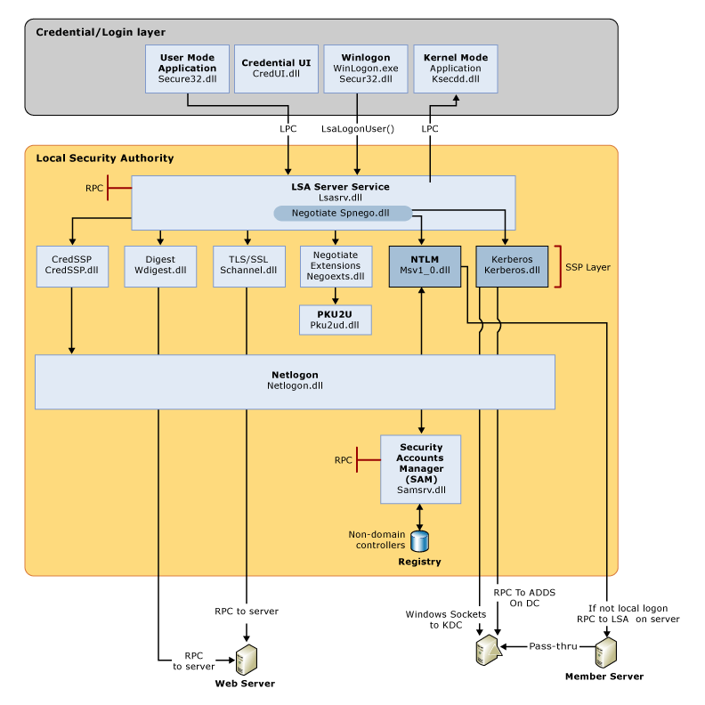

# กระบวนการยืนยันตัวตนของ Windows

## ภาพรวม

กระบวนการยืนยันตัวตนของ Windows client เกี่ยวข้องกับหลายโมดูลที่รับผิดชอบการ Logon, การดึงข้อมูลรับรอง (Credentials) และการตรวจสอบความถูกต้อง ในบรรดากลไกการยืนยันตัวตนต่างๆ ของ Windows **Kerberos** เป็นหนึ่งในวิธีที่ใช้กันอย่างแพร่หลายและซับซ้อนที่สุด

# LSA vs LSASS - ความแตกต่างและความสัมพันธ์

**LSA** และ **LSASS** เป็นคนละสิ่งที่เกี่ยวข้องกัน:

- **LSA** = **แนวคิด/ส่วนประกอบ** (Concept/Component)
- **LSASS** = **กระบวนการ/โปรแกรม** (Process/Program) ที่รัน LSA

---

## 1. Local Security Authority (LSA)

**LSA** คือ **ระบบย่อย (subsystem)** ของ Windows ที่รับผิดชอบด้านความปลอดภัย

### หน้าที่ของ LSA:

```
LSA (Local Security Authority)
├── Authentication (การยืนยันตัวตน)
│   ├── ตรวจสอบ username/password
│   ├── จัดการ authentication protocols (NTLM, Kerberos)
│   └── ตรวจสอบ credentials
│
├── Authorization (การให้สิทธิ์)
│   ├── สร้าง access tokens
│   ├── ตรวจสอบ permissions
│   └── จัดการ privileges
│
├── Security Policy Management
│   ├── Password policies
│   ├── Account lockout policies
│   └── Audit policies
│
└── Security Database Management
    ├── SAM (Security Account Manager) - local accounts
    ├── LSA Secrets - sensitive data
    └── Cached credentials
```

### LSA ประกอบด้วย:

1. **LSA Policy Database**: เก็บ security policies
2. **LSA Secrets**: เก็บข้อมูลลับ (passwords, service account credentials)
3. **Authentication Packages**: NTLM, Kerberos, Negotiate
4. **Security Support Providers (SSPs)**: ให้บริการ authentication

---

## 2. Local Security Authority Subsystem Service (LSASS)

**LSASS** (lsass.exe) คือ **กระบวนการ Windows** ที่ทำให้ LSA ทำงานได้จริง

**ที่อยู่ไฟล์:** `%SystemRoot%\System32\Lsass.exe`

### LSASS Process:

```powershell
# ดู LSASS process
Get-Process lsass

# Output:
# Handles  NPM(K)    PM(K)      WS(K)     CPU(s)     Id  SI ProcessName
# -------  ------    -----      -----     ------     --  -- -----------
#    1456      32    15384      25692      12.34    632   0 lsass

# ข้อมูลเพิ่มเติม
tasklist /fi "imagename eq lsass.exe" /v

# Location: C:\Windows\System32\lsass.exe
# Parent Process: wininit.exe
# User: NT AUTHORITY\SYSTEM (รันด้วยสิทธิ์สูงสุด)
```

### คุณสมบัติของ LSASS:

1. **Critical System Process**: ถ้า LSASS หยุดทำงาน → Windows จะ restart ทันที
2. **รันตลอดเวลา**: เริ่มตั้งแต่ boot จนถึง shutdown
3. **Protected Process**: ไม่สามารถ terminate ง่ายๆ ได้
4. **มี LSA Server Service**: รอรับคำขอ authentication


## องค์ประกอบหลักของกระบวนการยืนยันตัวตน


## 1. จุดเริ่มต้น: WinLogon.exe และ LogonUI

**WinLogon.exe** เป็นตัวจัดการหลักของกระบวนการ login บน Windows ทำงานร่วมกับ **LogonUI** (หน้าจอ login ที่เราเห็น)

**ตัวอย่างการใช้งาน:**
- กด Ctrl+Alt+Del และเลือก "Lock" หรือ "Sign out"
- หน้าจอ login ที่ปรากฏขึ้นคือ LogonUI
- เมื่อพิมพ์ username/password นั้นคือการส่งข้อมูลผ่าน WinLogon

## 2. Credential Provider

**Credential Provider** รับผิดชอบในการรับข้อมูล credentials จากผู้ใช้

**ตัวอย่างการใช้งาน:**
- **Password Provider**: การ login แบบปกติด้วย username/password
- **Smart Card Provider**: การใช้บัตร smart card แทนรหัสผ่าน
- **Biometric Provider**: ใช้ Windows Hello (ลายนิ้วมือ, ใบหน้า)
- **PIN Provider**: ใช้ PIN 4-6 หลักแทนรหัสผ่าน

```
ตัวอย่าง: เมื่อคุณเลือก "Sign-in options" บนหน้า login
คุณจะเห็นตัวเลือกต่างๆ เช่น:
- Password
- PIN
- Picture password
- Fingerprint
แต่ละตัวเลือกนี้คือ Credential Provider ที่แตกต่างกัน
```

## 3. Authentication Packages

หลังจาก Credential Provider รับข้อมูลแล้ว จะส่งไปยัง **Authentication Packages** ผ่าน **lsass.exe** (Local Security Authority Subsystem Service)

### Authentication Packages แบ่งเป็น 2 ประเภท:

### A. Local / Non-Domain Joined Authentication

สำหรับคอมพิวเตอร์ที่ไม่ได้เชื่อมกับ Domain (เครื่อง standalone หรือ workgroup)

**กระบวนการ:**
```
LogonUI → lsass.exe → NTLM → SAM → Registry
```

**ส่วนประกอบ:**
- **NTLM** (NT LAN Manager): โปรโตคอลสำหรับ authentication
- **SAM** (Security Account Manager): ฐานข้อมูลบัญชีผู้ใช้ local
- **Registry**: เก็บข้อมูล SAM ที่ `HKLM\SAM`

**ตัวอย่างการใช้งาน:**
```powershell
# สร้าง local user
net user TestUser Password123! /add

# เมื่อ login ด้วย TestUser:
# 1. ป้อน username: TestUser
# 2. ป้อน password: Password123!
# 3. NTLM hash password และเปรียบเทียบกับค่าใน SAM
# 4. ถ้าตรงกัน → ให้สิทธิ์เข้าใช้งาน
```

**ไฟล์ที่เกี่ยวข้อง:**
- **Msv1_0.dll**: Microsoft Authentication Package สำหรับ NTLM
- **Samsrv.dll**: SAM service DLL
- ข้อมูลจริงเก็บที่: `C:\Windows\System32\config\SAM`

### B. Remote / Domain-Joined Authentication

สำหรับคอมพิวเตอร์ที่เชื่อมกับ Active Directory Domain

**กระบวนการ:**
```
LogonUI → lsass.exe → NTLM/Kerberos → Netlogon → AD Directory Services
```

**ส่วนประกอบ:**
- **Kerberos**: โปรโตคอล authentication ที่ทันสมัยกว่า NTLM (เป็นค่าเริ่มต้น)
- **NTLM**: ใช้เป็น fallback เมื่อ Kerberos ใช้ไม่ได้
- **Netlogon**: บริการสำหรับติดต่อกับ Domain Controller
- **AD Directory Services**: Active Directory server

**ตัวอย่างการใช้งาน:**

```powershell
# กรณี Domain login
Username: CONTOSO\watunyoo
# หรือ
Username: watunyoo@contoso.com
Password: DomainPassword123!

# ขั้นตอนการทำงาน:
# 1. lsass.exe ตรวจสอบว่าเป็น domain account
# 2. ส่งคำขอไปยัง Domain Controller ผ่าน Netlogon
# 3. ใช้ Kerberos protocol:
#    - ขอ TGT (Ticket Granting Ticket) จาก KDC
#    - ใช้ TGT เพื่อขอ Service Ticket
#    - ตรวจสอบ ticket กับ AD
# 4. AD ยืนยันตัวตนและส่ง security token กลับมา
```

**ไฟล์ที่เกี่ยวข้อง:**
- **Kerberos.dll**: Kerberos authentication package
- **Netlogon.dll**: Domain authentication service
- **Ntdsa.dll**: Active Directory database access

## 4. ความแตกต่างระหว่าง NTLM และ Kerberos

### NTLM (NT LAN Manager)

**วิธีการทำงาน:**
```
1. Client ส่ง username ไปยัง server
2. Server ส่ง challenge (random number) กลับมา
3. Client hash password + challenge และส่งกลับไป
4. Server ตรวจสอบกับค่าที่เก็บไว้
```

**ข้อจำกัด:**
- ช้ากว่า Kerberos
- ไม่มี mutual authentication
- ต้องติดต่อ Domain Controller ทุกครั้ง

**ตัวอย่างการใช้:**
```cmd
# NTLM ยังใช้อยู่ในกรณี:
# - เชื่อมต่อผ่าน IP address แทน hostname
net use \\192.168.1.100\share /user:DOMAIN\user password

# - ระบบเก่าที่ไม่รองรับ Kerberos
```

### Kerberos (ค่าเริ่มต้นสำหรับ Domain)

**วิธีการทำงาน:**
```
1. Client ขอ TGT จาก Authentication Server (AS)
2. AS ส่ง TGT กลับมา (encrypted ด้วย key ของ client)
3. Client ใช้ TGT ขอ Service Ticket จาก Ticket Granting Server (TGS)
4. TGS ส่ง Service Ticket กลับมา
5. Client ใช้ Service Ticket เข้าถึง resource
```

**ข้อดี:**
- รวดเร็วกว่า (ใช้ ticket แทนการส่ง credential ซ้ำๆ)
- มี mutual authentication
- ปลอดภัยกว่า

**ตัวอย่างการใช้:**
```powershell
# ตรวจสอบ Kerberos tickets ปัจจุบัน
klist

# ผลลัพธ์:
# Ticket cache: User: CONTOSO\watunyoo
# 
# #0>  Client: watunyoo @ CONTOSO.COM
#      Server: krbtgt/CONTOSO.COM @ CONTOSO.COM
#      KerbTicket Encryption Type: AES-256-CTS-HMAC-SHA1-96
#      Ticket Flags: forwardable renewable
```

## 5. กระบวนการหลัง Authentication สำเร็จ

หลังจาก authentication สำเร็จ WinLogon จะเรียก:

### CreateDesktop() → userinit.exe → explorer.exe

**ตัวอย่างขั้นตอน:**

```
1. CreateDesktop(): สร้าง desktop environment
2. Load Profile: โหลด user profile จาก:
   C:\Users\[username]
3. Load Registry: โหลด user registry hive:
   HKEY_CURRENT_USER
4. userinit.exe: กระบวนการเริ่มต้น user session
   - ตั้งค่า environment variables
   - รัน startup scripts
   - เริ่ม Group Policy
5. explorer.exe: เริ่ม Windows Explorer (taskbar, desktop)
```


## Authentication Packages

| Package | คำอธิบาย |
|---------|----------|
| **Lsasrv.dll** | LSA Server service ที่บังคับใช้ security policies และทำหน้าที่เป็น security package manager สำหรับ LSA มีฟังก์ชัน Negotiate ที่เลือกใช้ NTLM หรือ Kerberos protocol |
| **Msv1_0.dll** | Authentication package สำหรับ local machine logons ที่ไม่ต้องการ custom authentication |
| **Samsrv.dll** | Security Accounts Manager (SAM) เก็บ local security accounts, บังคับใช้ locally stored policies และรองรับ APIs |
| **Kerberos.dll** | Security package ที่โหลดโดย LSA สำหรับ Kerberos-based authentication |
| **Netlogon.dll** | Network-based logon service |
| **Ntdsa.dll** | ใช้สำหรับสร้าง records และ folders ใหม่ใน Windows registry |

# GINA - Graphical Identification and Authentication

## อะไรคือ GINA?

**GINA** (Graphical Identification and Authentication) คือ **ระบบเก่า** ของ Windows ที่ใช้จัดการหน้าจอ login และกระบวนการ authentication ก่อนที่จะถูกแทนที่ด้วย **Credential Provider** ใน Windows Vista/Server 2008 ขึ้นไป

---

## ประวัติและวิวัฒนาการ

```
Windows NT 3.1 → Windows XP/Server 2003
├── ใช้ GINA (msgina.dll)
├── Winlogon.exe → GINA → LSASS
└── ปัญหา: จำกัด, ไม่ยืดหยุ่น

        ⬇️  เปลี่ยนแปลง

Windows Vista/7/8/10/11 → ปัจจุบัน
├── ใช้ Credential Provider
├── Winlogon.exe → Credential Provider → LSASS
└── ยืดหยุ่นกว่า, รองรับหลาย providers พร้อมกัน
```

### Timeline:

| ระยะเวลา | ระบบ | เทคโนโลยี |
|----------|------|-----------|
| 1993-2006 | Windows NT 3.1 - XP/2003 | **GINA** |
| 2007-ปัจจุบัน | Windows Vista/7/8/10/11 | **Credential Provider** |

# SAM Database (Security Account Manager) - คู่มือฉบับสมบูรณ์

## SAM คือคืออะไร?

**SAM (Security Account Manager)** คือฐานข้อมูลที่เก็บข้อมูลบัญชีผู้ใช้และรหัสผ่านแบบ local บนระบบ Windows โดยทำหน้าที่เป็น "โลก database" สำหรับการ authentication ของ local accounts

```
┌─────────────────────────────────────────┐
│         Windows Local System            │
│                                          │
│  ┌────────────────────────────────┐    │
│  │   SAM Database                  │    │
│  │  ┌──────────────────────────┐  │    │
│  │  │ Local Users:             │  │    │
│  │  │  - Administrator         │  │    │
│  │  │  - Guest                 │  │    │
│  │  │  - Watunyoo              │  │    │
│  │  │  - TestUser              │  │    │
│  │  └──────────────────────────┘  │    │
│  │  ┌──────────────────────────┐  │    │
│  │  │ Password Hashes (NTLM)   │  │    │
│  │  │  - Encrypted/Hashed      │  │    │
│  │  │  - Never plaintext       │  │    │
│  │  └──────────────────────────┘  │    │
│  │  ┌──────────────────────────┐  │    │
│  │  │ Local Groups:            │  │    │
│  │  │  - Administrators        │  │    │
│  │  │  - Users                 │  │    │
│  │  │  - Power Users           │  │    │
│  │  └──────────────────────────┘  │    │
│  └────────────────────────────────┘    │
└─────────────────────────────────────────┘
```

---

## ที่ตั้งของ SAM Database

### 1. ไฟล์หลัก

```powershell
# ไฟล์ SAM อยู่ที่
C:\Windows\System32\config\SAM

# ไฟล์สำรอง (backup)
C:\Windows\System32\config\RegBack\SAM

# Registry hive
HKEY_LOCAL_MACHINE\SAM

# หมายเหตุ: ไม่สามารถ copy หรือดูไฟล์นี้ได้ขณะ Windows ทำงาน
# เพราะถูก lock โดย system
```

### 2. ลักษณะไฟล์

```cmd
# ดูข้อมูลไฟล์ (จะไม่สามารถเปิดได้)
dir C:\Windows\System32\config\SAM

# Output ตัวอย่าง:
# 11/12/2025  10:30 AM        262,144 SAM

# พยายาม copy จะเจอ error
copy C:\Windows\System32\config\SAM C:\Temp\
# Error: The process cannot access the file because it is being used by another process
```

---

## โครงสร้างของ SAM Database

### 1. User Accounts Information

SAM เก็บข้อมูลดังนี้:

```
User Account Entry:
├── Username (ชื่อผู้ใช้)
├── User ID (SID - Security Identifier)
├── Password Hash
│   ├── LM Hash (เก่า, ไม่ปลอดภัย, ปิดใช้งานใน modern Windows)
│   └── NTLM Hash (ใช้งานปัจจุบัน)
├── User Profile Path
├── Home Directory
├── Account Flags
│   ├── Account Disabled
│   ├── Password Never Expires
│   ├── User Cannot Change Password
│   └── Account Locked Out
├── Password Policy
│   ├── Last Password Change
│   ├── Password Expiration Date
│   └── Bad Password Count
└── Group Memberships (local groups)
```

### 2. Local Groups Information

```
Group Entry:
├── Group Name
├── Group ID (RID - Relative Identifier)
├── Group Members (list of SIDs)
└── Group Description
```

---

## การทำงานของ SAM ในกระบวนการ Authentication

### ขั้นตอนการ Login ด้วย Local Account:

```
1. User ป้อน Username + Password
              ↓
2. WinLogon.exe รับข้อมูล
              ↓
3. ส่งไปยัง lsass.exe (Local Security Authority Subsystem Service)
              ↓
4. lsass.exe เรียกใช้ Msv1_0.dll (Authentication Package)
              ↓
5. Hash password ที่ผู้ใช้ป้อนด้วย NTLM algorithm
              ↓
6. เปิดอ่าน SAM database ผ่าน samsrv.dll
              ↓
7. เปรียบเทียบ hash ที่คำนวณได้กับ hash ใน SAM
              ↓
8. ถ้าตรงกัน → Authentication สำเร็จ
   ถ้าไม่ตรงกัน → Authentication ล้มเหลว
              ↓
9. บันทึก event log (Event ID 4624 หรือ 4625)
              ↓
10. สร้าง access token สำหรับ user session
```


## Windows Workgroup คืออะไร?

**Workgroup** คือ **กลุ่มของคอมพิวเตอร์** ที่เชื่อมต่อกันในเครือข่ายแบบ peer-to-peer โดยไม่มี server กลางในการจัดการ

### ลักษณะของ Workgroup:

```
┌─────────────┐    ┌─────────────┐    ┌─────────────┐
│  PC-01      │────│  PC-02      │────│  PC-03      │
│ Workgroup:  │    │ Workgroup:  │    │ Workgroup:  │
│ OFFICE      │    │ OFFICE      │    │ OFFICE      │
└─────────────┘    └─────────────┘    └─────────────┘
     │                   │                   │
     └───────────────────┴───────────────────┘
           เครือข่าย LAN แบบ peer-to-peer
```

### คุณสมบัติ Workgroup:

1. **ไม่มีการจัดการส่วนกลาง**: แต่ละเครื่องจัดการ users ของตัวเองอิสระ
2. **ใช้สำหรับเครือข่ายขนาดเล็ก**: โดยทั่วไป ≤ 20 เครื่อง
3. **แต่ละเครื่องมี local accounts แยกกัน**: User บนเครื่อง A ต่างจาก User บนเครื่อง B
4. **Share resources แบบ peer-to-peer**: เช่น แชร์ folder, printer
5. **ชื่อ Workgroup เป็นเพียงป้ายกำกับ**: ไม่ได้ควบคุมสิทธิ์อะไร


### สถานการณ์จริง:

```
สมมติมี 3 เครื่องใน Workgroup ชื่อ "OFFICE":

PC-01:
  - Workgroup: OFFICE
  - Local users: admin, watunyoo, guest

PC-02:
  - Workgroup: OFFICE
  - Local users: admin, somchai, guest

PC-03:
  - Workgroup: OFFICE
  - Local users: admin, nittaya, guest

ปัญหา: ถึงแม้ทั้ง 3 เครื่องจะอยู่ใน Workgroup เดียวกัน
แต่ user "watunyoo" บน PC-01 ไม่สามารถใช้ credentials เดียวกัน
login เข้า PC-02 หรือ PC-03 ได้
เพราะแต่ละเครื่องมี user database แยกกัน (SAM แยกกัน)

หากต้องการเข้าถึง shared folder บน PC-02:
- ต้องมี account "watunyoo" บน PC-02 ด้วย
- หรือใช้ account ที่มีอยู่บน PC-02 แทน (เช่น somchai)
```

---
### Windows Active Directory Domain:

```
┌─────────────────────────────────────────┐
│       Domain Controller (DC)             │
│  - Active Directory                      │
│  - Centralized User Management          │
│  - Group Policies                        │
└────────────┬────────────────────────────┘
             │
     ┌───────┴───────┐
     │               │
┌─────────┐    ┌─────────┐
│ Client1 │    │ Client2 │
│ Domain: │    │ Domain: │
│ CONTOSO │    │ CONTOSO │
└─────────┘    └─────────┘

- Users จัดการส่วนกลางบน DC
- Login ด้วย domain account เครื่องไหนก็ได้
- Group Policy บังคับใช้ทั่วทั้ง domain
- มี Domain Groups (คล้าย Linux Groups แต่ใช้ได้ทั้ง domain)
```
### Workgroup vs Domain

**Workgroup:**
- ระบบจัดการ SAM database แบบ local
- เก็บผู้ใช้ทั้งหมดใน database นี้

**Domain:**
- Domain Controller (DC) ต้องตรวจสอบข้อมูลรับรองจาก Active Directory database (ntds.dit)
- เก็บที่: `%SystemRoot%\ntds.dit`

### SYSKEY Protection
Microsoft เพิ่มฟีเจอร์ **SYSKEY** (syskey.exe) ใน Windows NT 4.0:
- เข้ารหัส SAM file บางส่วนบน disk
- Password hashes ของ local accounts ทั้งหมดถูกเข้ารหัสด้วย system-generated key
- ช่วยป้องกันการ crack แบบ offline

## Credential Manager



### ความสามารถ
Credential Manager เป็นฟีเจอร์ built-in ของ Windows ทุกเวอร์ชัน:
- ช่วยให้ผู้ใช้เก็บและจัดการข้อมูลรับรอง
- ใช้เข้าถึง network resources, websites และ applications

### การเก็บข้อมูล
- เก็บ credentials ต่อ user profile ใน **Credential Locker**
- ข้อมูลรับรองถูกเข้ารหัสและเก็บที่:

```
C:\Users\[Username]\AppData\Local\Microsoft\[Vault/Credentials]\
```

### การ Decrypt
มีหลายวิธีในการ decrypt credentials ที่บันทึกไว้ใน Credential Manager (จะได้ฝึกปฏิบัติในโมดูล)

## NTDS (NT Directory Services)

### บทบาทใน Domain Environment

ในสภาพแวดล้อมที่ Windows systems เข้า Windows domain:
- ทำให้การจัดการแบบรวมศูนย์ง่ายขึ้น
- ผู้ดูแลระบบสามารถดูแลระบบทั้งหมดในองค์กรได้อย่างมีประสิทธิภาพ
- Logon requests ถูกส่งไปยัง Domain Controllers ใน Active Directory forest เดียวกัน

### NTDS.dit File

**คำนิยาม:**
ไฟล์ database ที่เก็บข้อมูล Active Directory

**เนื้อหาที่เก็บ:**
- User accounts (username และ password hash)
- Group accounts
- Computer accounts
- Group policy objects

**การซิงค์:**
- ซิงค์ข้อมูลระหว่าง Domain Controllers ทั้งหมด
- **ยกเว้น** Read-Only Domain Controllers (RODCs)

**ที่อยู่:** แต่ละ Domain Controller มีไฟล์ NTDS.dit ของตัวเอง

## สรุป

กระบวนการยืนยันตัวตนของ Windows เกี่ยวข้องกับหลายส่วนประกอบที่ทำงานร่วมกัน:

1. **WinLogon** → รับ credentials จากผู้ใช้
2. **Credential Providers** → รวบรวมข้อมูลรับรอง
3. **LSASS** → ยืนยันตัวตนผผู้ใช้
4. **Authentication Packages** → ตรวจสอบข้อมูลรับรอง (NTLM/Kerberos)
5. **SAM/NTDS** → เก็บข้อมูลรับรองของผู้ใช้

---

