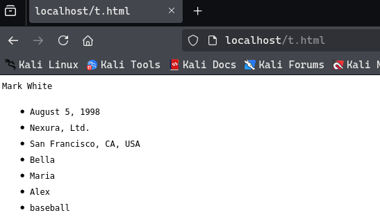

# การสร้าง Wordlist และ Rules แบบกำหนดเอง

## ความท้าทายของรหัสผ่านที่ซับซ้อน

ผู้ใช้มักสร้างรหัสผ่านโดยคำนึงถึงความง่ายมากกว่าความปลอดภัย เพื่อแก้ไขปัญหานี้ ระบบจึงมักบังคับใช้ **Password Policy** ที่กำหนดข้อกำหนดต่างๆ เช่น:

- ความยาวขั้นต่ำ (มักจะ 8 ตัวอักษร)
- ต้องมีตัวพิมพ์ใหญ่
- ต้องมีตัวเลข
- ต้องมีสัญลักษณ์พิเศษ

## รูปแบบการสร้างรหัสผ่านที่ผู้ใช้นิยม

แม้จะมี Password Policy ผู้ใช้ก็ยังมีแนวโน้มสร้างรหัสผ่านแบบที่คาดเดาได้ โดยมักใช้:

- ชื่อบริษัท
- ชื่อสัตว์เลี้ยง
- ชื่อเพื่อนหรือครอบครัว
- กีฬาที่ชอบ
- งานอดิเรก

### รูปแบบที่นิยมเพิ่มเติม

| คำอธิบาย | ตัวอย่าง |
|---------|---------|
| ตัวแรกเป็นตัวพิมพ์ใหญ่ | Password |
| เพิ่มตัวเลข | Password123 |
| เพิ่มปี | Password2022 |
| เพิ่มเดือน | Password02 |
| เพิ่ม ! ท้ายสุด | Password2022! |
| เพิ่มสัญลักษณ์พิเศษ | P@ssw0rd2022! |

## การใช้ Hashcat สร้าง Custom Wordlist

### Hashcat Rule Syntax

| Function | คำอธิบาย |
|----------|---------|
| `:` | ไม่ทำอะไร (ใช้คำเดิม) |
| `l` | แปลงเป็นตัวพิมพ์เล็กทั้งหมด |
| `u` | แปลงเป็นตัวพิมพ์ใหญ่ทั้งหมด |
| `c` | ตัวแรกพิมพ์ใหญ่ ที่เหลือพิมพ์เล็ก |
| `sXY` | แทนที่ X ทั้งหมดด้วย Y |
| `$!` | เพิ่ม ! ท้ายสุด |

### ตัวอย่างการสร้าง Custom Rule

สร้างไฟล์ `custom.rule`:

```
:
c
so0
c so0
sa@
c sa@
c sa@ so0
$!
$! c
$! so0
$! sa@
$! c so0
$! c sa@
$! so0 sa@
$! c so0 sa@
```

### คำสั่งสร้าง Wordlist

```bash
hashcat --force password.list -r custom.rule --stdout | sort -u > mut_password.list
```

### ผลลัพธ์จากคำว่า "password"

```
password
Password
passw0rd
Passw0rd
p@ssword
P@ssword
P@ssw0rd
password!
Password!
passw0rd!
p@ssword!
Passw0rd!
P@ssword!
p@ssw0rd!
P@ssw0rd!
```

## การใช้ CeWL สร้าง Wordlist จากเว็บไซต์

**CeWL (Custom Word List generator)** เป็นเครื่องมือที่สแกนคำจากเว็บไซต์บริษัทเพื่อสร้าง wordlist

### ตัวอย่างคำสั่ง

```bash
cewl https://www.inlanefreight.com -d 4 -m 6 --lowercase -w inlane.wordlist
```

### พารามิเตอร์ที่สำคัญ

- `-d 4` : ความลึกในการ spider (4 ระดับ)
- `-m 6` : ความยาวคำขั้นต่ำ (6 ตัวอักษร)
- `--lowercase` : แปลงเป็นตัวพิมพ์เล็กทั้งหมด
- `-w inlane.wordlist` : บันทึกผลลัพธ์ในไฟล์นี้

### ตรวจสอบผลลัพธ์

```bash
wc -l inlane.wordlist
# ผลลัพธ์: 326
```

## กลยุทธ์การสร้าง Custom Wordlist

1. **รวบรวมข้อมูลจาก OSINT:**
   - ชื่อบริษัท
   - ชื่อสัตว์เลี้ยง
   - ชื่อครอบครัว
   - งานอดิเรก
   - วันเกิด

2. **ศึกษา Password Policy:**
   - ความยาวขั้นต่ำ
   - ข้อกำหนดตัวอักษร
   - ข้อกำหนดสัญลักษณ์

3. **สร้าง Base Wordlist:**
   - ใช้ CeWL สแกนเว็บไซต์
   - เพิ่มข้อมูลส่วนตัวที่รวบรวมได้

4. **ใช้ Rules ที่มีประสิทธิภาพ:**
   - `best64.rule` (ruleset ที่ได้ผลดีที่สุด)
   - Custom rules ตาม pattern ที่คาดการณ์

## หมายเหตุสำคัญ

**การ crack รหัสผ่านส่วนใหญ่เป็นการเดา** แต่เราสามารถทำให้การเดาแม่นยำขึ้นได้โดย:
- มีข้อมูลเกี่ยวกับ password policy
- รู้จักบริษัท ภูมิภาค อุตสาหกรรม
- เข้าใจพฤติกรรมผู้ใช้

ยกเว้นกรณีที่รหัสผ่านรั่วไหลและได้มาโดยตรง ซึ่งก็ไม่ต้องเดาอีกแล้ว

---

## เครื่องมือที่แนะนำ

- **Hashcat** - password cracking และ rule generation
- **John the Ripper (JtR)** - มี pre-built rules มาให้
- **CeWL** - สร้าง wordlist จากเว็บไซต์
- **best64.rule** - ruleset ที่ใช้กันอย่างแพร่หลายและได้ผลดี




```
┌──(kali㉿kali)-[~/test]
└─$ cewl  -m 4 --lowercase --with-numbers  -w t.txt  http://localhost/t.html;cat t.txt
CeWL 6.2.1 (More Fixes) Robin Wood (robin@digi.ninja) (https://digi.ninja/)
mark
white
august
1998
nexura
francisco
bella
maria
alex
baseball

┌──(kali㉿kali)-[~/test]
└─$ hashcat --stdout -a 1 t.txt t.txt > comt.txt

┌──(kali㉿kali)-[~/test]
└─$ hashcat comt.txt -r custom.rule --stdout | sort -u > mut_password.list                              
                                                                                                                       
┌──(kali㉿kali)-[~/test]
└─$ hashcat -a 0 -m 0 97268a8ae45ac7d15c3cea4ce6ea550b mut_password.list                                        
97268a8ae45ac7d15c3cea4ce6ea550b:Baseball1998!   


```


