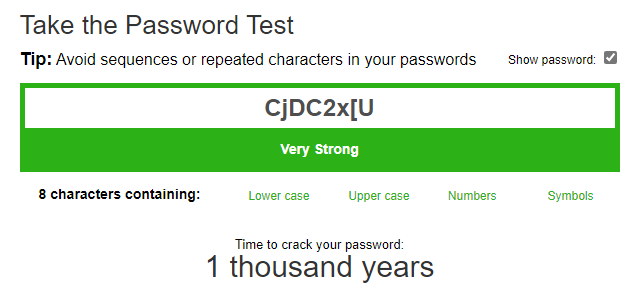

# Password Policies (นโยบายรหัสผ่าน)

## บทนำ
หลังจากที่เราได้ศึกษาวิธีการต่างๆ ในการดักจับ credentials และรหัสผ่านแล้ว ตอนนี้มาดูแนวทางปฏิบัติที่ดีที่สุดสำหรับการปกป้องรหัสผ่านและ identity กัน เปรียบเสมือนกฎจราจรที่มีไว้เพื่อความปลอดภัยในการขับขี่ หากไม่มีนโยบายที่เหมาะสมในองค์กร ผู้ใช้อาจทำอะไรก็ได้โดยไม่คำนึงถึงผลที่ตามมา

## ตัวอย่างกรณีศึกษา
Mark พนักงานใหม่ของ Inlanefreight Corp. ที่ไม่ได้ทำงานด้าน IT พยายามตั้งรหัสผ่านอีเมลเป็น `password123` แต่ได้รับข้อผิดพลาดว่ารหัสผ่านไม่ตรงตามนโยบายของบริษัท ในตัวอย่างนี้มีองค์ประกอบสำคัญ 2 ส่วน:

1. **การกำหนดนโยบาย** (Definition) - กฎเกณฑ์และข้อกำหนดในการสร้างรหัสผ่าน
2. **การบังคับใช้** (Enforcement) - เทคโนโลยีที่ใช้บังคับให้ปฏิบัติตาม

## Password Policy คือ?
Password policy คือชุดของกฎที่ออกแบบมาเพื่อเพิ่มความปลอดภัยให้กับระบบคอมพิวเตอร์ โดยกระตุ้นให้ผู้ใช้สร้างรหัสผ่านที่แข็งแรงและใช้งานอย่างเหมาะสมตามมาตรฐานขององค์กร ขอบเขตของนโยบายครอบคลุมวงจรชีวิตทั้งหมดของรหัสผ่าน ตั้งแต่:
- การสร้าง (Creation)
- การจัดเก็บ (Storage)
- การจัดการ (Management)
- การส่งผ่าน (Transmission)

## มาตรฐานนโยบายรหัสผ่าน
หลายบริษัทปฏิบัติตามมาตรฐาน IT Security ที่ได้รับการยอมรับ ซึ่งมาตรฐานที่พบบ่อยได้แก่:

- **NIST SP800-63B**
- **CIS Password Policy Guide**
- **PCI DSS**

### กรณีศึกษา: Password Expiration
ในอดีตมักได้ยินคำแนะนำว่า "เปลี่ยนรหัสผ่านทุก 90 วันเพื่อความปลอดภัย" แต่ปัจจุบันแนวทางของอุตสาหกรรมเปลี่ยนไป โดยแนะนำให้ปิดการหมดอายุของรหัสผ่าน เพราะมักทำให้ผู้ใช้สร้างรหัสผ่านที่เดาได้ง่ายและมีรูปแบบที่คาดเดาได้

## ตัวอย่างนโยบายรหัสผ่าน
รหัสผ่านทั้งหมดต้อง:

1. มีความยาวอย่างน้อย 8 ตัวอักษร
2. ประกอบด้วยตัวพิมพ์ใหญ่และตัวพิมพ์เล็ก
3. มีตัวเลขอย่างน้อย 1 ตัว
4. มีอักขระพิเศษอย่างน้อย 1 ตัว
5. ต้องไม่ใช่ username
6. ต้องเปลี่ยนทุก 60 วัน

### ปัญหาที่พบ
Mark เลือกรหัสผ่านเป็น `Inlanefreight01!` ซึ่งผ่านตามนโยบาย แต่ยังคงเดาได้ง่ายเพราะมีชื่อบริษัทอยู่ในนั้น และเมื่อรหัสผ่านหมดอายุ Mark สามารถเปลี่ยนเป็น `Inlanefreight02!` ได้ ซึ่งก็ยังผ่านตามนโยบาย

## คำที่ควร Blacklist
นโยบายควรรวมคำที่ห้ามใช้ เช่น:

- ชื่อบริษัท
- คำที่เกี่ยวข้องกับบริษัท
- ชื่อเดือน
- ชื่อฤดูกาล
- คำว่า "welcome" และ "password" พร้อมรูปแบบต่างๆ
- คำที่เดาง่าย เช่น "password", "123456", "abcde"

## การบังคับใช้นโยบาย (Enforcing Password Policy)

### ด้านเทคนิค
ต้องใช้เทคโนโลยีที่มีอยู่หรือจัดหาเครื่องมือที่จำเป็น ระบบจัดการ identity ส่วนใหญ่มีฟีเจอร์รองรับการบังคับใช้นโยบาย

**ตัวอย่าง:** ถ้าใช้ Active Directory สามารถกำหนด Active Directory Password Policy GPO เพื่อให้ผู้ใช้ปฏิบัติตามนโยบาย

### ด้านองค์กร
1. สื่อสารนโยบายให้ทั่วทั้งบริษัท
2. สร้างกระบวนการและขั้นตอนเพื่อรับประกันว่านโยบายถูกนำไปใช้ทุกที่

## การสร้างรหัสผ่านที่แข็งแรง

### เครื่องมือช่วยเหลือ
- **PasswordMonster** - ประเมินความแข็งแรงของรหัสผ่าน
- **1Password Password Generator** - สร้างรหัสผ่านที่ปลอดภัย

### ตัวอย่างรหัสผ่านแบบต่างๆ

#### 1. รหัสผ่านแบบสุ่ม

`CjDC2x[U` - แข็งแรงมาก ใช้เวลาแคร็กหลายพันปี แต่จำยาก

#### 2. รหัสผ่านแบบใช้วลีหรือประโยค
- `This is my secure password`
- `The name of my dog is Popy`
- `()The name of my dog is Popy!` (เพิ่มอักขระพิเศษ)

รหัสผ่านแบบนี้แข็งแรงและจำง่าย แต่ต้องระวังเรื่อง OSINT ที่ attackers อาจใช้ค้นหาข้อมูลเกี่ยวกับเรา

**ตัวอย่าง:** `The name of my dog is Popy` ใช้เวลาแคร็ก 381 trillion ปี

### ข้อจำกัด
เมื่อจำนวนรหัสผ่านเพิ่มขึ้น จะยากต่อการจดจำและจัดการทั้งหมด ในหัวข้อถัดไปจะพูดถึงการใช้ **Password Manager** ที่ช่วยสร้างและจัดเก็บรหัสผ่านจำนวนมากได้อย่างปลอดภัย

---

https://www.passwordmonster.com/

https://1password.com/password-generator/