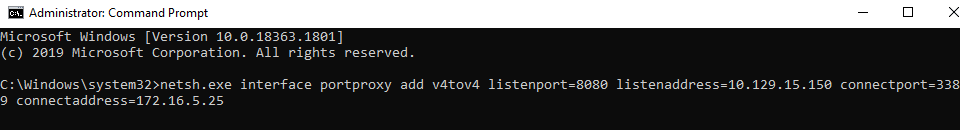

# Port Forwarding with Windows Netsh

## ภาพรวมของ Netsh

**Netsh** (Network Shell) เป็น command-line tool ที่มีมาพร้อมกับ Windows ใช้สำหรับจัดการ network configuration ต่างๆ

**ความสามารถของ Netsh**:
- ค้นหา routes
- ดูการตั้งค่า firewall
- เพิ่ม proxies
- **สร้าง port forwarding rules** (ที่เราจะใช้ในเทคนิคนี้)

---

## สถานการณ์และโครงสร้างเครือข่าย

สมมติว่าเรา compromise เครื่อง Windows 10 ของ IT admin ได้แล้ว (อาจจะผ่าน social engineering หรือ phishing)

**โครงสร้าง**:
- **Attack Host**: 10.10.15.5 (เครื่องของเรา)
- **Windows 10 User** (Pivot): 10.129.15.150 และ 172.16.5.25 (มี 2 network interfaces)
- **Windows Server** (Target): 172.16.5.25 (internal network) เปิด RDP port 3389

**ปัญหา**: เราไม่สามารถเข้าถึง Windows Server (172.16.5.25) ได้โดยตรงจากเครื่อง Attack Host

**วิธีแก้**: ใช้ Windows 10 workstation ที่เรา compromise แล้วเป็น pivot point ด้วย netsh

---

## การทำงานของ Netsh Port Forwarding

### แนวคิดหลัก

Netsh จะสร้าง port forwarding rule ที่ทำให้:
1. Windows 10 workstation เปิด listen port 8080
2. เมื่อมี connection เข้ามาที่ port 8080
3. Windows จะ forward traffic นั้นไปยัง 172.16.5.25:3389 (Windows Server)

---

## ขั้นตอนการตั้งค่า

### 1. สร้าง Port Forward Rule

```cmd
netsh.exe interface portproxy add v4tov4 listenport=8080 listenaddress=10.129.15.150 connectport=3389 connectaddress=172.16.5.25
```



**วิเคราะห์คำสั่งทีละส่วน**:

| Parameter | ค่า | ความหมาย |
|-----------|-----|----------|
| `interface portproxy` | - | ใช้ function portproxy ของ netsh |
| `add v4tov4` | - | เพิ่ม rule แบบ IPv4 to IPv4 |
| `listenport` | 8080 | port ที่จะเปิด listen บน pivot host |
| `listenaddress` | 10.129.15.150 | IP address ที่จะเปิด listen (IP ของ pivot ที่หันหน้าออก internet) |
| `connectport` | 3389 | port ของ service บน target (RDP) |
| `connectaddress` | 172.16.5.25 | IP ของ target ใน internal network |

**สิ่งที่เกิดขึ้น**:
- Windows สร้าง rule ที่บอกว่า "ถ้ามีใครเชื่อมต่อมาที่ 10.129.15.150:8080"
- "ให้ forward connection นั้นไปยัง 172.16.5.25:3389"

---

### 2. ตรวจสอบ Port Forward Rule

```cmd
netsh.exe interface portproxy show v4tov4
```

**Output ที่คาดหวัง**:
```
Listen on ipv4:             Connect to ipv4:

Address         Port        Address         Port
--------------- ----------  --------------- ----------
10.129.15.150   8080        172.16.5.25     3389
```

**การอ่าน**:
- **Listen on**: ที่ใด (IP:Port) ที่ Windows กำลัง listen
- **Connect to**: จะ forward ไปที่ไหน (IP:Port)

---

### 3. เชื่อมต่อจาก Attack Host

```bash
xfreerdp /v:10.129.15.150:8080 /u:victor /p:pass@123
```

**สิ่งที่เกิดขึ้นทีละขั้น**:
1. **Attack Host** ส่ง RDP request ไปที่ 10.129.15.150:8080
2. **Windows 10 Pivot** รับ connection ที่ port 8080
3. **Netsh portproxy** forward traffic ไปยัง 172.16.5.25:3389
4. **Windows Server** รับ RDP connection
5. **Response** กลับมาทางเดิม

---

## การไหลของข้อมูลแบบ Visual

```
Attack Host (10.10.15.5)
        |
        | [1] RDP request to 10.129.15.150:8080
        ↓
Windows 10 Pivot (10.129.15.150)
        |
        | [2] Netsh portproxy รับ connection
        | [3] Forward ไปยัง internal network
        ↓
Windows Server (172.16.5.25:3389)
        |
        | [4] ตอบกลับ RDP
        ↓
Windows 10 Pivot
        |
        | [5] Forward response กลับ
        ↓
Attack Host
```

---

## ข้อดีของการใช้ Netsh

### 1. **Native Windows Tool**
- ไม่ต้อง upload tools เพิ่มเติม
- มีมาพร้อมกับ Windows ทุกเวอร์ชัน
- ไม่ต้องกังวลเรื่อง AV detection

### 2. **Persistent Configuration**
- Port forwarding rules จะอยู่แม้ reboot (ถ้าไม่ได้ลบ)
- ทำงานเป็น Windows service

### 3. **Performance**
- ทำงานที่ kernel level
- มี performance ดีกว่า user-space tools

### 4. **Stealth**
- ดูเป็น legitimate Windows network configuration
- ยากต่อการตรวจจับกว่า SSH tunnels หรือ custom tools

---

## คำสั่ง Netsh ที่เป็นประโยชน์

### ดู Rules ทั้งหมด

```cmd
netsh interface portproxy show all
```

### ลบ Specific Rule

```cmd
netsh interface portproxy delete v4tov4 listenport=8080 listenaddress=10.129.15.150
```

### ลบ Rules ทั้งหมด

```cmd
netsh interface portproxy reset
```

### ตรวจสอบว่า Port กำลัง Listen

```cmd
netstat -ano | findstr :8080
```

**ควรเห็น**:
```
TCP    10.129.15.150:8080     0.0.0.0:0              LISTENING       4
```

---


---

## Use Cases ที่เหมาะสม

### ✅ เหมาะกับ:
- **Windows environments** ที่ไม่สามารถใช้ SSH ได้
- **Long-term access** ที่ต้องการ persistence
- **Scenarios ที่ต้องการ stealth** เพราะใช้ native Windows features
- **Multiple users/tools** ที่ต้องการใช้ pivot พร้อมกัน

### ❌ ไม่เหมาะกับ:
- **Engagement ที่ต้องการลบร่องรอย** เพราะ config อาจค้างอยู่
- **Non-admin access** (ต้องมี admin privileges)
- **Dynamic port forwarding** (netsh ทำแค่ static forwarding)

---

## ข้อควรระวัง (Security Considerations)

### 1. **Firewall Rules**
Netsh จะ forward traffic ได้ แต่ถ้า Windows Firewall block port 8080:
```cmd
netsh advfirewall firewall add rule name="Forward_Port_8080" protocol=TCP dir=in localip=10.129.15.150 localport=8080 action=allow
```

### 2. **Logging**
Windows Event Logs อาจมีร่องรอยของ:
- Netsh command execution
- New firewall rules
- Unusual network connections

### 3. **Cleanup**
อย่าลืมลบ rules หลังเสร็จงาน:
```cmd
netsh interface portproxy delete v4tov4 listenport=8080 listenaddress=10.129.15.150
netsh advfirewall firewall delete rule name="Forward_Port_8080"
```

---


## สรุปหลักการสำคัญ

### แนวคิดหลัก
Netsh portproxy ทำให้ Windows host กลายเป็น **transparent port forwarder** ที่:
- ไม่ต้องการ special software
- ทำงานที่ kernel level (เร็วและมีประสิทธิภาพ)
- มีความ persistent สูง

### เมื่อไหร่ควรใช้
- เมื่อ compromise Windows host ที่มี access ทั้ง external และ internal networks
- เมื่อต้องการ forward specific ports (ไม่ใช่ SOCKS proxy แบบ dynamic)
- เมื่อต้องการให้ pivot ทำงานแม้ session หลุด

### ข้อจำกัด
- ต้องมี **Administrator privileges**
- เป็น **static forwarding** (ต้องรู้ target IP/port ล่วงหน้า)
- **ทิ้งร่องรอยใน configuration** (ต้องจำลบ)

Netsh เป็นเครื่องมือที่ powerful มากสำหรับ pivoting ใน Windows environments โดยเฉพาะเมื่อเราต้องการความ stable และ persistent โดยไม่ต้องพึ่ง third-party tools