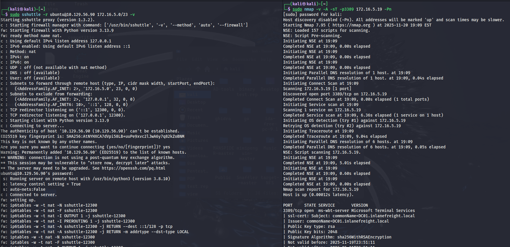

# SSH Pivoting with Sshuttle

## ภาพรวมของ Sshuttle

Sshuttle เป็น tool ที่เขียนด้วย Python ซึ่งช่วยให้เราไม่ต้องตั้งค่า proxychains เลย อย่างไรก็ตาม tool นี้มีข้อจำกัดคือ **ใช้ได้เฉพาะกับ SSH pivoting เท่านั้น** ไม่สามารถ pivot ผ่าน TOR หรือ HTTPS proxy ได้

### จุดเด่นของ Sshuttle

- **ทำงานกับ iptables โดยอัตโนมัติ** - ไม่ต้องตั้งค่าเอง
- **ไม่ต้องใช้ proxychains** - tool ต่างๆ ทำงานได้โดยตรงเหมือนอยู่ใน network เดียวกัน
- **เหมาะกับการทำ network scanning** เช่น Nmap
- **โปร่งใสต่อผู้ใช้งาน** - ใช้ tool ธรรมดาได้เลย ไม่ต้องเพิ่ม prefix อะไร

---

## การติดตั้ง Sshuttle

```bash
sudo apt-get install sshuttle
```

**Output ตัวอย่าง**:
```
The following NEW packages will be installed:
  sshuttle
0 upgraded, 1 newly installed, 0 to remove and 4 not upgraded.
Need to get 91.8 kB of archives.
After this operation, 508 kB of additional disk space will be used.
```

---

## การใช้งาน Sshuttle

### คำสั่งพื้นฐาน

```bash
sudo sshuttle -r ubuntu@10.129.202.64 172.16.5.0/23 -v
```

**อธิบายพารามิเตอร์**:
- `sudo`: ต้องใช้ root privileges เพราะต้องแก้ไข iptables
- `-r ubuntu@10.129.202.64`: remote host ที่จะใช้เป็น pivot (username@ip)
- `172.16.5.0/23`: network ที่ต้องการ route ผ่าน pivot host
- `-v`: verbose mode (แสดงรายละเอียดการทำงาน)

---

## สิ่งที่เกิดขึ้นเบื้องหลัง

### ขั้นตอนการทำงานของ Sshuttle

```
Starting sshuttle proxy (version 1.1.0).
c : Starting firewall manager with command: ['/usr/bin/python3', '/usr/local/lib/python3.9/dist-packages/sshuttle/__main__.py', '-v', '--method', 'auto', '--firewall']
fw: Starting firewall with Python version 3.9.2
fw: ready method name nat.
c : Method: nat
c : IPv4: on
c : IPv6: on
c : UDP : off (not available with nat method)
c : DNS : off (available)
```

**อธิบาย log**:
1. เริ่มต้น sshuttle proxy
2. เปิด firewall manager
3. ใช้ method **nat** (Network Address Translation)
4. เปิดใช้งาน IPv4 และ IPv6
5. UDP ปิดใช้งาน (nat method ไม่รองรับ)

### Network ที่จะ Forward

```
c : Subnets to forward through remote host (type, IP, cidr mask width, startPort, endPort):
c :   (<AddressFamily.AF_INET: 2>, '172.16.5.0', 32, 0, 0)
c : Subnets to exclude from forwarding:
c :   (<AddressFamily.AF_INET: 2>, '127.0.0.1', 32, 0, 0)
c :   (<AddressFamily.AF_INET6: 10>, '::1', 128, 0, 0)
```

**อธิบาย**:
- **Forward**: traffic ไปยัง 172.16.5.0/23 จะถูกส่งผ่าน pivot
- **Exclude**: traffic ไป localhost (127.0.0.1, ::1) จะไม่ถูก forward

### การเชื่อมต่อ

```
c : TCP redirector listening on ('127.0.0.1', 12300).
c : Starting client with Python version 3.9.2
c : Connecting to server...
ubuntu@10.129.202.64's password: 
 s: Running server on remote host with /usr/bin/python3 (version 3.8.10)
c : Connected to server.
```

**สิ่งที่เกิดขึ้น**:
1. เปิด TCP redirector บน localhost port 12300
2. เชื่อมต่อ SSH ไปยัง pivot host (ต้องใส่รหัสผ่าน)
3. รัน Python script บน remote host
4. เชื่อมต่อสำเร็จ

---

## การตั้งค่า iptables อัตโนมัติ

Sshuttle จะสร้าง iptables rules เพื่อ redirect traffic

```
fw: setting up.
fw: iptables -w -t nat -N sshuttle-12300
fw: iptables -w -t nat -F sshuttle-12300
fw: iptables -w -t nat -I OUTPUT 1 -j sshuttle-12300
fw: iptables -w -t nat -I PREROUTING 1 -j sshuttle-12300
fw: iptables -w -t nat -A sshuttle-12300 -j RETURN -m addrtype --dst-type LOCAL
fw: iptables -w -t nat -A sshuttle-12300 -j RETURN --dest 127.0.0.1/32 -p tcp
fw: iptables -w -t nat -A sshuttle-12300 -j REDIRECT --dest 172.16.5.0/32 -p tcp --to-ports 12300
```

### วิเคราะห์ iptables rules

1. **สร้าง chain ใหม่**: `sshuttle-12300`
2. **ล้าง rules เดิม**: ใน chain นี้
3. **เพิ่ม jump rules**: 
   - ใน OUTPUT chain (traffic ที่ออกจากเครื่องเรา)
   - ใน PREROUTING chain (traffic ที่เข้ามา)
4. **RETURN rules**: ให้ traffic ที่ไปยัง localhost ผ่านไปตามปกติ
5. **REDIRECT rule**: **นี่คือหัวใจสำคัญ**
   - Traffic ที่มุ่งหน้าไป 172.16.5.0/32 
   - จะถูก redirect ไปที่ port 12300 (ที่ sshuttle กำลัง listen อยู่)

---

## การใช้งานจริง: Nmap Scanning

### ก่อนใช้ Sshuttle (ต้องใช้ proxychains)

```bash
proxychains nmap -sT 172.16.5.19 -p3389
```

### หลังใช้ Sshuttle (ไม่ต้อง proxychains)

```bash
sudo nmap -v -A -sT -p3389 172.16.5.19 -Pn
```

**ผลลัพธ์**:
```
Starting Nmap 7.94SVN ( https://nmap.org ) at 2025-10-08 10:42 CDT
Nmap scan report for 172.16.5.19
Host is up (0.000051s latency).

PORT     STATE SERVICE       VERSION
3389/tcp open  ms-wbt-server Microsoft Terminal Services
|_ssl-date: 2025-10-08T16:42:47+00:00; +1h00m05s from scanner time.
| ssl-cert: Subject: commonName=DC01.inlanefreight.local
| Not valid before: 2025-10-07T16:30:30
|_Not valid after:  2026-04-08T16:30:30
| rdp-ntlm-info: 
|   Target_Name: INLANEFREIGHT
|   NetBIOS_Domain_Name: INLANEFREIGHT
|   NetBIOS_Computer_Name: DC01
|   DNS_Domain_Name: inlanefreight.local
|   DNS_Computer_Name: DC01.inlanefreight.local
|   Product_Version: 10.0.17763
|_  System_Time: 2025-10-08T16:42:43+00:00
```

**สังเกต**:
- Scan ได้โดยตรงโดยไม่ต้องใช้ proxychains
- ความเร็วดีมาก (latency 0.000051s)
- ได้ข้อมูลครบถ้วน (SSL cert, RDP info, OS detection)

---

## การทำงานของ Sshuttle (Flow Diagram)

```
Application (Nmap)
    |
    | [1] ส่ง packet ไปยัง 172.16.5.19:3389
    ↓
Kernel Network Stack
    |
    | [2] ตรวจสอบ iptables rules
    ↓
iptables NAT table
    |
    | [3] match rule: destination 172.16.5.0/23
    | [4] REDIRECT ไปยัง localhost:12300
    ↓
Sshuttle Client (localhost:12300)
    |
    | [5] รับ packet แล้ว encapsulate
    | [6] ส่งผ่าน SSH tunnel
    ↓
SSH Connection
    |
    | [7] encrypted tunnel ไปยัง pivot host
    ↓
Sshuttle Server (บน Ubuntu pivot)
    |
    | [8] decrypt และ extract packet
    | [9] ส่งไปยัง destination จริง (172.16.5.19:3389)
    ↓
Target Host (172.16.5.19)
    |
    | [10] รับ packet และตอบกลับ
    ↓
[ทางกลับ: ผ่านเส้นทางเดียวกัน แต่ย้อนกลับ]
    ↓
Application (Nmap) ได้รับ response
```

---

## ข้อดีและข้อเสียของ Sshuttle

### ข้อดี ✅

1. **ไม่ต้องใช้ proxychains**
   - ไม่ต้องเพิ่ม `proxychains` ข้างหน้าทุกคำสั่ง
   - Tool ทำงานได้โดยตรง

2. **ตั้งค่า iptables อัตโนมัติ**
   - ไม่ต้องเขียน iptables rules เอง
   - ลบ rules อัตโนมัติเมื่อปิดโปรแกรม

3. **โปร่งใสต่อ applications**
   - Apps ไม่รู้เลยว่ากำลัง route ผ่าน pivot
   - ทำงานเหมือนอยู่ใน network เดียวกัน

4. **Performance ดี**
   - ไม่มี overhead จาก SOCKS proxy
   - Latency ต่ำ

5. **ใช้งานง่าย**
   - คำสั่งเดียวก็เริ่มใช้งานได้
   - ไม่ต้องตั้งค่าอะไรซับซ้อน

### ข้อเสีย ❌

1. **ใช้ได้เฉพาะ SSH**
   - ไม่รองรับ pivoting ผ่าน TOR, HTTPS proxy
   - ต้องมี SSH access บน pivot host

2. **ต้องใช้ root privileges**
   - เพราะต้องแก้ไข iptables
   - อาจเป็นปัญหาในบาง environment

3. **ไม่รองรับ UDP**
   - ใช้ nat method ซึ่งไม่รองรับ UDP
   - เหมาะกับ TCP เท่านั้น

4. **ต้องมี Python บน pivot host**
   - Server-side ต้องรัน Python script
   - บาง target อาจไม่มี Python

5. **Single point of failure**
   - ถ้า SSH connection หลุด traffic ทั้งหมดจะหยุด
   - ต้อง restart sshuttle

---


## Use Cases ที่เหมาะกับ Sshuttle

### ✅ เหมาะสำหรับ:

1. **Network Reconnaissance**
   - Nmap scanning ทั้ง network
   - Host discovery
   - Port scanning หลาย hosts

2. **Multiple Tools Usage**
   - ต้องใช้หลาย tools พร้อมกัน
   - ไม่อยากพิมพ์ proxychains ซ้ำๆ

3. **Quick Pivoting**
   - ต้องการ pivot แบบเร็วๆ
   - มี SSH access อยู่แล้ว

4. **Transparent Access**
   - ต้องการให้ apps ทำงานเหมือนอยู่ใน network เดียวกัน
   - ใช้ GUI tools ที่ไม่รองรับ SOCKS

### ❌ ไม่เหมาะสำหรับ:

1. **Non-SSH Scenarios**
   - ไม่มี SSH access
   - ต้อง pivot ผ่าน HTTP/HTTPS

2. **UDP Traffic**
   - DNS queries ที่ต้องการ UDP
   - VoIP, gaming protocols

3. **Multiple Pivot Hops**
   - ต้อง pivot หลายชั้น (chain pivoting)
   - Sshuttle ทำได้แต่ซับซ้อน

4. **No Root Access**
   - ไม่มีสิทธิ์ sudo
   - ไม่สามารถแก้ไข iptables

---

## เทคนิคการใช้งานขั้นสูง

### 1. Exclude Specific IPs

```bash
sudo sshuttle -r ubuntu@pivot -x 172.16.5.10 172.16.5.0/23
```
**อธิบาย**: Route ทั้ง network ยกเว้น 172.16.5.10

### 2. Auto-Detect Networks

```bash
sudo sshuttle -r ubuntu@pivot -N
```
**อธิบาย**: ให้ sshuttle หา networks บน pivot host เอง

### 3. DNS Forwarding

```bash
sudo sshuttle -r ubuntu@pivot --dns 172.16.5.0/23
```
**อธิบาย**: Forward DNS queries ผ่าน pivot ด้วย

### 4. Use Key Authentication

```bash
sudo sshuttle -r ubuntu@pivot -e "ssh -i /path/to/key" 172.16.5.0/23
```
**อธิบาย**: ใช้ SSH key แทนรหัสผ่าน

---

## Troubleshooting

### ปัญหา: sshuttle ไม่ทำงาน

**ตรวจสอบ**:
```bash
# ดู iptables rules
sudo iptables -t nat -L sshuttle-* -v

# ตรวจสอบ SSH connection
ssh -v ubuntu@pivot

# ดู log ละเอียด
sudo sshuttle -r ubuntu@pivot 172.16.5.0/23 -vvv
```

### ปัญหา: Permission denied

**แก้ไข**: ต้องใช้ `sudo` เพราะต้องแก้ไข iptables

### ปัญหา: Connection refused

**สาเหตุ**: Pivot host อาจไม่มี Python หรือ route ไปยัง target ไม่ได้

**ตรวจสอบบน pivot**:
```bash
python3 --version
ip route
```

---

## สรุป

Sshuttle เป็น tool ที่ยอดเยี่ยมสำหรับ **transparent SSH pivoting** โดยเฉพาะเมื่อ:

1. ต้องการใช้หลาย tools โดยไม่ต้อง proxychains
2. มี SSH access บน pivot host
3. ต้องการ setup ที่ง่ายและรวดเร็ว
4. ทำงานกับ TCP traffic (ไม่ใช่ UDP)

**หลักการสำคัญ**: Sshuttle ทำให้การ pivoting เป็นเรื่องโปร่งใส (transparent) โดยใช้ iptables redirect traffic ไปยัง SSH tunnel อัตโนมัติ ทำให้เราสามารถใช้ tool ใดก็ได้โดยตรง เหมือนกับว่าเราอยู่ใน internal network นั้นจริงๆ

เมื่อเทียบกับเทคนิคอื่น Sshuttle ชนะด้านความสะดวก แต่มีข้อจำกัดที่ต้องใช้ SSH เท่านั้น ดังนั้นควรเลือกใช้ตาม use case ที่เหมาะสม


