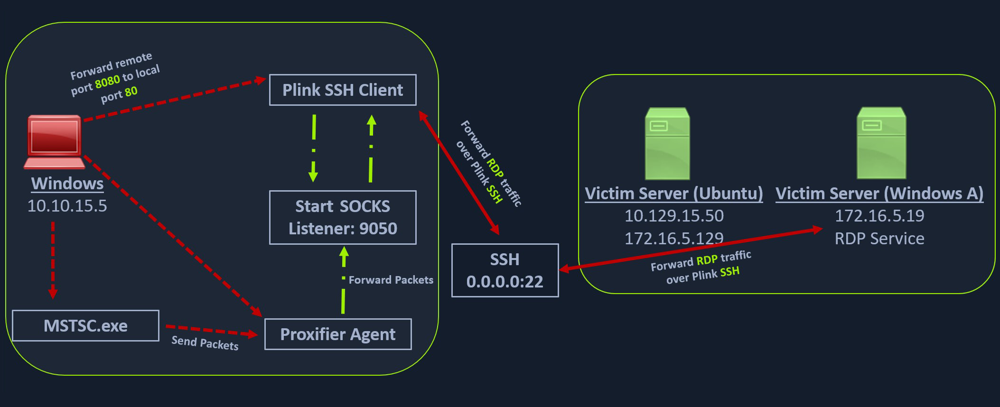
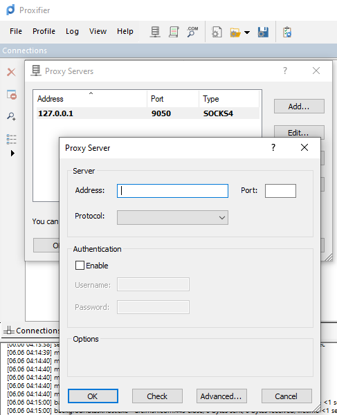

# SSH for Windows: plink.exe

## ภาพรวมของ Plink

**Plink (PuTTY Link)** คือ command-line SSH tool สำหรับ Windows ที่มาพร้อมกับ PuTTY package เป็นเครื่องมือที่มี function คล้ายกับ SSH client บน Linux โดยสามารถสร้าง dynamic port forwards และ SOCKS proxies ได้เช่นกัน

---

## ประวัติและบริบทการใช้งาน

### ความสำคัญของ Plink

**ก่อนปลายปี 2018**: Windows ไม่มี native SSH client มาให้ ทำให้ sysadmin ต้องติดตั้ง tool เอง และ **PuTTY เป็นตัวเลือกที่นิยมที่สุด**

**ปัจจุบัน**: แม้ Windows จะมี SSH client แล้ว แต่ในระบบเก่าๆ หรือระบบที่ปรับแต่งมานาน PuTTY/Plink อาจจะยังติดตั้งอยู่

---

## สถานการณ์จริงในการทำ Penetration Testing

### สถานการณ์ตัวอย่าง

ลองจินตนาการว่าเราทำ pentest และ compromise Windows machine ได้แล้ว:

1. **ทำ enumeration** และพบว่าเครื่องนี้มี security ค่อนข้างเข้มงวด
2. **ต้องการใช้เป็น pivot point** แต่ถ้าพยายาม upload tools ของเราเอง มีโอกาสโดน detect สูง
3. **วิธีแก้**: "Live off the land" - ใช้เครื่องมือที่มีอยู่แล้วในระบบ

### ข้อดีของการใช้ Plink

✅ **มีอยู่แล้วในระบบ** - ไม่ต้อง upload tools ใหม่  
✅ **เป็น legitimate tool** - ลดโอกาสโดน detect  
✅ **มีฟังก์ชันครบ** - สร้าง SSH tunnels และ SOCKS proxy ได้  
✅ **เหมาะกับ Windows attack host** - ถ้าเราใช้ Windows เป็นเครื่อง attack หลัก

---

## การทำงานของ Plink

### โครงสร้างเครือข่าย

```
Windows Attack Host (10.10.15.5)
    ↓ [SSH + Dynamic Port Forward]
Ubuntu Server (10.129.15.50) - Pivot Host
    ↓ [Access Internal Network]
Windows Target A (172.16.5.19) - RDP Service
```

---



## การใช้งาน Plink แบบละเอียด

### คำสั่งพื้นฐาน

```cmd
plink -ssh -D 9050 ubuntu@10.129.15.50
```

### วิเคราะห์คำสั่งทีละส่วน

| Parameter | ความหมาย | วัตถุประสงค์ |
|-----------|----------|--------------|
| `plink` | เรียกใช้ Plink executable | เริ่มต้น SSH client |
| `-ssh` | ระบุโปรโตคอล SSH | บอกให้ใช้ SSH แทน Telnet หรือ rlogin |
| `-D 9050` | Dynamic port forwarding บน port 9050 | สร้าง SOCKS proxy listener |
| `ubuntu@10.129.15.50` | username และ target host | เชื่อมต่อไปยัง Ubuntu server |

### สิ่งที่เกิดขึ้นหลังรันคำสั่ง

1. **สร้าง SSH session** ระหว่าง Windows attack host กับ Ubuntu server
2. **เปิด listener** บน Windows attack host ที่ port 9050
3. **รอรับ SOCKS connections** ที่ port 9050
4. **Forward ทุก traffic** ที่เข้ามาผ่าน SSH tunnel ไปยัง Ubuntu server
5. **Ubuntu server ทำหน้าที่ pivot** ส่งต่อ traffic ไปยัง internal network

---

## การใช้ Proxifier กับ Plink

### Proxifier คืออะไร?

**Proxifier** เป็น Windows application ที่:
- สร้าง tunneled network สำหรับ desktop applications
- ทำให้โปรแกรมต่างๆ สามารถทำงานผ่าน SOCKS หรือ HTTPS proxy
- รองรับ **proxy chaining** (ใช้หลาย proxy ต่อกัน)

### ทำไมต้องใช้ Proxifier?

โปรแกรมส่วนใหญ่บน Windows (เช่น Remote Desktop, browsers, etc.) **ไม่รองรับการใช้ SOCKS proxy โดยตรง** ดังนั้นเราต้องใช้ Proxifier เป็น "ตัวกลาง" ที่ทำให้โปรแกรมเหล่านี้สามารถส่ง traffic ผ่าน SOCKS proxy ได้

---

## ขั้นตอนการตั้งค่า Proxifier

https://www.proxifier.com/

### 1. เปิด Proxifier Configuration

ไปที่ **Profile → Proxy Servers**

### 2. เพิ่ม Proxy Server

กรอกข้อมูลดังนี้:

| Field | Value | คำอธิบาย |
|-------|-------|----------|
| **Address** | `127.0.0.1` | localhost (เครื่องตัวเอง) |
| **Port** | `9050` | port ที่ Plink เปิด listen ไว้ |
| **Protocol** | `SOCKS Version 4` | ใช้ SOCKS4 protocol |
| **Authentication** | ไม่ต้องใส่ | Plink ไม่ต้อง auth แยก |

### 3. บันทึกการตั้งค่า

กด **OK** หรือ **Apply** เพื่อ activate configuration



---

## การใช้งาน RDP ผ่าน Proxifier

### รัน Remote Desktop Connection

หลังจากตั้งค่า Proxifier เรียบร้อยแล้ว เราสามารถใช้ `mstsc.exe` (Remote Desktop) ได้ตามปกติ:

```cmd
mstsc.exe
```

**สิ่งที่เกิดขึ้นเบื้องหลัง**:

1. เราเปิด RDP client (`mstsc.exe`)
2. พิมพ์ IP ของ Windows target (172.16.5.19)
3. **Proxifier จับ traffic** ของ mstsc.exe
4. **ส่งผ่าน SOCKS proxy** (localhost:9050)
5. **Plink forward** traffic ผ่าน SSH tunnel ไปยัง Ubuntu
6. **Ubuntu forward** ไปยัง Windows target (172.16.5.19:3389)
7. **ได้ RDP connection** กับ internal Windows server

---

## แผนภาพการไหลของข้อมูล

```
[Windows Attack Host: 10.10.15.5]
        |
        | 1. mstsc.exe → RDP request to 172.16.5.19:3389
        ↓
[Proxifier: Intercept]
        |
        | 2. Forward to SOCKS proxy
        ↓
[Plink SOCKS Proxy: localhost:9050]
        |
        | 3. Encapsulate in SSH tunnel
        ↓
[SSH Tunnel]
        |
        | 4. Send to Ubuntu Server
        ↓
[Ubuntu Server: 10.129.15.50]
        |
        | 5. Forward to internal network
        ↓
[Windows Target: 172.16.5.19:3389]
        |
        | 6. RDP Service responds
        ↓
[Connection Established!]
```

---


## Use Cases ที่เหมาะสมกับ Plink

### 1. Red Team Operations
- ต้องการ blend in กับ legitimate traffic
- ไม่อยากให้ Blue Team สงสัยว่ามีการ upload tools แปลกๆ
- PuTTY/Plink เป็น admin tools ที่ใช้กันทั่วไป

### 2. Restricted Environments
- ไม่สามารถ upload executable ใหม่ได้
- มี application whitelisting
- แต่ Plink อยู่ในระบบอยู่แล้ว

### 3. Windows-Centric Networks
- เป็น Windows environment ทั้งหมด
- IT team คุ้นเคยกับ PuTTY/Plink
- มีโอกาสพบเครื่องมือนี้สูง

### 4. File Share Discovery
- พบ Plink.exe บน network file share
- สามารถรัน remote โดยไม่ต้อง copy ลงเครื่อง
- ลดร่องรอยการโจมตี

---

## ข้อควรระวังและ Best Practices

### Security Considerations

⚠️ **Authentication**
- ต้องมี credentials สำหรับ SSH (username/password หรือ SSH key)
- อาจต้องใช้ `-pw` parameter สำหรับ password

⚠️ **Logging**
- SSH connections ถูก log บน Ubuntu server
- อาจมี SIEM ที่ monitor SSH sessions
- ควร clean up logs หลังใช้งาน (ถ้าเป็น actual pentest)

⚠️ **Network Detection**
- SSH traffic อาจถูก monitor
- ควรใช้ร่วมกับ legitimate traffic timing
- พิจารณาใช้ port ที่ไม่โดดเด่น

### Technical Tips

💡 **Background Execution**
```cmd
start /B plink -ssh -D 9050 ubuntu@10.129.15.50
```
รัน Plink ใน background เพื่อไม่ให้ window แสดง

💡 **SSH Key Authentication**
```cmd
plink -ssh -D 9050 -i private_key.ppk ubuntu@10.129.15.50
```
ใช้ SSH key แทน password (ปลอดภัยกว่า)

💡 **Specify Port**
```cmd
plink -ssh -P 22 -D 9050 ubuntu@10.129.15.50
```
ระบุ SSH port ถ้าไม่ใช่ default (22)

---

## Alternative: Modern Windows SSH Client

### Windows 10/11 Built-in SSH

Windows versions หลังปี 2018 มี OpenSSH client built-in แล้ว:

```powershell
ssh -D 9050 ubuntu@10.129.15.50
```

**ข้อดี**: Native, ไม่ต้องติดตั้งเพิ่ม  
**ข้อเสีย**: ในระบบเก่าอาจไม่มี

---

## Troubleshooting

### ปัญหาที่พบบ่อย

**1. Plink ไม่ connect ได้**
```
Check: firewall, network connectivity, SSH service status
Solution: ตรวจสอบว่า Ubuntu SSH service ทำงานอยู่
```

**2. Proxifier ไม่ forward traffic**
```
Check: Proxy configuration, application rules
Solution: ตรวจสอบว่า SOCKS proxy address/port ถูกต้อง
```

**3. RDP ช้าหรือ disconnect**
```
Check: network latency, SSH tunnel stability
Solution: ลอง reconnect SSH session ใหม่
```

---

## สรุปหลักการสำคัญ

1. **Plink = SSH client สำหรับ Windows** ที่สามารถสร้าง SOCKS proxy ได้

2. **Living off the Land** - ใช้ tools ที่มีอยู่แล้วในระบบเพื่อหลีกเลี่ยงการ detect

3. **Proxifier เป็นตัวเชื่อม** ที่ทำให้ Windows applications ใช้ SOCKS proxy ได้

4. **เหมาะกับ Windows-based attacks** โดยเฉพาะเมื่อไม่สามารถ upload tools ใหม่ได้

5. **Dynamic Port Forwarding (-D)** ทำงานเหมือน SOCKS proxy ที่ยืดหยุ่น

---

📌 **Real World Application**:
- เทคนิคนี้ใช้ได้จริงใน actual penetration tests
- เป็นทักษะสำคัญสำหรับ Red Team operations
- ควรฝึกทั้งบน Linux (SSH) และ Windows (Plink) เพื่อความยืดหยุ่น