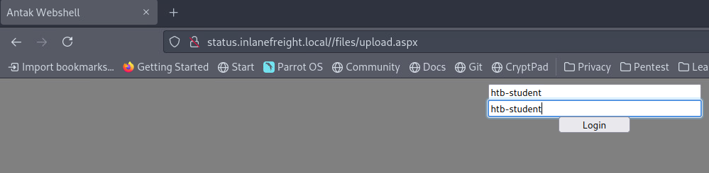
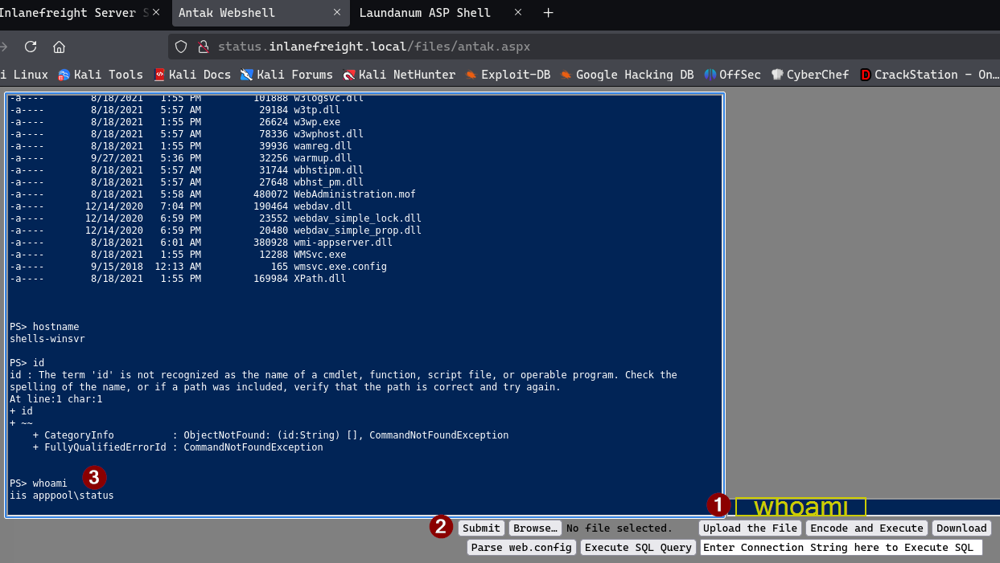

# บทนำสู่ Web Shells

## ทำไม Web Servers จึงสำคัญ?

ในยุคปัจจุบัน **บริการซอฟต์แวร์ส่วนใหญ่ของโลกกำลังเปลี่ยนไปสู่แพลตฟอร์มบนเว็บ** ที่สามารถเข้าถึงได้ทั่วโลกผ่าน Web Browser และ HTTP/S 

### ตัวอย่างการใช้งานในชีวิตจริง:

- **เว็บไซต์ที่เราใช้งานอยู่:** เข้าถึงได้ผ่าน Browser จากทุกที่ทั่วโลก
- **Entertainment สมัยใหม่:** 
  - วิดีโอเกม
  - สตริมมิงเพลง
  - สตริมมิงวิดีโอ
- **ทั้งหมดเข้าถึงได้ผ่าน Browser และ Apps**

**สิ่งนี้หมายความว่า:** เราจะพบว่าตัวเองกำลัง Target Web Applications มากขึ้นเรื่อยๆ

## ภูมิทัศน์ของ External Penetration Testing

### สภาพการณ์ปัจจุบัน:

**เครือข่าย Perimeter ที่แข็งแกร่ง:**
- ลูกค้าส่วนใหญ่มีการป้องกันเครือข่าย Perimeter อย่างดี
- ไม่เปิดเผย Vulnerable Services เช่น SMB หรือบริการอื่นๆ ที่เคยพบบ่อย
- บริการเหล่านี้มักพบใน **Internal Penetration Test** แทน

### วิธีการ "Get In" (สร้าง Foothold) ที่พบบ่อยใน External Pentesting:

**1. Web Application Attacks:**
- File Upload Attacks
- SQL Injection
- RFI/LFI (Remote/Local File Inclusion)
- Command Injection
- และอื่นๆ

**2. Password Spraying:**
- RDS (Remote Desktop Services)
- VPN Portals
- Citrix
- OWA (Outlook Web Access)
- Applications อื่นที่ใช้ Active Directory Authentication

**3. Social Engineering:**
- การหลอกลวงผู้ใช้เพื่อเข้าถึงระบบ

## พื้นที่โจมตีขนาดใหญ่ของ Web Applications

### สิ่งที่มักพบใน External Network Assessment:

**Web Applications คือสิ่งที่เราเห็นมากที่สุด** และมักมี **Attack Surface ขนาดใหญ่มาก**

### ตัวอย่างช่องโหว่ที่พบบ่อย:

**1. File Upload Forms ที่เปิดเผยต่อสาธารณะ:**
- อัปโหลด Web Shell ได้โดยตรง (PHP, JSP, ASP.NET)

**2. Authenticated Functionality:**
- ฟังก์ชันที่ต้อง Login ก่อนใช้งาน

**3. Self-Registration with Upload:**
- **กรณีโปรดประจำใจ:** ระบบลงทะเบียนด้วยตัวเอง
- อัปโหลด Web Shell ผ่านการอัปโหลดรูป Profile
- (หลังจาก Bypass การตรวจสอบฝั่ง Client)

**4. Application Servers:**
- **Tomcat, Axis2, WebLogic:**
  - อนุญาตให้ Deploy JSP Code ผ่าน WAR File
  - เป็นส่วนหนึ่งของฟังก์ชันการทำงานปกติ

**5. Misconfigured Services:**
- **FTP Service ที่ตั้งค่าผิด:**
  - อนุญาตให้อัปโหลดไฟล์ตรงไปยัง Webroot ของเซิร์ฟเวอร์

**และมีวิธีอื่นๆ อีกมากมาย** ที่อยู่นอกขอบเขตของโมดูลนี้

### คำถามสำคัญ:
**"เมื่อพบช่องโหว่ Unrestricted Upload หรือการตั้งค่าที่ผิดพลาด ขั้นตอนถัดไปคืออะไร?"**

## Web Shell คืออะไร?

**Web Shell** คือ **Shell Session ที่ใช้งานผ่าน Browser** ที่เราสามารถใช้โต้ตอบกับระบบปฏิบัติการพื้นฐานของ Web Server

### ขั้นตอนการได้ Web Shell:

**1. หาช่องโหว่:**
- ต้องหา Vulnerability ในเว็บไซต์หรือ Web Application ก่อน
- ช่องโหว่นั้นต้องให้ความสามารถในการอัปโหลดไฟล์

**2. อัปโหลด Payload:**
- อัปโหลด Payload ที่เขียนด้วย Web Language
- ภาษาต้องรองรับโดย Target Server

**3. Remote Code Execution:**
- Payload ที่อัปโหลดให้ความสามารถในการ Execute Code จากระยะไกล
- สามารถ Execute Command ผ่าน Browser

## ข้อจำกัดและข้อควรระวัง

### ความไม่เสถียรของ Web Shell:

**ปัญหา:**
- การพึ่งพา Web Shell อย่างเดียวอาจ **ไม่เสถียร** และ **ไม่น่าเชื่อถือ**
- Web Applications บางตัวตั้งค่าให้ **ลบไฟล์ที่อัปโหลดหลังจากช่วงเวลาหนึ่ง**

**วิธีแก้ไข:**

**1. ใช้เป็นจุดเริ่มต้น:**
- Web Shell เป็นวิธีเริ่มต้นในการได้ Remote Code Execution

**2. Upgrade Shell:**
- ใช้ Web Shell เพื่อ **Upgrade ไปเป็น Interactive Reverse Shell**
- Reverse Shell มีความเสถียรและมี Feature มากกว่า

**3. Persistence:**
- สร้างวิธีการเข้าถึงระบบแบบถาวร
- ไม่ต้องพึ่งพา Web Shell เพียงอย่างเดียว

# Antak Webshell - PowerShell Web Shell สำหรับ Windows

## เคล็ดลับการเรียนรู้ก่อนเริ่ม

### IPPSEC.rocks - เครื่องมือเรียนรู้ที่ทรงพลัง

**ทำไมต้องใช้หลายวิธีในการเรียนรู้?**
- การอ่านอย่างเดียวอาจไม่เพียงพอในการเข้าใจแนวคิดบางอย่าง
- ควรเสริมด้วย:
  - 📖 **Reading** - อ่านเนื้อหา
  - 🎥 **Watching** - ดู Demonstration
  - 🖐️ **Hands-on** - ลงมือทำจริง

### วิธีใช้ IPPSEC.rocks:

**1. เข้าเว็บไซต์:** [ippsec.rocks](https://ippsec.rocks)

**2. ค้นหาแนวคิดที่ต้องการเรียน:**
- พิมพ์คำค้นหา เช่น "aspx"
- ระบบจะ Crawl คำอธิบายของวิดีโอทั้งหมดบน YouTube

**3. ผลลัพธ์ที่ได้:**
- แสดงรายการวิดีโอที่เกี่ยวข้อง
- **พร้อม Timestamp** ที่กล่าวถึงคำที่ค้นหา
- ตัวอย่าง: "Cereal," "RE," "Bounty," "Silo," "Minion," "Granny and Grandpa"

**4. การใช้งาน:**
- คลิกลิงก์ → ไปที่ส่วนของวิดีโอที่สอนเรื่องนั้นๆ
- เหมือน **Search Engine สำหรับเรียน Hacking!**

### ตัวอย่างแนะนำ:

**IPPSEC - Cereal Box:**
- ⏰ **เวลาที่แนะนำ:** 1:17:00 - 1:20:00 (3 นาที)
- 📚 **เนื้อหา:** การทำความเข้าใจ ASPX Web Shell พื้นฐาน
- 🎯 **สิ่งที่จะเห็น:**
  - Upload ไฟล์ผ่าน HTTP
  - Navigate ไปยังไฟล์ผ่าน Browser
  - ส่งคำสั่งและรับผลลัพธ์จาก Windows OS

**ข้อดีของวิดีโอ:**
- 🍔 ดูระหว่างกินข้าว
- 🛋️ ดูบนโซฟา
- 🛏️ ดูก่อนนอน
- เรียนรู้แบบสบายๆ!

## ASPX คืออะไร? มันทำงานอย่างไร?

### ASPX ย่อมาจาก:

**Active Server Page Extended**

### คุณสมบัติ:

**1. File Type/Extension:**
- เขียนสำหรับ **Microsoft ASP.NET Framework**
- ทำงานบน Web Server ที่รัน ASP.NET

**2. การทำงาน:**
- สร้าง **Web Form Pages** สำหรับให้ผู้ใช้ใส่ข้อมูล
- **Server-Side Processing:**
  - รับข้อมูลจากผู้ใช้
  - แปลงเป็น **HTML** ฝั่งเซิร์ฟเวอร์
  - ส่งกลับไปยัง Client

**3. การใช้ประโยชน์ (Exploitation):**
- ใช้ **ASPX-based Web Shell** เพื่อควบคุม Windows OS
- เข้าถึง Underlying Operating System ได้โดยตรง

## Antak Webshell - PowerShell Web Shell

### Antak คืออะไร?

**Web Shell ที่สร้างด้วย ASP.Net**
- เป็นส่วนหนึ่งของ **Nishang Project**
- อยู่ใน Category: Offensive PowerShell Toolset

### Nishang Project:

**คืออะไร:**
- **Offensive PowerShell Toolset ที่ครอบคลุม**
- มีเครื่องมือสำหรับทุกส่วนของ Pentest

**Antak เหมาะสำหรับ:**
- 🎯 **Web Applications** (โฟกัสของเราตอนนี้)
- 🪟 **Windows Servers** (ใช้ PowerShell ในการโต้ตอบ)

### จุดเด่นของ Antak:

**1. ใช้ PowerShell:**
- โต้ตอบกับ Host ผ่าน PowerShell
- เหมาะสำหรับได้ Web Shell บน Windows Server

**2. UI Theme:**
- ออกแบบให้เหมือน **PowerShell Console**
- คุ้นเคยและใช้งานง่าย

**3. ความสามารถ:**
- Execute Commands แต่ละคำสั่งเป็น **New Process**
- Execute Scripts ใน **Memory**
- **Encode Commands** ก่อนส่ง
- Web Shell ที่ทรงพลัง!

## การทำงานกับ Antak

### ตำแหน่งไฟล์:

```bash
/usr/share/nishang/Antak-WebShell
```

**ไฟล์ภายใน:**
```bash
$ ls /usr/share/nishang/Antak-WebShell
antak.aspx  Readme.md
```

### การเตรียมใช้งาน:

**ข้อกำหนดเบื้องต้น - ตั้งค่า /etc/hosts:**
```bash
<target_ip> status.inlanefreight.local
```

## การสาธิต Antak แบบ Step-by-Step

### ขั้นตอนที่ 1: Copy ไฟล์เพื่อแก้ไข

```bash
cp /usr/share/nishang/Antak-WebShell/antak.aspx /home/administrator/Upload.aspx
```

### ขั้นตอนที่ 2: ตั้งค่า Credentials

**แก้ไขบรรทัดที่ 14:**


**เหตุผลในการตั้งค่า Credentials:**
1. 🔒 **Security:** ป้องกันคนอื่นใช้ Shell โดยบังเอิญ
2. 🔒 **Access Control:** ควบคุมการเข้าถึง
3. 🔒 **Operational Security:** ทำงานปลอดภัยยิ่งขึ้น

**⚠️ Best Practices (แนะนำอย่างยิ่ง):**
1. ❌ **ลบ ASCII Art** - หลบ Signature Detection
2. ❌ **ลบ Comments** - ป้องกัน AV/Defenders ตรวจจับ
3. ✅ **Obfuscate Code** - ทำให้ยากต่อการวิเคราะห์

### ขั้นตอนที่ 3: Upload Shell

**ใช้ฟังก์ชัน Upload บน Status Portal:**
1. เลือกไฟล์ `upload.aspx`
2. กด Upload
3. ไฟล์จะถูกเก็บใน `\\files\` directory

### ขั้นตอนที่ 4: Navigate และ Login

**URL ที่ต้องเข้าถึง:**
```
status.inlanefreight.local/files/upload.aspx
```



### ขั้นตอนที่ 5: ใช้งาน Antak Shell

**หน้าจอหลังจาก Login สำเร็จ:**



