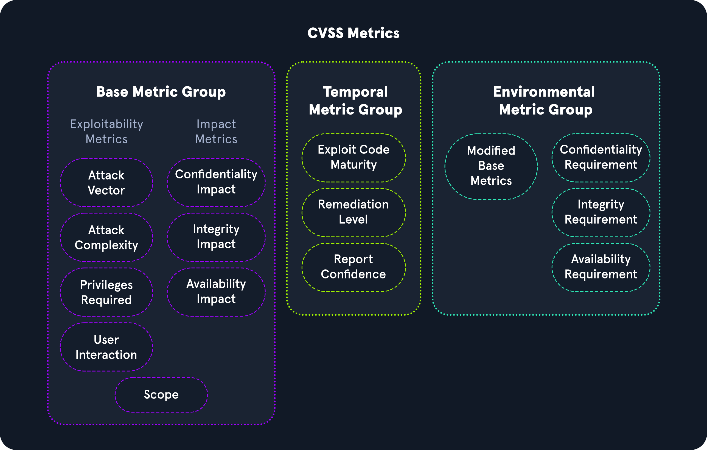
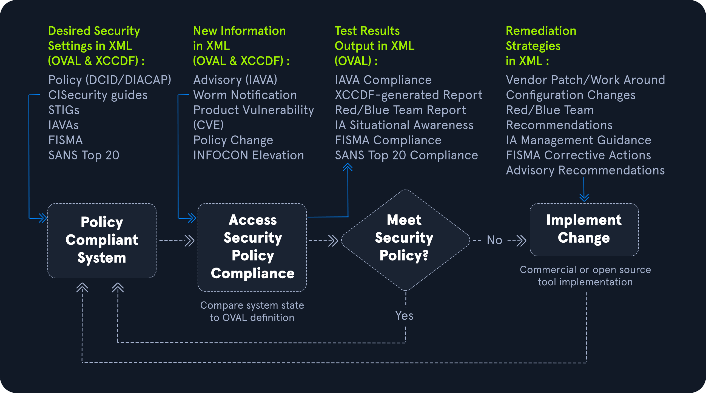

# Common Vulnerability Scoring System (CVSS)

## ภาพรวม

**CVSS** คือมาตรฐานอุตสาหกรรมสำหรับการคำนวณคะแนนความรุนแรงของช่องโหว่

**การใช้งาน**:
- เครื่องมือสแกนมักจะให้คะแนนเหล่านี้โดยอัตโนมัติ
- ผู้ประเมินต้องเข้าใจวิธีคำนวณเพื่อสามารถคำนวณเองหรืออธิบายคะแนนได้

**มักใช้ร่วมกับ**: **Microsoft DREAD**

---

## Microsoft DREAD

**คืออะไร**: ระบบประเมินความเสี่ยงที่พัฒนาโดย Microsoft เพื่อช่วยผู้เชี่ยวชาญด้าน IT security ประเมินความรุนแรงของภัยคุกคามและช่องโหว่

**วิธีการ**: ใช้มาตราส่วน **10 คะแนน** ประเมินตาม **5 ปัจจัยหลัก**:

### 5 ปัจจัยของ DREAD

1. **D - Damage Potential** (ศักยภาพในการสร้างความเสียหาย)
2. **R - Reproducibility** (ความสามารถในการทำซ้ำ)
3. **E - Exploitability** (ความง่ายในการโจมตี)
4. **A - Affected Users** (จำนวนผู้ใช้ที่ได้รับผลกระทบ)
5. **D - Discoverability** (ความง่ายในการค้นพบ)

**บทบาท**:
- เป็นส่วนสำคัญของกลยุทธ์ความปลอดภัยของ Microsoft
- ใช้ตรวจสอบ ประเมิน และตอบสนองต่อภัยคุกคามในผลิตภัณฑ์ Microsoft
- เป็นแหล่งอ้างอิงสำหรับผู้เชี่ยวชาญและผู้จัดการในการประเมินและจัดลำดับความสำคัญ

---

## Severity Scoring (การให้คะแนนความรุนแรง)

**วัตถุประสงค์**:
- จัดหมวดหมู่ความรุนแรงของปัญหา
- ช่วยองค์กรจัดลำดับความสำคัญ

**องค์ประกอบหลัก**:
1. **Exploitability** (ความสามารถในการโจมตี)
   - Attack Vector (เวกเตอร์การโจมตี)
   - Access Complexity (ความซับซ้อนในการเข้าถึง)
   - Authentication (การยืนยันตัวตน)

2. **Impact** (ผลกระทบ)
   - CIA Triad: Confidentiality, Integrity, Availability

---

## โครงสร้าง CVSS Metrics

CVSS แบ่งออกเป็น **3 กลุ่มหลัก**:

```
CVSS Metrics
├── Base Metric Group (คะแนนพื้นฐาน)
│   ├── Exploitability Metrics (วัดความง่ายในการโจมตี)
│   └── Impact Metrics (วัดผลกระทบ)
├── Temporal Metric Group (คะแนนตามเวลา)
└── Environmental Metric Group (คะแนนตามสภาพแวดล้อม)
```

---

## 1. Base Metric Group (กลุ่มเมตริกพื้นฐาน)

แสดงลักษณะของช่องโหว่ ประกอบด้วย 2 ส่วน

### 1.1 Exploitability Metrics (เมตริกความสามารถในการโจมตี)

ประเมินวิธีการทางเทคนิคที่ต้องใช้ในการโจมตี

#### **Attack Vector (เวกเตอร์การโจมตี)**
- ทางไหนที่ผู้โจมตีสามารถเข้าถึงได้
- **ประเภท**: Network, Adjacent, Local, Physical

#### **Attack Complexity (ความซับซ้อนในการโจมตี)**
- ยากแค่ไหนในการโจมตี
- **ระดับ**: Low, High

#### **Privileges Required (สิทธิ์ที่ต้องการ)**
- ต้องการสิทธิ์อะไรในการโจมตี
- **ระดับ**: None, Low, High

#### **User Interaction (การมีส่วนร่วมของผู้ใช้)**
- ต้องการให้ผู้ใช้ทำอะไรหรือไม่
- **ค่า**: None, Required

---

### 1.2 Impact Metrics (เมตริกผลกระทบ)

แสดงผลที่ตามมาจากการโจมตีสำเร็จ อิงจาก **CIA Triad**

### CIA Triad (หลักการสามประการด้านความปลอดภัย)

```
CIA Triad
├── Confidentiality (ความลับของข้อมูล)
│   └── ควบคุมการเข้าถึง รักษาความเป็นส่วนตัว
├── Integrity (ความสมบูรณ์ของข้อมูล)
│   └── ข้อมูลครบถ้วนและไม่ถูกแก้ไข
└── Availability (ความพร้อมใช้งาน)
    └── ทรัพยากรพร้อมใช้เมื่อต้องการ
```

#### **Confidentiality Impact (ผลกระทบต่อความลับ)**

**คืออะไร**: การรักษาความปลอดภัยของข้อมูล และให้เฉพาะผู้มีอำนาจเข้าถึงได้

**ตัวอย่างความรุนแรง**:
- **High**: ผู้โจมตีขโมยรหัสผ่านหรือ encryption keys
- **Low**: ผู้โจมตีขโมยข้อมูลที่ไม่สำคัญมากสำหรับองค์กร

#### **Integrity Impact (ผลกระทบต่อความสมบูรณ์)**

**คืออะไร**: ข้อมูลไม่ถูกเปลี่ยนแปลงหรือแก้ไข เพื่อรักษาความถูกต้อง

**ตัวอย่างความรุนแรง**:
- **High**: ผู้โจมตีแก้ไขไฟล์ธุรกิจสำคัญในองค์กร
- **Low**: ผู้โจมตีไม่สามารถควบคุมจำนวนไฟล์ที่เปลี่ยนแปลงได้โดยเฉพาะเจาะจง

#### **Availability Impact (ผลกระทบต่อความพร้อมใช้)**

**คืออะไร**: ข้อมูลพร้อมใช้งานตามความต้องการทางธุรกิจ

**ตัวอย่างความรุนแรง**:
- **High**: ผู้โจมตีทำให้ระบบไม่สามารถใช้งานได้เลยสำหรับธุรกิจ
- **Low**: ผู้โจมตีไม่สามารถปฏิเสธการเข้าถึงได้ทั้งหมด ผู้ใช้ยังเข้าถึงทรัพย์สินบางอย่างได้

---

## 2. Temporal Metric Group (กลุ่มเมตริกตามเวลา)

รายละเอียดเกี่ยวกับความพร้อมของ exploits หรือ patches สำหรับช่องโหว่

### 2.1 Exploit Code Maturity (ความพร้อมของโค้ดโจมตี)

**คืออะไร**: แสดงความน่าจะเป็นที่ช่องโหว่จะถูกโจมตี อิงจากความง่ายของเทคนิคการโจมตี

**ค่าที่เป็นไปได้**:

| ค่า | ความหมาย |
|-----|----------|
| **Not Defined** | ข้ามเมตริกนี้ |
| **High** | exploit ทำงานได้สม่ำเสมอและหาได้ง่ายด้วยเครื่องมืออัตโนมัติ |
| **Functional** | มี exploit code สาธารณะพร้อมใช้ |
| **Proof-of-Concept** | มี PoC exploit code แต่ต้องแก้ไขก่อนใช้โจมตีจริง |
| **Unproven** | ไม่มีหลักฐานว่าโจมตีได้ |

### 2.2 Remediation Level (ระดับการแก้ไข)

**คืออะไร**: ใช้ระบุลำดับความสำคัญของช่องโหว่

**ค่าที่เป็นไปได้**:

| ค่า | ความหมาย |
|-----|----------|
| **Not Defined** | ข้ามเมตริกนี้ |
| **Unavailable** | ยังไม่มี patch สำหรับช่องโหว่นี้ |
| **Workaround** | มีวิธีแก้ไขชั่วคราวที่ไม่เป็นทางการจนกว่าผู้ผลิตจะออก patch |
| **Temporary Fix** | ผู้ผลิตให้วิธีแก้ไขชั่วคราวแล้ว แต่ยังไม่ได้ออก patch |
| **Official Fix** | ผู้ผลิตออก patch อย่างเป็นทางการแล้ว |

### 2.3 Report Confidence (ความมั่นใจในรายงาน)

**คืออะไร**: แสดงการยืนยันช่องโหว่และความถูกต้องของรายละเอียดทางเทคนิค

**ค่าที่เป็นไปได้**:

| ค่า | ความหมาย |
|-----|----------|
| **Not Defined** | ข้ามเมตริกนี้ |
| **Confirmed** | มีหลายแหล่งที่มีข้อมูลละเอียดยืนยันช่องโหว่ |
| **Reasonable** | มีแหล่งเผยแพร่ข้อมูลเกี่ยวกับช่องโหว่ แต่ยังไม่มั่นใจว่าจะได้ผลเหมือนกัน เนื่องจากขาดรายละเอียดในการทำซ้ำ |
| **Unknown** | ไม่ทราบ |

---

## 3. Environmental Metric Group (กลุ่มเมตริกสภาพแวดล้อม)

แสดงความสำคัญของช่องโหว่ต่อองค์กร โดยคำนึงถึง CIA triad

### 3.1 Modified Base Metrics (เมตริกพื้นฐานที่ปรับแต่ง)

**คืออะไร**: เมตริกที่สามารถปรับเปลี่ยนได้ หากองค์กรที่ได้รับผลกระทบเห็นว่ามีความเสี่ยงมากขึ้นใน Confidentiality, Integrity, หรือ Availability

**ค่าที่เป็นไปได้**:

| ค่า | ความหมาย |
|-----|----------|
| **Not Defined** | ข้ามเมตริกนี้ |
| **High** | องค์ประกอบหนึ่งของ CIA triad มีผลกระทบอย่างมหาศาลต่อองค์กรและลูกค้า |
| **Medium** | องค์ประกอบหนึ่งของ CIA triad มีผลกระทบอย่างมีนัยสำคัญต่อองค์กรและลูกค้า |
| **Low** | องค์ประกอบหนึ่งของ CIA triad มีผลกระทบน้อยที่สุดต่อองค์กรและลูกค้า |

**Confidentiality Requirement**: ความต้องการด้านความลับ
**Integrity Requirement**: ความต้องการด้านความสมบูรณ์
**Availability Requirement**: ความต้องการด้านความพร้อมใช้

---

## การคำนวณคะแนน CVSS

### เครื่องมือ

**National Vulnerability Database** มี CVSS Calculator สาธารณะ
- เว็บไซต์: https://nvd.nist.gov/vuln-metrics/cvss/v3-calculator

### ช่วงคะแนน

**CVSS v3.1 Score Range**:
- **0.0**: ไม่มีความเสี่ยง
- **0.1-3.9**: Low (ต่ำ)
- **4.0-6.9**: Medium (กลาง)
- **7.0-8.9**: High (สูง)
- **9.0-10.0**: Critical (วิกฤต)

### ตัวอย่างการคำนวณ

**Windows Print Spooler Remote Code Execution Vulnerability**

**CVSS Base Score**: **8.8** (High)

**คำนวณจาก**:
- Attack Vector
- Attack Complexity
- Privileges Required
- User Interaction
- Confidentiality Impact
- Integrity Impact
- Availability Impact

สามารถดูรายละเอียดค่าแต่ละเมตริกได้ใน National Vulnerability Database

---
# Common Vulnerabilities and Exposures (CVE) และ OVAL

## Open Vulnerability Assessment Language (OVAL)

### ภาพรวม

**OVAL** คือมาตรฐานสากลด้านความปลอดภัยสารสนเทศที่เปิดเผยต่อสาธารณะ ใช้เพื่อประเมินและอธิบายสถานะปัจจุบันและปัญหาของระบบ

**การสนับสนุน**: 
- Office of Cybersecurity and Communications จาก U.S. Department of Homeland Security
- U.S. National Institute of Standards and Technology (NIST)

**จุดประสงค์**:
- ให้ภาษาสำหรับเข้าใจการเข้ารหัสคุณสมบัติของระบบ
- แบ่งปันเนื้อหาในคลังข้อมูลภายในชุมชนความปลอดภัย
- มีคำจำกัดความมากกว่า **7,000+ definitions** สำหรับใช้งานสาธารณะ

### การใช้งานใน SCAP

**SCAP (Security Content Automation Protocol)** ของ NIST ใช้ OVAL ในการ:
- ทำให้การจัดการช่องโหว่เป็นอัตโนมัติ
- วัดผล (measurement)
- ตรวจสอบว่าระบบปฏิบัติตามนโยบาย (policy compliance)

---

## OVAL Process (กระบวนการ OVAL)

### โครงสร้าง 3 ขั้นตอน

```
OVAL Assessment Process
├── 1. Identifying (ระบุ)
│   └── กำหนดค่าของระบบสำหรับการทดสอบ
├── 2. Evaluating (ประเมิน)
│   └── ประเมินสถานะปัจจุบันของระบบ
└── 3. Disclosing (เปิดเผย)
    └── เปิดเผยข้อมูลในรายงาน
```

### Security Policy Compliance Flowchart

```
การตั้งค่าความปลอดภัยที่ต้องการ (Desired Security Settings)
            ↓
    ข้อมูลใหม่ในรูปแบบ XML
            ↓
    ประเมินการปฏิบัติตามนโยบาย
            ↓
    ┌───────┴───────┐
    ↓               ↓
ปฏิบัติตาม      ไม่ปฏิบัติตาม
    ↓               ↓
ระบบ         ใช้กลยุทธ์การแก้ไข
ปฏิบัติตาม   (Remediation Strategies)
```


### ประเภทของสถานะ (States)

ข้อมูลสามารถอธิบายได้ใน 4 ประเภท:

1. **Vulnerable** (มีช่องโหว่)
2. **Non-compliant** (ไม่ปฏิบัติตามข้อกำหนด)
3. **Installed Asset** (ทรัพย์สินที่ติดตั้ง)
4. **Patched** (แพตช์แล้ว)

---

## OVAL Definitions (คำจำกัดความของ OVAL)

### รูปแบบ

**บันทึกเป็น**: รูปแบบ XML

**วัตถุประสงค์**: ค้นพบ
- ช่องโหว่ซอฟต์แวร์
- การตั้งค่าที่ผิดพลาด (misconfigurations)
- โปรแกรม
- ข้อมูลระบบเพิ่มเติม

**ข้อดี**: **ไม่ต้องโจมตีระบบจริง** - สามารถระบุปัญหาได้โดยไม่ต้อง exploit

**ประโยชน์**: องค์กรสามารถสัมพันธ์ว่าระบบใดในเครือข่ายต้องการ patch

---

### 4 ประเภทหลักของ OVAL Definitions

| ประเภท | ความหมาย | วัตถุประสงค์ |
|--------|----------|--------------|
| **OVAL Vulnerability Definitions** | คำจำกัดความช่องโหว่ | ระบุช่องโหว่ของระบบ |
| **OVAL Compliance Definitions** | คำจำกัดความการปฏิบัติตาม | ตรวจสอบว่าการตั้งค่าตรงตามนโยบายหรือไม่ |
| **OVAL Inventory Definitions** | คำจำกัดความสินค้าคงคลัง | ประเมินว่ามีซอฟต์แวร์เฉพาะในระบบหรือไม่ |
| **OVAL Patch Definitions** | คำจำกัดความแพตช์ | ระบุว่าระบบมีแพตช์ที่เหมาะสมหรือไม่ |

---

### OVAL ID Format (รูปแบบ OVAL ID)

**โครงสร้าง**: `oval:Organization Domain Name:ID Type:ID Value`

**ID Type ประกอบด้วย**:
- `def` = definition (คำจำกัดความ)
- `obj` = object (วัตถุ)
- `ste` = state (สถานะ)
- `var` = variable (ตัวแปร)

**ตัวอย่าง**: `oval:org.mitre.oval:obj:1116`

---

### การใช้งานใน Scanners

**Nessus** และเครื่องมือสแกนอื่นๆ สามารถใช้ OVAL เพื่อตั้งค่า **security compliance scanning templates**

---

## Common Vulnerabilities and Exposures (CVE)

### ภาพรวม

**CVE** คือแคตตาล็อกปัญหาความปลอดภัยที่เปิดเผยต่อสาธารณะ

**สนับสนุนโดย**: United States Department of Homeland Security (DHS)

**CVE ID**: หมายเลขเฉพาะที่กำหนดโดย **CVE Numbering Authority (CNA)**

### วัตถุประสงค์

สร้างมาตรฐานสำหรับช่องโหว่หรือการเปิดเผย (exposure) เมื่อนักวิจัยระบุพบ

### ข้อมูลใน CVE

แต่ละ CVE ประกอบด้วย:
- **คำอธิบาย** (Description) ของช่องโหว่หรือ exposure
- **อ้างอิง** (References) เกี่ยวกับปัญหา
- **ข้อมูลสำคัญ** ที่ช่วยให้ทีม IT เข้าใจว่าปัญหาอาจร้ายแรงแค่ไหนต่อสภาพแวดล้อมของตน

---

## CVE ID Criteria (เกณฑ์การได้รับ CVE ID)

ช่องโหว่ที่จะได้รับ CVE ID ต้องมีคุณสมบัติ **3 ข้อ**:

```
CVE ID Criteria
├── 1. Independently Fixable
│   └── สามารถแก้ไขได้อย่างอิสระ
├── 2. Affect One Codebase
│   └── กระทบเฉพาะ codebase เดียว
└── 3. Acknowledged by Vendor
    └── ผู้ผลิตยอมรับและจัดทำเอกสาร
```

---

## 9 ขั้นตอนการขอ CVE ID

### **Stage 1: ระบุว่าต้องการ CVE หรือไม่**

**ตรวจสอบว่า**:
- ปัญหาที่พบเป็นช่องโหว่จริงหรือไม่

**คำจำกัดความช่องโหว่ตาม CVE Team**:
> "โค้ดที่สามารถถูก exploit ได้ ส่งผลกระทบเชิงลบต่อ confidentiality, integrity, หรือ availability และต้องการการเปลี่ยนแปลงโค้ด, specification, หรือการยกเลิก specification เพื่อลดหรือแก้ไขปัญหา"

**ตรวจสอบ**: ว่ายังไม่มี CVE ID ในฐานข้อมูลแล้ว

---

### **Stage 2: ติดต่อผู้ผลิต (Vendor)**

นักวิจัยควร**ติดต่อผู้ผลิตโดยตรง**อย่างจริงจัง

**อ้างอิง**: CVE's Documents on Disclosure Practices

---

### **Stage 3: ระบุว่าควรติดต่อ CNA ใด**

**ถ้าบริษัทเป็น CNA**: สามารถกำหนด CVE ID สำหรับผลิตภัณฑ์ของตนเองได้

**ถ้าไม่ใช่ CNA**: นักวิจัยควรติดต่อ third-party coordinator ของผู้ผลิต

**CNA ที่เข้าร่วม**: สามารถดูรายชื่อได้ที่เว็บไซต์ CVE

---

### **Stage 4: ขอ CVE ID ผ่าน Web Form**

ถ้าวิธีข้างต้นไม่ได้ผล สามารถกรอกแบบฟอร์มออนไลน์ของ CVE Team ได้

---

### **Stage 5: รับอีเมลยืนยัน**

หลังส่งแบบฟอร์ม จะได้รับ**อีเมลยืนยัน**

CVE Team จะติดต่อกลับหากต้องการข้อมูลเพิ่มเติม

---

### **Stage 6: รับ CVE ID**

เมื่อได้รับการอนุมัติ CVE Team จะแจ้ง **CVE ID** หากช่องโหว่ได้รับการยืนยัน

**หมายเหตุ**: CVE ID ยัง**ไม่เป็นสาธารณะ**ในขั้นตอนนี้

---

### **Stage 7: เปิดเผย CVE ID ต่อสาธารณะ**

CVE ID สามารถประกาศได้ทันทีที่**ผู้ผลิตและฝ่ายที่เกี่ยวข้องรับทราบแล้ว**

**วัตถุประสงค์**: ป้องกันการซ้ำซ้อนของ CVE ID และให้ทุกฝ่ายรับทราบก่อนเปิดเผยสู่สาธารณะ

---

### **Stage 8: ประกาศ CVE**

CVE Team ขอให้นักวิจัยที่แบ่งปันหลาย CVE **ระบุความแตกต่างของแต่ละช่องโหว่อย่างชัดเจน**

---

### **Stage 9: ให้ข้อมูลแก่ CVE Team**

นักวิจัยควร**ให้ข้อมูลเพิ่มเติม**เพื่อใช้ในรายการ CVE อย่างเป็นทางการบนเว็บไซต์

**ฐานข้อมูล**: U.S. National Vulnerability Database (NVD) เก็บรักษาข้อมูลนี้ออนไลน์

---

## Responsible Disclosure (การเปิดเผยอย่างรับผิดชอบ)

### ทำไมต้องมี?

**นักวิจัยและที่ปรึกษาด้านความปลอดภัย** อ้างอิงฐานข้อมูล CVE อยู่เสมอ เพราะมีช่องโหว่หลายพันรายการที่สามารถนำมาใช้โจมตีได้

**บางครั้ง**: อาจพบปัญหาที่ไม่เคยเห็นในธรรมชาติหรือไม่เคยถูกเปิดเผยมาก่อน

### ความสำคัญ

**Responsible Disclosure สำคัญ**เพราะ:

1. **ทำงานร่วมกับผู้ผลิต**: องค์กรหรือนักวิจัยทำงานโดยตรงกับผู้ผลิต
2. **ให้รายละเอียดก่อน**: แจ้งปัญหาให้ผู้ผลิตก่อนเพื่อให้มีเวลาทำ patch
3. **มี Patch ก่อนประกาศ**: ตรวจสอบว่ามี patch พร้อมก่อนประกาศต่อสาธารณะ

### อันตรายของการไม่เปิดเผยอย่างรับผิดชอบ

ถ้า**ไม่แจ้งผู้ผลิตก่อน**:
- ผู้โจมตีจริง (threat actors) อาจนำช่องโหว่ไปใช้ในทางอาญา
- เรียกว่า **Zero Day** หรือ **0-day**

---

## ตัวอย่าง CVE ที่สำคัญ

### CVE-2020-5902

**ประเภท**: Unauthenticated Remote Code Execution (RCE)

**เป้าหมาย**: BIG-IP Traffic Management User Interface (TMUI)

**เงื่อนไข**: TMUI ต้องเข้าถึงได้ผ่าน BIG-IP management port

**ผลกระทบ**:
- **Complete System Takeover** (ยึดครองระบบทั้งหมด)
- ผู้โจมตีสามารถ:
  - Execute code (รันโค้ด)
  - Edit files (แก้ไขไฟล์)
  - Enable or disable services (เปิด/ปิดบริการ) บน remote host

**ความรุนแรง**: สูงมาก เพราะไม่ต้อง authentication

---

### CVE-2021-34527 (PrintNightmare)

**ประเภท**: Remote Code Execution (RCE)

**เป้าหมาย**: Windows Print Spooler service

**สาเหตุ**: Print Spooler จัดการ privileges file operations อย่างไม่เหมาะสม

**เงื่อนไข**: 
- ต้องมี authentication
- แต่สามารถโจมตีจากระยะไกล (remote) หรือในเครื่อง (local) ได้

**ผลกระทบ**:
- **Complete System Takeover**
- **อันตรายมาก** เพราะ:
  - โจมตี servers (รวมถึง domain controllers) ได้
  - โจมตี workstations ได้
  - **สามารถควบคุม domain ทั้งหมดได้**

**ทำไมอันตราย**: 
- กระทบทั้ง servers และ workstations
- โจมตี domain controller = ควบคุม domain ทั้งหมด
- แพร่กระจายได้ง่าย

---

## สรุปเปรียบเทียบ OVAL vs CVE

| หัวข้อ | OVAL | CVE |
|--------|------|-----|
| **ประเภท** | ภาษาประเมิน/มาตรฐาน | แคตตาล็อกช่องโหว่ |
| **วัตถุประสงค์** | ประเมินสถานะระบบ | ระบุช่องโหว่อย่างมีมาตรฐาน |
| **รูปแบบ** | XML definitions | CVE ID + รายละเอียด |
| **จำนวน** | 7,000+ definitions | หลายพันรายการ (เพิ่มอยู่เสมอ) |
| **การใช้งาน** | Compliance scanning | อ้างอิงช่องโหว่เฉพาะ |
| **เครื่องมือ** | Nessus, compliance tools | NVD, vulnerability databases |

---

## บทสรุป

### OVAL
- **มาตรฐานสากล**สำหรับประเมินระบบ
- ใช้ **XML** บันทึกคำจำกัดความ
- **ไม่ต้องโจมตีจริง** แต่ประเมินได้
- เหมาะกับการตรวจสอบ **compliance**

### CVE
- **มาตรฐานการตั้งชื่อ**ช่องโหว่
- ทุกช่องโหว่มี **ID เฉพาะ**
- ต้อง**เปิดเผยอย่างรับผิดชอบ**
- ใช้อ้างอิงโดย**นักวิจัยและผู้เชี่ยวชาญ**ทั่วโลก

### ความสำคัญ
- OVAL + CVE ช่วยให้การจัดการช่องโหว่เป็น**มาตรฐานเดียวกัน**
- ทำให้**สื่อสารได้ชัดเจน**ระหว่างองค์กร นักวิจัย และผู้ผลิต
- **Responsible Disclosure** ป้องกัน zero-day attacks

