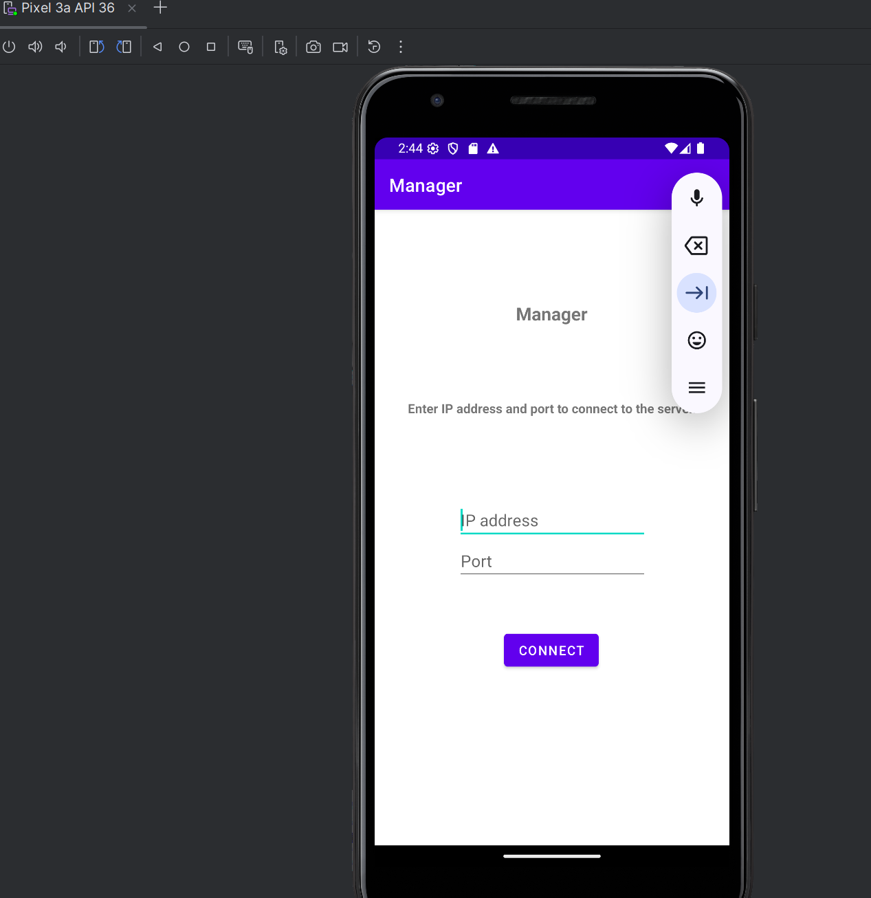

install addroid studio
set up burp suit for android https://corsecure.blog/2023/08/17/using-burp-suite-with-an-android-emulator/

drag apk file to emulator

after register

change username to admin

login as admin

