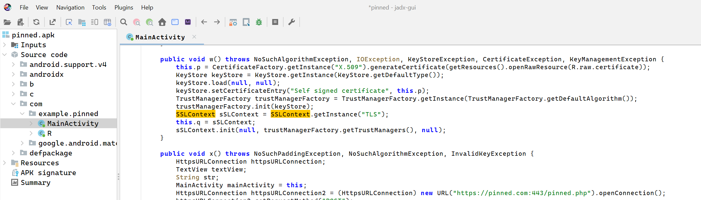
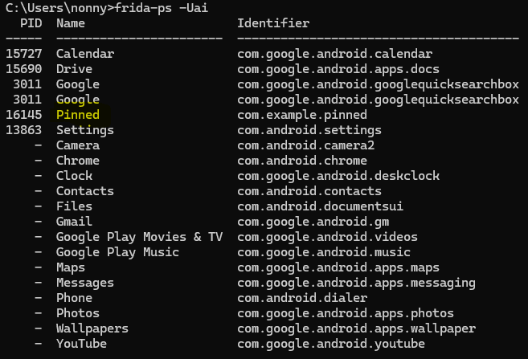
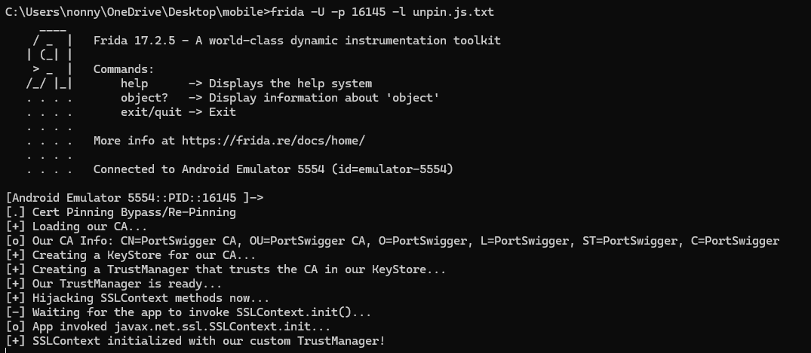
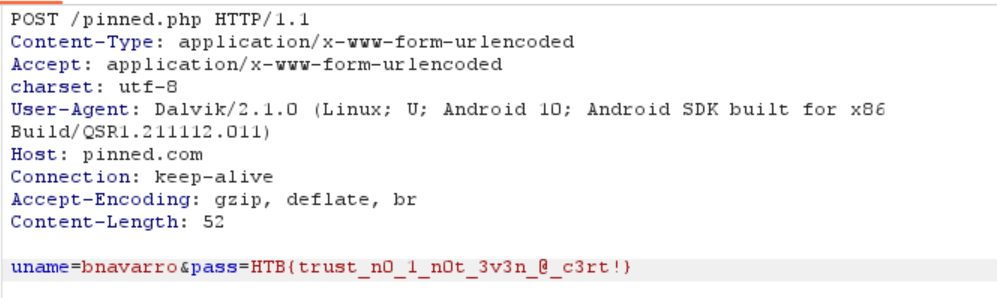

burp can not capture traffic because ssl pinned

SSL Pinning in Android is a security technique used to protect against Man-in-the-Middle (MITM) attacks by "pinning" or "pinning" a server's certificate or public key to an application.

How it works
Normal check (no Pinning):

The app connects to the server via HTTPS.
The system checks the certificate chain from the trusted Root CA.
If the certificate is valid according to the chain of trust, the connection is allowed.

How SSL Pinning works:

The app stores the server's certificate or public key in advance (hard-coded).
When connecting, the app compares the received certificate with the stored one.
Allows the connection only if the certificates match.

https://github.com/frida/frida/releases

use Frida for bypass SSL Pinning

adb push frida-server-17.2.5-android-x86 /data/local/tmp/frida-server

adb shell

generic_x86:/ # chmod 755 /data/local/tmp/frida-server

generic_x86:/ # /data/local/tmp/frida-server &

generic_x86:/ #  ps | grep frida-server

root          7972  7791   70760  36392 do_sys_poll         0 S frida-server

C:\Users\nonny\Downloads\Compressed>python -c "import sys; print(sys.executable)"

C:\Users\nonny\AppData\Local\Microsoft\WindowsApps\PythonSoftwareFoundation.Python.3.10_qbz5n2kfra8p0\python.exe

C:\Users\nonny\Downloads\Compressed>set PATH=%PATH%;C:\Users\nonny\AppData\Local\Packages\PythonSoftwareFoundation.Python.3.10_qbz5n2kfra8p0\LocalCache\local-packages\Python310\Scripts

C:\Users\nonny\Downloads\Compressed>frida --version

17.2.5

adb push burp.der /data/local/tmp/cert-der.crt //for frida

adb push burp.der /sdcard/burp.crt  // install CA burp

https://codeshare.frida.re/@pcipolloni/universal-android-ssl-pinning-bypass-with-frida/

