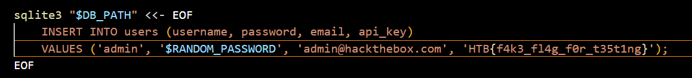
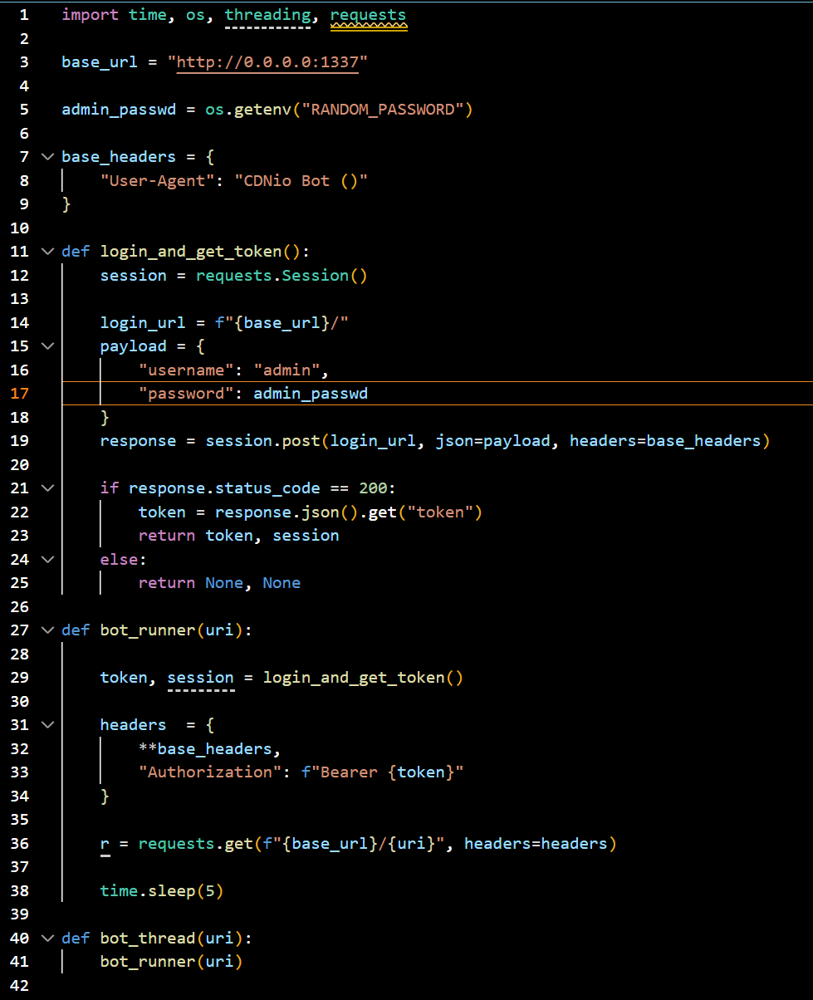
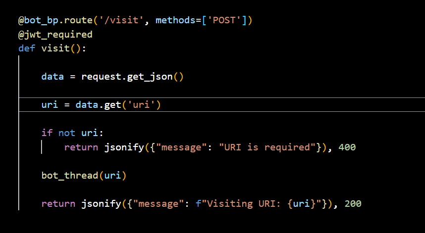
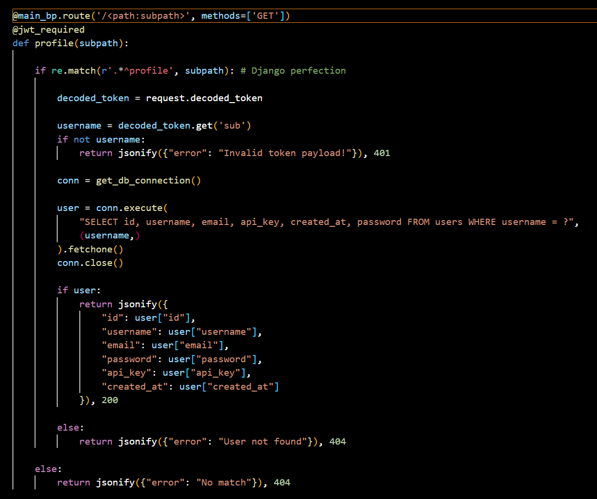
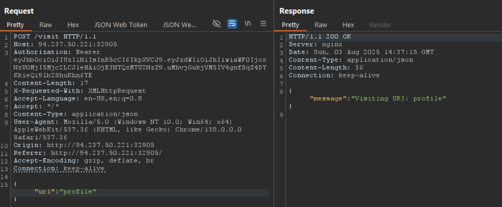
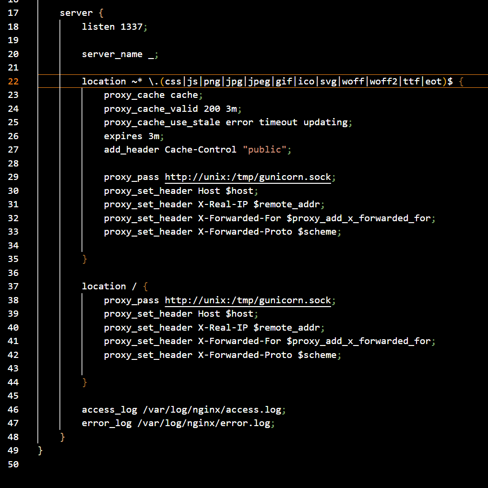
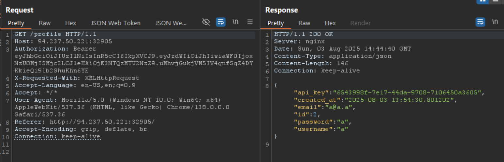
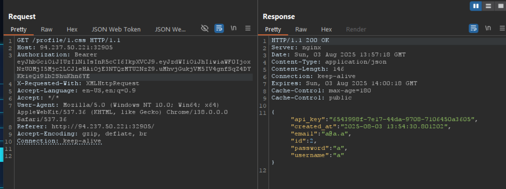
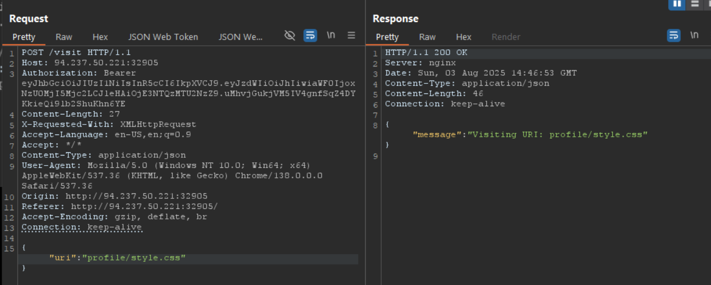
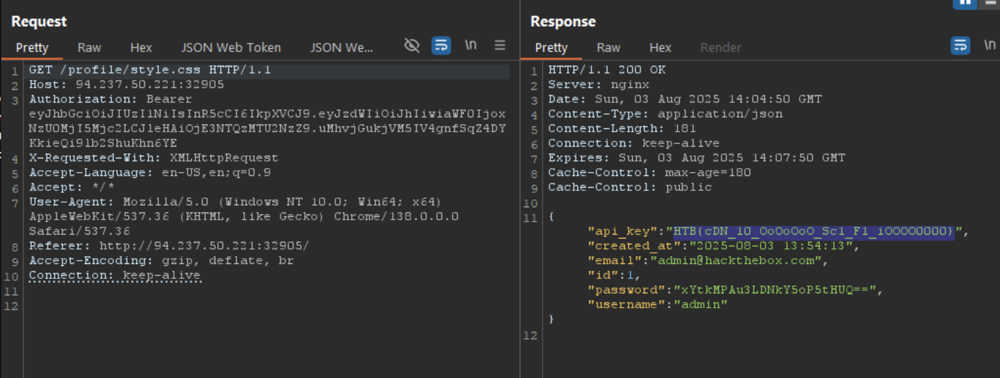

```
flag คือ api_key ของ admin
```







```
bot ใช้ credentail ของ admin set "Authorization": f"Bearer {token}" ให้ตัวเองสามารเรียก /profile ก็จะได้ api_key admin มาได้ ผ่าน /visit
```










```
ให้ bot ไปที่ `GET /profile/style.css` เพื่อให้ ข้อมูล ของ admin ถูก cache โดย nginx
เนื่องจาก nginx คิดว่าเป็น .css file สามารถทำ cache ได้ จึงไปค้นดูใน cache ซึ่งไม่เจอ จึงเรียกผ่าน api  `GET /profile/style.css`
ซึ่ง 
   if re.match(r'.*^profile', subpath):
   - Pattern นี้จะ match กับ URL ใดๆ ที่ขึ้นต้นด้วย `profile`
   - เช่น: `profile/1.css`
   @main_bp.route('/<path:subpath>', methods=['GET'])
   - รับ URL path อะไรก็ได้
จะ return เป็น json ของ admin

```







