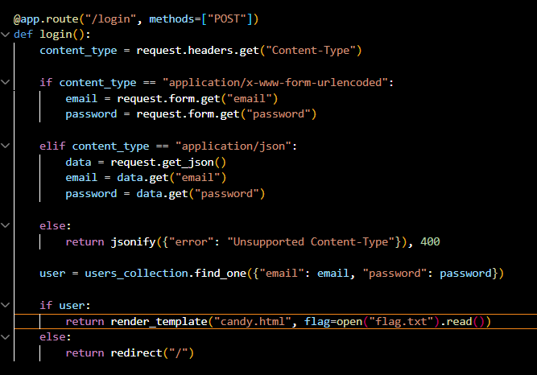
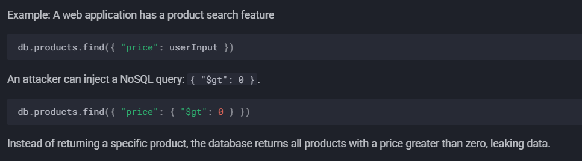
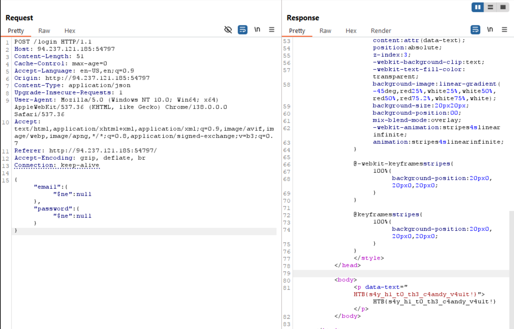

https://swisskyrepo.github.io/PayloadsAllTheThings/NoSQL%20Injection/#operator-injection

findone ก็แค่เอาอันที่ id บนสุดเช่น

 ถ้ามีข้อมูลในฐานข้อมูล:

 {"_id": 1, "name": "John", "age": 25}

 {"_id": 2, "name": "John", "age": 30}  

 {"_id": 3, "name": "John", "age": 35}

user = users_collection.find_one({"name": "John"})

 จะได้: {"_id": 1, "name": "John", "age": 25}  <-- อันแรก/เก่าที่สุด

 แล้ว จะผ่าน if exist ได้ flag

คำสั่งนี้จะค้นหาเอกสารที่มีทั้ง username และ password ไม่เป็น null

 จะเจอเอกสารที่มีลักษณะแบบนี้:

{"_id": 1, "username": "john123", "password": "secret123"}

{"_id": 2, "username": "mary456", "password": "mypass"}

{"_id": 3, "username": "", "password": "abc"}  # string ว่างก็ไม่ใช่ null