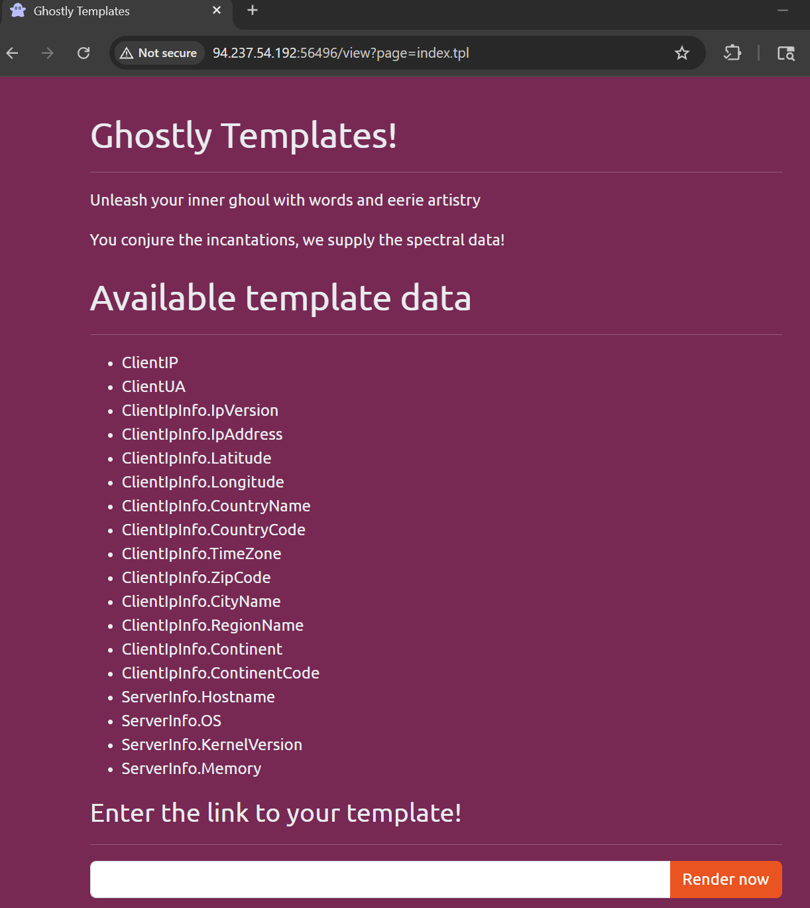
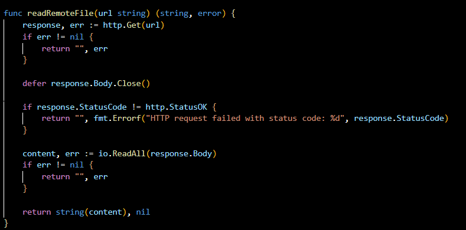
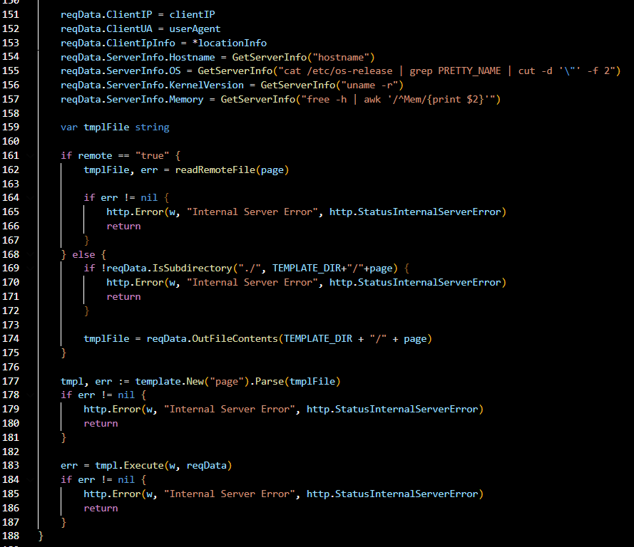
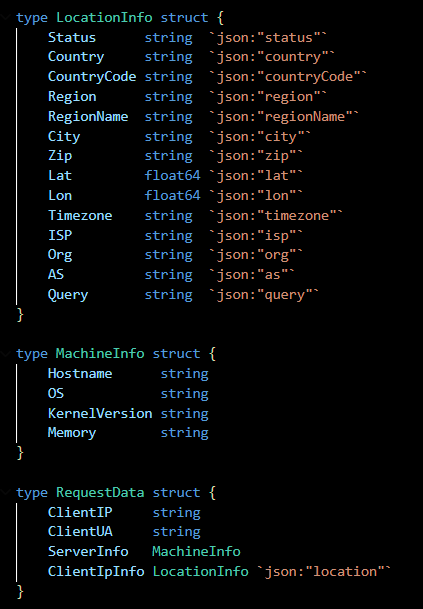
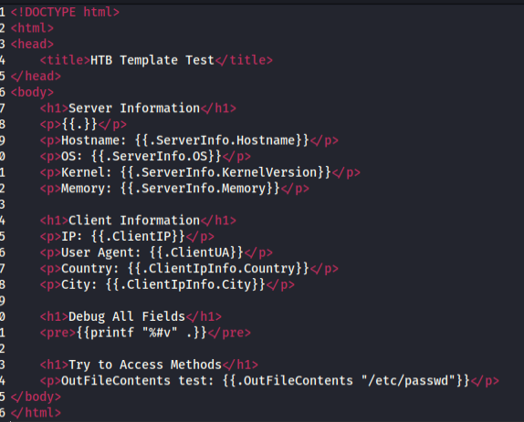
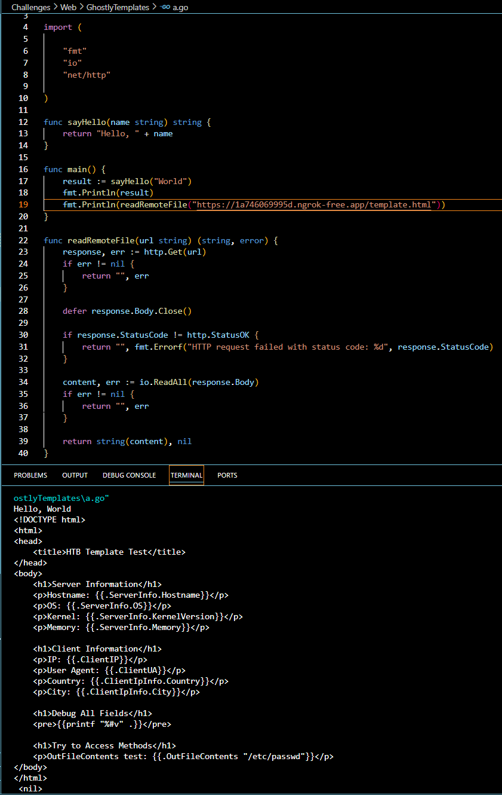
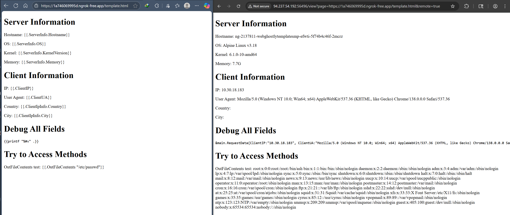
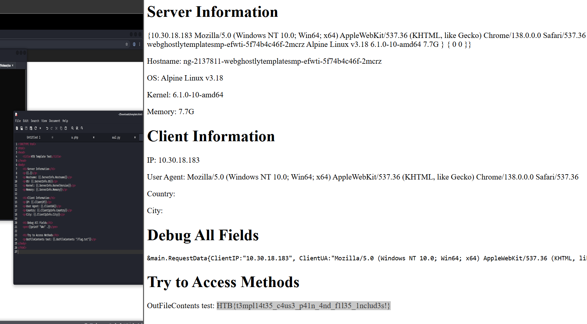

get html ออกมาเป็น string

defer response.Body.Close() เป็นการมั่นใจว่า HTTP connection จะถูกปิดเสมอ ไม่ว่า function จะจบด้วยวิธีไหน (success, error, panic) เพื่อป้องกัน resource leak




##  Template Injection
ปัญหาหลักคือการใช้ `template.New().Parse()` กับข้อมูลที่อาจมาจากผู้ใช้ (`tmplFile`) โดยไม่ได้ตรวจสอบ ทำให้เกิด **Server-Side Template Injection (SSTI)**

```go
// ช่องโหว่: ถ้า tmplFile มาจาก user input
tmpl, err := template.New("page").Parse(tmplFile)
- `template.New("page")` = สร้าง template object ใหม่ชื่อ "page"
- `.Parse(tmplFile)` = แปลง string ใน `tmplFile` เป็น template
- `tmplFile` คือ string ที่มี template syntax
```

ผู้โจมตีสามารถส่ง template code ที่เป็นอันตราย เช่น:
```go
{{.}} // อ่านข้อมูลทั้งหมดใน reqData
{{range $key, $value := .}} {{$key}}: {{$value}} {{end}} // เปิดเผยข้อมูล

```





```go
err = tmpl.Execute(w, reqData)
```

**สิ่งที่เกิดขึ้น:**
- `tmpl.Execute()` = รัน template และแทนที่ variables
- `w` = HTTP response writer (ส่งไปยัง browser)
- `reqData` = ข้อมูลที่จะใส่ใน template


https://snyk.io/articles/understanding-server-side-template-injection-in-golang/



ngrok http 80

python3 -m http.server 8000







สำหรับกรณีนี้ **ไม่สามารถสร้าง `exec.Command` เองได้** ด้วยเหตุผลดังนี้:

## ข้อจำกัดของ Go Template Engine

### 1. **Template Syntax Limitation**
Go template มีไวยากรณ์จำกัด ไม่สามารถ:
- ประกาศตัวแปร
- Import packages
- สร้าง function ใหม่
- เรียกใช้ arbitrary functions

```golang
// ❌ ไม่ได้ - Template ไม่รองรับ
{{ import "os/exec" }}
{{ $cmd := exec.Command("cat", "/flag.txt") }}
{{ $output := $cmd.Output() }}
```

### 2. **Template Context Restriction**
Template สามารถเข้าถึงได้เฉพาะ:
- Fields ของ struct ที่ส่งเข้ามา (`.ClientIP`, `.ServerInfo`)
- Methods ที่ inherit กับ struct นั้น (`.GetServerInfo`, `.OutFileContents`)
- Built-in template functions (`len`, `printf`, etc.)

### 3. **Security by Design**
Go template ถูกออกแบบมาให้ปลอดภัย:
```golang
// ❌ ไม่สามารถเรียก package functions ได้โดยตรง
{{ exec.Command "cat /flag.txt" }}
{{ os.ReadFile "/flag.txt" }}
{{ fmt.Println "hello" }}
```

## วิธีที่เป็นไปได้

### วิธีเดียวที่ทำได้คือใช้ Methods ที่มีอยู่แล้ว:

1. **ผ่าน Methods ของ struct:**
```golang
{{ .GetServerInfo "cat /flag.txt" }}  // ✅ ถ้ามี method นี้
{{ .OutFileContents "/flag.txt" }}    // ✅ อ่านไฟล์ได้
```

2. **ผ่าน Custom Functions ที่ developer เพิ่มเข้าไป:**
```golang
// ถ้า developer เพิ่ม custom functions
tmpl = tmpl.Funcs(template.FuncMap{
    "exec": func(cmd string) string {
        output, _ := exec.Command("sh", "-c", cmd).Output()
        return string(output)
    },
})

// แล้วใน template จะใช้ได้
{{ exec "cat /flag.txt" }}
```

## สรุป

Template Injection ใน Go **จำกัดอยู่ที่ context ที่ส่งเข้าไปเท่านั้น** ไม่สามารถสร้าง arbitrary code execution ได้เหมือนภาษาอื่นๆ เช่น Python หรือ PHP

ดังนั้นการโจมตีจึงต้องพึ่งพา:
- **Dangerous Methods** ที่มีอยู่แล้วในระบบ
- **Misconfigured Functions** ที่ developer เพิ่มเข้าไป
- **File Read Capabilities** เพื่อค้นหา sensitive data

นี่คือเหตุผลที่ Go Template ถือว่าปลอดภัยกว่า template engines อื่นๆ แต่ก็ยังมีช่องโหว่ได้ถ้า developer implement ไม่ระวัง!