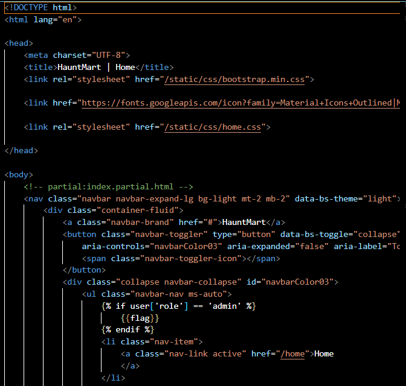
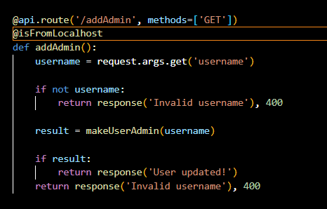
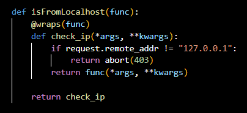
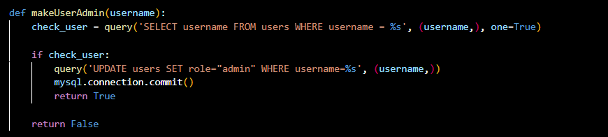
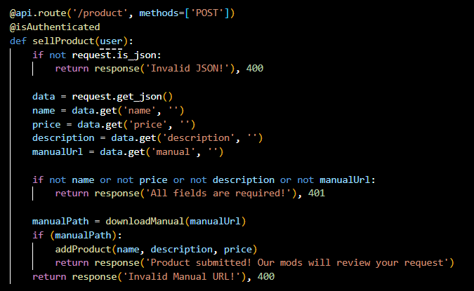
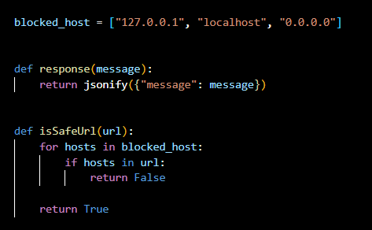
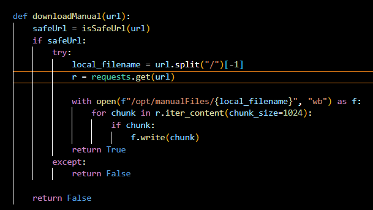
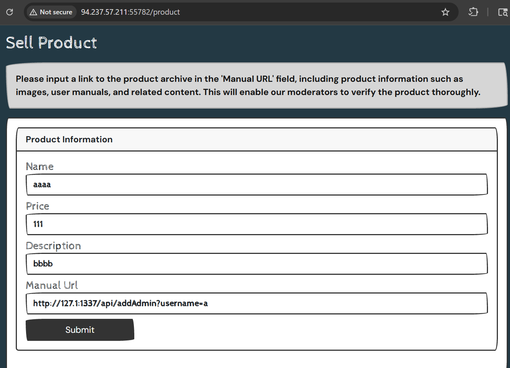
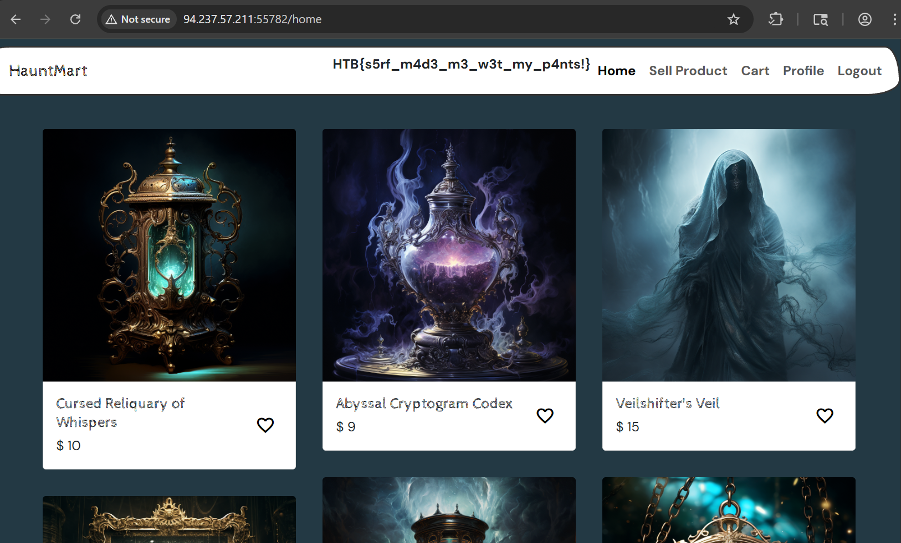

/home จะมี flag ซึ่งจะแสดงเมื่อมี role ใน jwt เป็น admin

จะสารถ addAdmin ได้แต่จะต้องอยู่ใน localhost !!!!!!! ก่อน

parameter manualUrl ซึ่งรับจาก user intput 

parameter manualUrl จะมาถูก get request

ที่อยู่ 127.0.0.1 ที่หมายถึง localhost สามารถเขียนได้หลายแบบ:

**รูปแบบ IP Address:**
- 127.0.0.1 (แบบมาตรฐาน)
- 127.1 (ย่อรูป)
- 127.0.1 (ย่อรูป)
- 0.0.0.0 (ในบางกรณี สำหรับ bind ทุก interface)
- 0 (ย่อสุดๆ แต่อาจใช้ไม่ได้ในทุกระบบ)

port นำมาจาก docker

login อีกครั้งเพื่อรับ jwt ใหม่ที่มี role admin