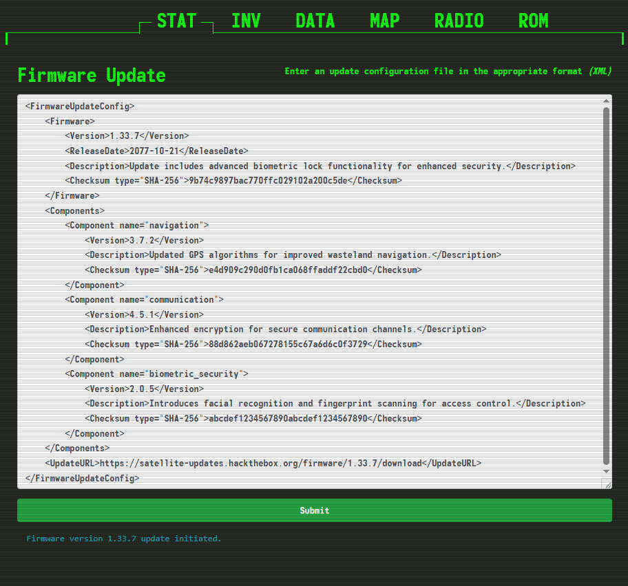
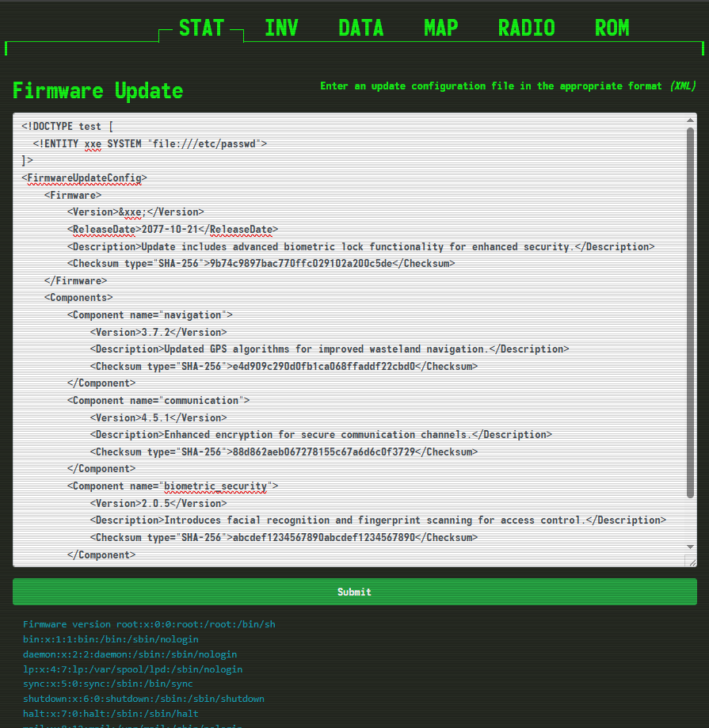

XXE ที่ version ได้




XXE (XML External Entity) เกิดจากการที่แอปพลิเคชันประมวลผล XML input ที่ไม่ปลอดภัย โดยเฉพาะเมื่อ XML parser อนุญาตให้ประมวลผล external entities

**สาเหตุหลักของ XXE:**

**1. การเปิดใช้งาน External Entities**
- XML parser ที่ไม่ได้กำหนดค่าความปลอดภัย
- อนุญาตให้อ่าน external entities โดยไม่มีการตรวจสอบ

**2. การประมวลผล DTD (Document Type Definition)**
```xml
<!DOCTYPE test [
  <!ENTITY xxe SYSTEM "file:///etc/passwd">
]>
<test>&xxe;</test>
```

**3. ประเภทการโจมตี XXE:**
- **File Disclosure**: อ่านไฟล์ระบบ เช่น `/etc/passwd`, configuration files
- **SSRF (Server-Side Request Forgery)**: ส่งคำขอไปยัง internal services
- **DoS**: ใช้ billion laughs attack หรือ recursive entities
- **Remote Code Execution**: ในบางกรณี

**ตัวอย่างการโจมตี:**
```xml
<!DOCTYPE data [
  <!ENTITY file SYSTEM "file:///etc/passwd">
]>
<data>&file;</data>
```


DOCTYPE ใช้สำหรับกำหนด Document Type Definition (DTD) ซึ่งเป็นการระบุโครงสร้างและกฎเกณฑ์ของเอกสาร XML หรือ HTML

**หน้าที่หลักของ DOCTYPE:**

**1. กำหนดโครงสร้างเอกสาร**
- ระบุ elements ที่อนุญาตให้ใช้
- กำหนดลำดับและความสัมพันธ์ของ elements
- กำหนด attributes ที่แต่ละ element มีได้

**2. ประกาศ Entities**
```xml
<!DOCTYPE library [
  <!ENTITY company "บริษัท ABC จำกัด">
  <!ENTITY phone "02-123-4567">
]>
<library>
  <contact>&company; โทร &phone;</contact>
</library>
```

**3. ใน HTML - กำหนดมาตรฐาน**
```html
<!DOCTYPE html>  <!-- HTML5 -->
<!DOCTYPE HTML PUBLIC "-//W3C//DTD HTML 4.01//EN">  <!-- HTML 4.01 -->
```

**4. ใน XML - กำหนดกฎการตรวจสอบ**
```xml
<!DOCTYPE book [
  <!ELEMENT book (title, author, price)>
  <!ELEMENT title (#PCDATA)>
  <!ELEMENT author (#PCDATA)>
  <!ELEMENT price (#PCDATA)>
]>
```

**ประเภทของ DOCTYPE:**
- **Internal DTD**: กำหนดภายในเอกสาร
- **External DTD**: อ้างอิงจากไฟล์ภายนอก
- **Mixed**: ผสมทั้งสองแบบ

**ตัวอย่างการใช้งาน:**
```xml
<!DOCTYPE html PUBLIC "-//W3C//DTD XHTML 1.0 Transitional//EN"
"http://www.w3.org/TR/xhtml1/DTD/xhtml1-transitional.dtd">
```


**DTD Types:**
- **Internal DTD**: ประกาศภายในเอกสาร (ใช้ `[ ]`)
- **External DTD**: อ้างอิงจากไฟล์ภายนอก (ใช้ `SYSTEM` หรือ `PUBLIC` กับ URL)

**Entity Types:**
- **Internal Entity**: ค่าถูกกำหนดไว้ในเอกสาร
- **External Entity**: ค่าอ้างอิงจากแหล่งภายนอก

**ในตัวอย่างของคุณ:**
```xml
<!DOCTYPE data [
  <!ENTITY file SYSTEM "file:///etc/passwd">
]>
```

- **DTD**: เป็น Internal DTD (เพราะใช้ `[ ]`)
- **Entity**: เป็น External Entity (เพราะใช้ `SYSTEM` ชี้ไปยังไฟล์ภายนอก)

**ตัวอย่างเปรียบเทียบ:**

**Internal Entity:**
```xml
<!DOCTYPE data [
  <!ENTITY company "ABC Company">
]>
<data>&company;</data>
```

**External Entity:**
```xml
<!DOCTYPE data [
  <!ENTITY file SYSTEM "file:///etc/passwd">
]>
<data>&file;</data>
```

**External DTD:**
```xml
<!DOCTYPE data SYSTEM "http://example.com/schema.dtd">
```

ดังนั้นตัวอย่างที่คุณให้มา คือ Internal DTD ที่ประกาศ External Entity ซึ่งเป็นรูปแบบที่ใช้ในการโจมตี XXE