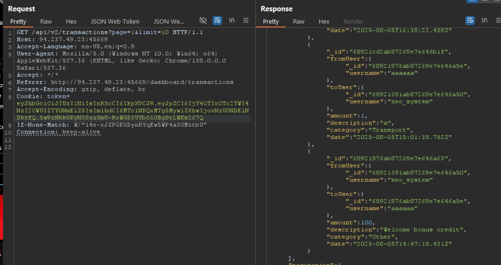
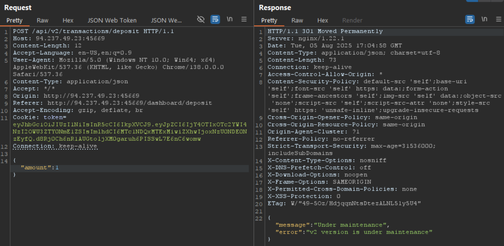
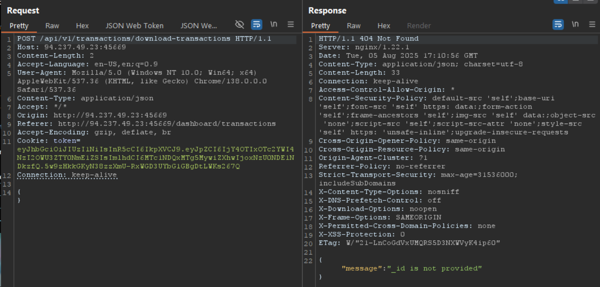
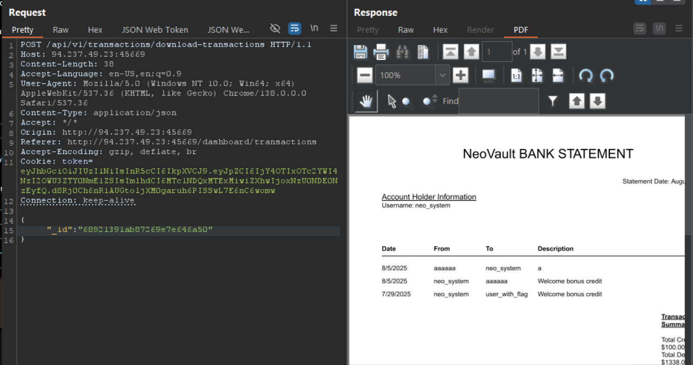
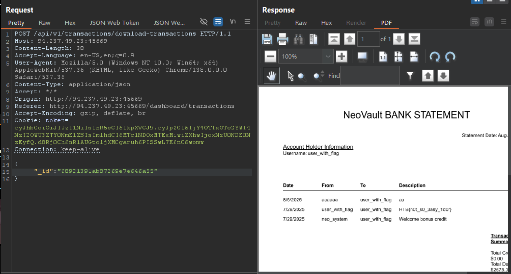

Banking web application

## main function

-tranfer ไว้โอนเงิน

-deposit ไว้ถอนเงิน

-transaction เป็นประวัติการโอน สามารถโหลดเป็น pdf



มี leaked informaion _id ของ user



deposite ใช้ไม่ได้ และมีการใบ้ api version

ลองเปลี่ยน api version 





```

เข้าไปดู transaction ของ neo_system จะเจอ user_with_flag 

flag ควรจะอยู่ใน transaction history ของ user_with_flag

เนื่องจาก มี leaked informaion _id ของ user บน /api/v2/transactions

ดังนั้น เราจะ tranfer เงิน ของ owned user ไปที่ user_with_flag 

จะได้ _id ของ user_with_flag เพื่อเข้าไปดู transaction history ของเขา

```


