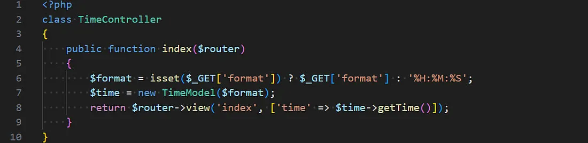
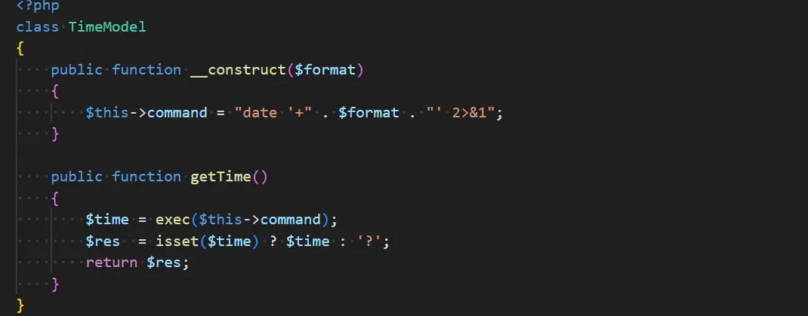
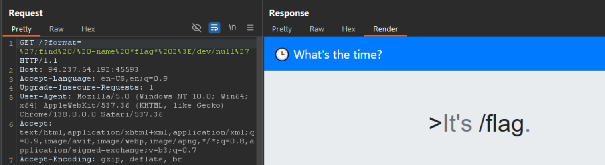
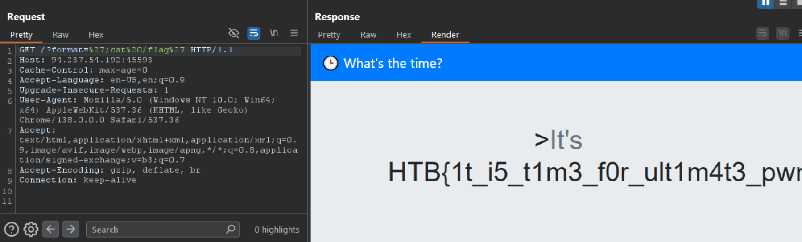

ในโค้ด PHP นี้ ส่วน `.$format.` ทำงานเป็น **string concatenation** (การต่อสตริง) 


```php
$this->command = "date '+" . $format . "' 2>&1";
```

**การทำงาน:**
- `.` ใน PHP ใช้สำหรับต่อสตริง (concatenation operator)
- `"date '+"` - สตริงแรก
- `$format` - ตัวแปรที่ส่งเข้ามา
- `"' 2>&1"` - สตริงสุดท้าย

**ตัวอย่างการทำงาน:**
ถ้า `$format = "%H:%M:%S"` 

ผลลัพธ์จะเป็น:
```bash
date '+%H:%M:%S' 2>&1
```

**ส่วน `2>&1` คือ:**
- `2>` - redirect stderr (error output)
- `&1` - ไปที่ stdout (standard output)
- ทำให้ error messages แสดงร่วมกับ output ปกติ


```
┌──(kali㉿DESKTOP-KQAT41L)-[/mnt/…/hackthebox/Challenges/Web/TimeKORP]
└─$ date '+"%H:%M:%S"'
"22:48:18"

┌──(kali㉿DESKTOP-KQAT41L)-[/mnt/…/hackthebox/Challenges/Web/TimeKORP]
└─$ date '+%H:%M:%S'
22:48:24

┌──(kali㉿DESKTOP-KQAT41L)-[/mnt/…/hackthebox/Challenges/Web/TimeKORP]
└─$ date '+';ls''

image-1.png  image-2.png  image-3.png  image.png  README.md
```




